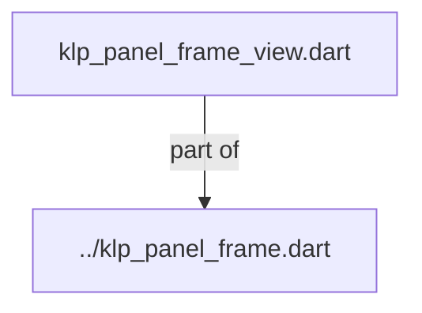
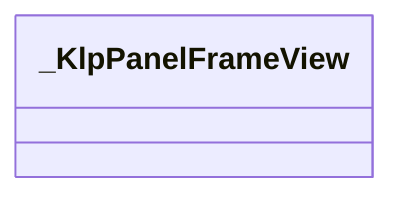
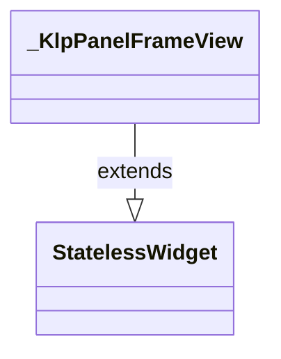

# klp_panel_frame_view.dart：直接依賴與宣告架構

[回到目錄](README.md) · [來源檔案](../../../../../../../../lib/src/features/workspace/shell/panel/primitives/klp_panel_frame_view.dart)

## 範圍

核心是 `lib/src/features/workspace/shell/panel/primitives/klp_panel_frame_view.dart`。主要視角為該檔案明寫的 import／export／part；輔助視角為本檔宣告及 extends／implements／with／on 關係。只展開一層外部邊界。

## 直接依賴圖

## 依賴證據

| 關係 | 原始 directive | 來源 |
|---|---|---|
| part of | <code>part of &#x27;../klp_panel_frame.dart&#x27;;</code> | [lib/src/features/workspace/shell/panel/primitives/klp_panel_frame_view.dart:1](../../../../../../../../lib/src/features/workspace/shell/panel/primitives/klp_panel_frame_view.dart#L1) |

## 宣告關係圖

本組節點是本檔宣告；沒有箭頭的宣告未在此圖主張互相依賴。

## 宣告與成員證據

成員包含 public 與 private；簽章取自來源，省略函式本體與欄位初始值。`(inferred)` 表示來源未明寫型別；建構子只顯示參數部分，不含初始化列表。

### _KlpPanelFrameView

ClassDeclaration · private · [lib/src/features/workspace/shell/panel/primitives/klp_panel_frame_view.dart:3](../../../../../../../../lib/src/features/workspace/shell/panel/primitives/klp_panel_frame_view.dart#L3)

<code>class _KlpPanelFrameView extends StatelessWidget</code>

來源註解摘要：Panel 對 Flutter 裝飾、裁切、彈性排版與 scrollbar 的 primitive 邊界。

- `extends` → <code>StatelessWidget</code>：[lib/src/features/workspace/shell/panel/primitives/klp_panel_frame_view.dart:4](../../../../../../../../lib/src/features/workspace/shell/panel/primitives/klp_panel_frame_view.dart#L4)

| 成員 | 可見性 | 簽章／型別 | 來源註解摘要 | 證據 |
|---|---|---|---|---|
| constructor <code>_KlpPanelFrameView</code> | private | <code>const _KlpPanelFrameView({ required this.header, required this.content, required this.footer, required this.headerSize, required this.tone, required this.contentScrollController, })</code> |  | [lib/src/features/workspace/shell/panel/primitives/klp_panel_frame_view.dart:5](../../../../../../../../lib/src/features/workspace/shell/panel/primitives/klp_panel_frame_view.dart#L5) |
| field <code>header</code> | public | <code>final Widget? header</code> |  | [lib/src/features/workspace/shell/panel/primitives/klp_panel_frame_view.dart:14](../../../../../../../../lib/src/features/workspace/shell/panel/primitives/klp_panel_frame_view.dart#L14) |
| field <code>content</code> | public | <code>final Widget content</code> |  | [lib/src/features/workspace/shell/panel/primitives/klp_panel_frame_view.dart:15](../../../../../../../../lib/src/features/workspace/shell/panel/primitives/klp_panel_frame_view.dart#L15) |
| field <code>footer</code> | public | <code>final Widget? footer</code> |  | [lib/src/features/workspace/shell/panel/primitives/klp_panel_frame_view.dart:16](../../../../../../../../lib/src/features/workspace/shell/panel/primitives/klp_panel_frame_view.dart#L16) |
| field <code>headerSize</code> | public | <code>final KlpPanelHeaderSize headerSize</code> |  | [lib/src/features/workspace/shell/panel/primitives/klp_panel_frame_view.dart:17](../../../../../../../../lib/src/features/workspace/shell/panel/primitives/klp_panel_frame_view.dart#L17) |
| field <code>tone</code> | public | <code>final KlpPanelTone tone</code> |  | [lib/src/features/workspace/shell/panel/primitives/klp_panel_frame_view.dart:18](../../../../../../../../lib/src/features/workspace/shell/panel/primitives/klp_panel_frame_view.dart#L18) |
| field <code>contentScrollController</code> | public | <code>final ScrollController? contentScrollController</code> |  | [lib/src/features/workspace/shell/panel/primitives/klp_panel_frame_view.dart:19](../../../../../../../../lib/src/features/workspace/shell/panel/primitives/klp_panel_frame_view.dart#L19) |
| method <code>build</code> | public | <code>Widget build(BuildContext context)</code> |  | [lib/src/features/workspace/shell/panel/primitives/klp_panel_frame_view.dart:21](../../../../../../../../lib/src/features/workspace/shell/panel/primitives/klp_panel_frame_view.dart#L21) |

## 閱讀說明與限制

箭頭只表示來源明寫的靜態關係；import 不等於呼叫。未分析動態呼叫、欄位的實際物件擁有權、狀態轉移或渲染流程；型別未進行語意解析，繼承目標保留原始型別拼寫。public／private 依 Dart 名稱前綴判斷；public 宣告不代表已由 `lib/kallopis.dart` 匯出。

本頁由 `tool/architecture_atlas` 產生；編輯來源或生成工具後重新產生，避免手改本頁。
