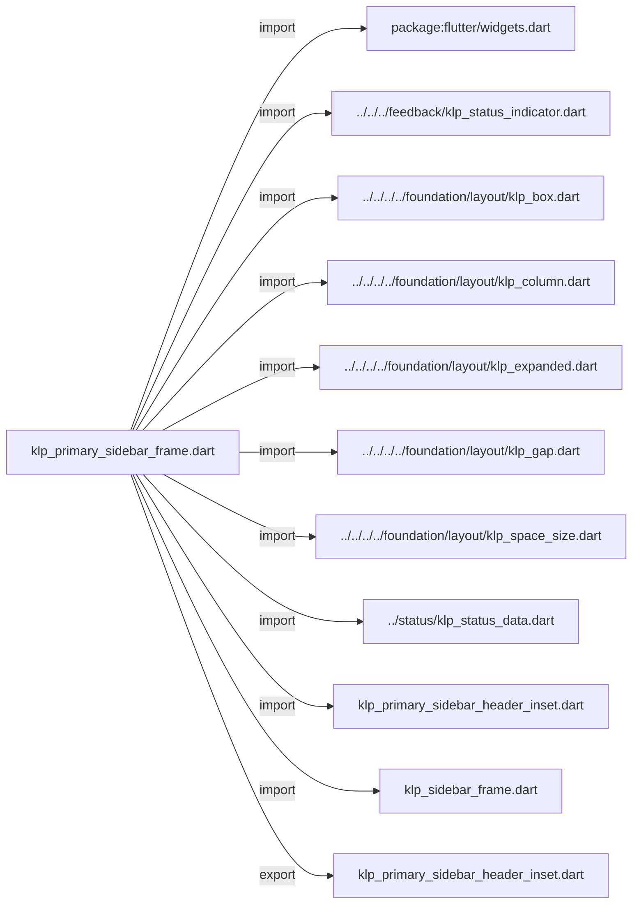
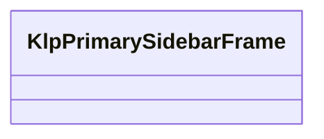
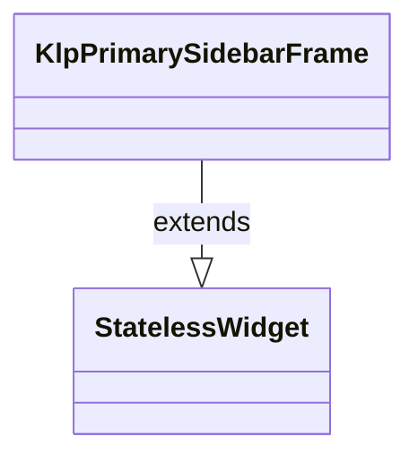

# klp_primary_sidebar_frame.dart：直接依賴與宣告架構

[回到目錄](README.md) · [來源檔案](../../../../../../../lib/src/features/workspace/shell/sidebar/klp_primary_sidebar_frame.dart)

## 範圍

核心是 `lib/src/features/workspace/shell/sidebar/klp_primary_sidebar_frame.dart`。主要視角為該檔案明寫的 import／export／part；輔助視角為本檔宣告及 extends／implements／with／on 關係。只展開一層外部邊界。

## 直接依賴圖

## 依賴證據

| 關係 | 原始 directive | 來源 |
|---|---|---|
| import | <code>import &#x27;package:flutter/widgets.dart&#x27;;</code> | [lib/src/features/workspace/shell/sidebar/klp_primary_sidebar_frame.dart:1](../../../../../../../lib/src/features/workspace/shell/sidebar/klp_primary_sidebar_frame.dart#L1) |
| import | <code>import &#x27;../../../feedback/klp_status_indicator.dart&#x27;;</code> | [lib/src/features/workspace/shell/sidebar/klp_primary_sidebar_frame.dart:3](../../../../../../../lib/src/features/workspace/shell/sidebar/klp_primary_sidebar_frame.dart#L3) |
| import | <code>import &#x27;../../../../foundation/layout/klp_box.dart&#x27;;</code> | [lib/src/features/workspace/shell/sidebar/klp_primary_sidebar_frame.dart:4](../../../../../../../lib/src/features/workspace/shell/sidebar/klp_primary_sidebar_frame.dart#L4) |
| import | <code>import &#x27;../../../../foundation/layout/klp_column.dart&#x27;;</code> | [lib/src/features/workspace/shell/sidebar/klp_primary_sidebar_frame.dart:5](../../../../../../../lib/src/features/workspace/shell/sidebar/klp_primary_sidebar_frame.dart#L5) |
| import | <code>import &#x27;../../../../foundation/layout/klp_expanded.dart&#x27;;</code> | [lib/src/features/workspace/shell/sidebar/klp_primary_sidebar_frame.dart:6](../../../../../../../lib/src/features/workspace/shell/sidebar/klp_primary_sidebar_frame.dart#L6) |
| import | <code>import &#x27;../../../../foundation/layout/klp_gap.dart&#x27;;</code> | [lib/src/features/workspace/shell/sidebar/klp_primary_sidebar_frame.dart:7](../../../../../../../lib/src/features/workspace/shell/sidebar/klp_primary_sidebar_frame.dart#L7) |
| import | <code>import &#x27;../../../../foundation/layout/klp_space_size.dart&#x27;;</code> | [lib/src/features/workspace/shell/sidebar/klp_primary_sidebar_frame.dart:8](../../../../../../../lib/src/features/workspace/shell/sidebar/klp_primary_sidebar_frame.dart#L8) |
| import | <code>import &#x27;../status/klp_status_data.dart&#x27;;</code> | [lib/src/features/workspace/shell/sidebar/klp_primary_sidebar_frame.dart:9](../../../../../../../lib/src/features/workspace/shell/sidebar/klp_primary_sidebar_frame.dart#L9) |
| import | <code>import &#x27;klp_primary_sidebar_header_inset.dart&#x27;;</code> | [lib/src/features/workspace/shell/sidebar/klp_primary_sidebar_frame.dart:10](../../../../../../../lib/src/features/workspace/shell/sidebar/klp_primary_sidebar_frame.dart#L10) |
| import | <code>import &#x27;klp_sidebar_frame.dart&#x27;;</code> | [lib/src/features/workspace/shell/sidebar/klp_primary_sidebar_frame.dart:11](../../../../../../../lib/src/features/workspace/shell/sidebar/klp_primary_sidebar_frame.dart#L11) |
| export | <code>export &#x27;klp_primary_sidebar_header_inset.dart&#x27;;</code> | [lib/src/features/workspace/shell/sidebar/klp_primary_sidebar_frame.dart:13](../../../../../../../lib/src/features/workspace/shell/sidebar/klp_primary_sidebar_frame.dart#L13) |

## 宣告關係圖

本組節點是本檔宣告；沒有箭頭的宣告未在此圖主張互相依賴。

## 宣告與成員證據

成員包含 public 與 private；簽章取自來源，省略函式本體與欄位初始值。`(inferred)` 表示來源未明寫型別；建構子只顯示參數部分，不含初始化列表。

### KlpPrimarySidebarFrame

ClassDeclaration · public · [lib/src/features/workspace/shell/sidebar/klp_primary_sidebar_frame.dart:15](../../../../../../../lib/src/features/workspace/shell/sidebar/klp_primary_sidebar_frame.dart#L15)

<code>class KlpPrimarySidebarFrame extends StatelessWidget</code>

來源註解摘要：桌面工作區的 Primary Sidebar 外框。 Identity、導覽與 Explorer 緊密排列；上下節奏由各區域自行決定。 content 與 footer 沿用 [KlpSidebarFrame] 的水平 padding 規則；footer 不再 額外包覆垂直 padding。

- `extends` → <code>StatelessWidget</code>：[lib/src/features/workspace/shell/sidebar/klp_primary_sidebar_frame.dart:20](../../../../../../../lib/src/features/workspace/shell/sidebar/klp_primary_sidebar_frame.dart#L20)

| 成員 | 可見性 | 簽章／型別 | 來源註解摘要 | 證據 |
|---|---|---|---|---|
| constructor <code>KlpPrimarySidebarFrame</code> | public | <code>const KlpPrimarySidebarFrame({ super.key, this.header, this.navigation, required this.explorer, this.footer, this.status, this.contentInset = KlpSidebarInset.chromePanel, this.headerInset = KlpPrimarySidebarHeaderInset.navigation, this.headerNavigationGap, })</code> |  | [lib/src/features/workspace/shell/sidebar/klp_primary_sidebar_frame.dart:21](../../../../../../../lib/src/features/workspace/shell/sidebar/klp_primary_sidebar_frame.dart#L21) |
| field <code>header</code> | public | <code>final Widget? header</code> |  | [lib/src/features/workspace/shell/sidebar/klp_primary_sidebar_frame.dart:33](../../../../../../../lib/src/features/workspace/shell/sidebar/klp_primary_sidebar_frame.dart#L33) |
| field <code>navigation</code> | public | <code>final Widget? navigation</code> |  | [lib/src/features/workspace/shell/sidebar/klp_primary_sidebar_frame.dart:34](../../../../../../../lib/src/features/workspace/shell/sidebar/klp_primary_sidebar_frame.dart#L34) |
| field <code>explorer</code> | public | <code>final Widget explorer</code> |  | [lib/src/features/workspace/shell/sidebar/klp_primary_sidebar_frame.dart:35](../../../../../../../lib/src/features/workspace/shell/sidebar/klp_primary_sidebar_frame.dart#L35) |
| field <code>footer</code> | public | <code>final Widget? footer</code> |  | [lib/src/features/workspace/shell/sidebar/klp_primary_sidebar_frame.dart:36](../../../../../../../lib/src/features/workspace/shell/sidebar/klp_primary_sidebar_frame.dart#L36) |
| field <code>status</code> | public | <code>final KlpStatusItemData? status</code> | 側欄底部狀態；提供時由框架使用共通狀態元件渲染。 | [lib/src/features/workspace/shell/sidebar/klp_primary_sidebar_frame.dart:39](../../../../../../../lib/src/features/workspace/shell/sidebar/klp_primary_sidebar_frame.dart#L39) |
| field <code>contentInset</code> | public | <code>final KlpSidebarInset contentInset</code> |  | [lib/src/features/workspace/shell/sidebar/klp_primary_sidebar_frame.dart:40](../../../../../../../lib/src/features/workspace/shell/sidebar/klp_primary_sidebar_frame.dart#L40) |
| field <code>headerInset</code> | public | <code>final KlpPrimarySidebarHeaderInset headerInset</code> |  | [lib/src/features/workspace/shell/sidebar/klp_primary_sidebar_frame.dart:41](../../../../../../../lib/src/features/workspace/shell/sidebar/klp_primary_sidebar_frame.dart#L41) |
| field <code>headerNavigationGap</code> | public | <code>final KlpSpaceSize? headerNavigationGap</code> |  | [lib/src/features/workspace/shell/sidebar/klp_primary_sidebar_frame.dart:42](../../../../../../../lib/src/features/workspace/shell/sidebar/klp_primary_sidebar_frame.dart#L42) |
| method <code>build</code> | public | <code>Widget build(BuildContext context)</code> |  | [lib/src/features/workspace/shell/sidebar/klp_primary_sidebar_frame.dart:44](../../../../../../../lib/src/features/workspace/shell/sidebar/klp_primary_sidebar_frame.dart#L44) |

## 閱讀說明與限制

箭頭只表示來源明寫的靜態關係；import 不等於呼叫。未分析動態呼叫、欄位的實際物件擁有權、狀態轉移或渲染流程；型別未進行語意解析，繼承目標保留原始型別拼寫。public／private 依 Dart 名稱前綴判斷；public 宣告不代表已由 `lib/kallopis.dart` 匯出。

本頁由 `tool/architecture_atlas` 產生；編輯來源或生成工具後重新產生，避免手改本頁。
