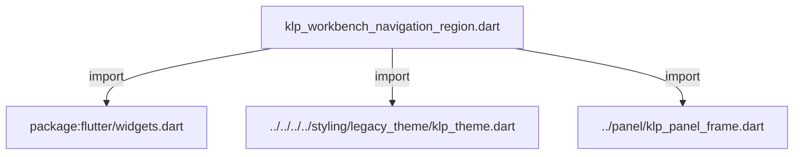
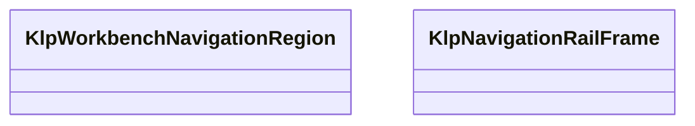
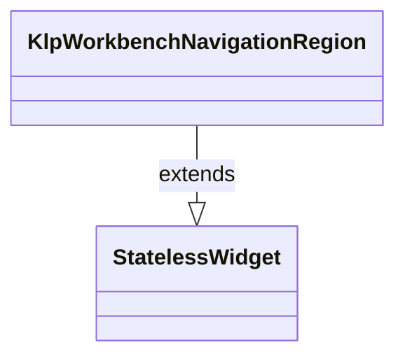
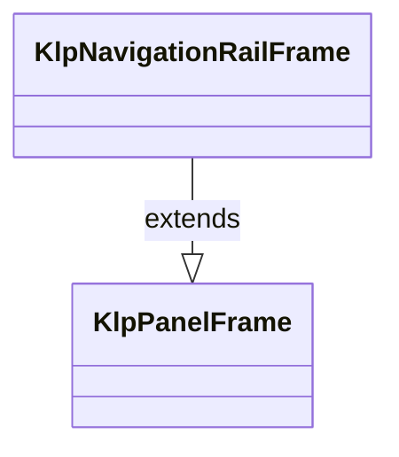

# klp_workbench_navigation_region.dart：直接依賴與宣告架構

[回到目錄](README.md) · [來源檔案](../../../../../../../lib/src/features/workspace/shell/sidebar/klp_workbench_navigation_region.dart)

## 範圍

核心是 `lib/src/features/workspace/shell/sidebar/klp_workbench_navigation_region.dart`。主要視角為該檔案明寫的 import／export／part；輔助視角為本檔宣告及 extends／implements／with／on 關係。只展開一層外部邊界。

## 直接依賴圖

## 依賴證據

| 關係 | 原始 directive | 來源 |
|---|---|---|
| import | <code>import &#x27;package:flutter/widgets.dart&#x27;;</code> | [lib/src/features/workspace/shell/sidebar/klp_workbench_navigation_region.dart:1](../../../../../../../lib/src/features/workspace/shell/sidebar/klp_workbench_navigation_region.dart#L1) |
| import | <code>import &#x27;../../../../styling/legacy_theme/klp_theme.dart&#x27;;</code> | [lib/src/features/workspace/shell/sidebar/klp_workbench_navigation_region.dart:3](../../../../../../../lib/src/features/workspace/shell/sidebar/klp_workbench_navigation_region.dart#L3) |
| import | <code>import &#x27;../panel/klp_panel_frame.dart&#x27;;</code> | [lib/src/features/workspace/shell/sidebar/klp_workbench_navigation_region.dart:4](../../../../../../../lib/src/features/workspace/shell/sidebar/klp_workbench_navigation_region.dart#L4) |

## 宣告關係圖

本組節點是本檔宣告；沒有箭頭的宣告未在此圖主張互相依賴。

## 宣告與成員證據

成員包含 public 與 private；簽章取自來源，省略函式本體與欄位初始值。`(inferred)` 表示來源未明寫型別；建構子只顯示參數部分，不含初始化列表。

### KlpWorkbenchNavigationRegion

ClassDeclaration · public · [lib/src/features/workspace/shell/sidebar/klp_workbench_navigation_region.dart:6](../../../../../../../lib/src/features/workspace/shell/sidebar/klp_workbench_navigation_region.dart#L6)

<code>class KlpWorkbenchNavigationRegion extends StatelessWidget</code>

來源註解摘要：Workbench 左側導覽區域：並排獨立的 Rail 與 Sidebar surface。 本層只決定兩個同層區域的寬度與間距；完整的 Panel Tree 由 Dock layout 擁有。

- `extends` → <code>StatelessWidget</code>：[lib/src/features/workspace/shell/sidebar/klp_workbench_navigation_region.dart:9](../../../../../../../lib/src/features/workspace/shell/sidebar/klp_workbench_navigation_region.dart#L9)

| 成員 | 可見性 | 簽章／型別 | 來源註解摘要 | 證據 |
|---|---|---|---|---|
| constructor <code>KlpWorkbenchNavigationRegion</code> | public | <code>const KlpWorkbenchNavigationRegion({ super.key, required this.rail, required this.sidebar, })</code> |  | [lib/src/features/workspace/shell/sidebar/klp_workbench_navigation_region.dart:10](../../../../../../../lib/src/features/workspace/shell/sidebar/klp_workbench_navigation_region.dart#L10) |
| field <code>rail</code> | public | <code>final Widget rail</code> |  | [lib/src/features/workspace/shell/sidebar/klp_workbench_navigation_region.dart:16](../../../../../../../lib/src/features/workspace/shell/sidebar/klp_workbench_navigation_region.dart#L16) |
| field <code>sidebar</code> | public | <code>final Widget sidebar</code> |  | [lib/src/features/workspace/shell/sidebar/klp_workbench_navigation_region.dart:17](../../../../../../../lib/src/features/workspace/shell/sidebar/klp_workbench_navigation_region.dart#L17) |
| method <code>build</code> | public | <code>Widget build(BuildContext context)</code> |  | [lib/src/features/workspace/shell/sidebar/klp_workbench_navigation_region.dart:19](../../../../../../../lib/src/features/workspace/shell/sidebar/klp_workbench_navigation_region.dart#L19) |

### KlpNavigationRailFrame

ClassDeclaration · public · [lib/src/features/workspace/shell/sidebar/klp_workbench_navigation_region.dart:32](../../../../../../../lib/src/features/workspace/shell/sidebar/klp_workbench_navigation_region.dart#L32)

<code>class KlpNavigationRailFrame extends KlpPanelFrame</code>

來源註解摘要：Workbench Rail 的獨立表面。

- `extends` → <code>KlpPanelFrame</code>：[lib/src/features/workspace/shell/sidebar/klp_workbench_navigation_region.dart:33](../../../../../../../lib/src/features/workspace/shell/sidebar/klp_workbench_navigation_region.dart#L33)

| 成員 | 可見性 | 簽章／型別 | 來源註解摘要 | 證據 |
|---|---|---|---|---|
| constructor <code>KlpNavigationRailFrame</code> | public | <code>const KlpNavigationRailFrame({super.key, required Widget child})</code> |  | [lib/src/features/workspace/shell/sidebar/klp_workbench_navigation_region.dart:34](../../../../../../../lib/src/features/workspace/shell/sidebar/klp_workbench_navigation_region.dart#L34) |

## 閱讀說明與限制

箭頭只表示來源明寫的靜態關係；import 不等於呼叫。未分析動態呼叫、欄位的實際物件擁有權、狀態轉移或渲染流程；型別未進行語意解析，繼承目標保留原始型別拼寫。public／private 依 Dart 名稱前綴判斷；public 宣告不代表已由 `lib/kallopis.dart` 匯出。

本頁由 `tool/architecture_atlas` 產生；編輯來源或生成工具後重新產生，避免手改本頁。
