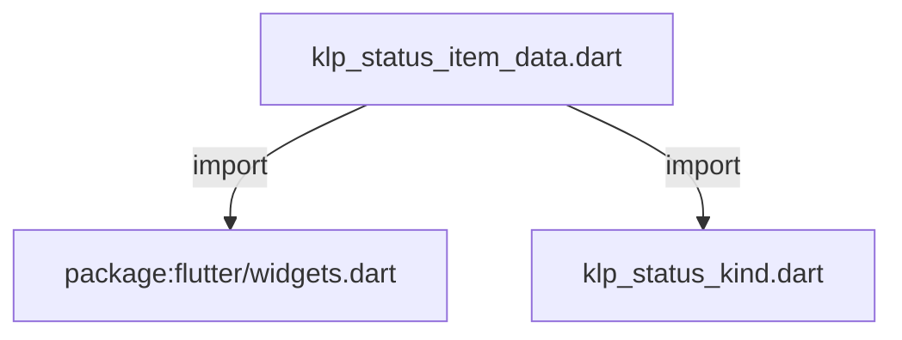
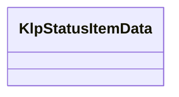

# klp_status_item_data.dart：直接依賴與宣告架構

[回到目錄](README.md) · [來源檔案](../../../../../../../lib/src/features/workspace/shell/status/klp_status_item_data.dart)

## 範圍

核心是 `lib/src/features/workspace/shell/status/klp_status_item_data.dart`。主要視角為該檔案明寫的 import／export／part；輔助視角為本檔宣告及 extends／implements／with／on 關係。只展開一層外部邊界。

## 直接依賴圖

## 依賴證據

| 關係 | 原始 directive | 來源 |
|---|---|---|
| import | <code>import &#x27;package:flutter/widgets.dart&#x27;;</code> | [lib/src/features/workspace/shell/status/klp_status_item_data.dart:4](../../../../../../../lib/src/features/workspace/shell/status/klp_status_item_data.dart#L4) |
| import | <code>import &#x27;klp_status_kind.dart&#x27;;</code> | [lib/src/features/workspace/shell/status/klp_status_item_data.dart:5](../../../../../../../lib/src/features/workspace/shell/status/klp_status_item_data.dart#L5) |

## 宣告關係圖

本組節點是本檔宣告；沒有箭頭的宣告未在此圖主張互相依賴。

## 宣告與成員證據

成員包含 public 與 private；簽章取自來源，省略函式本體與欄位初始值。`(inferred)` 表示來源未明寫型別；建構子只顯示參數部分，不含初始化列表。

### KlpStatusItemData

ClassDeclaration · public · [lib/src/features/workspace/shell/status/klp_status_item_data.dart:7](../../../../../../../lib/src/features/workspace/shell/status/klp_status_item_data.dart#L7)

<code>class KlpStatusItemData</code>

來源註解摘要：一個可注入至側欄或狀態列的產品中立狀態項目。

| 成員 | 可見性 | 簽章／型別 | 來源註解摘要 | 證據 |
|---|---|---|---|---|
| constructor <code>KlpStatusItemData</code> | public | <code>const KlpStatusItemData({ required this.label, this.kind = KlpStatusKind.dot, this.active = true, this.color, this.showsIndicator = true, })</code> |  | [lib/src/features/workspace/shell/status/klp_status_item_data.dart:10](../../../../../../../lib/src/features/workspace/shell/status/klp_status_item_data.dart#L10) |
| field <code>label</code> | public | <code>final String label</code> |  | [lib/src/features/workspace/shell/status/klp_status_item_data.dart:18](../../../../../../../lib/src/features/workspace/shell/status/klp_status_item_data.dart#L18) |
| field <code>kind</code> | public | <code>final KlpStatusKind kind</code> |  | [lib/src/features/workspace/shell/status/klp_status_item_data.dart:19](../../../../../../../lib/src/features/workspace/shell/status/klp_status_item_data.dart#L19) |
| field <code>active</code> | public | <code>final bool active</code> |  | [lib/src/features/workspace/shell/status/klp_status_item_data.dart:20](../../../../../../../lib/src/features/workspace/shell/status/klp_status_item_data.dart#L20) |
| field <code>color</code> | public | <code>final Color? color</code> |  | [lib/src/features/workspace/shell/status/klp_status_item_data.dart:21](../../../../../../../lib/src/features/workspace/shell/status/klp_status_item_data.dart#L21) |
| field <code>showsIndicator</code> | public | <code>final bool showsIndicator</code> |  | [lib/src/features/workspace/shell/status/klp_status_item_data.dart:22](../../../../../../../lib/src/features/workspace/shell/status/klp_status_item_data.dart#L22) |

## 閱讀說明與限制

箭頭只表示來源明寫的靜態關係；import 不等於呼叫。未分析動態呼叫、欄位的實際物件擁有權、狀態轉移或渲染流程；型別未進行語意解析，繼承目標保留原始型別拼寫。public／private 依 Dart 名稱前綴判斷；public 宣告不代表已由 `lib/kallopis.dart` 匯出。

本頁由 `tool/architecture_atlas` 產生；編輯來源或生成工具後重新產生，避免手改本頁。
