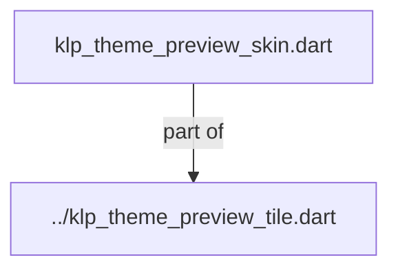
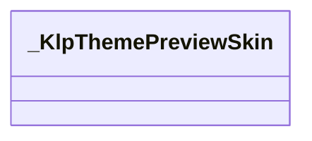

# klp_theme_preview_skin.dart：直接依賴與宣告架構

[回到目錄](README.md) · [來源檔案](../../../../../../../../lib/src/features/workspace/shell/theme/internal/klp_theme_preview_skin.dart)

## 範圍

核心是 `lib/src/features/workspace/shell/theme/internal/klp_theme_preview_skin.dart`。主要視角為該檔案明寫的 import／export／part；輔助視角為本檔宣告及 extends／implements／with／on 關係。只展開一層外部邊界。

## 直接依賴圖

## 依賴證據

| 關係 | 原始 directive | 來源 |
|---|---|---|
| part of | <code>part of &#x27;../klp_theme_preview_tile.dart&#x27;;</code> | [lib/src/features/workspace/shell/theme/internal/klp_theme_preview_skin.dart:1](../../../../../../../../lib/src/features/workspace/shell/theme/internal/klp_theme_preview_skin.dart#L1) |

## 宣告關係圖

本組節點是本檔宣告；沒有箭頭的宣告未在此圖主張互相依賴。

## 宣告與成員證據

成員包含 public 與 private；簽章取自來源，省略函式本體與欄位初始值。`(inferred)` 表示來源未明寫型別；建構子只顯示參數部分，不含初始化列表。

### _KlpThemePreviewSkin

ClassDeclaration · private · [lib/src/features/workspace/shell/theme/internal/klp_theme_preview_skin.dart:3](../../../../../../../../lib/src/features/workspace/shell/theme/internal/klp_theme_preview_skin.dart#L3)

<code>class _KlpThemePreviewSkin</code>

來源註解摘要：預覽插圖內模擬視窗所使用的 theme preset 投影。

| 成員 | 可見性 | 簽章／型別 | 來源註解摘要 | 證據 |
|---|---|---|---|---|
| constructor <code>_KlpThemePreviewSkin</code> | private | <code>const _KlpThemePreviewSkin({ required this.app, required this.surface, required this.well, required this.outline, required this.ink, required this.faint, })</code> |  | [lib/src/features/workspace/shell/theme/internal/klp_theme_preview_skin.dart:5](../../../../../../../../lib/src/features/workspace/shell/theme/internal/klp_theme_preview_skin.dart#L5) |
| constructor <code>from</code> | public | <code>factory _KlpThemePreviewSkin.from(KlpThemeData tokens)</code> |  | [lib/src/features/workspace/shell/theme/internal/klp_theme_preview_skin.dart:14](../../../../../../../../lib/src/features/workspace/shell/theme/internal/klp_theme_preview_skin.dart#L14) |
| field <code>app</code> | public | <code>final Color app</code> |  | [lib/src/features/workspace/shell/theme/internal/klp_theme_preview_skin.dart:24](../../../../../../../../lib/src/features/workspace/shell/theme/internal/klp_theme_preview_skin.dart#L24) |
| field <code>surface</code> | public | <code>final Color surface</code> |  | [lib/src/features/workspace/shell/theme/internal/klp_theme_preview_skin.dart:25](../../../../../../../../lib/src/features/workspace/shell/theme/internal/klp_theme_preview_skin.dart#L25) |
| field <code>well</code> | public | <code>final Color well</code> |  | [lib/src/features/workspace/shell/theme/internal/klp_theme_preview_skin.dart:26](../../../../../../../../lib/src/features/workspace/shell/theme/internal/klp_theme_preview_skin.dart#L26) |
| field <code>outline</code> | public | <code>final Color outline</code> |  | [lib/src/features/workspace/shell/theme/internal/klp_theme_preview_skin.dart:27](../../../../../../../../lib/src/features/workspace/shell/theme/internal/klp_theme_preview_skin.dart#L27) |
| field <code>ink</code> | public | <code>final Color ink</code> |  | [lib/src/features/workspace/shell/theme/internal/klp_theme_preview_skin.dart:28](../../../../../../../../lib/src/features/workspace/shell/theme/internal/klp_theme_preview_skin.dart#L28) |
| field <code>faint</code> | public | <code>final Color faint</code> |  | [lib/src/features/workspace/shell/theme/internal/klp_theme_preview_skin.dart:29](../../../../../../../../lib/src/features/workspace/shell/theme/internal/klp_theme_preview_skin.dart#L29) |
| field <code>light</code> | public | <code>static final (inferred) light</code> |  | [lib/src/features/workspace/shell/theme/internal/klp_theme_preview_skin.dart:31](../../../../../../../../lib/src/features/workspace/shell/theme/internal/klp_theme_preview_skin.dart#L31) |
| field <code>dark</code> | public | <code>static final (inferred) dark</code> |  | [lib/src/features/workspace/shell/theme/internal/klp_theme_preview_skin.dart:32](../../../../../../../../lib/src/features/workspace/shell/theme/internal/klp_theme_preview_skin.dart#L32) |
| field <code>ultraDark</code> | public | <code>static final (inferred) ultraDark</code> |  | [lib/src/features/workspace/shell/theme/internal/klp_theme_preview_skin.dart:33](../../../../../../../../lib/src/features/workspace/shell/theme/internal/klp_theme_preview_skin.dart#L33) |
| field <code>transparent</code> | public | <code>static final (inferred) transparent</code> |  | [lib/src/features/workspace/shell/theme/internal/klp_theme_preview_skin.dart:34](../../../../../../../../lib/src/features/workspace/shell/theme/internal/klp_theme_preview_skin.dart#L34) |

## 閱讀說明與限制

箭頭只表示來源明寫的靜態關係；import 不等於呼叫。未分析動態呼叫、欄位的實際物件擁有權、狀態轉移或渲染流程；型別未進行語意解析，繼承目標保留原始型別拼寫。public／private 依 Dart 名稱前綴判斷；public 宣告不代表已由 `lib/kallopis.dart` 匯出。

本頁由 `tool/architecture_atlas` 產生；編輯來源或生成工具後重新產生，避免手改本頁。
