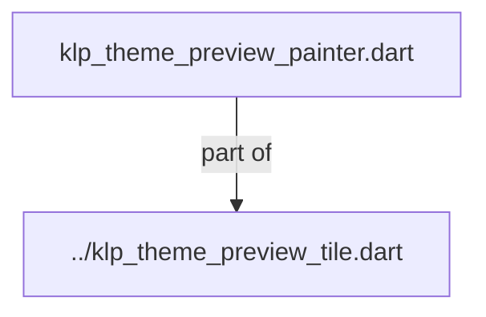
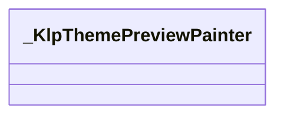
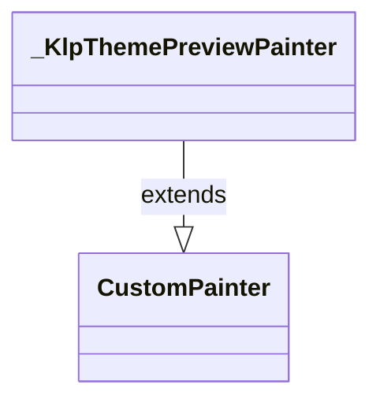

# klp_theme_preview_painter.dart：直接依賴與宣告架構

[回到目錄](README.md) · [來源檔案](../../../../../../../../lib/src/features/workspace/shell/theme/primitives/klp_theme_preview_painter.dart)

## 範圍

核心是 `lib/src/features/workspace/shell/theme/primitives/klp_theme_preview_painter.dart`。主要視角為該檔案明寫的 import／export／part；輔助視角為本檔宣告及 extends／implements／with／on 關係。只展開一層外部邊界。

## 直接依賴圖

## 依賴證據

| 關係 | 原始 directive | 來源 |
|---|---|---|
| part of | <code>part of &#x27;../klp_theme_preview_tile.dart&#x27;;</code> | [lib/src/features/workspace/shell/theme/primitives/klp_theme_preview_painter.dart:1](../../../../../../../../lib/src/features/workspace/shell/theme/primitives/klp_theme_preview_painter.dart#L1) |

## 宣告關係圖

本組節點是本檔宣告；沒有箭頭的宣告未在此圖主張互相依賴。

## 宣告與成員證據

成員包含 public 與 private；簽章取自來源，省略函式本體與欄位初始值。`(inferred)` 表示來源未明寫型別；建構子只顯示參數部分，不含初始化列表。

### _KlpThemePreviewPainter

ClassDeclaration · private · [lib/src/features/workspace/shell/theme/primitives/klp_theme_preview_painter.dart:3](../../../../../../../../lib/src/features/workspace/shell/theme/primitives/klp_theme_preview_painter.dart#L3)

<code>class _KlpThemePreviewPainter extends CustomPainter</code>

來源註解摘要：以固定插圖座標描繪顏色模式，不承擔產品表面布局。

- `extends` → <code>CustomPainter</code>：[lib/src/features/workspace/shell/theme/primitives/klp_theme_preview_painter.dart:4](../../../../../../../../lib/src/features/workspace/shell/theme/primitives/klp_theme_preview_painter.dart#L4)

| 成員 | 可見性 | 簽章／型別 | 來源註解摘要 | 證據 |
|---|---|---|---|---|
| constructor <code>_KlpThemePreviewPainter</code> | private | <code>const _KlpThemePreviewPainter(this.mode, this.cornerRadius)</code> |  | [lib/src/features/workspace/shell/theme/primitives/klp_theme_preview_painter.dart:5](../../../../../../../../lib/src/features/workspace/shell/theme/primitives/klp_theme_preview_painter.dart#L5) |
| field <code>_designWidth</code> | private | <code>static const double _designWidth</code> |  | [lib/src/features/workspace/shell/theme/primitives/klp_theme_preview_painter.dart:7](../../../../../../../../lib/src/features/workspace/shell/theme/primitives/klp_theme_preview_painter.dart#L7) |
| field <code>_designHeightFactor</code> | private | <code>static const double _designHeightFactor</code> |  | [lib/src/features/workspace/shell/theme/primitives/klp_theme_preview_painter.dart:8](../../../../../../../../lib/src/features/workspace/shell/theme/primitives/klp_theme_preview_painter.dart#L8) |
| field <code>designAspectRatio</code> | public | <code>static const double designAspectRatio</code> |  | [lib/src/features/workspace/shell/theme/primitives/klp_theme_preview_painter.dart:9](../../../../../../../../lib/src/features/workspace/shell/theme/primitives/klp_theme_preview_painter.dart#L9) |
| field <code>mode</code> | public | <code>final KlpThemePreviewMode mode</code> |  | [lib/src/features/workspace/shell/theme/primitives/klp_theme_preview_painter.dart:11](../../../../../../../../lib/src/features/workspace/shell/theme/primitives/klp_theme_preview_painter.dart#L11) |
| field <code>cornerRadius</code> | public | <code>final double cornerRadius</code> |  | [lib/src/features/workspace/shell/theme/primitives/klp_theme_preview_painter.dart:12](../../../../../../../../lib/src/features/workspace/shell/theme/primitives/klp_theme_preview_painter.dart#L12) |
| method <code>paint</code> | public | <code>void paint(Canvas canvas, Size size)</code> |  | [lib/src/features/workspace/shell/theme/primitives/klp_theme_preview_painter.dart:14](../../../../../../../../lib/src/features/workspace/shell/theme/primitives/klp_theme_preview_painter.dart#L14) |
| method <code>_paintBackdrop</code> | private | <code>void _paintBackdrop(Canvas canvas, Rect rect, _KlpThemePreviewSkin front)</code> |  | [lib/src/features/workspace/shell/theme/primitives/klp_theme_preview_painter.dart:47](../../../../../../../../lib/src/features/workspace/shell/theme/primitives/klp_theme_preview_painter.dart#L47) |
| method <code>_paintWindow</code> | private | <code>void _paintWindow( Canvas canvas, Rect rect, _KlpThemePreviewSkin skin, { bool dimTraffic = false, bool glass = false, })</code> |  | [lib/src/features/workspace/shell/theme/primitives/klp_theme_preview_painter.dart:78](../../../../../../../../lib/src/features/workspace/shell/theme/primitives/klp_theme_preview_painter.dart#L78) |
| method <code>_paintTrafficLights</code> | private | <code>void _paintTrafficLights( Canvas canvas, Rect titleBar, _KlpThemePreviewSkin skin, bool dim, )</code> |  | [lib/src/features/workspace/shell/theme/primitives/klp_theme_preview_painter.dart:139](../../../../../../../../lib/src/features/workspace/shell/theme/primitives/klp_theme_preview_painter.dart#L139) |
| method <code>_paintRules</code> | private | <code>void _paintRules( Canvas canvas, Rect rect, _KlpThemePreviewSkin skin, List&lt;double&gt; widths, )</code> |  | [lib/src/features/workspace/shell/theme/primitives/klp_theme_preview_painter.dart:155](../../../../../../../../lib/src/features/workspace/shell/theme/primitives/klp_theme_preview_painter.dart#L155) |
| method <code>_skinFor</code> | private | <code>_KlpThemePreviewSkin _skinFor(KlpThemePreviewMode value)</code> |  | [lib/src/features/workspace/shell/theme/primitives/klp_theme_preview_painter.dart:178](../../../../../../../../lib/src/features/workspace/shell/theme/primitives/klp_theme_preview_painter.dart#L178) |
| method <code>shouldRepaint</code> | public | <code>bool shouldRepaint(covariant _KlpThemePreviewPainter oldDelegate)</code> |  | [lib/src/features/workspace/shell/theme/primitives/klp_theme_preview_painter.dart:188](../../../../../../../../lib/src/features/workspace/shell/theme/primitives/klp_theme_preview_painter.dart#L188) |

## 閱讀說明與限制

箭頭只表示來源明寫的靜態關係；import 不等於呼叫。未分析動態呼叫、欄位的實際物件擁有權、狀態轉移或渲染流程；型別未進行語意解析，繼承目標保留原始型別拼寫。public／private 依 Dart 名稱前綴判斷；public 宣告不代表已由 `lib/kallopis.dart` 匯出。

本頁由 `tool/architecture_atlas` 產生；編輯來源或生成工具後重新產生，避免手改本頁。
