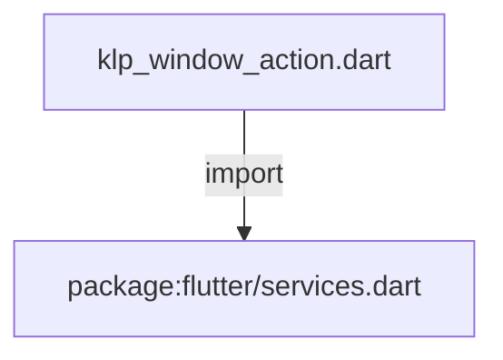
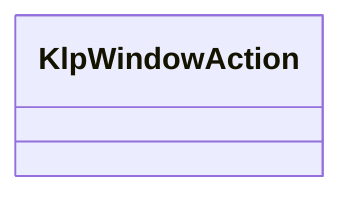

# klp_window_action.dart：直接依賴與宣告架構

[回到目錄](README.md) · [來源檔案](../../../../../../../lib/src/features/workspace/shell/window/klp_window_action.dart)

## 範圍

核心是 `lib/src/features/workspace/shell/window/klp_window_action.dart`。主要視角為該檔案明寫的 import／export／part；輔助視角為本檔宣告及 extends／implements／with／on 關係。只展開一層外部邊界。

## 直接依賴圖

## 依賴證據

| 關係 | 原始 directive | 來源 |
|---|---|---|
| import | <code>import &#x27;package:flutter/services.dart&#x27;;</code> | [lib/src/features/workspace/shell/window/klp_window_action.dart:1](../../../../../../../lib/src/features/workspace/shell/window/klp_window_action.dart#L1) |

## 宣告關係圖

本組節點是本檔宣告；沒有箭頭的宣告未在此圖主張互相依賴。

## 宣告與成員證據

成員包含 public 與 private；簽章取自來源，省略函式本體與欄位初始值。`(inferred)` 表示來源未明寫型別；建構子只顯示參數部分，不含初始化列表。

### KlpWindowAction

ClassDeclaration · public · [lib/src/features/workspace/shell/window/klp_window_action.dart:3](../../../../../../../lib/src/features/workspace/shell/window/klp_window_action.dart#L3)

<code>abstract final class KlpWindowAction</code>

來源註解摘要：桌面平台視窗控制操作。

| 成員 | 可見性 | 簽章／型別 | 來源註解摘要 | 證據 |
|---|---|---|---|---|
| field <code>_channel</code> | private | <code>static const MethodChannel _channel</code> |  | [lib/src/features/workspace/shell/window/klp_window_action.dart:5](../../../../../../../lib/src/features/workspace/shell/window/klp_window_action.dart#L5) |
| method <code>minimize</code> | public | <code>static Future&lt;void&gt; minimize()</code> | 最小化目前視窗。 | [lib/src/features/workspace/shell/window/klp_window_action.dart:7](../../../../../../../lib/src/features/workspace/shell/window/klp_window_action.dart#L7) |
| method <code>toggleMaximize</code> | public | <code>static Future&lt;void&gt; toggleMaximize()</code> | 切換最大化或還原目前視窗。 | [lib/src/features/workspace/shell/window/klp_window_action.dart:14](../../../../../../../lib/src/features/workspace/shell/window/klp_window_action.dart#L14) |
| method <code>maximize</code> | public | <code>static Future&lt;void&gt; maximize()</code> | 確保目前視窗最大化。 | [lib/src/features/workspace/shell/window/klp_window_action.dart:21](../../../../../../../lib/src/features/workspace/shell/window/klp_window_action.dart#L21) |
| method <code>close</code> | public | <code>static Future&lt;void&gt; close()</code> | 關閉目前視窗。 | [lib/src/features/workspace/shell/window/klp_window_action.dart:30](../../../../../../../lib/src/features/workspace/shell/window/klp_window_action.dart#L30) |
| method <code>drag</code> | public | <code>static Future&lt;void&gt; drag()</code> | 開始拖曳目前視窗。 | [lib/src/features/workspace/shell/window/klp_window_action.dart:37](../../../../../../../lib/src/features/workspace/shell/window/klp_window_action.dart#L37) |
| method <code>setMinSize</code> | public | <code>static Future&lt;void&gt; setMinSize({double? minWidth, double? minHeight})</code> | 設定視窗最小寬高限制。 | [lib/src/features/workspace/shell/window/klp_window_action.dart:44](../../../../../../../lib/src/features/workspace/shell/window/klp_window_action.dart#L44) |
| method <code>checkIsMaximized</code> | public | <code>static Future&lt;bool&gt; checkIsMaximized()</code> | 查詢目前視窗是否處於最大化狀態。 | [lib/src/features/workspace/shell/window/klp_window_action.dart:54](../../../../../../../lib/src/features/workspace/shell/window/klp_window_action.dart#L54) |

## 閱讀說明與限制

箭頭只表示來源明寫的靜態關係；import 不等於呼叫。未分析動態呼叫、欄位的實際物件擁有權、狀態轉移或渲染流程；型別未進行語意解析，繼承目標保留原始型別拼寫。public／private 依 Dart 名稱前綴判斷；public 宣告不代表已由 `lib/kallopis.dart` 匯出。

本頁由 `tool/architecture_atlas` 產生；編輯來源或生成工具後重新產生，避免手改本頁。
