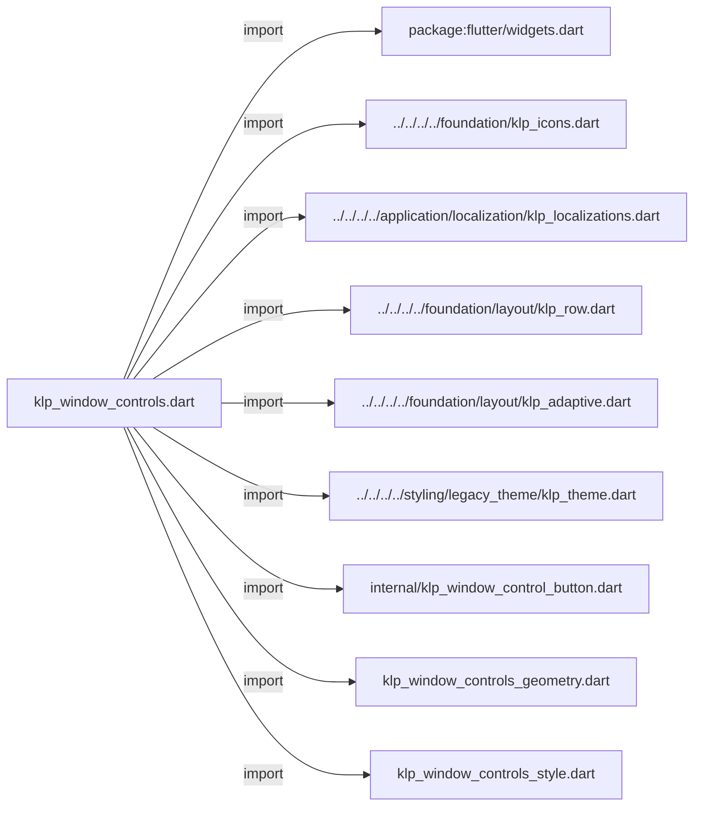
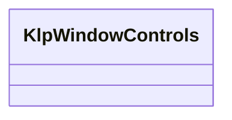
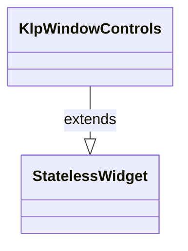

# klp_window_controls.dart：直接依賴與宣告架構

[回到目錄](README.md) · [來源檔案](../../../../../../../lib/src/features/workspace/shell/window/klp_window_controls.dart)

## 範圍

核心是 `lib/src/features/workspace/shell/window/klp_window_controls.dart`。主要視角為該檔案明寫的 import／export／part；輔助視角為本檔宣告及 extends／implements／with／on 關係。只展開一層外部邊界。

## 直接依賴圖

## 依賴證據

| 關係 | 原始 directive | 來源 |
|---|---|---|
| import | <code>import &#x27;package:flutter/widgets.dart&#x27;;</code> | [lib/src/features/workspace/shell/window/klp_window_controls.dart:1](../../../../../../../lib/src/features/workspace/shell/window/klp_window_controls.dart#L1) |
| import | <code>import &#x27;../../../../foundation/klp_icons.dart&#x27;;</code> | [lib/src/features/workspace/shell/window/klp_window_controls.dart:3](../../../../../../../lib/src/features/workspace/shell/window/klp_window_controls.dart#L3) |
| import | <code>import &#x27;../../../../application/localization/klp_localizations.dart&#x27;;</code> | [lib/src/features/workspace/shell/window/klp_window_controls.dart:4](../../../../../../../lib/src/features/workspace/shell/window/klp_window_controls.dart#L4) |
| import | <code>import &#x27;../../../../foundation/layout/klp_row.dart&#x27;;</code> | [lib/src/features/workspace/shell/window/klp_window_controls.dart:5](../../../../../../../lib/src/features/workspace/shell/window/klp_window_controls.dart#L5) |
| import | <code>import &#x27;../../../../foundation/layout/klp_adaptive.dart&#x27;;</code> | [lib/src/features/workspace/shell/window/klp_window_controls.dart:6](../../../../../../../lib/src/features/workspace/shell/window/klp_window_controls.dart#L6) |
| import | <code>import &#x27;../../../../styling/legacy_theme/klp_theme.dart&#x27;;</code> | [lib/src/features/workspace/shell/window/klp_window_controls.dart:7](../../../../../../../lib/src/features/workspace/shell/window/klp_window_controls.dart#L7) |
| import | <code>import &#x27;internal/klp_window_control_button.dart&#x27;;</code> | [lib/src/features/workspace/shell/window/klp_window_controls.dart:8](../../../../../../../lib/src/features/workspace/shell/window/klp_window_controls.dart#L8) |
| import | <code>import &#x27;klp_window_controls_geometry.dart&#x27;;</code> | [lib/src/features/workspace/shell/window/klp_window_controls.dart:9](../../../../../../../lib/src/features/workspace/shell/window/klp_window_controls.dart#L9) |
| import | <code>import &#x27;klp_window_controls_style.dart&#x27;;</code> | [lib/src/features/workspace/shell/window/klp_window_controls.dart:10](../../../../../../../lib/src/features/workspace/shell/window/klp_window_controls.dart#L10) |

## 宣告關係圖

本組節點是本檔宣告；沒有箭頭的宣告未在此圖主張互相依賴。

## 宣告與成員證據

成員包含 public 與 private；簽章取自來源，省略函式本體與欄位初始值。`(inferred)` 表示來源未明寫型別；建構子只顯示參數部分，不含初始化列表。

### KlpWindowControls

ClassDeclaration · public · [lib/src/features/workspace/shell/window/klp_window_controls.dart:12](../../../../../../../lib/src/features/workspace/shell/window/klp_window_controls.dart#L12)

<code>class KlpWindowControls extends StatelessWidget</code>

來源註解摘要：依平台策略排列視窗控制按鈕。

- `extends` → <code>StatelessWidget</code>：[lib/src/features/workspace/shell/window/klp_window_controls.dart:13](../../../../../../../lib/src/features/workspace/shell/window/klp_window_controls.dart#L13)

| 成員 | 可見性 | 簽章／型別 | 來源註解摘要 | 證據 |
|---|---|---|---|---|
| constructor <code>KlpWindowControls</code> | public | <code>const KlpWindowControls({ super.key, required this.onMinimize, required this.onToggleMaximize, required this.onClose, this.isMaximized = false, this.style = KlpWindowControlsStyle.adaptive, this.geometry, this.minimizeKey, this.maximizeKey, this.closeKey, })</code> |  | [lib/src/features/workspace/shell/window/klp_window_controls.dart:14](../../../../../../../lib/src/features/workspace/shell/window/klp_window_controls.dart#L14) |
| field <code>onMinimize</code> | public | <code>final VoidCallback? onMinimize</code> |  | [lib/src/features/workspace/shell/window/klp_window_controls.dart:27](../../../../../../../lib/src/features/workspace/shell/window/klp_window_controls.dart#L27) |
| field <code>onToggleMaximize</code> | public | <code>final VoidCallback? onToggleMaximize</code> |  | [lib/src/features/workspace/shell/window/klp_window_controls.dart:28](../../../../../../../lib/src/features/workspace/shell/window/klp_window_controls.dart#L28) |
| field <code>onClose</code> | public | <code>final VoidCallback? onClose</code> |  | [lib/src/features/workspace/shell/window/klp_window_controls.dart:29](../../../../../../../lib/src/features/workspace/shell/window/klp_window_controls.dart#L29) |
| field <code>isMaximized</code> | public | <code>final bool isMaximized</code> |  | [lib/src/features/workspace/shell/window/klp_window_controls.dart:30](../../../../../../../lib/src/features/workspace/shell/window/klp_window_controls.dart#L30) |
| field <code>style</code> | public | <code>final KlpWindowControlsStyle style</code> |  | [lib/src/features/workspace/shell/window/klp_window_controls.dart:31](../../../../../../../lib/src/features/workspace/shell/window/klp_window_controls.dart#L31) |
| field <code>geometry</code> | public | <code>final KlpWindowControlsGeometry? geometry</code> |  | [lib/src/features/workspace/shell/window/klp_window_controls.dart:32](../../../../../../../lib/src/features/workspace/shell/window/klp_window_controls.dart#L32) |
| field <code>minimizeKey</code> | public | <code>final Key? minimizeKey</code> |  | [lib/src/features/workspace/shell/window/klp_window_controls.dart:33](../../../../../../../lib/src/features/workspace/shell/window/klp_window_controls.dart#L33) |
| field <code>maximizeKey</code> | public | <code>final Key? maximizeKey</code> |  | [lib/src/features/workspace/shell/window/klp_window_controls.dart:34](../../../../../../../lib/src/features/workspace/shell/window/klp_window_controls.dart#L34) |
| field <code>closeKey</code> | public | <code>final Key? closeKey</code> |  | [lib/src/features/workspace/shell/window/klp_window_controls.dart:35](../../../../../../../lib/src/features/workspace/shell/window/klp_window_controls.dart#L35) |
| method <code>build</code> | public | <code>Widget build(BuildContext context)</code> |  | [lib/src/features/workspace/shell/window/klp_window_controls.dart:37](../../../../../../../lib/src/features/workspace/shell/window/klp_window_controls.dart#L37) |
| method <code>buildPlatformControls</code> | public | <code>Widget buildPlatformControls(BuildContext context, bool isMac)</code> |  | [lib/src/features/workspace/shell/window/klp_window_controls.dart:56](../../../../../../../lib/src/features/workspace/shell/window/klp_window_controls.dart#L56) |

## 閱讀說明與限制

箭頭只表示來源明寫的靜態關係；import 不等於呼叫。未分析動態呼叫、欄位的實際物件擁有權、狀態轉移或渲染流程；型別未進行語意解析，繼承目標保留原始型別拼寫。public／private 依 Dart 名稱前綴判斷；public 宣告不代表已由 `lib/kallopis.dart` 匯出。

本頁由 `tool/architecture_atlas` 產生；編輯來源或生成工具後重新產生，避免手改本頁。
