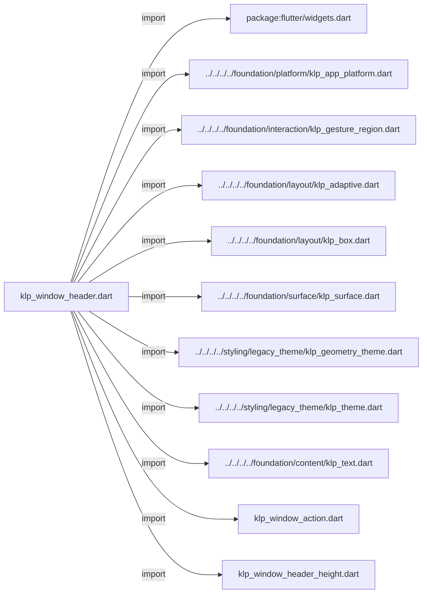
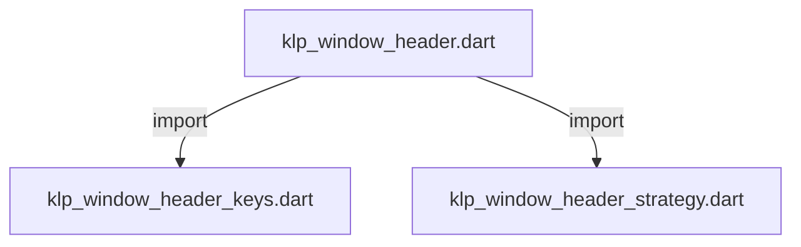
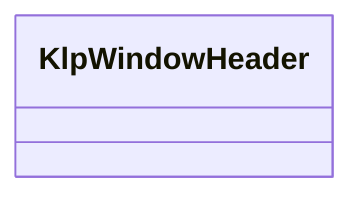
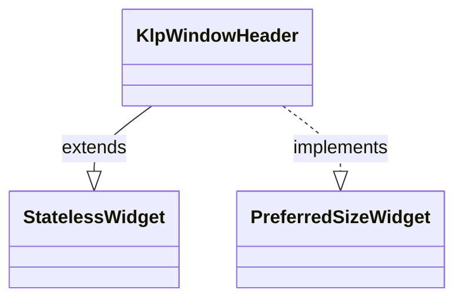

# klp_window_header.dart：直接依賴與宣告架構

[回到目錄](README.md) · [來源檔案](../../../../../../../lib/src/features/workspace/shell/window/klp_window_header.dart)

## 範圍

核心是 `lib/src/features/workspace/shell/window/klp_window_header.dart`。主要視角為該檔案明寫的 import／export／part；輔助視角為本檔宣告及 extends／implements／with／on 關係。只展開一層外部邊界。

## 直接依賴圖

## 依賴證據

| 關係 | 原始 directive | 來源 |
|---|---|---|
| import | <code>import &#x27;package:flutter/widgets.dart&#x27;;</code> | [lib/src/features/workspace/shell/window/klp_window_header.dart:1](../../../../../../../lib/src/features/workspace/shell/window/klp_window_header.dart#L1) |
| import | <code>import &#x27;../../../../foundation/platform/klp_app_platform.dart&#x27;;</code> | [lib/src/features/workspace/shell/window/klp_window_header.dart:3](../../../../../../../lib/src/features/workspace/shell/window/klp_window_header.dart#L3) |
| import | <code>import &#x27;../../../../foundation/interaction/klp_gesture_region.dart&#x27;;</code> | [lib/src/features/workspace/shell/window/klp_window_header.dart:4](../../../../../../../lib/src/features/workspace/shell/window/klp_window_header.dart#L4) |
| import | <code>import &#x27;../../../../foundation/layout/klp_adaptive.dart&#x27;;</code> | [lib/src/features/workspace/shell/window/klp_window_header.dart:5](../../../../../../../lib/src/features/workspace/shell/window/klp_window_header.dart#L5) |
| import | <code>import &#x27;../../../../foundation/layout/klp_box.dart&#x27;;</code> | [lib/src/features/workspace/shell/window/klp_window_header.dart:6](../../../../../../../lib/src/features/workspace/shell/window/klp_window_header.dart#L6) |
| import | <code>import &#x27;../../../../foundation/surface/klp_surface.dart&#x27;;</code> | [lib/src/features/workspace/shell/window/klp_window_header.dart:7](../../../../../../../lib/src/features/workspace/shell/window/klp_window_header.dart#L7) |
| import | <code>import &#x27;../../../../styling/legacy_theme/klp_geometry_theme.dart&#x27;;</code> | [lib/src/features/workspace/shell/window/klp_window_header.dart:8](../../../../../../../lib/src/features/workspace/shell/window/klp_window_header.dart#L8) |
| import | <code>import &#x27;../../../../styling/legacy_theme/klp_theme.dart&#x27;;</code> | [lib/src/features/workspace/shell/window/klp_window_header.dart:9](../../../../../../../lib/src/features/workspace/shell/window/klp_window_header.dart#L9) |
| import | <code>import &#x27;../../../../foundation/content/klp_text.dart&#x27;;</code> | [lib/src/features/workspace/shell/window/klp_window_header.dart:10](../../../../../../../lib/src/features/workspace/shell/window/klp_window_header.dart#L10) |
| import | <code>import &#x27;klp_window_action.dart&#x27;;</code> | [lib/src/features/workspace/shell/window/klp_window_header.dart:11](../../../../../../../lib/src/features/workspace/shell/window/klp_window_header.dart#L11) |
| import | <code>import &#x27;klp_window_header_height.dart&#x27;;</code> | [lib/src/features/workspace/shell/window/klp_window_header.dart:12](../../../../../../../lib/src/features/workspace/shell/window/klp_window_header.dart#L12) |
| import | <code>import &#x27;klp_window_header_keys.dart&#x27;;</code> | [lib/src/features/workspace/shell/window/klp_window_header.dart:13](../../../../../../../lib/src/features/workspace/shell/window/klp_window_header.dart#L13) |
| import | <code>import &#x27;klp_window_header_strategy.dart&#x27;;</code> | [lib/src/features/workspace/shell/window/klp_window_header.dart:14](../../../../../../../lib/src/features/workspace/shell/window/klp_window_header.dart#L14) |

## 宣告關係圖

本組節點是本檔宣告；沒有箭頭的宣告未在此圖主張互相依賴。

## 宣告與成員證據

成員包含 public 與 private；簽章取自來源，省略函式本體與欄位初始值。`(inferred)` 表示來源未明寫型別；建構子只顯示參數部分，不含初始化列表。

### KlpWindowHeader

ClassDeclaration · public · [lib/src/features/workspace/shell/window/klp_window_header.dart:16](../../../../../../../lib/src/features/workspace/shell/window/klp_window_header.dart#L16)

<code>class KlpWindowHeader extends StatelessWidget implements PreferredSizeWidget</code>

來源註解摘要：桌面應用程式自帶視窗標題列（Chrome Header）。整個 Header 表面都可拖動視窗； 內部操作元件仍保留 tap 等自身事件。 - **Windows / Linux 模式**：左側展示 App Icon 與標題，右側展示自訂動作與視窗控制項。 - **macOS 模式**：左側展示視窗控制項（交通燈），中間展示 App Icon 與標題，右側展示自訂動作。

- `extends` → <code>StatelessWidget</code>：[lib/src/features/workspace/shell/window/klp_window_header.dart:21](../../../../../../../lib/src/features/workspace/shell/window/klp_window_header.dart#L21)
- `implements` → <code>PreferredSizeWidget</code>：[lib/src/features/workspace/shell/window/klp_window_header.dart:21](../../../../../../../lib/src/features/workspace/shell/window/klp_window_header.dart#L21)

| 成員 | 可見性 | 簽章／型別 | 來源註解摘要 | 證據 |
|---|---|---|---|---|
| constructor <code>KlpWindowHeader</code> | public | <code>const KlpWindowHeader({ super.key, this.title, this.titleText, this.titleRole = KlpTextRole.appTitle, this.titleTrailing, this.appIcon, this.appIconButton, this.actions, this.leading, this.trailing, this.platform, this.height, this.onMinimize, this.onToggleMaximize, this.onClose, this.isMaximized = false, this.showWindowControls = true, })</code> |  | [lib/src/features/workspace/shell/window/klp_window_header.dart:22](../../../../../../../lib/src/features/workspace/shell/window/klp_window_header.dart#L22) |
| field <code>title</code> | public | <code>final Widget? title</code> | 自訂標題 Widget。優先於 [titleText]。 | [lib/src/features/workspace/shell/window/klp_window_header.dart:43](../../../../../../../lib/src/features/workspace/shell/window/klp_window_header.dart#L43) |
| field <code>titleText</code> | public | <code>final String? titleText</code> | 標題純文字。 | [lib/src/features/workspace/shell/window/klp_window_header.dart:46](../../../../../../../lib/src/features/workspace/shell/window/klp_window_header.dart#L46) |
| field <code>titleRole</code> | public | <code>final KlpTextRole titleRole</code> | 產品標題字體角色（預設使用 [KlpTextRole.appTitle]）。 | [lib/src/features/workspace/shell/window/klp_window_header.dart:49](../../../../../../../lib/src/features/workspace/shell/window/klp_window_header.dart#L49) |
| field <code>titleTrailing</code> | public | <code>final Widget? titleTrailing</code> | 緊接在標題右方的控制項；適合在面板收合後保留展開按鈕。 | [lib/src/features/workspace/shell/window/klp_window_header.dart:52](../../../../../../../lib/src/features/workspace/shell/window/klp_window_header.dart#L52) |
| field <code>appIcon</code> | public | <code>final Widget? appIcon</code> | 應用程式圖示。 | [lib/src/features/workspace/shell/window/klp_window_header.dart:55](../../../../../../../lib/src/features/workspace/shell/window/klp_window_header.dart#L55) |
| field <code>appIconButton</code> | public | <code>final Widget? appIconButton</code> | 佔用 App icon 槽位的互動按鈕。提供時優先於 [appIcon]。 | [lib/src/features/workspace/shell/window/klp_window_header.dart:58](../../../../../../../lib/src/features/workspace/shell/window/klp_window_header.dart#L58) |
| field <code>actions</code> | public | <code>final List&lt;Widget&gt;? actions</code> | 頂部自訂動作按鈕清單。 | [lib/src/features/workspace/shell/window/klp_window_header.dart:61](../../../../../../../lib/src/features/workspace/shell/window/klp_window_header.dart#L61) |
| field <code>leading</code> | public | <code>final Widget? leading</code> | 自訂最左側區域（若為 macOS 且提供則排在控制鈕後）。 | [lib/src/features/workspace/shell/window/klp_window_header.dart:64](../../../../../../../lib/src/features/workspace/shell/window/klp_window_header.dart#L64) |
| field <code>trailing</code> | public | <code>final Widget? trailing</code> | 自訂最右側區域。 | [lib/src/features/workspace/shell/window/klp_window_header.dart:67](../../../../../../../lib/src/features/workspace/shell/window/klp_window_header.dart#L67) |
| field <code>platform</code> | public | <code>final KlpAppPlatform? platform</code> | 手動指定平台外觀風格（預設依系統環境判定）。 | [lib/src/features/workspace/shell/window/klp_window_header.dart:70](../../../../../../../lib/src/features/workspace/shell/window/klp_window_header.dart#L70) |
| field <code>height</code> | public | <code>final double? height</code> | 標題列版面占位高度；未指定時為內容高度加上上下 margin。 | [lib/src/features/workspace/shell/window/klp_window_header.dart:73](../../../../../../../lib/src/features/workspace/shell/window/klp_window_header.dart#L73) |
| field <code>onMinimize</code> | public | <code>final VoidCallback? onMinimize</code> | 最小化視窗回呼。 | [lib/src/features/workspace/shell/window/klp_window_header.dart:76](../../../../../../../lib/src/features/workspace/shell/window/klp_window_header.dart#L76) |
| field <code>onToggleMaximize</code> | public | <code>final VoidCallback? onToggleMaximize</code> | 最大化／還原視窗回呼。 | [lib/src/features/workspace/shell/window/klp_window_header.dart:79](../../../../../../../lib/src/features/workspace/shell/window/klp_window_header.dart#L79) |
| field <code>onClose</code> | public | <code>final VoidCallback? onClose</code> | 關閉視窗回呼。 | [lib/src/features/workspace/shell/window/klp_window_header.dart:82](../../../../../../../lib/src/features/workspace/shell/window/klp_window_header.dart#L82) |
| field <code>isMaximized</code> | public | <code>final bool isMaximized</code> | 目前視窗是否為最大化狀態。 | [lib/src/features/workspace/shell/window/klp_window_header.dart:85](../../../../../../../lib/src/features/workspace/shell/window/klp_window_header.dart#L85) |
| field <code>showWindowControls</code> | public | <code>final bool showWindowControls</code> | 是否顯示視窗控制按鈕（最小化、最大化、關閉）。 | [lib/src/features/workspace/shell/window/klp_window_header.dart:88](../../../../../../../lib/src/features/workspace/shell/window/klp_window_header.dart#L88) |
| getter <code>preferredSize</code> | public | <code>Size get preferredSize</code> |  | [lib/src/features/workspace/shell/window/klp_window_header.dart:90](../../../../../../../lib/src/features/workspace/shell/window/klp_window_header.dart#L90) |
| method <code>build</code> | public | <code>Widget build(BuildContext context)</code> |  | [lib/src/features/workspace/shell/window/klp_window_header.dart:95](../../../../../../../lib/src/features/workspace/shell/window/klp_window_header.dart#L95) |

## 閱讀說明與限制

箭頭只表示來源明寫的靜態關係；import 不等於呼叫。未分析動態呼叫、欄位的實際物件擁有權、狀態轉移或渲染流程；型別未進行語意解析，繼承目標保留原始型別拼寫。public／private 依 Dart 名稱前綴判斷；public 宣告不代表已由 `lib/kallopis.dart` 匯出。

本頁由 `tool/architecture_atlas` 產生；編輯來源或生成工具後重新產生，避免手改本頁。
