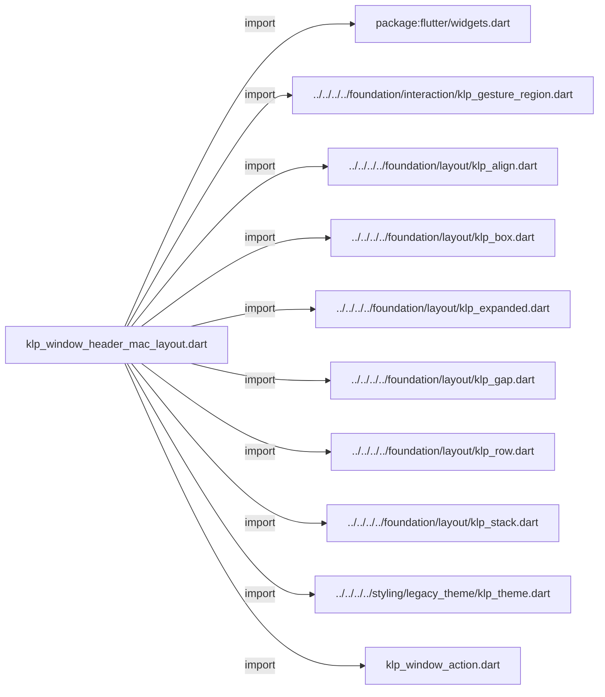
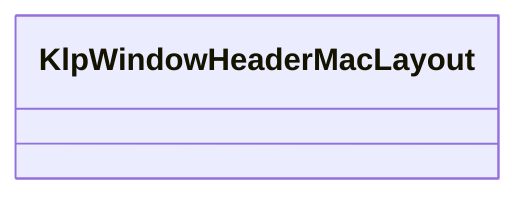
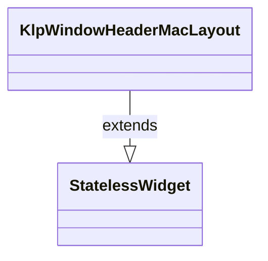

# klp_window_header_mac_layout.dart：直接依賴與宣告架構

[回到目錄](README.md) · [來源檔案](../../../../../../../lib/src/features/workspace/shell/window/klp_window_header_mac_layout.dart)

## 範圍

核心是 `lib/src/features/workspace/shell/window/klp_window_header_mac_layout.dart`。主要視角為該檔案明寫的 import／export／part；輔助視角為本檔宣告及 extends／implements／with／on 關係。只展開一層外部邊界。

## 直接依賴圖

## 依賴證據

| 關係 | 原始 directive | 來源 |
|---|---|---|
| import | <code>import &#x27;package:flutter/widgets.dart&#x27;;</code> | [lib/src/features/workspace/shell/window/klp_window_header_mac_layout.dart:1](../../../../../../../lib/src/features/workspace/shell/window/klp_window_header_mac_layout.dart#L1) |
| import | <code>import &#x27;../../../../foundation/interaction/klp_gesture_region.dart&#x27;;</code> | [lib/src/features/workspace/shell/window/klp_window_header_mac_layout.dart:3](../../../../../../../lib/src/features/workspace/shell/window/klp_window_header_mac_layout.dart#L3) |
| import | <code>import &#x27;../../../../foundation/layout/klp_align.dart&#x27;;</code> | [lib/src/features/workspace/shell/window/klp_window_header_mac_layout.dart:4](../../../../../../../lib/src/features/workspace/shell/window/klp_window_header_mac_layout.dart#L4) |
| import | <code>import &#x27;../../../../foundation/layout/klp_box.dart&#x27;;</code> | [lib/src/features/workspace/shell/window/klp_window_header_mac_layout.dart:5](../../../../../../../lib/src/features/workspace/shell/window/klp_window_header_mac_layout.dart#L5) |
| import | <code>import &#x27;../../../../foundation/layout/klp_expanded.dart&#x27;;</code> | [lib/src/features/workspace/shell/window/klp_window_header_mac_layout.dart:6](../../../../../../../lib/src/features/workspace/shell/window/klp_window_header_mac_layout.dart#L6) |
| import | <code>import &#x27;../../../../foundation/layout/klp_gap.dart&#x27;;</code> | [lib/src/features/workspace/shell/window/klp_window_header_mac_layout.dart:7](../../../../../../../lib/src/features/workspace/shell/window/klp_window_header_mac_layout.dart#L7) |
| import | <code>import &#x27;../../../../foundation/layout/klp_row.dart&#x27;;</code> | [lib/src/features/workspace/shell/window/klp_window_header_mac_layout.dart:8](../../../../../../../lib/src/features/workspace/shell/window/klp_window_header_mac_layout.dart#L8) |
| import | <code>import &#x27;../../../../foundation/layout/klp_stack.dart&#x27;;</code> | [lib/src/features/workspace/shell/window/klp_window_header_mac_layout.dart:9](../../../../../../../lib/src/features/workspace/shell/window/klp_window_header_mac_layout.dart#L9) |
| import | <code>import &#x27;../../../../styling/legacy_theme/klp_theme.dart&#x27;;</code> | [lib/src/features/workspace/shell/window/klp_window_header_mac_layout.dart:10](../../../../../../../lib/src/features/workspace/shell/window/klp_window_header_mac_layout.dart#L10) |
| import | <code>import &#x27;klp_window_action.dart&#x27;;</code> | [lib/src/features/workspace/shell/window/klp_window_header_mac_layout.dart:11](../../../../../../../lib/src/features/workspace/shell/window/klp_window_header_mac_layout.dart#L11) |

## 宣告關係圖

本組節點是本檔宣告；沒有箭頭的宣告未在此圖主張互相依賴。

## 宣告與成員證據

成員包含 public 與 private；簽章取自來源，省略函式本體與欄位初始值。`(inferred)` 表示來源未明寫型別；建構子只顯示參數部分，不含初始化列表。

### KlpWindowHeaderMacLayout

ClassDeclaration · public · [lib/src/features/workspace/shell/window/klp_window_header_mac_layout.dart:13](../../../../../../../lib/src/features/workspace/shell/window/klp_window_header_mac_layout.dart#L13)

<code>class KlpWindowHeaderMacLayout extends StatelessWidget</code>

來源註解摘要：macOS 平台的視窗標題列排版元件。

- `extends` → <code>StatelessWidget</code>：[lib/src/features/workspace/shell/window/klp_window_header_mac_layout.dart:14](../../../../../../../lib/src/features/workspace/shell/window/klp_window_header_mac_layout.dart#L14)

| 成員 | 可見性 | 簽章／型別 | 來源註解摘要 | 證據 |
|---|---|---|---|---|
| constructor <code>KlpWindowHeaderMacLayout</code> | public | <code>const KlpWindowHeaderMacLayout({ super.key, required this.identity, required this.controls, this.leading, this.trailing, this.titleTrailing, this.actions, this.onToggleMaximize, })</code> |  | [lib/src/features/workspace/shell/window/klp_window_header_mac_layout.dart:15](../../../../../../../lib/src/features/workspace/shell/window/klp_window_header_mac_layout.dart#L15) |
| field <code>identity</code> | public | <code>final Widget identity</code> |  | [lib/src/features/workspace/shell/window/klp_window_header_mac_layout.dart:26](../../../../../../../lib/src/features/workspace/shell/window/klp_window_header_mac_layout.dart#L26) |
| field <code>controls</code> | public | <code>final Widget controls</code> |  | [lib/src/features/workspace/shell/window/klp_window_header_mac_layout.dart:27](../../../../../../../lib/src/features/workspace/shell/window/klp_window_header_mac_layout.dart#L27) |
| field <code>leading</code> | public | <code>final Widget? leading</code> |  | [lib/src/features/workspace/shell/window/klp_window_header_mac_layout.dart:28](../../../../../../../lib/src/features/workspace/shell/window/klp_window_header_mac_layout.dart#L28) |
| field <code>trailing</code> | public | <code>final Widget? trailing</code> |  | [lib/src/features/workspace/shell/window/klp_window_header_mac_layout.dart:29](../../../../../../../lib/src/features/workspace/shell/window/klp_window_header_mac_layout.dart#L29) |
| field <code>titleTrailing</code> | public | <code>final Widget? titleTrailing</code> |  | [lib/src/features/workspace/shell/window/klp_window_header_mac_layout.dart:30](../../../../../../../lib/src/features/workspace/shell/window/klp_window_header_mac_layout.dart#L30) |
| field <code>actions</code> | public | <code>final List&lt;Widget&gt;? actions</code> |  | [lib/src/features/workspace/shell/window/klp_window_header_mac_layout.dart:31](../../../../../../../lib/src/features/workspace/shell/window/klp_window_header_mac_layout.dart#L31) |
| field <code>onToggleMaximize</code> | public | <code>final VoidCallback? onToggleMaximize</code> |  | [lib/src/features/workspace/shell/window/klp_window_header_mac_layout.dart:32](../../../../../../../lib/src/features/workspace/shell/window/klp_window_header_mac_layout.dart#L32) |
| method <code>build</code> | public | <code>Widget build(BuildContext context)</code> |  | [lib/src/features/workspace/shell/window/klp_window_header_mac_layout.dart:34](../../../../../../../lib/src/features/workspace/shell/window/klp_window_header_mac_layout.dart#L34) |

## 閱讀說明與限制

箭頭只表示來源明寫的靜態關係；import 不等於呼叫。未分析動態呼叫、欄位的實際物件擁有權、狀態轉移或渲染流程；型別未進行語意解析，繼承目標保留原始型別拼寫。public／private 依 Dart 名稱前綴判斷；public 宣告不代表已由 `lib/kallopis.dart` 匯出。

本頁由 `tool/architecture_atlas` 產生；編輯來源或生成工具後重新產生，避免手改本頁。
