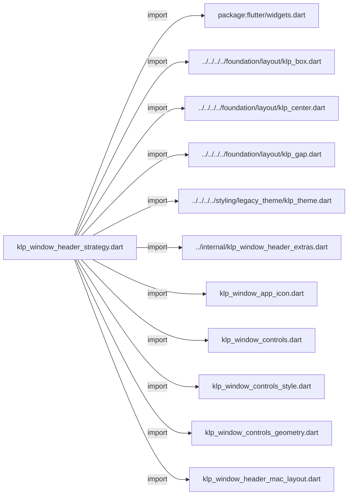
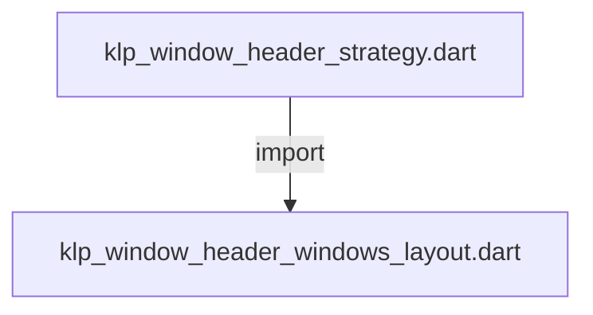
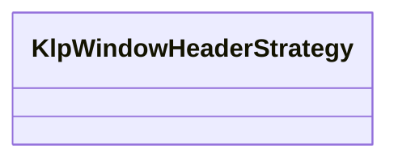

# klp_window_header_strategy.dart：直接依賴與宣告架構

[回到目錄](README.md) · [來源檔案](../../../../../../../lib/src/features/workspace/shell/window/klp_window_header_strategy.dart)

## 範圍

核心是 `lib/src/features/workspace/shell/window/klp_window_header_strategy.dart`。主要視角為該檔案明寫的 import／export／part；輔助視角為本檔宣告及 extends／implements／with／on 關係。只展開一層外部邊界。

## 直接依賴圖

## 依賴證據

| 關係 | 原始 directive | 來源 |
|---|---|---|
| import | <code>import &#x27;package:flutter/widgets.dart&#x27;;</code> | [lib/src/features/workspace/shell/window/klp_window_header_strategy.dart:1](../../../../../../../lib/src/features/workspace/shell/window/klp_window_header_strategy.dart#L1) |
| import | <code>import &#x27;../../../../foundation/layout/klp_box.dart&#x27;;</code> | [lib/src/features/workspace/shell/window/klp_window_header_strategy.dart:3](../../../../../../../lib/src/features/workspace/shell/window/klp_window_header_strategy.dart#L3) |
| import | <code>import &#x27;../../../../foundation/layout/klp_center.dart&#x27;;</code> | [lib/src/features/workspace/shell/window/klp_window_header_strategy.dart:4](../../../../../../../lib/src/features/workspace/shell/window/klp_window_header_strategy.dart#L4) |
| import | <code>import &#x27;../../../../foundation/layout/klp_gap.dart&#x27;;</code> | [lib/src/features/workspace/shell/window/klp_window_header_strategy.dart:5](../../../../../../../lib/src/features/workspace/shell/window/klp_window_header_strategy.dart#L5) |
| import | <code>import &#x27;../../../../styling/legacy_theme/klp_theme.dart&#x27;;</code> | [lib/src/features/workspace/shell/window/klp_window_header_strategy.dart:6](../../../../../../../lib/src/features/workspace/shell/window/klp_window_header_strategy.dart#L6) |
| import | <code>import &#x27;../internal/klp_window_header_extras.dart&#x27;;</code> | [lib/src/features/workspace/shell/window/klp_window_header_strategy.dart:7](../../../../../../../lib/src/features/workspace/shell/window/klp_window_header_strategy.dart#L7) |
| import | <code>import &#x27;klp_window_app_icon.dart&#x27;;</code> | [lib/src/features/workspace/shell/window/klp_window_header_strategy.dart:8](../../../../../../../lib/src/features/workspace/shell/window/klp_window_header_strategy.dart#L8) |
| import | <code>import &#x27;klp_window_controls.dart&#x27;;</code> | [lib/src/features/workspace/shell/window/klp_window_header_strategy.dart:9](../../../../../../../lib/src/features/workspace/shell/window/klp_window_header_strategy.dart#L9) |
| import | <code>import &#x27;klp_window_controls_style.dart&#x27;;</code> | [lib/src/features/workspace/shell/window/klp_window_header_strategy.dart:10](../../../../../../../lib/src/features/workspace/shell/window/klp_window_header_strategy.dart#L10) |
| import | <code>import &#x27;klp_window_controls_geometry.dart&#x27;;</code> | [lib/src/features/workspace/shell/window/klp_window_header_strategy.dart:11](../../../../../../../lib/src/features/workspace/shell/window/klp_window_header_strategy.dart#L11) |
| import | <code>import &#x27;klp_window_header_mac_layout.dart&#x27;;</code> | [lib/src/features/workspace/shell/window/klp_window_header_strategy.dart:12](../../../../../../../lib/src/features/workspace/shell/window/klp_window_header_strategy.dart#L12) |
| import | <code>import &#x27;klp_window_header_windows_layout.dart&#x27;;</code> | [lib/src/features/workspace/shell/window/klp_window_header_strategy.dart:13](../../../../../../../lib/src/features/workspace/shell/window/klp_window_header_strategy.dart#L13) |

## 宣告關係圖

本組節點是本檔宣告；沒有箭頭的宣告未在此圖主張互相依賴。

## 宣告與成員證據

成員包含 public 與 private；簽章取自來源，省略函式本體與欄位初始值。`(inferred)` 表示來源未明寫型別；建構子只顯示參數部分，不含初始化列表。

### KlpWindowHeaderStrategy

ClassDeclaration · public · [lib/src/features/workspace/shell/window/klp_window_header_strategy.dart:15](../../../../../../../lib/src/features/workspace/shell/window/klp_window_header_strategy.dart#L15)

<code>class KlpWindowHeaderStrategy</code>

來源註解摘要：將 Window Header 共用輸入轉為各平台 layout 的建構策略。

| 成員 | 可見性 | 簽章／型別 | 來源註解摘要 | 證據 |
|---|---|---|---|---|
| constructor <code>KlpWindowHeaderStrategy</code> | public | <code>const KlpWindowHeaderStrategy({ required this.title, required this.controlExtent, required this.appIconExtent, required this.appIconSlotKey, required this.onMinimize, required this.onToggleMaximize, required this.onClose, this.appIcon, this.appIconButton, this.actions, this.leading, this.trailing, this.titleTrailing, this.isMaximized = false, this.showWindowControls = true, })</code> |  | [lib/src/features/workspace/shell/window/klp_window_header_strategy.dart:17](../../../../../../../lib/src/features/workspace/shell/window/klp_window_header_strategy.dart#L17) |
| field <code>title</code> | public | <code>final Widget title</code> |  | [lib/src/features/workspace/shell/window/klp_window_header_strategy.dart:35](../../../../../../../lib/src/features/workspace/shell/window/klp_window_header_strategy.dart#L35) |
| field <code>controlExtent</code> | public | <code>final double controlExtent</code> |  | [lib/src/features/workspace/shell/window/klp_window_header_strategy.dart:36](../../../../../../../lib/src/features/workspace/shell/window/klp_window_header_strategy.dart#L36) |
| field <code>appIconExtent</code> | public | <code>final double appIconExtent</code> |  | [lib/src/features/workspace/shell/window/klp_window_header_strategy.dart:37](../../../../../../../lib/src/features/workspace/shell/window/klp_window_header_strategy.dart#L37) |
| field <code>appIconSlotKey</code> | public | <code>final Key appIconSlotKey</code> |  | [lib/src/features/workspace/shell/window/klp_window_header_strategy.dart:38](../../../../../../../lib/src/features/workspace/shell/window/klp_window_header_strategy.dart#L38) |
| field <code>onMinimize</code> | public | <code>final VoidCallback onMinimize</code> |  | [lib/src/features/workspace/shell/window/klp_window_header_strategy.dart:39](../../../../../../../lib/src/features/workspace/shell/window/klp_window_header_strategy.dart#L39) |
| field <code>onToggleMaximize</code> | public | <code>final VoidCallback onToggleMaximize</code> |  | [lib/src/features/workspace/shell/window/klp_window_header_strategy.dart:40](../../../../../../../lib/src/features/workspace/shell/window/klp_window_header_strategy.dart#L40) |
| field <code>onClose</code> | public | <code>final VoidCallback onClose</code> |  | [lib/src/features/workspace/shell/window/klp_window_header_strategy.dart:41](../../../../../../../lib/src/features/workspace/shell/window/klp_window_header_strategy.dart#L41) |
| field <code>appIcon</code> | public | <code>final Widget? appIcon</code> |  | [lib/src/features/workspace/shell/window/klp_window_header_strategy.dart:42](../../../../../../../lib/src/features/workspace/shell/window/klp_window_header_strategy.dart#L42) |
| field <code>appIconButton</code> | public | <code>final Widget? appIconButton</code> |  | [lib/src/features/workspace/shell/window/klp_window_header_strategy.dart:43](../../../../../../../lib/src/features/workspace/shell/window/klp_window_header_strategy.dart#L43) |
| field <code>actions</code> | public | <code>final List&lt;Widget&gt;? actions</code> |  | [lib/src/features/workspace/shell/window/klp_window_header_strategy.dart:44](../../../../../../../lib/src/features/workspace/shell/window/klp_window_header_strategy.dart#L44) |
| field <code>leading</code> | public | <code>final Widget? leading</code> |  | [lib/src/features/workspace/shell/window/klp_window_header_strategy.dart:45](../../../../../../../lib/src/features/workspace/shell/window/klp_window_header_strategy.dart#L45) |
| field <code>trailing</code> | public | <code>final Widget? trailing</code> |  | [lib/src/features/workspace/shell/window/klp_window_header_strategy.dart:46](../../../../../../../lib/src/features/workspace/shell/window/klp_window_header_strategy.dart#L46) |
| field <code>titleTrailing</code> | public | <code>final Widget? titleTrailing</code> |  | [lib/src/features/workspace/shell/window/klp_window_header_strategy.dart:47](../../../../../../../lib/src/features/workspace/shell/window/klp_window_header_strategy.dart#L47) |
| field <code>isMaximized</code> | public | <code>final bool isMaximized</code> |  | [lib/src/features/workspace/shell/window/klp_window_header_strategy.dart:48](../../../../../../../lib/src/features/workspace/shell/window/klp_window_header_strategy.dart#L48) |
| field <code>showWindowControls</code> | public | <code>final bool showWindowControls</code> |  | [lib/src/features/workspace/shell/window/klp_window_header_strategy.dart:49](../../../../../../../lib/src/features/workspace/shell/window/klp_window_header_strategy.dart#L49) |
| method <code>buildWindows</code> | public | <code>Widget buildWindows(BuildContext context)</code> |  | [lib/src/features/workspace/shell/window/klp_window_header_strategy.dart:51](../../../../../../../lib/src/features/workspace/shell/window/klp_window_header_strategy.dart#L51) |
| method <code>buildMacOS</code> | public | <code>Widget buildMacOS(BuildContext context)</code> |  | [lib/src/features/workspace/shell/window/klp_window_header_strategy.dart:65](../../../../../../../lib/src/features/workspace/shell/window/klp_window_header_strategy.dart#L65) |
| method <code>buildIdentity</code> | public | <code>Widget buildIdentity(BuildContext context, bool appIconUsesIndependentSlot)</code> |  | [lib/src/features/workspace/shell/window/klp_window_header_strategy.dart:77](../../../../../../../lib/src/features/workspace/shell/window/klp_window_header_strategy.dart#L77) |
| method <code>buildControls</code> | public | <code>Widget buildControls(KlpWindowControlsStyle style)</code> |  | [lib/src/features/workspace/shell/window/klp_window_header_strategy.dart:98](../../../../../../../lib/src/features/workspace/shell/window/klp_window_header_strategy.dart#L98) |

## 閱讀說明與限制

箭頭只表示來源明寫的靜態關係；import 不等於呼叫。未分析動態呼叫、欄位的實際物件擁有權、狀態轉移或渲染流程；型別未進行語意解析，繼承目標保留原始型別拼寫。public／private 依 Dart 名稱前綴判斷；public 宣告不代表已由 `lib/kallopis.dart` 匯出。

本頁由 `tool/architecture_atlas` 產生；編輯來源或生成工具後重新產生，避免手改本頁。
