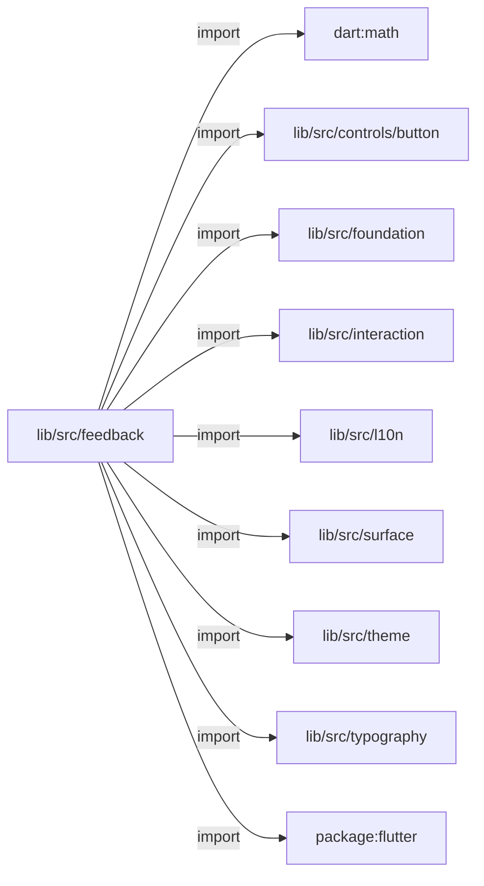
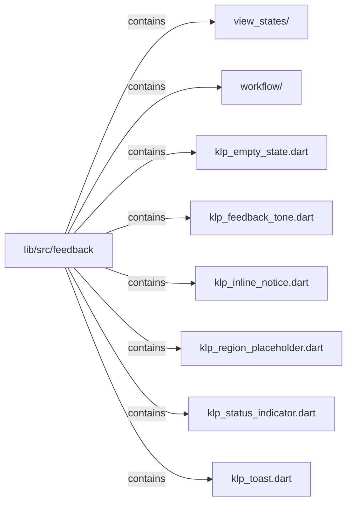

# lib/src/feedback：架構分析入口

[上一層](../README.md)

## 範圍

閱讀 `lib/src/feedback` 的直接子目錄與 Dart 檔案。結構圖表示實際檔案包含關係；依賴圖表示本層檔案明寫的 directives。每個檔案頁另列直接依賴、宣告、欄位、方法、建構子及行號證據。

## 模組閱讀重點

## 分析入口

此目錄呈現空白、錯誤、載入、權限與有限工作流狀態，並提供 live region 與焦點邊界。`KlpWorkflowState` 是輸入狀態分類；僅憑 enum 不可推論狀態轉移圖。此目錄目前沒有巢狀子目錄。

| 想回答的問題 | 精確符號與來源 |
| --- | --- |
| 工作流狀態與畫面入口在哪裡？ | `KlpWorkflowState`、`KlpWorkflowStateSurface`：lib/src/feedback/klp_finite_workflow.dart:12、31 |
| 載入與錯誤呈現由誰負責？ | `KlpLoadingState`、`KlpErrorState`：lib/src/feedback/klp_view_states.dart:11、46 |
| 無障礙通知與焦點生命週期從哪裡看？ | `KlpLiveRegion`、`KlpFocusBoundary`：lib/src/feedback/klp_finite_workflow.dart:147、163 |

重要依賴：`KlpWorkflowStateSurface` 的 build 在 `klp_finite_workflow.dart:69` 建構 `KlpSurface`，:95 將 `onAction` 交給 `KlpButton`。這是已查證的畫面組合與回呼轉交，沒有證明工作流本身由此執行。

## 本層直接依賴圖

箭頭以本層 Dart 檔案明寫的 directive 彙總到目標所在目錄或外部套件邊界；不遞迴將子目錄依賴算入本層。相同目標的不同 directive 類型分開計數。

| 目標邊界 | 關係 | directive 數 | 第一筆來源證據 |
|---|---|---|---|
| <code>dart:math</code> | import | 1 | [lib/src/feedback/klp_region_placeholder.dart:1](../../../../lib/src/feedback/klp_region_placeholder.dart#L1) |
| <code>lib/src/controls/button</code> | import | 1 | [lib/src/feedback/klp_toast.dart:3](../../../../lib/src/feedback/klp_toast.dart#L3) |
| <code>lib/src/foundation</code> | import | 5 | [lib/src/feedback/klp_empty_state.dart:3](../../../../lib/src/feedback/klp_empty_state.dart#L3) |
| <code>lib/src/interaction</code> | import | 1 | [lib/src/feedback/klp_region_placeholder.dart:5](../../../../lib/src/feedback/klp_region_placeholder.dart#L5) |
| <code>lib/src/l10n</code> | import | 1 | [lib/src/feedback/klp_toast.dart:5](../../../../lib/src/feedback/klp_toast.dart#L5) |
| <code>lib/src/surface</code> | import | 2 | [lib/src/feedback/klp_empty_state.dart:4](../../../../lib/src/feedback/klp_empty_state.dart#L4) |
| <code>lib/src/theme</code> | import | 6 | [lib/src/feedback/klp_empty_state.dart:5](../../../../lib/src/feedback/klp_empty_state.dart#L5) |
| <code>lib/src/typography</code> | import | 5 | [lib/src/feedback/klp_empty_state.dart:6](../../../../lib/src/feedback/klp_empty_state.dart#L6) |
| <code>package:flutter</code> | import | 6 | [lib/src/feedback/klp_empty_state.dart:1](../../../../lib/src/feedback/klp_empty_state.dart#L1) |

### 同目錄依賴

| 來源 → 目標 | 關係 | 證據 |
|---|---|---|
| <code>klp_inline_notice.dart → klp_feedback_tone.dart</code> | import | [lib/src/feedback/klp_inline_notice.dart:7](../../../../lib/src/feedback/klp_inline_notice.dart#L7) |
| <code>klp_toast.dart → klp_feedback_tone.dart</code> | import | [lib/src/feedback/klp_toast.dart:8](../../../../lib/src/feedback/klp_toast.dart#L8) |

## 目錄結構圖

## 子目錄

| 目錄 | 導航 | 來源證據 |
|---|---|---|
| `view_states/` | [架構入口](view_states/README.md) | [來源目錄](../../../../lib/src/feedback/view_states) |
| `workflow/` | [架構入口](workflow/README.md) | [來源目錄](../../../../lib/src/feedback/workflow) |

## 本層檔案

| 檔案 | 宣告 | 細節 | 來源證據 |
|---|---|---|---|
| `klp_empty_state.dart` | KlpEmptyState, KlpSkeletonLine | [架構與 API](klp_empty_state.md) | [lib/src/feedback/klp_empty_state.dart:1](../../../../lib/src/feedback/klp_empty_state.dart#L1) |
| `klp_feedback_tone.dart` | KlpFeedbackTone, KlpFeedbackToneStyle | [架構與 API](klp_feedback_tone.md) | [lib/src/feedback/klp_feedback_tone.dart:1](../../../../lib/src/feedback/klp_feedback_tone.dart#L1) |
| `klp_inline_notice.dart` | KlpInlineNotice | [架構與 API](klp_inline_notice.md) | [lib/src/feedback/klp_inline_notice.dart:1](../../../../lib/src/feedback/klp_inline_notice.dart#L1) |
| `klp_region_placeholder.dart` | KlpRegionPlaceholderTone, KlpRegionPlaceholder, _PlaceholderAction, _PlaceholderActionState, _PlaceholderMarker, _KlpPlaceholderFillPainter | [架構與 API](klp_region_placeholder.md) | [lib/src/feedback/klp_region_placeholder.dart:1](../../../../lib/src/feedback/klp_region_placeholder.dart#L1) |
| `klp_status_indicator.dart` | KlpStatusKind, KlpStatusIndicator | [架構與 API](klp_status_indicator.md) | [lib/src/feedback/klp_status_indicator.dart:1](../../../../lib/src/feedback/klp_status_indicator.dart#L1) |
| `klp_toast.dart` | KlpToast, KlpToastStack | [架構與 API](klp_toast.md) | [lib/src/feedback/klp_toast.dart:1](../../../../lib/src/feedback/klp_toast.dart#L1) |

## 閱讀說明

箭頭只表示來源明寫的靜態關係；import 不等於呼叫。未分析動態呼叫、欄位的實際物件擁有權、狀態轉移或渲染流程；型別未進行語意解析，繼承目標保留原始型別拼寫。public／private 依 Dart 名稱前綴判斷；public 宣告不代表已由 `lib/kallopis.dart` 匯出。

本頁的目錄與檔案由來源清冊產生；`manifest.json` 位於本圖集根目錄，可核對 SHA-256 與覆蓋數。人工模組摘要存於 `tool/architecture_atlas/briefs/`，重新生成時保留。
