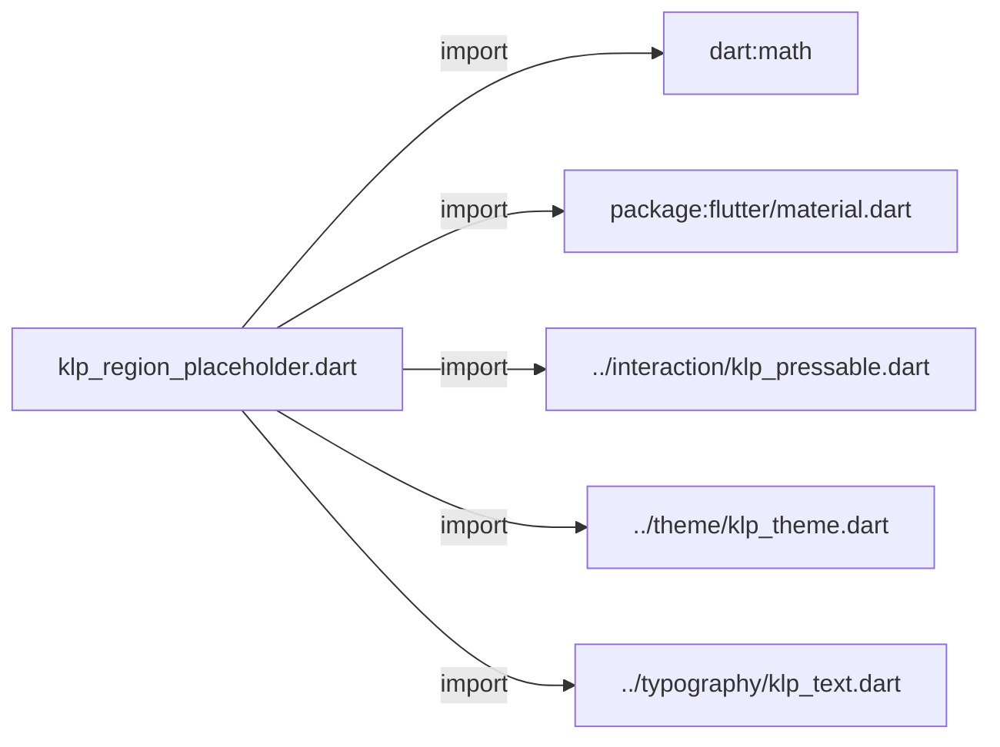
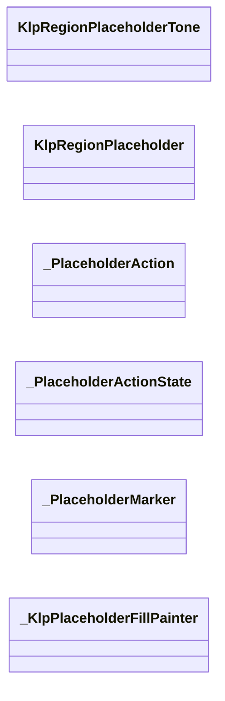
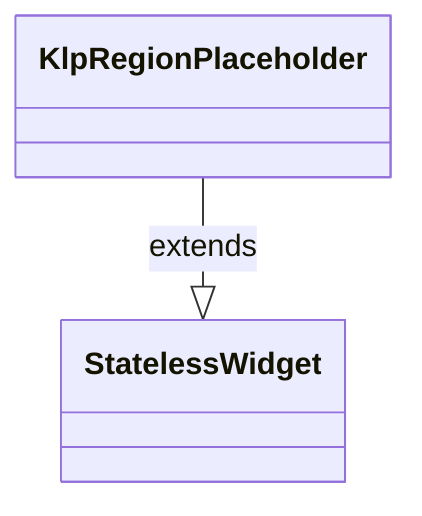
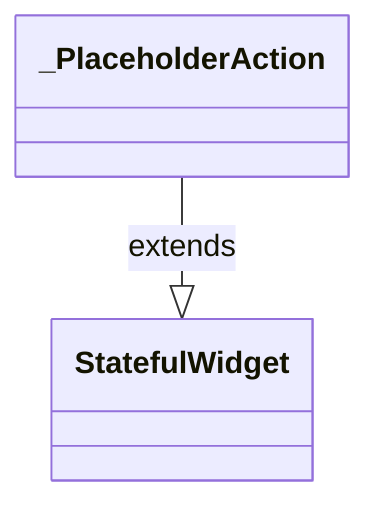
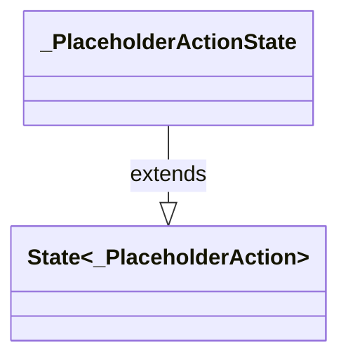
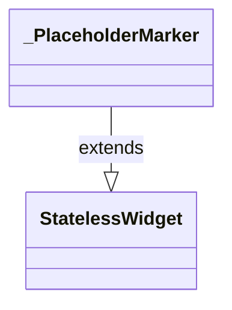
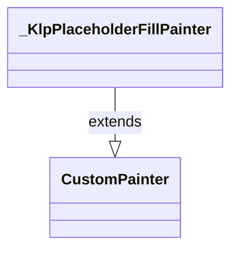

# klp_region_placeholder.dart：直接依賴與宣告架構

[回到目錄](README.md) · [來源檔案](../../../../lib/src/feedback/klp_region_placeholder.dart)

## 範圍

核心是 `lib/src/feedback/klp_region_placeholder.dart`。主要視角為該檔案明寫的 import／export／part；輔助視角為本檔宣告及 extends／implements／with／on 關係。只展開一層外部邊界。

## 直接依賴圖

## 依賴證據

| 關係 | 原始 directive | 來源 |
|---|---|---|
| import | <code>import &#x27;dart:math&#x27; as math;</code> | [lib/src/feedback/klp_region_placeholder.dart:1](../../../../lib/src/feedback/klp_region_placeholder.dart#L1) |
| import | <code>import &#x27;package:flutter/material.dart&#x27;;</code> | [lib/src/feedback/klp_region_placeholder.dart:3](../../../../lib/src/feedback/klp_region_placeholder.dart#L3) |
| import | <code>import &#x27;../interaction/klp_pressable.dart&#x27;;</code> | [lib/src/feedback/klp_region_placeholder.dart:5](../../../../lib/src/feedback/klp_region_placeholder.dart#L5) |
| import | <code>import &#x27;../theme/klp_theme.dart&#x27;;</code> | [lib/src/feedback/klp_region_placeholder.dart:6](../../../../lib/src/feedback/klp_region_placeholder.dart#L6) |
| import | <code>import &#x27;../typography/klp_text.dart&#x27;;</code> | [lib/src/feedback/klp_region_placeholder.dart:7](../../../../lib/src/feedback/klp_region_placeholder.dart#L7) |

## 宣告關係圖

本組節點是本檔宣告；沒有箭頭的宣告未在此圖主張互相依賴。

## 宣告與成員證據

成員包含 public 與 private；簽章取自來源，省略函式本體與欄位初始值。`(inferred)` 表示來源未明寫型別；建構子只顯示參數部分，不含初始化列表。

### KlpRegionPlaceholderTone

EnumDeclaration · public · [lib/src/feedback/klp_region_placeholder.dart:9](../../../../lib/src/feedback/klp_region_placeholder.dart#L9)

<code>enum KlpRegionPlaceholderTone</code>

| 成員 | 可見性 | 簽章／型別 | 來源註解摘要 | 證據 |
|---|---|---|---|---|
| enum value <code>neutral</code> | public | <code>neutral</code> |  | [lib/src/feedback/klp_region_placeholder.dart:9](../../../../lib/src/feedback/klp_region_placeholder.dart#L9) |
| enum value <code>pending</code> | public | <code>pending</code> |  | [lib/src/feedback/klp_region_placeholder.dart:9](../../../../lib/src/feedback/klp_region_placeholder.dart#L9) |

### KlpRegionPlaceholder

ClassDeclaration · public · [lib/src/feedback/klp_region_placeholder.dart:11](../../../../lib/src/feedback/klp_region_placeholder.dart#L11)

<code>class KlpRegionPlaceholder extends StatelessWidget</code>

- `extends` → <code>StatelessWidget</code>：[lib/src/feedback/klp_region_placeholder.dart:11](../../../../lib/src/feedback/klp_region_placeholder.dart#L11)

| 成員 | 可見性 | 簽章／型別 | 來源註解摘要 | 證據 |
|---|---|---|---|---|
| constructor <code>KlpRegionPlaceholder</code> | public | <code>const KlpRegionPlaceholder({ super.key, required this.label, required this.kindLabel, this.detail, this.hatched = true, this.minHeight, this.tone = KlpRegionPlaceholderTone.neutral, this.actionLabel, this.onAction, })</code> |  | [lib/src/feedback/klp_region_placeholder.dart:12](../../../../lib/src/feedback/klp_region_placeholder.dart#L12) |
| field <code>label</code> | public | <code>final String label</code> |  | [lib/src/feedback/klp_region_placeholder.dart:28](../../../../lib/src/feedback/klp_region_placeholder.dart#L28) |
| field <code>kindLabel</code> | public | <code>final String kindLabel</code> |  | [lib/src/feedback/klp_region_placeholder.dart:29](../../../../lib/src/feedback/klp_region_placeholder.dart#L29) |
| field <code>detail</code> | public | <code>final String? detail</code> |  | [lib/src/feedback/klp_region_placeholder.dart:30](../../../../lib/src/feedback/klp_region_placeholder.dart#L30) |
| field <code>hatched</code> | public | <code>final bool hatched</code> |  | [lib/src/feedback/klp_region_placeholder.dart:31](../../../../lib/src/feedback/klp_region_placeholder.dart#L31) |
| field <code>minHeight</code> | public | <code>final double? minHeight</code> |  | [lib/src/feedback/klp_region_placeholder.dart:32](../../../../lib/src/feedback/klp_region_placeholder.dart#L32) |
| field <code>tone</code> | public | <code>final KlpRegionPlaceholderTone tone</code> |  | [lib/src/feedback/klp_region_placeholder.dart:33](../../../../lib/src/feedback/klp_region_placeholder.dart#L33) |
| field <code>actionLabel</code> | public | <code>final String? actionLabel</code> |  | [lib/src/feedback/klp_region_placeholder.dart:34](../../../../lib/src/feedback/klp_region_placeholder.dart#L34) |
| field <code>onAction</code> | public | <code>final VoidCallback? onAction</code> |  | [lib/src/feedback/klp_region_placeholder.dart:35](../../../../lib/src/feedback/klp_region_placeholder.dart#L35) |
| method <code>build</code> | public | <code>Widget build(BuildContext context)</code> |  | [lib/src/feedback/klp_region_placeholder.dart:37](../../../../lib/src/feedback/klp_region_placeholder.dart#L37) |

### _PlaceholderAction

ClassDeclaration · private · [lib/src/feedback/klp_region_placeholder.dart:149](../../../../lib/src/feedback/klp_region_placeholder.dart#L149)

<code>class _PlaceholderAction extends StatefulWidget</code>

- `extends` → <code>StatefulWidget</code>：[lib/src/feedback/klp_region_placeholder.dart:149](../../../../lib/src/feedback/klp_region_placeholder.dart#L149)

| 成員 | 可見性 | 簽章／型別 | 來源註解摘要 | 證據 |
|---|---|---|---|---|
| constructor <code>_PlaceholderAction</code> | private | <code>const _PlaceholderAction({required this.label, required this.onPressed})</code> |  | [lib/src/feedback/klp_region_placeholder.dart:150](../../../../lib/src/feedback/klp_region_placeholder.dart#L150) |
| field <code>label</code> | public | <code>final String label</code> |  | [lib/src/feedback/klp_region_placeholder.dart:152](../../../../lib/src/feedback/klp_region_placeholder.dart#L152) |
| field <code>onPressed</code> | public | <code>final VoidCallback? onPressed</code> |  | [lib/src/feedback/klp_region_placeholder.dart:153](../../../../lib/src/feedback/klp_region_placeholder.dart#L153) |
| method <code>createState</code> | public | <code>State&lt;_PlaceholderAction&gt; createState()</code> |  | [lib/src/feedback/klp_region_placeholder.dart:155](../../../../lib/src/feedback/klp_region_placeholder.dart#L155) |

### _PlaceholderActionState

ClassDeclaration · private · [lib/src/feedback/klp_region_placeholder.dart:159](../../../../lib/src/feedback/klp_region_placeholder.dart#L159)

<code>class _PlaceholderActionState extends State&lt;_PlaceholderAction&gt;</code>

- `extends` → <code>State&lt;_PlaceholderAction&gt;</code>：[lib/src/feedback/klp_region_placeholder.dart:159](../../../../lib/src/feedback/klp_region_placeholder.dart#L159)

| 成員 | 可見性 | 簽章／型別 | 來源註解摘要 | 證據 |
|---|---|---|---|---|
| method <code>build</code> | public | <code>Widget build(BuildContext context)</code> |  | [lib/src/feedback/klp_region_placeholder.dart:160](../../../../lib/src/feedback/klp_region_placeholder.dart#L160) |

### _PlaceholderMarker

ClassDeclaration · private · [lib/src/feedback/klp_region_placeholder.dart:201](../../../../lib/src/feedback/klp_region_placeholder.dart#L201)

<code>class _PlaceholderMarker extends StatelessWidget</code>

- `extends` → <code>StatelessWidget</code>：[lib/src/feedback/klp_region_placeholder.dart:201](../../../../lib/src/feedback/klp_region_placeholder.dart#L201)

| 成員 | 可見性 | 簽章／型別 | 來源註解摘要 | 證據 |
|---|---|---|---|---|
| constructor <code>_PlaceholderMarker</code> | private | <code>const _PlaceholderMarker({required this.tone})</code> |  | [lib/src/feedback/klp_region_placeholder.dart:202](../../../../lib/src/feedback/klp_region_placeholder.dart#L202) |
| field <code>tone</code> | public | <code>final KlpRegionPlaceholderTone tone</code> |  | [lib/src/feedback/klp_region_placeholder.dart:204](../../../../lib/src/feedback/klp_region_placeholder.dart#L204) |
| method <code>build</code> | public | <code>Widget build(BuildContext context)</code> |  | [lib/src/feedback/klp_region_placeholder.dart:206](../../../../lib/src/feedback/klp_region_placeholder.dart#L206) |

### _KlpPlaceholderFillPainter

ClassDeclaration · private · [lib/src/feedback/klp_region_placeholder.dart:231](../../../../lib/src/feedback/klp_region_placeholder.dart#L231)

<code>class _KlpPlaceholderFillPainter extends CustomPainter</code>

- `extends` → <code>CustomPainter</code>：[lib/src/feedback/klp_region_placeholder.dart:231](../../../../lib/src/feedback/klp_region_placeholder.dart#L231)

| 成員 | 可見性 | 簽章／型別 | 來源註解摘要 | 證據 |
|---|---|---|---|---|
| constructor <code>_KlpPlaceholderFillPainter</code> | private | <code>const _KlpPlaceholderFillPainter({ required this.fillColor, required this.hatchColor, required this.hatched, required this.hatchBand, required this.hatchGap, })</code> |  | [lib/src/feedback/klp_region_placeholder.dart:232](../../../../lib/src/feedback/klp_region_placeholder.dart#L232) |
| field <code>fillColor</code> | public | <code>final Color fillColor</code> |  | [lib/src/feedback/klp_region_placeholder.dart:240](../../../../lib/src/feedback/klp_region_placeholder.dart#L240) |
| field <code>hatchColor</code> | public | <code>final Color hatchColor</code> |  | [lib/src/feedback/klp_region_placeholder.dart:241](../../../../lib/src/feedback/klp_region_placeholder.dart#L241) |
| field <code>hatched</code> | public | <code>final bool hatched</code> |  | [lib/src/feedback/klp_region_placeholder.dart:242](../../../../lib/src/feedback/klp_region_placeholder.dart#L242) |
| field <code>hatchBand</code> | public | <code>final double hatchBand</code> |  | [lib/src/feedback/klp_region_placeholder.dart:243](../../../../lib/src/feedback/klp_region_placeholder.dart#L243) |
| field <code>hatchGap</code> | public | <code>final double hatchGap</code> |  | [lib/src/feedback/klp_region_placeholder.dart:244](../../../../lib/src/feedback/klp_region_placeholder.dart#L244) |
| method <code>paint</code> | public | <code>void paint(Canvas canvas, Size size)</code> |  | [lib/src/feedback/klp_region_placeholder.dart:246](../../../../lib/src/feedback/klp_region_placeholder.dart#L246) |
| method <code>shouldRepaint</code> | public | <code>bool shouldRepaint(covariant _KlpPlaceholderFillPainter oldDelegate)</code> |  | [lib/src/feedback/klp_region_placeholder.dart:277](../../../../lib/src/feedback/klp_region_placeholder.dart#L277) |

## 閱讀說明與限制

箭頭只表示來源明寫的靜態關係；import 不等於呼叫。未分析動態呼叫、欄位的實際物件擁有權、狀態轉移或渲染流程；型別未進行語意解析，繼承目標保留原始型別拼寫。public／private 依 Dart 名稱前綴判斷；public 宣告不代表已由 `lib/kallopis.dart` 匯出。

本頁由 `tool/architecture_atlas` 產生；編輯來源或生成工具後重新產生，避免手改本頁。
