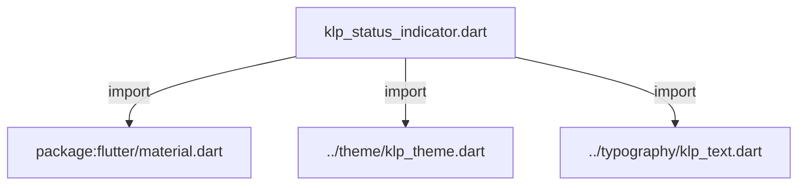
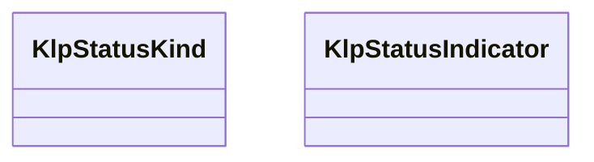
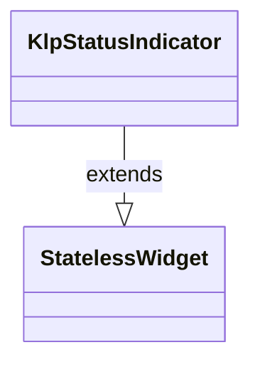

# klp_status_indicator.dart：直接依賴與宣告架構

[回到目錄](README.md) · [來源檔案](../../../../lib/src/feedback/klp_status_indicator.dart)

## 範圍

核心是 `lib/src/feedback/klp_status_indicator.dart`。主要視角為該檔案明寫的 import／export／part；輔助視角為本檔宣告及 extends／implements／with／on 關係。只展開一層外部邊界。

## 直接依賴圖

## 依賴證據

| 關係 | 原始 directive | 來源 |
|---|---|---|
| import | <code>import &#x27;package:flutter/material.dart&#x27;;</code> | [lib/src/feedback/klp_status_indicator.dart:1](../../../../lib/src/feedback/klp_status_indicator.dart#L1) |
| import | <code>import &#x27;../theme/klp_theme.dart&#x27;;</code> | [lib/src/feedback/klp_status_indicator.dart:3](../../../../lib/src/feedback/klp_status_indicator.dart#L3) |
| import | <code>import &#x27;../typography/klp_text.dart&#x27;;</code> | [lib/src/feedback/klp_status_indicator.dart:4](../../../../lib/src/feedback/klp_status_indicator.dart#L4) |

## 宣告關係圖

本組節點是本檔宣告；沒有箭頭的宣告未在此圖主張互相依賴。

## 宣告與成員證據

成員包含 public 與 private；簽章取自來源，省略函式本體與欄位初始值。`(inferred)` 表示來源未明寫型別；建構子只顯示參數部分，不含初始化列表。

### KlpStatusKind

EnumDeclaration · public · [lib/src/feedback/klp_status_indicator.dart:6](../../../../lib/src/feedback/klp_status_indicator.dart#L6)

<code>enum KlpStatusKind</code>

來源註解摘要：狀態語意種類。所有種類統一以純色圓點呈現，種類只負責解析預設顏色。

| 成員 | 可見性 | 簽章／型別 | 來源註解摘要 | 證據 |
|---|---|---|---|---|
| enum value <code>dot</code> | public | <code>dot</code> | 實心圓點。 | [lib/src/feedback/klp_status_indicator.dart:8](../../../../lib/src/feedback/klp_status_indicator.dart#L8) |
| enum value <code>running</code> | public | <code>running</code> | 運行中語意，使用資訊色圓點。 | [lib/src/feedback/klp_status_indicator.dart:11](../../../../lib/src/feedback/klp_status_indicator.dart#L11) |
| enum value <code>splitDot</code> | public | <code>splitDot</code> | 雙色狀態語意，使用資訊色圓點。 | [lib/src/feedback/klp_status_indicator.dart:14](../../../../lib/src/feedback/klp_status_indicator.dart#L14) |
| enum value <code>check</code> | public | <code>check</code> | 完成語意，使用成功色圓點。 | [lib/src/feedback/klp_status_indicator.dart:17](../../../../lib/src/feedback/klp_status_indicator.dart#L17) |
| enum value <code>cross</code> | public | <code>cross</code> | 失敗語意，使用危險色圓點。 | [lib/src/feedback/klp_status_indicator.dart:20](../../../../lib/src/feedback/klp_status_indicator.dart#L20) |
| enum value <code>waiting</code> | public | <code>waiting</code> | 等待語意，使用警告色圓點。 | [lib/src/feedback/klp_status_indicator.dart:23](../../../../lib/src/feedback/klp_status_indicator.dart#L23) |
| enum value <code>circle</code> | public | <code>circle</code> | 中性語意，使用 muted 色圓點。 | [lib/src/feedback/klp_status_indicator.dart:26](../../../../lib/src/feedback/klp_status_indicator.dart#L26) |

### KlpStatusIndicator

ClassDeclaration · public · [lib/src/feedback/klp_status_indicator.dart:30](../../../../lib/src/feedback/klp_status_indicator.dart#L30)

<code>class KlpStatusIndicator extends StatelessWidget</code>

來源註解摘要：狀態指示標記與文字。

- `extends` → <code>StatelessWidget</code>：[lib/src/feedback/klp_status_indicator.dart:31](../../../../lib/src/feedback/klp_status_indicator.dart#L31)

| 成員 | 可見性 | 簽章／型別 | 來源註解摘要 | 證據 |
|---|---|---|---|---|
| constructor <code>KlpStatusIndicator</code> | public | <code>const KlpStatusIndicator({ super.key, required this.label, this.active = true, this.kind = KlpStatusKind.dot, this.color, this.expanded = false, })</code> |  | [lib/src/feedback/klp_status_indicator.dart:32](../../../../lib/src/feedback/klp_status_indicator.dart#L32) |
| field <code>label</code> | public | <code>final String label</code> | 狀態標籤文字。 | [lib/src/feedback/klp_status_indicator.dart:42](../../../../lib/src/feedback/klp_status_indicator.dart#L42) |
| field <code>active</code> | public | <code>final bool active</code> | 是否處於啟用或活動狀態。 | [lib/src/feedback/klp_status_indicator.dart:45](../../../../lib/src/feedback/klp_status_indicator.dart#L45) |
| field <code>kind</code> | public | <code>final KlpStatusKind kind</code> | 指示圖示種類。 | [lib/src/feedback/klp_status_indicator.dart:48](../../../../lib/src/feedback/klp_status_indicator.dart#L48) |
| field <code>color</code> | public | <code>final Color? color</code> | 自訂狀態標記顏色；標籤仍沿用狀態列的 muted 文字語意。 | [lib/src/feedback/klp_status_indicator.dart:51](../../../../lib/src/feedback/klp_status_indicator.dart#L51) |
| field <code>expanded</code> | public | <code>final bool expanded</code> | 是否占滿可用寬度，並讓標籤在空間不足時省略。 | [lib/src/feedback/klp_status_indicator.dart:54](../../../../lib/src/feedback/klp_status_indicator.dart#L54) |
| method <code>build</code> | public | <code>Widget build(BuildContext context)</code> |  | [lib/src/feedback/klp_status_indicator.dart:56](../../../../lib/src/feedback/klp_status_indicator.dart#L56) |

## 閱讀說明與限制

箭頭只表示來源明寫的靜態關係；import 不等於呼叫。未分析動態呼叫、欄位的實際物件擁有權、狀態轉移或渲染流程；型別未進行語意解析，繼承目標保留原始型別拼寫。public／private 依 Dart 名稱前綴判斷；public 宣告不代表已由 `lib/kallopis.dart` 匯出。

本頁由 `tool/architecture_atlas` 產生；編輯來源或生成工具後重新產生，避免手改本頁。
