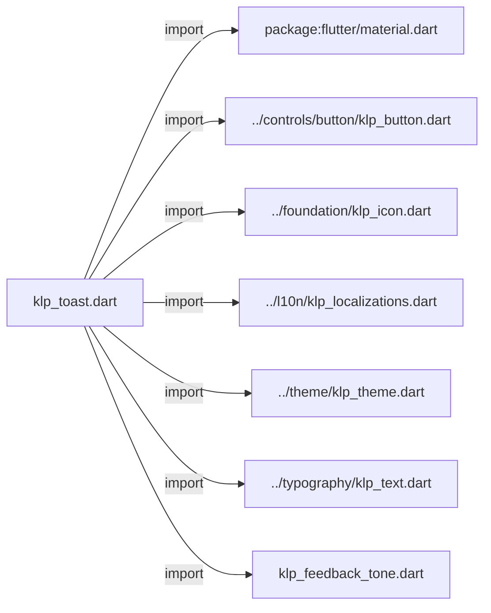
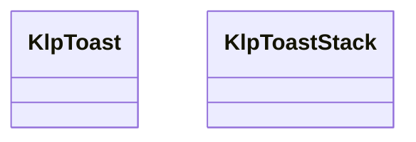
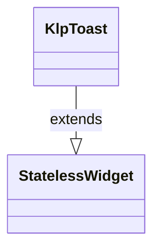
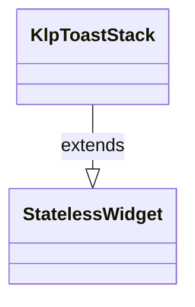

# klp_toast.dart：直接依賴與宣告架構

[回到目錄](README.md) · [來源檔案](../../../../lib/src/feedback/klp_toast.dart)

## 範圍

核心是 `lib/src/feedback/klp_toast.dart`。主要視角為該檔案明寫的 import／export／part；輔助視角為本檔宣告及 extends／implements／with／on 關係。只展開一層外部邊界。

## 直接依賴圖

## 依賴證據

| 關係 | 原始 directive | 來源 |
|---|---|---|
| import | <code>import &#x27;package:flutter/material.dart&#x27;;</code> | [lib/src/feedback/klp_toast.dart:1](../../../../lib/src/feedback/klp_toast.dart#L1) |
| import | <code>import &#x27;../controls/button/klp_button.dart&#x27;;</code> | [lib/src/feedback/klp_toast.dart:3](../../../../lib/src/feedback/klp_toast.dart#L3) |
| import | <code>import &#x27;../foundation/klp_icon.dart&#x27;;</code> | [lib/src/feedback/klp_toast.dart:4](../../../../lib/src/feedback/klp_toast.dart#L4) |
| import | <code>import &#x27;../l10n/klp_localizations.dart&#x27;;</code> | [lib/src/feedback/klp_toast.dart:5](../../../../lib/src/feedback/klp_toast.dart#L5) |
| import | <code>import &#x27;../theme/klp_theme.dart&#x27;;</code> | [lib/src/feedback/klp_toast.dart:6](../../../../lib/src/feedback/klp_toast.dart#L6) |
| import | <code>import &#x27;../typography/klp_text.dart&#x27;;</code> | [lib/src/feedback/klp_toast.dart:7](../../../../lib/src/feedback/klp_toast.dart#L7) |
| import | <code>import &#x27;klp_feedback_tone.dart&#x27;;</code> | [lib/src/feedback/klp_toast.dart:8](../../../../lib/src/feedback/klp_toast.dart#L8) |

## 宣告關係圖

本組節點是本檔宣告；沒有箭頭的宣告未在此圖主張互相依賴。

## 宣告與成員證據

成員包含 public 與 private；簽章取自來源，省略函式本體與欄位初始值。`(inferred)` 表示來源未明寫型別；建構子只顯示參數部分，不含初始化列表。

### KlpToast

ClassDeclaration · public · [lib/src/feedback/klp_toast.dart:10](../../../../lib/src/feedback/klp_toast.dart#L10)

<code>class KlpToast extends StatelessWidget</code>

來源註解摘要：短暫通知。**不負責排程與消失**——停留時間取自 `theme.motion.toastDwell`， 但實際的顯示與收起由呼叫端控制。

- `extends` → <code>StatelessWidget</code>：[lib/src/feedback/klp_toast.dart:12](../../../../lib/src/feedback/klp_toast.dart#L12)

| 成員 | 可見性 | 簽章／型別 | 來源註解摘要 | 證據 |
|---|---|---|---|---|
| constructor <code>KlpToast</code> | public | <code>const KlpToast({ super.key, required this.title, this.message, this.tone = KlpFeedbackTone.info, this.actionLabel, this.onAction, this.onClose, this.closeLabel, })</code> |  | [lib/src/feedback/klp_toast.dart:13](../../../../lib/src/feedback/klp_toast.dart#L13) |
| field <code>title</code> | public | <code>final String title</code> |  | [lib/src/feedback/klp_toast.dart:27](../../../../lib/src/feedback/klp_toast.dart#L27) |
| field <code>message</code> | public | <code>final String? message</code> |  | [lib/src/feedback/klp_toast.dart:28](../../../../lib/src/feedback/klp_toast.dart#L28) |
| field <code>tone</code> | public | <code>final KlpFeedbackTone tone</code> |  | [lib/src/feedback/klp_toast.dart:29](../../../../lib/src/feedback/klp_toast.dart#L29) |
| field <code>actionLabel</code> | public | <code>final String? actionLabel</code> |  | [lib/src/feedback/klp_toast.dart:30](../../../../lib/src/feedback/klp_toast.dart#L30) |
| field <code>onAction</code> | public | <code>final VoidCallback? onAction</code> |  | [lib/src/feedback/klp_toast.dart:31](../../../../lib/src/feedback/klp_toast.dart#L31) |
| field <code>onClose</code> | public | <code>final VoidCallback? onClose</code> |  | [lib/src/feedback/klp_toast.dart:32](../../../../lib/src/feedback/klp_toast.dart#L32) |
| field <code>closeLabel</code> | public | <code>final String? closeLabel</code> | 關閉鈕的文字。有 [onClose] 時必填——庫不替產品決定用什麼語言。 | [lib/src/feedback/klp_toast.dart:35](../../../../lib/src/feedback/klp_toast.dart#L35) |
| method <code>build</code> | public | <code>Widget build(BuildContext context)</code> |  | [lib/src/feedback/klp_toast.dart:37](../../../../lib/src/feedback/klp_toast.dart#L37) |

### KlpToastStack

ClassDeclaration · public · [lib/src/feedback/klp_toast.dart:127](../../../../lib/src/feedback/klp_toast.dart#L127)

<code>class KlpToastStack extends StatelessWidget</code>

- `extends` → <code>StatelessWidget</code>：[lib/src/feedback/klp_toast.dart:127](../../../../lib/src/feedback/klp_toast.dart#L127)

| 成員 | 可見性 | 簽章／型別 | 來源註解摘要 | 證據 |
|---|---|---|---|---|
| constructor <code>KlpToastStack</code> | public | <code>const KlpToastStack({super.key, required this.children})</code> |  | [lib/src/feedback/klp_toast.dart:128](../../../../lib/src/feedback/klp_toast.dart#L128) |
| field <code>children</code> | public | <code>final List&lt;Widget&gt; children</code> |  | [lib/src/feedback/klp_toast.dart:130](../../../../lib/src/feedback/klp_toast.dart#L130) |
| method <code>build</code> | public | <code>Widget build(BuildContext context)</code> |  | [lib/src/feedback/klp_toast.dart:132](../../../../lib/src/feedback/klp_toast.dart#L132) |

## 閱讀說明與限制

箭頭只表示來源明寫的靜態關係；import 不等於呼叫。未分析動態呼叫、欄位的實際物件擁有權、狀態轉移或渲染流程；型別未進行語意解析，繼承目標保留原始型別拼寫。public／private 依 Dart 名稱前綴判斷；public 宣告不代表已由 `lib/kallopis.dart` 匯出。

本頁由 `tool/architecture_atlas` 產生；編輯來源或生成工具後重新產生，避免手改本頁。
