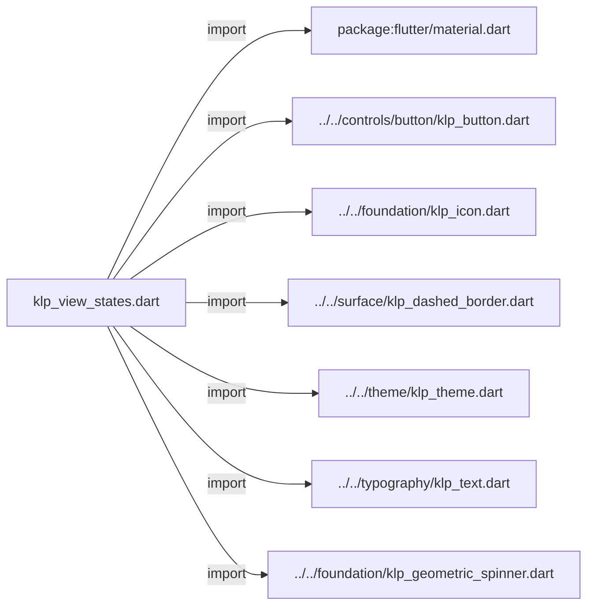
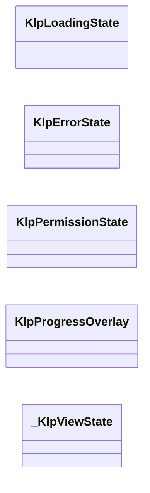
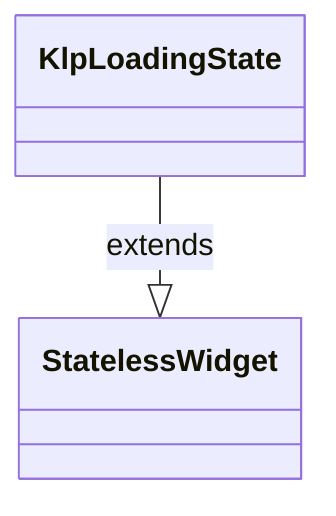
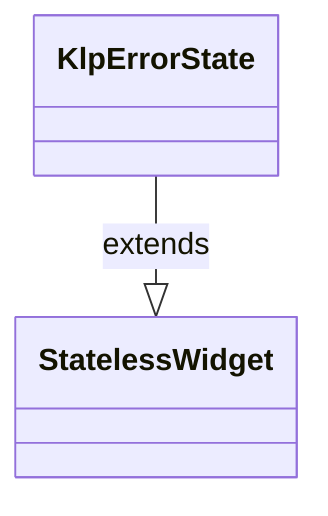
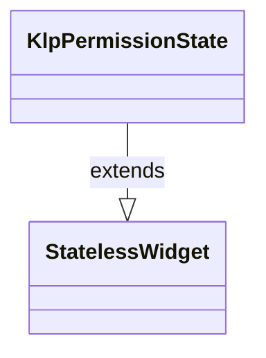
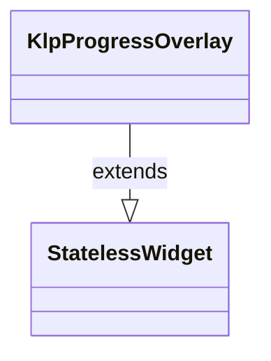
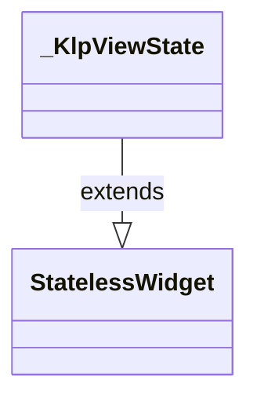

# klp_view_states.dart：直接依賴與宣告架構

[回到目錄](README.md) · [來源檔案](../../../../../lib/src/feedback/view_states/klp_view_states.dart)

## 範圍

核心是 `lib/src/feedback/view_states/klp_view_states.dart`。主要視角為該檔案明寫的 import／export／part；輔助視角為本檔宣告及 extends／implements／with／on 關係。只展開一層外部邊界。

## 直接依賴圖

## 依賴證據

| 關係 | 原始 directive | 來源 |
|---|---|---|
| import | <code>import &#x27;package:flutter/material.dart&#x27;;</code> | [lib/src/feedback/view_states/klp_view_states.dart:1](../../../../../lib/src/feedback/view_states/klp_view_states.dart#L1) |
| import | <code>import &#x27;../../controls/button/klp_button.dart&#x27;;</code> | [lib/src/feedback/view_states/klp_view_states.dart:3](../../../../../lib/src/feedback/view_states/klp_view_states.dart#L3) |
| import | <code>import &#x27;../../foundation/klp_icon.dart&#x27;;</code> | [lib/src/feedback/view_states/klp_view_states.dart:4](../../../../../lib/src/feedback/view_states/klp_view_states.dart#L4) |
| import | <code>import &#x27;../../surface/klp_dashed_border.dart&#x27;;</code> | [lib/src/feedback/view_states/klp_view_states.dart:5](../../../../../lib/src/feedback/view_states/klp_view_states.dart#L5) |
| import | <code>import &#x27;../../theme/klp_theme.dart&#x27;;</code> | [lib/src/feedback/view_states/klp_view_states.dart:6](../../../../../lib/src/feedback/view_states/klp_view_states.dart#L6) |
| import | <code>import &#x27;../../typography/klp_text.dart&#x27;;</code> | [lib/src/feedback/view_states/klp_view_states.dart:7](../../../../../lib/src/feedback/view_states/klp_view_states.dart#L7) |
| import | <code>import &#x27;../../foundation/klp_geometric_spinner.dart&#x27;;</code> | [lib/src/feedback/view_states/klp_view_states.dart:9](../../../../../lib/src/feedback/view_states/klp_view_states.dart#L9) |

## 宣告關係圖

本組節點是本檔宣告；沒有箭頭的宣告未在此圖主張互相依賴。

## 宣告與成員證據

成員包含 public 與 private；簽章取自來源，省略函式本體與欄位初始值。`(inferred)` 表示來源未明寫型別；建構子只顯示參數部分，不含初始化列表。

### KlpLoadingState

ClassDeclaration · public · [lib/src/feedback/view_states/klp_view_states.dart:11](../../../../../lib/src/feedback/view_states/klp_view_states.dart#L11)

<code>class KlpLoadingState extends StatelessWidget</code>

- `extends` → <code>StatelessWidget</code>：[lib/src/feedback/view_states/klp_view_states.dart:11](../../../../../lib/src/feedback/view_states/klp_view_states.dart#L11)

| 成員 | 可見性 | 簽章／型別 | 來源註解摘要 | 證據 |
|---|---|---|---|---|
| constructor <code>KlpLoadingState</code> | public | <code>const KlpLoadingState({ super.key, required this.label, this.color, this.spinnerSize, })</code> |  | [lib/src/feedback/view_states/klp_view_states.dart:12](../../../../../lib/src/feedback/view_states/klp_view_states.dart#L12) |
| field <code>label</code> | public | <code>final String label</code> |  | [lib/src/feedback/view_states/klp_view_states.dart:19](../../../../../lib/src/feedback/view_states/klp_view_states.dart#L19) |
| field <code>color</code> | public | <code>final Color? color</code> |  | [lib/src/feedback/view_states/klp_view_states.dart:20](../../../../../lib/src/feedback/view_states/klp_view_states.dart#L20) |
| field <code>spinnerSize</code> | public | <code>final double? spinnerSize</code> |  | [lib/src/feedback/view_states/klp_view_states.dart:21](../../../../../lib/src/feedback/view_states/klp_view_states.dart#L21) |
| method <code>build</code> | public | <code>Widget build(BuildContext context)</code> |  | [lib/src/feedback/view_states/klp_view_states.dart:23](../../../../../lib/src/feedback/view_states/klp_view_states.dart#L23) |

### KlpErrorState

ClassDeclaration · public · [lib/src/feedback/view_states/klp_view_states.dart:46](../../../../../lib/src/feedback/view_states/klp_view_states.dart#L46)

<code>class KlpErrorState extends StatelessWidget</code>

- `extends` → <code>StatelessWidget</code>：[lib/src/feedback/view_states/klp_view_states.dart:46](../../../../../lib/src/feedback/view_states/klp_view_states.dart#L46)

| 成員 | 可見性 | 簽章／型別 | 來源註解摘要 | 證據 |
|---|---|---|---|---|
| constructor <code>KlpErrorState</code> | public | <code>const KlpErrorState({ super.key, required this.title, required this.message, this.icon, this.retryLabel, this.onRetry, })</code> |  | [lib/src/feedback/view_states/klp_view_states.dart:47](../../../../../lib/src/feedback/view_states/klp_view_states.dart#L47) |
| field <code>title</code> | public | <code>final String title</code> |  | [lib/src/feedback/view_states/klp_view_states.dart:56](../../../../../lib/src/feedback/view_states/klp_view_states.dart#L56) |
| field <code>message</code> | public | <code>final String message</code> |  | [lib/src/feedback/view_states/klp_view_states.dart:57](../../../../../lib/src/feedback/view_states/klp_view_states.dart#L57) |
| field <code>icon</code> | public | <code>final KlpIconData? icon</code> |  | [lib/src/feedback/view_states/klp_view_states.dart:58](../../../../../lib/src/feedback/view_states/klp_view_states.dart#L58) |
| field <code>retryLabel</code> | public | <code>final String? retryLabel</code> |  | [lib/src/feedback/view_states/klp_view_states.dart:59](../../../../../lib/src/feedback/view_states/klp_view_states.dart#L59) |
| field <code>onRetry</code> | public | <code>final VoidCallback? onRetry</code> |  | [lib/src/feedback/view_states/klp_view_states.dart:60](../../../../../lib/src/feedback/view_states/klp_view_states.dart#L60) |
| method <code>build</code> | public | <code>Widget build(BuildContext context)</code> |  | [lib/src/feedback/view_states/klp_view_states.dart:62](../../../../../lib/src/feedback/view_states/klp_view_states.dart#L62) |

### KlpPermissionState

ClassDeclaration · public · [lib/src/feedback/view_states/klp_view_states.dart:80](../../../../../lib/src/feedback/view_states/klp_view_states.dart#L80)

<code>class KlpPermissionState extends StatelessWidget</code>

- `extends` → <code>StatelessWidget</code>：[lib/src/feedback/view_states/klp_view_states.dart:80](../../../../../lib/src/feedback/view_states/klp_view_states.dart#L80)

| 成員 | 可見性 | 簽章／型別 | 來源註解摘要 | 證據 |
|---|---|---|---|---|
| constructor <code>KlpPermissionState</code> | public | <code>const KlpPermissionState({ super.key, required this.title, required this.message, this.icon, this.action, })</code> |  | [lib/src/feedback/view_states/klp_view_states.dart:81](../../../../../lib/src/feedback/view_states/klp_view_states.dart#L81) |
| field <code>title</code> | public | <code>final String title</code> |  | [lib/src/feedback/view_states/klp_view_states.dart:89](../../../../../lib/src/feedback/view_states/klp_view_states.dart#L89) |
| field <code>message</code> | public | <code>final String message</code> |  | [lib/src/feedback/view_states/klp_view_states.dart:90](../../../../../lib/src/feedback/view_states/klp_view_states.dart#L90) |
| field <code>icon</code> | public | <code>final KlpIconData? icon</code> |  | [lib/src/feedback/view_states/klp_view_states.dart:91](../../../../../lib/src/feedback/view_states/klp_view_states.dart#L91) |
| field <code>action</code> | public | <code>final Widget? action</code> |  | [lib/src/feedback/view_states/klp_view_states.dart:92](../../../../../lib/src/feedback/view_states/klp_view_states.dart#L92) |
| method <code>build</code> | public | <code>Widget build(BuildContext context)</code> |  | [lib/src/feedback/view_states/klp_view_states.dart:94](../../../../../lib/src/feedback/view_states/klp_view_states.dart#L94) |

### KlpProgressOverlay

ClassDeclaration · public · [lib/src/feedback/view_states/klp_view_states.dart:106](../../../../../lib/src/feedback/view_states/klp_view_states.dart#L106)

<code>class KlpProgressOverlay extends StatelessWidget</code>

- `extends` → <code>StatelessWidget</code>：[lib/src/feedback/view_states/klp_view_states.dart:106](../../../../../lib/src/feedback/view_states/klp_view_states.dart#L106)

| 成員 | 可見性 | 簽章／型別 | 來源註解摘要 | 證據 |
|---|---|---|---|---|
| constructor <code>KlpProgressOverlay</code> | public | <code>const KlpProgressOverlay({ super.key, required this.child, required this.visible, required this.label, this.backgroundColor, })</code> |  | [lib/src/feedback/view_states/klp_view_states.dart:107](../../../../../lib/src/feedback/view_states/klp_view_states.dart#L107) |
| field <code>child</code> | public | <code>final Widget child</code> |  | [lib/src/feedback/view_states/klp_view_states.dart:115](../../../../../lib/src/feedback/view_states/klp_view_states.dart#L115) |
| field <code>visible</code> | public | <code>final bool visible</code> |  | [lib/src/feedback/view_states/klp_view_states.dart:116](../../../../../lib/src/feedback/view_states/klp_view_states.dart#L116) |
| field <code>label</code> | public | <code>final String label</code> |  | [lib/src/feedback/view_states/klp_view_states.dart:117](../../../../../lib/src/feedback/view_states/klp_view_states.dart#L117) |
| field <code>backgroundColor</code> | public | <code>final Color? backgroundColor</code> |  | [lib/src/feedback/view_states/klp_view_states.dart:118](../../../../../lib/src/feedback/view_states/klp_view_states.dart#L118) |
| method <code>build</code> | public | <code>Widget build(BuildContext context)</code> |  | [lib/src/feedback/view_states/klp_view_states.dart:120](../../../../../lib/src/feedback/view_states/klp_view_states.dart#L120) |

### _KlpViewState

ClassDeclaration · private · [lib/src/feedback/view_states/klp_view_states.dart:146](../../../../../lib/src/feedback/view_states/klp_view_states.dart#L146)

<code>class _KlpViewState extends StatelessWidget</code>

- `extends` → <code>StatelessWidget</code>：[lib/src/feedback/view_states/klp_view_states.dart:146](../../../../../lib/src/feedback/view_states/klp_view_states.dart#L146)

| 成員 | 可見性 | 簽章／型別 | 來源註解摘要 | 證據 |
|---|---|---|---|---|
| constructor <code>_KlpViewState</code> | private | <code>const _KlpViewState({ required this.icon, required this.iconColor, required this.title, required this.message, required this.action, })</code> |  | [lib/src/feedback/view_states/klp_view_states.dart:147](../../../../../lib/src/feedback/view_states/klp_view_states.dart#L147) |
| field <code>icon</code> | public | <code>final KlpIconData? icon</code> |  | [lib/src/feedback/view_states/klp_view_states.dart:155](../../../../../lib/src/feedback/view_states/klp_view_states.dart#L155) |
| field <code>iconColor</code> | public | <code>final Color iconColor</code> |  | [lib/src/feedback/view_states/klp_view_states.dart:156](../../../../../lib/src/feedback/view_states/klp_view_states.dart#L156) |
| field <code>title</code> | public | <code>final String title</code> |  | [lib/src/feedback/view_states/klp_view_states.dart:157](../../../../../lib/src/feedback/view_states/klp_view_states.dart#L157) |
| field <code>message</code> | public | <code>final String message</code> |  | [lib/src/feedback/view_states/klp_view_states.dart:158](../../../../../lib/src/feedback/view_states/klp_view_states.dart#L158) |
| field <code>action</code> | public | <code>final Widget? action</code> |  | [lib/src/feedback/view_states/klp_view_states.dart:159](../../../../../lib/src/feedback/view_states/klp_view_states.dart#L159) |
| method <code>build</code> | public | <code>Widget build(BuildContext context)</code> |  | [lib/src/feedback/view_states/klp_view_states.dart:161](../../../../../lib/src/feedback/view_states/klp_view_states.dart#L161) |

## 閱讀說明與限制

箭頭只表示來源明寫的靜態關係；import 不等於呼叫。未分析動態呼叫、欄位的實際物件擁有權、狀態轉移或渲染流程；型別未進行語意解析，繼承目標保留原始型別拼寫。public／private 依 Dart 名稱前綴判斷；public 宣告不代表已由 `lib/kallopis.dart` 匯出。

本頁由 `tool/architecture_atlas` 產生；編輯來源或生成工具後重新產生，避免手改本頁。
