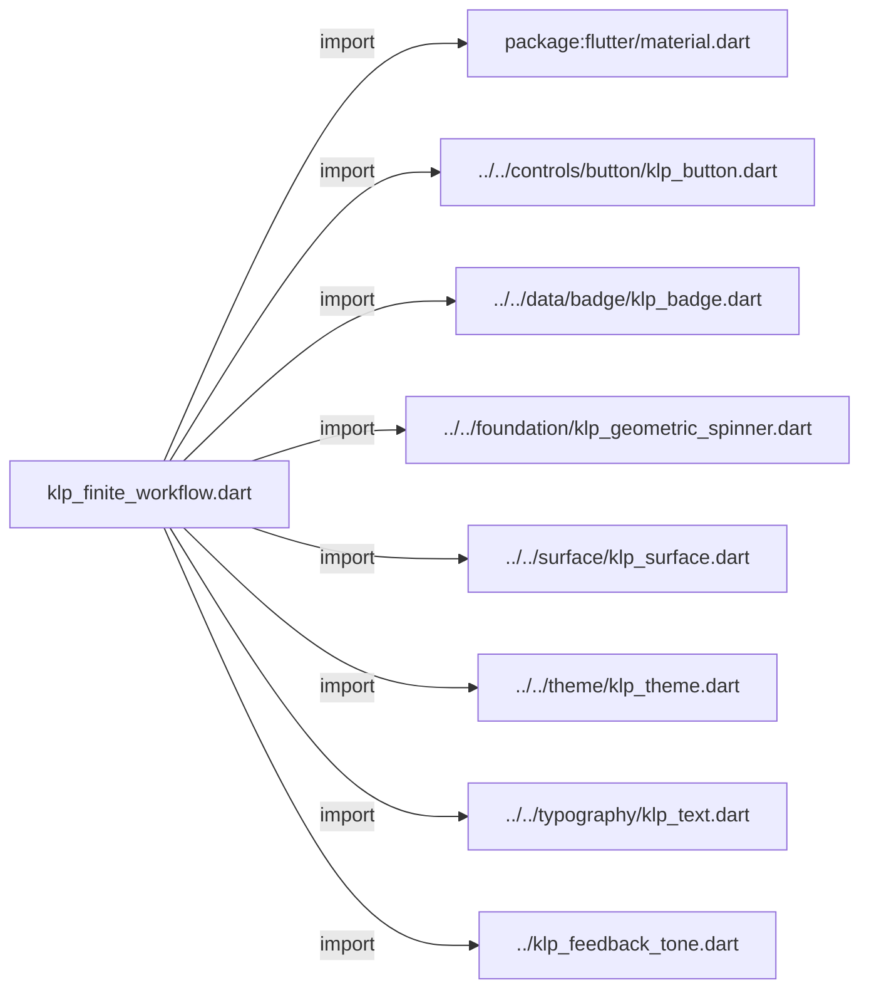
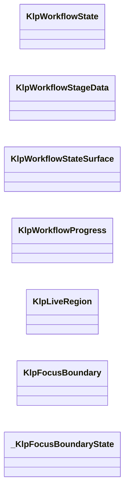
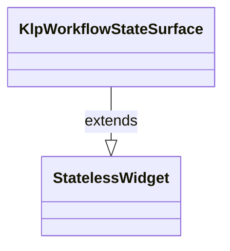
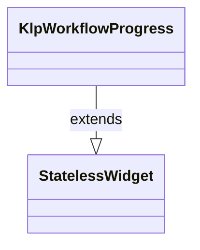
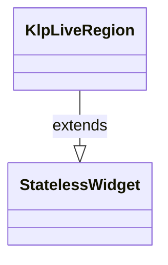
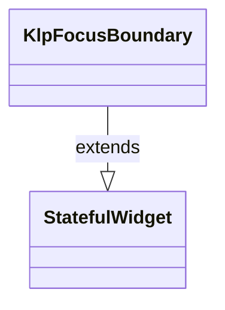
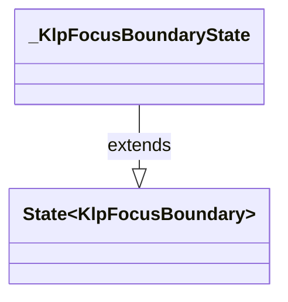

# klp_finite_workflow.dart：直接依賴與宣告架構

[回到目錄](README.md) · [來源檔案](../../../../../lib/src/feedback/workflow/klp_finite_workflow.dart)

## 範圍

核心是 `lib/src/feedback/workflow/klp_finite_workflow.dart`。主要視角為該檔案明寫的 import／export／part；輔助視角為本檔宣告及 extends／implements／with／on 關係。只展開一層外部邊界。

## 直接依賴圖

## 依賴證據

| 關係 | 原始 directive | 來源 |
|---|---|---|
| import | <code>import &#x27;package:flutter/material.dart&#x27;;</code> | [lib/src/feedback/workflow/klp_finite_workflow.dart:1](../../../../../lib/src/feedback/workflow/klp_finite_workflow.dart#L1) |
| import | <code>import &#x27;../../controls/button/klp_button.dart&#x27;;</code> | [lib/src/feedback/workflow/klp_finite_workflow.dart:3](../../../../../lib/src/feedback/workflow/klp_finite_workflow.dart#L3) |
| import | <code>import &#x27;../../data/badge/klp_badge.dart&#x27;;</code> | [lib/src/feedback/workflow/klp_finite_workflow.dart:4](../../../../../lib/src/feedback/workflow/klp_finite_workflow.dart#L4) |
| import | <code>import &#x27;../../foundation/klp_geometric_spinner.dart&#x27;;</code> | [lib/src/feedback/workflow/klp_finite_workflow.dart:5](../../../../../lib/src/feedback/workflow/klp_finite_workflow.dart#L5) |
| import | <code>import &#x27;../../surface/klp_surface.dart&#x27;;</code> | [lib/src/feedback/workflow/klp_finite_workflow.dart:6](../../../../../lib/src/feedback/workflow/klp_finite_workflow.dart#L6) |
| import | <code>import &#x27;../../theme/klp_theme.dart&#x27;;</code> | [lib/src/feedback/workflow/klp_finite_workflow.dart:7](../../../../../lib/src/feedback/workflow/klp_finite_workflow.dart#L7) |
| import | <code>import &#x27;../../typography/klp_text.dart&#x27;;</code> | [lib/src/feedback/workflow/klp_finite_workflow.dart:8](../../../../../lib/src/feedback/workflow/klp_finite_workflow.dart#L8) |
| import | <code>import &#x27;../klp_feedback_tone.dart&#x27;;</code> | [lib/src/feedback/workflow/klp_finite_workflow.dart:9](../../../../../lib/src/feedback/workflow/klp_finite_workflow.dart#L9) |

## 宣告關係圖

本組節點是本檔宣告；沒有箭頭的宣告未在此圖主張互相依賴。

## 宣告與成員證據

成員包含 public 與 private；簽章取自來源，省略函式本體與欄位初始值。`(inferred)` 表示來源未明寫型別；建構子只顯示參數部分，不含初始化列表。

### KlpWorkflowState

EnumDeclaration · public · [lib/src/feedback/workflow/klp_finite_workflow.dart:11](../../../../../lib/src/feedback/workflow/klp_finite_workflow.dart#L11)

<code>enum KlpWorkflowState</code>

來源註解摘要：有限工作流的語意狀態；狀態轉移仍由呼叫端控制。

| 成員 | 可見性 | 簽章／型別 | 來源註解摘要 | 證據 |
|---|---|---|---|---|
| enum value <code>empty</code> | public | <code>empty</code> |  | [lib/src/feedback/workflow/klp_finite_workflow.dart:12](../../../../../lib/src/feedback/workflow/klp_finite_workflow.dart#L12) |
| enum value <code>collecting</code> | public | <code>collecting</code> |  | [lib/src/feedback/workflow/klp_finite_workflow.dart:12](../../../../../lib/src/feedback/workflow/klp_finite_workflow.dart#L12) |
| enum value <code>reviewing</code> | public | <code>reviewing</code> |  | [lib/src/feedback/workflow/klp_finite_workflow.dart:12](../../../../../lib/src/feedback/workflow/klp_finite_workflow.dart#L12) |
| enum value <code>ready</code> | public | <code>ready</code> |  | [lib/src/feedback/workflow/klp_finite_workflow.dart:12](../../../../../lib/src/feedback/workflow/klp_finite_workflow.dart#L12) |
| enum value <code>stale</code> | public | <code>stale</code> |  | [lib/src/feedback/workflow/klp_finite_workflow.dart:12](../../../../../lib/src/feedback/workflow/klp_finite_workflow.dart#L12) |
| enum value <code>applying</code> | public | <code>applying</code> |  | [lib/src/feedback/workflow/klp_finite_workflow.dart:12](../../../../../lib/src/feedback/workflow/klp_finite_workflow.dart#L12) |
| enum value <code>applied</code> | public | <code>applied</code> |  | [lib/src/feedback/workflow/klp_finite_workflow.dart:12](../../../../../lib/src/feedback/workflow/klp_finite_workflow.dart#L12) |
| enum value <code>failed</code> | public | <code>failed</code> |  | [lib/src/feedback/workflow/klp_finite_workflow.dart:12](../../../../../lib/src/feedback/workflow/klp_finite_workflow.dart#L12) |

### KlpWorkflowStageData

ClassDeclaration · public · [lib/src/feedback/workflow/klp_finite_workflow.dart:14](../../../../../lib/src/feedback/workflow/klp_finite_workflow.dart#L14)

<code>class KlpWorkflowStageData</code>

來源註解摘要：一個具名稱的工作流階段，不使用虛構的時間估算。

| 成員 | 可見性 | 簽章／型別 | 來源註解摘要 | 證據 |
|---|---|---|---|---|
| constructor <code>KlpWorkflowStageData</code> | public | <code>const KlpWorkflowStageData({ required this.label, required this.statusLabel, required this.complete, this.active = false, })</code> |  | [lib/src/feedback/workflow/klp_finite_workflow.dart:17](../../../../../lib/src/feedback/workflow/klp_finite_workflow.dart#L17) |
| field <code>label</code> | public | <code>final String label</code> |  | [lib/src/feedback/workflow/klp_finite_workflow.dart:24](../../../../../lib/src/feedback/workflow/klp_finite_workflow.dart#L24) |
| field <code>statusLabel</code> | public | <code>final String statusLabel</code> |  | [lib/src/feedback/workflow/klp_finite_workflow.dart:25](../../../../../lib/src/feedback/workflow/klp_finite_workflow.dart#L25) |
| field <code>complete</code> | public | <code>final bool complete</code> |  | [lib/src/feedback/workflow/klp_finite_workflow.dart:26](../../../../../lib/src/feedback/workflow/klp_finite_workflow.dart#L26) |
| field <code>active</code> | public | <code>final bool active</code> |  | [lib/src/feedback/workflow/klp_finite_workflow.dart:27](../../../../../lib/src/feedback/workflow/klp_finite_workflow.dart#L27) |

### KlpWorkflowStateSurface

ClassDeclaration · public · [lib/src/feedback/workflow/klp_finite_workflow.dart:30](../../../../../lib/src/feedback/workflow/klp_finite_workflow.dart#L30)

<code>class KlpWorkflowStateSurface extends StatelessWidget</code>

來源註解摘要：將有限工作流狀態轉成可讀、可宣告的狀態表面。

- `extends` → <code>StatelessWidget</code>：[lib/src/feedback/workflow/klp_finite_workflow.dart:31](../../../../../lib/src/feedback/workflow/klp_finite_workflow.dart#L31)

| 成員 | 可見性 | 簽章／型別 | 來源註解摘要 | 證據 |
|---|---|---|---|---|
| constructor <code>KlpWorkflowStateSurface</code> | public | <code>const KlpWorkflowStateSurface({ super.key, required this.state, required this.title, required this.message, required this.statusLabel, this.actionLabel, this.onAction, this.child, })</code> |  | [lib/src/feedback/workflow/klp_finite_workflow.dart:32](../../../../../lib/src/feedback/workflow/klp_finite_workflow.dart#L32) |
| field <code>state</code> | public | <code>final KlpWorkflowState state</code> |  | [lib/src/feedback/workflow/klp_finite_workflow.dart:43](../../../../../lib/src/feedback/workflow/klp_finite_workflow.dart#L43) |
| field <code>title</code> | public | <code>final String title</code> |  | [lib/src/feedback/workflow/klp_finite_workflow.dart:44](../../../../../lib/src/feedback/workflow/klp_finite_workflow.dart#L44) |
| field <code>message</code> | public | <code>final String message</code> |  | [lib/src/feedback/workflow/klp_finite_workflow.dart:45](../../../../../lib/src/feedback/workflow/klp_finite_workflow.dart#L45) |
| field <code>statusLabel</code> | public | <code>final String statusLabel</code> |  | [lib/src/feedback/workflow/klp_finite_workflow.dart:46](../../../../../lib/src/feedback/workflow/klp_finite_workflow.dart#L46) |
| field <code>actionLabel</code> | public | <code>final String? actionLabel</code> |  | [lib/src/feedback/workflow/klp_finite_workflow.dart:47](../../../../../lib/src/feedback/workflow/klp_finite_workflow.dart#L47) |
| field <code>onAction</code> | public | <code>final VoidCallback? onAction</code> |  | [lib/src/feedback/workflow/klp_finite_workflow.dart:48](../../../../../lib/src/feedback/workflow/klp_finite_workflow.dart#L48) |
| field <code>child</code> | public | <code>final Widget? child</code> |  | [lib/src/feedback/workflow/klp_finite_workflow.dart:49](../../../../../lib/src/feedback/workflow/klp_finite_workflow.dart#L49) |
| getter <code>_tone</code> | private | <code>KlpFeedbackTone get _tone</code> |  | [lib/src/feedback/workflow/klp_finite_workflow.dart:51](../../../../../lib/src/feedback/workflow/klp_finite_workflow.dart#L51) |
| method <code>build</code> | public | <code>Widget build(BuildContext context)</code> |  | [lib/src/feedback/workflow/klp_finite_workflow.dart:62](../../../../../lib/src/feedback/workflow/klp_finite_workflow.dart#L62) |

### KlpWorkflowProgress

ClassDeclaration · public · [lib/src/feedback/workflow/klp_finite_workflow.dart:105](../../../../../lib/src/feedback/workflow/klp_finite_workflow.dart#L105)

<code>class KlpWorkflowProgress extends StatelessWidget</code>

來源註解摘要：顯示具名稱的真實階段，並向輔助技術宣告目前階段。

- `extends` → <code>StatelessWidget</code>：[lib/src/feedback/workflow/klp_finite_workflow.dart:106](../../../../../lib/src/feedback/workflow/klp_finite_workflow.dart#L106)

| 成員 | 可見性 | 簽章／型別 | 來源註解摘要 | 證據 |
|---|---|---|---|---|
| constructor <code>KlpWorkflowProgress</code> | public | <code>const KlpWorkflowProgress({super.key, required this.stages, this.label})</code> |  | [lib/src/feedback/workflow/klp_finite_workflow.dart:107](../../../../../lib/src/feedback/workflow/klp_finite_workflow.dart#L107) |
| field <code>stages</code> | public | <code>final List&lt;KlpWorkflowStageData&gt; stages</code> |  | [lib/src/feedback/workflow/klp_finite_workflow.dart:109](../../../../../lib/src/feedback/workflow/klp_finite_workflow.dart#L109) |
| field <code>label</code> | public | <code>final String? label</code> |  | [lib/src/feedback/workflow/klp_finite_workflow.dart:110](../../../../../lib/src/feedback/workflow/klp_finite_workflow.dart#L110) |
| method <code>build</code> | public | <code>Widget build(BuildContext context)</code> |  | [lib/src/feedback/workflow/klp_finite_workflow.dart:112](../../../../../lib/src/feedback/workflow/klp_finite_workflow.dart#L112) |

### KlpLiveRegion

ClassDeclaration · public · [lib/src/feedback/workflow/klp_finite_workflow.dart:146](../../../../../lib/src/feedback/workflow/klp_finite_workflow.dart#L146)

<code>class KlpLiveRegion extends StatelessWidget</code>

來源註解摘要：控制重複公告的可及性 live region；呼叫端提供已去重的訊息。

- `extends` → <code>StatelessWidget</code>：[lib/src/feedback/workflow/klp_finite_workflow.dart:147](../../../../../lib/src/feedback/workflow/klp_finite_workflow.dart#L147)

| 成員 | 可見性 | 簽章／型別 | 來源註解摘要 | 證據 |
|---|---|---|---|---|
| constructor <code>KlpLiveRegion</code> | public | <code>const KlpLiveRegion({super.key, required this.message, this.child = const SizedBox.shrink()})</code> |  | [lib/src/feedback/workflow/klp_finite_workflow.dart:148](../../../../../lib/src/feedback/workflow/klp_finite_workflow.dart#L148) |
| field <code>message</code> | public | <code>final String message</code> |  | [lib/src/feedback/workflow/klp_finite_workflow.dart:150](../../../../../lib/src/feedback/workflow/klp_finite_workflow.dart#L150) |
| field <code>child</code> | public | <code>final Widget child</code> |  | [lib/src/feedback/workflow/klp_finite_workflow.dart:151](../../../../../lib/src/feedback/workflow/klp_finite_workflow.dart#L151) |
| method <code>build</code> | public | <code>Widget build(BuildContext context)</code> |  | [lib/src/feedback/workflow/klp_finite_workflow.dart:153](../../../../../lib/src/feedback/workflow/klp_finite_workflow.dart#L153) |

### KlpFocusBoundary

ClassDeclaration · public · [lib/src/feedback/workflow/klp_finite_workflow.dart:162](../../../../../lib/src/feedback/workflow/klp_finite_workflow.dart#L162)

<code>class KlpFocusBoundary extends StatefulWidget</code>

來源註解摘要：建立可回復焦點的邊界；對話框或導覽完成後可呼叫 [requestFocus]。

- `extends` → <code>StatefulWidget</code>：[lib/src/feedback/workflow/klp_finite_workflow.dart:163](../../../../../lib/src/feedback/workflow/klp_finite_workflow.dart#L163)

| 成員 | 可見性 | 簽章／型別 | 來源註解摘要 | 證據 |
|---|---|---|---|---|
| constructor <code>KlpFocusBoundary</code> | public | <code>const KlpFocusBoundary({super.key, required this.child, this.autofocus = false})</code> |  | [lib/src/feedback/workflow/klp_finite_workflow.dart:164](../../../../../lib/src/feedback/workflow/klp_finite_workflow.dart#L164) |
| field <code>child</code> | public | <code>final Widget child</code> |  | [lib/src/feedback/workflow/klp_finite_workflow.dart:166](../../../../../lib/src/feedback/workflow/klp_finite_workflow.dart#L166) |
| field <code>autofocus</code> | public | <code>final bool autofocus</code> |  | [lib/src/feedback/workflow/klp_finite_workflow.dart:167](../../../../../lib/src/feedback/workflow/klp_finite_workflow.dart#L167) |
| method <code>requestFocus</code> | public | <code>static void requestFocus(BuildContext context)</code> |  | [lib/src/feedback/workflow/klp_finite_workflow.dart:169](../../../../../lib/src/feedback/workflow/klp_finite_workflow.dart#L169) |
| method <code>createState</code> | public | <code>State&lt;KlpFocusBoundary&gt; createState()</code> |  | [lib/src/feedback/workflow/klp_finite_workflow.dart:173](../../../../../lib/src/feedback/workflow/klp_finite_workflow.dart#L173) |

### _KlpFocusBoundaryState

ClassDeclaration · private · [lib/src/feedback/workflow/klp_finite_workflow.dart:177](../../../../../lib/src/feedback/workflow/klp_finite_workflow.dart#L177)

<code>class _KlpFocusBoundaryState extends State&lt;KlpFocusBoundary&gt;</code>

- `extends` → <code>State&lt;KlpFocusBoundary&gt;</code>：[lib/src/feedback/workflow/klp_finite_workflow.dart:177](../../../../../lib/src/feedback/workflow/klp_finite_workflow.dart#L177)

| 成員 | 可見性 | 簽章／型別 | 來源註解摘要 | 證據 |
|---|---|---|---|---|
| field <code>_node</code> | private | <code>final FocusNode _node</code> |  | [lib/src/feedback/workflow/klp_finite_workflow.dart:178](../../../../../lib/src/feedback/workflow/klp_finite_workflow.dart#L178) |
| method <code>requestFocus</code> | public | <code>void requestFocus()</code> |  | [lib/src/feedback/workflow/klp_finite_workflow.dart:180](../../../../../lib/src/feedback/workflow/klp_finite_workflow.dart#L180) |
| method <code>dispose</code> | public | <code>void dispose()</code> |  | [lib/src/feedback/workflow/klp_finite_workflow.dart:182](../../../../../lib/src/feedback/workflow/klp_finite_workflow.dart#L182) |
| method <code>build</code> | public | <code>Widget build(BuildContext context)</code> |  | [lib/src/feedback/workflow/klp_finite_workflow.dart:188](../../../../../lib/src/feedback/workflow/klp_finite_workflow.dart#L188) |

## 閱讀說明與限制

箭頭只表示來源明寫的靜態關係；import 不等於呼叫。未分析動態呼叫、欄位的實際物件擁有權、狀態轉移或渲染流程；型別未進行語意解析，繼承目標保留原始型別拼寫。public／private 依 Dart 名稱前綴判斷；public 宣告不代表已由 `lib/kallopis.dart` 匯出。

本頁由 `tool/architecture_atlas` 產生；編輯來源或生成工具後重新產生，避免手改本頁。
