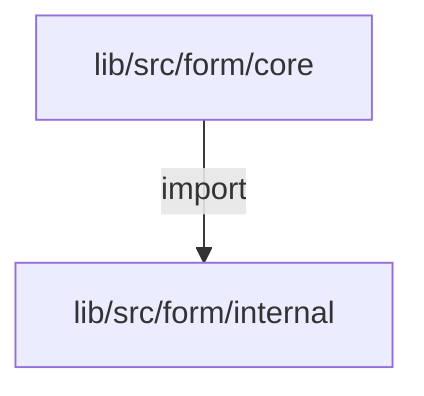
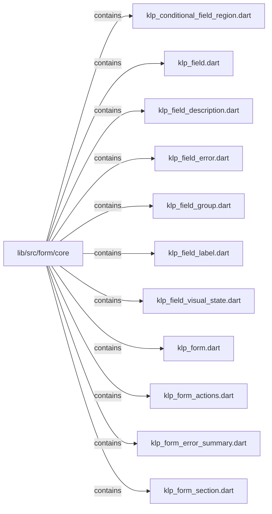

# lib/src/form/core：架構分析入口

[上一層](../README.md)

## 範圍

閱讀 `lib/src/form/core` 的直接子目錄與 Dart 檔案。結構圖表示實際檔案包含關係；依賴圖表示本層檔案明寫的 directives。每個檔案頁另列直接依賴、宣告、欄位、方法、建構子及行號證據。

## 本層直接依賴圖

箭頭以本層 Dart 檔案明寫的 directive 彙總到目標所在目錄或外部套件邊界；不遞迴將子目錄依賴算入本層。相同目標的不同 directive 類型分開計數。

| 目標邊界 | 關係 | directive 數 | 第一筆來源證據 |
|---|---|---|---|
| <code>lib/src/form/internal</code> | import | 10 | [lib/src/form/core/klp_conditional_field_region.dart:1](../../../../../lib/src/form/core/klp_conditional_field_region.dart#L1) |

### 同目錄依賴

| 來源 → 目標 | 關係 | 證據 |
|---|---|---|
| <code>klp_field.dart → klp_field_description.dart</code> | import | [lib/src/form/core/klp_field.dart:3](../../../../../lib/src/form/core/klp_field.dart#L3) |
| <code>klp_field.dart → klp_field_label.dart</code> | import | [lib/src/form/core/klp_field.dart:4](../../../../../lib/src/form/core/klp_field.dart#L4) |
| <code>klp_field_group.dart → klp_field.dart</code> | import | [lib/src/form/core/klp_field_group.dart:3](../../../../../lib/src/form/core/klp_field_group.dart#L3) |

## 目錄結構圖

## 子目錄

| 目錄 | 導航 | 來源證據 |
|---|---|---|
| 無 | 目前沒有下一層目錄 | — |

## 本層檔案

| 檔案 | 宣告 | 細節 | 來源證據 |
|---|---|---|---|
| `klp_conditional_field_region.dart` | KlpConditionalFieldRegion | [架構與 API](klp_conditional_field_region.md) | [lib/src/form/core/klp_conditional_field_region.dart:1](../../../../../lib/src/form/core/klp_conditional_field_region.dart#L1) |
| `klp_field.dart` | KlpField | [架構與 API](klp_field.md) | [lib/src/form/core/klp_field.dart:1](../../../../../lib/src/form/core/klp_field.dart#L1) |
| `klp_field_description.dart` | KlpFieldDescription | [架構與 API](klp_field_description.md) | [lib/src/form/core/klp_field_description.dart:1](../../../../../lib/src/form/core/klp_field_description.dart#L1) |
| `klp_field_error.dart` | KlpFieldError | [架構與 API](klp_field_error.md) | [lib/src/form/core/klp_field_error.dart:1](../../../../../lib/src/form/core/klp_field_error.dart#L1) |
| `klp_field_group.dart` | KlpFieldGroup | [架構與 API](klp_field_group.md) | [lib/src/form/core/klp_field_group.dart:1](../../../../../lib/src/form/core/klp_field_group.dart#L1) |
| `klp_field_label.dart` | KlpFieldLabel | [架構與 API](klp_field_label.md) | [lib/src/form/core/klp_field_label.dart:1](../../../../../lib/src/form/core/klp_field_label.dart#L1) |
| `klp_field_visual_state.dart` | KlpFieldVisualState | [架構與 API](klp_field_visual_state.md) | [lib/src/form/core/klp_field_visual_state.dart:1](../../../../../lib/src/form/core/klp_field_visual_state.dart#L1) |
| `klp_form.dart` | KlpForm | [架構與 API](klp_form.md) | [lib/src/form/core/klp_form.dart:1](../../../../../lib/src/form/core/klp_form.dart#L1) |
| `klp_form_actions.dart` | KlpFormActions | [架構與 API](klp_form_actions.md) | [lib/src/form/core/klp_form_actions.dart:1](../../../../../lib/src/form/core/klp_form_actions.dart#L1) |
| `klp_form_error_summary.dart` | KlpFormErrorSummary | [架構與 API](klp_form_error_summary.md) | [lib/src/form/core/klp_form_error_summary.dart:1](../../../../../lib/src/form/core/klp_form_error_summary.dart#L1) |
| `klp_form_section.dart` | KlpFormSection | [架構與 API](klp_form_section.md) | [lib/src/form/core/klp_form_section.dart:1](../../../../../lib/src/form/core/klp_form_section.dart#L1) |

## 閱讀說明

箭頭只表示來源明寫的靜態關係；import 不等於呼叫。未分析動態呼叫、欄位的實際物件擁有權、狀態轉移或渲染流程；型別未進行語意解析，繼承目標保留原始型別拼寫。public／private 依 Dart 名稱前綴判斷；public 宣告不代表已由 `lib/kallopis.dart` 匯出。

本頁的目錄與檔案由來源清冊產生；`manifest.json` 位於本圖集根目錄，可核對 SHA-256 與覆蓋數。人工模組摘要存於 `tool/architecture_atlas/briefs/`，重新生成時保留。
