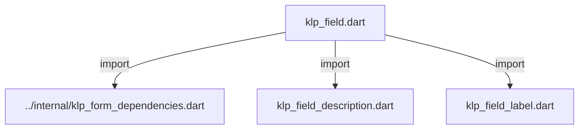
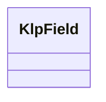
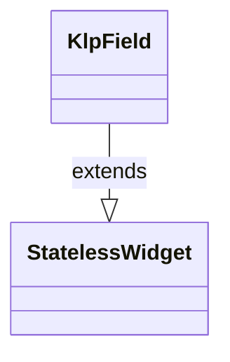

# klp_field.dart：直接依賴與宣告架構

[回到目錄](README.md) · [來源檔案](../../../../../lib/src/form/core/klp_field.dart)

## 範圍

核心是 `lib/src/form/core/klp_field.dart`。主要視角為該檔案明寫的 import／export／part；輔助視角為本檔宣告及 extends／implements／with／on 關係。只展開一層外部邊界。

## 直接依賴圖

## 依賴證據

| 關係 | 原始 directive | 來源 |
|---|---|---|
| import | <code>import &#x27;../internal/klp_form_dependencies.dart&#x27;;</code> | [lib/src/form/core/klp_field.dart:1](../../../../../lib/src/form/core/klp_field.dart#L1) |
| import | <code>import &#x27;klp_field_description.dart&#x27;;</code> | [lib/src/form/core/klp_field.dart:3](../../../../../lib/src/form/core/klp_field.dart#L3) |
| import | <code>import &#x27;klp_field_label.dart&#x27;;</code> | [lib/src/form/core/klp_field.dart:4](../../../../../lib/src/form/core/klp_field.dart#L4) |

## 宣告關係圖

本組節點是本檔宣告；沒有箭頭的宣告未在此圖主張互相依賴。

## 宣告與成員證據

成員包含 public 與 private；簽章取自來源，省略函式本體與欄位初始值。`(inferred)` 表示來源未明寫型別；建構子只顯示參數部分，不含初始化列表。

### KlpField

ClassDeclaration · public · [lib/src/form/core/klp_field.dart:6](../../../../../lib/src/form/core/klp_field.dart#L6)

<code>class KlpField extends StatelessWidget</code>

來源註解摘要：單一表單欄位的完整外框：標籤、選填說明、輸入控制項（[child]），以及 底部的錯誤／狀態／字數提示列。 [error]、[status]、[counter]、[errorCode] 共用同一列版面：底部提示列只在 四者至少有一個非 null 時才出現；[error] 優先於 [status]（兩者同時給只顯示 error），[errorCode]／[counter] 則各自靠右並存，通常放系統層級的診斷代碼 （例如後端回傳的驗證錯誤碼）供支援排查用，不是給一般使用者讀的文案。 實際的驗證邏輯、何時算 required 都由呼叫端決定，這個元件只負責排版。

- `extends` → <code>StatelessWidget</code>：[lib/src/form/core/klp_field.dart:14](../../../../../lib/src/form/core/klp_field.dart#L14)

| 成員 | 可見性 | 簽章／型別 | 來源註解摘要 | 證據 |
|---|---|---|---|---|
| constructor <code>KlpField</code> | public | <code>const KlpField({ super.key, required this.label, required this.child, this.description, this.error, this.errorCode, this.requirement, this.required = false, this.status, this.counter, })</code> |  | [lib/src/form/core/klp_field.dart:15](../../../../../lib/src/form/core/klp_field.dart#L15) |
| field <code>label</code> | public | <code>final String label</code> |  | [lib/src/form/core/klp_field.dart:28](../../../../../lib/src/form/core/klp_field.dart#L28) |
| field <code>description</code> | public | <code>final String? description</code> |  | [lib/src/form/core/klp_field.dart:29](../../../../../lib/src/form/core/klp_field.dart#L29) |
| field <code>error</code> | public | <code>final String? error</code> |  | [lib/src/form/core/klp_field.dart:30](../../../../../lib/src/form/core/klp_field.dart#L30) |
| field <code>errorCode</code> | public | <code>final String? errorCode</code> |  | [lib/src/form/core/klp_field.dart:31](../../../../../lib/src/form/core/klp_field.dart#L31) |
| field <code>requirement</code> | public | <code>final String? requirement</code> |  | [lib/src/form/core/klp_field.dart:32](../../../../../lib/src/form/core/klp_field.dart#L32) |
| field <code>required</code> | public | <code>final bool required</code> |  | [lib/src/form/core/klp_field.dart:33](../../../../../lib/src/form/core/klp_field.dart#L33) |
| field <code>status</code> | public | <code>final String? status</code> |  | [lib/src/form/core/klp_field.dart:34](../../../../../lib/src/form/core/klp_field.dart#L34) |
| field <code>counter</code> | public | <code>final String? counter</code> |  | [lib/src/form/core/klp_field.dart:35](../../../../../lib/src/form/core/klp_field.dart#L35) |
| field <code>child</code> | public | <code>final Widget child</code> |  | [lib/src/form/core/klp_field.dart:36](../../../../../lib/src/form/core/klp_field.dart#L36) |
| method <code>build</code> | public | <code>Widget build(BuildContext context)</code> |  | [lib/src/form/core/klp_field.dart:38](../../../../../lib/src/form/core/klp_field.dart#L38) |

## 閱讀說明與限制

箭頭只表示來源明寫的靜態關係；import 不等於呼叫。未分析動態呼叫、欄位的實際物件擁有權、狀態轉移或渲染流程；型別未進行語意解析，繼承目標保留原始型別拼寫。public／private 依 Dart 名稱前綴判斷；public 宣告不代表已由 `lib/kallopis.dart` 匯出。

本頁由 `tool/architecture_atlas` 產生；編輯來源或生成工具後重新產生，避免手改本頁。
