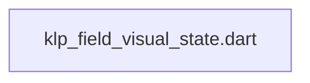
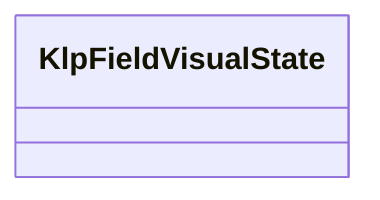

# klp_field_visual_state.dart：直接依賴與宣告架構

[回到目錄](README.md) · [來源檔案](../../../../../lib/src/form/core/klp_field_visual_state.dart)

## 範圍

核心是 `lib/src/form/core/klp_field_visual_state.dart`。主要視角為該檔案明寫的 import／export／part；輔助視角為本檔宣告及 extends／implements／with／on 關係。只展開一層外部邊界。

## 直接依賴圖

## 依賴證據

| 關係 | 原始 directive | 來源 |
|---|---|---|
| 無 | 本檔未宣告 import／export／part | [lib/src/form/core/klp_field_visual_state.dart:1](../../../../../lib/src/form/core/klp_field_visual_state.dart#L1) |

## 宣告關係圖

本組節點是本檔宣告；沒有箭頭的宣告未在此圖主張互相依賴。

## 宣告與成員證據

成員包含 public 與 private；簽章取自來源，省略函式本體與欄位初始值。`(inferred)` 表示來源未明寫型別；建構子只顯示參數部分，不含初始化列表。

### KlpFieldVisualState

EnumDeclaration · public · [lib/src/form/core/klp_field_visual_state.dart:1](../../../../../lib/src/form/core/klp_field_visual_state.dart#L1)

<code>enum KlpFieldVisualState</code>

來源註解摘要：欄位可能處於的視覺／驗證狀態詞彙表，供消費端的表單狀態機使用。 目前庫內元件不直接讀取這個列舉——[KlpField] 等元件是把 `error`／`status` 這類已算好的字串當參數。它存在的目的是讓不同產品在描述「這個欄位現在算 dirty 還是 conflict」時用同一套語彙，而不是各自發明字串常數。

| 成員 | 可見性 | 簽章／型別 | 來源註解摘要 | 證據 |
|---|---|---|---|---|
| enum value <code>pristine</code> | public | <code>pristine</code> |  | [lib/src/form/core/klp_field_visual_state.dart:7](../../../../../lib/src/form/core/klp_field_visual_state.dart#L7) |
| enum value <code>dirty</code> | public | <code>dirty</code> |  | [lib/src/form/core/klp_field_visual_state.dart:8](../../../../../lib/src/form/core/klp_field_visual_state.dart#L8) |
| enum value <code>touched</code> | public | <code>touched</code> |  | [lib/src/form/core/klp_field_visual_state.dart:9](../../../../../lib/src/form/core/klp_field_visual_state.dart#L9) |
| enum value <code>focused</code> | public | <code>focused</code> |  | [lib/src/form/core/klp_field_visual_state.dart:10](../../../../../lib/src/form/core/klp_field_visual_state.dart#L10) |
| enum value <code>validating</code> | public | <code>validating</code> |  | [lib/src/form/core/klp_field_visual_state.dart:11](../../../../../lib/src/form/core/klp_field_visual_state.dart#L11) |
| enum value <code>valid</code> | public | <code>valid</code> |  | [lib/src/form/core/klp_field_visual_state.dart:12](../../../../../lib/src/form/core/klp_field_visual_state.dart#L12) |
| enum value <code>invalid</code> | public | <code>invalid</code> |  | [lib/src/form/core/klp_field_visual_state.dart:13](../../../../../lib/src/form/core/klp_field_visual_state.dart#L13) |
| enum value <code>disabled</code> | public | <code>disabled</code> |  | [lib/src/form/core/klp_field_visual_state.dart:14](../../../../../lib/src/form/core/klp_field_visual_state.dart#L14) |
| enum value <code>readOnly</code> | public | <code>readOnly</code> |  | [lib/src/form/core/klp_field_visual_state.dart:15](../../../../../lib/src/form/core/klp_field_visual_state.dart#L15) |
| enum value <code>conflict</code> | public | <code>conflict</code> |  | [lib/src/form/core/klp_field_visual_state.dart:16](../../../../../lib/src/form/core/klp_field_visual_state.dart#L16) |

## 閱讀說明與限制

箭頭只表示來源明寫的靜態關係；import 不等於呼叫。未分析動態呼叫、欄位的實際物件擁有權、狀態轉移或渲染流程；型別未進行語意解析，繼承目標保留原始型別拼寫。public／private 依 Dart 名稱前綴判斷；public 宣告不代表已由 `lib/kallopis.dart` 匯出。

本頁由 `tool/architecture_atlas` 產生；編輯來源或生成工具後重新產生，避免手改本頁。
