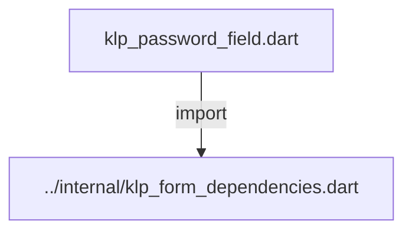
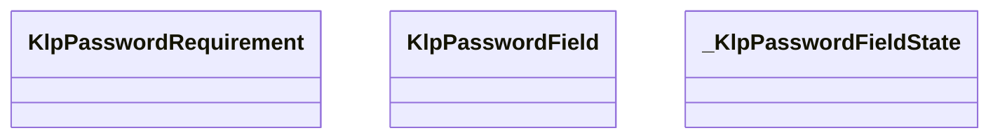
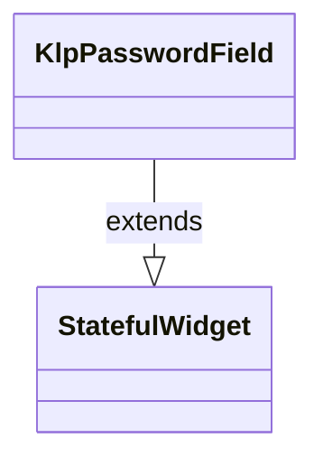
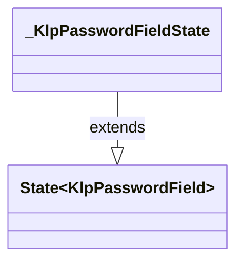

# klp_password_field.dart：直接依賴與宣告架構

[回到目錄](README.md) · [來源檔案](../../../../../lib/src/form/input/klp_password_field.dart)

## 範圍

核心是 `lib/src/form/input/klp_password_field.dart`。主要視角為該檔案明寫的 import／export／part；輔助視角為本檔宣告及 extends／implements／with／on 關係。只展開一層外部邊界。

## 直接依賴圖

## 依賴證據

| 關係 | 原始 directive | 來源 |
|---|---|---|
| import | <code>import &#x27;../internal/klp_form_dependencies.dart&#x27;;</code> | [lib/src/form/input/klp_password_field.dart:1](../../../../../lib/src/form/input/klp_password_field.dart#L1) |

## 宣告關係圖

本組節點是本檔宣告；沒有箭頭的宣告未在此圖主張互相依賴。

## 宣告與成員證據

成員包含 public 與 private；簽章取自來源，省略函式本體與欄位初始值。`(inferred)` 表示來源未明寫型別；建構子只顯示參數部分，不含初始化列表。

### KlpPasswordRequirement

ClassDeclaration · public · [lib/src/form/input/klp_password_field.dart:3](../../../../../lib/src/form/input/klp_password_field.dart#L3)

<code>class KlpPasswordRequirement</code>

來源註解摘要：密碼規則要求項。包含檢核描述與是否滿足之狀態。

| 成員 | 可見性 | 簽章／型別 | 來源註解摘要 | 證據 |
|---|---|---|---|---|
| constructor <code>KlpPasswordRequirement</code> | public | <code>const KlpPasswordRequirement({required this.label, required this.satisfied})</code> |  | [lib/src/form/input/klp_password_field.dart:6](../../../../../lib/src/form/input/klp_password_field.dart#L6) |
| field <code>label</code> | public | <code>final String label</code> |  | [lib/src/form/input/klp_password_field.dart:8](../../../../../lib/src/form/input/klp_password_field.dart#L8) |
| field <code>satisfied</code> | public | <code>final bool satisfied</code> |  | [lib/src/form/input/klp_password_field.dart:9](../../../../../lib/src/form/input/klp_password_field.dart#L9) |

### KlpPasswordField

ClassDeclaration · public · [lib/src/form/input/klp_password_field.dart:11](../../../../../lib/src/form/input/klp_password_field.dart#L11)

<code>class KlpPasswordField extends StatefulWidget</code>

來源註解摘要：密碼輸入控制項。支援顯示／隱藏密碼切換與密碼強度／規則檢核清單。

- `extends` → <code>StatefulWidget</code>：[lib/src/form/input/klp_password_field.dart:12](../../../../../lib/src/form/input/klp_password_field.dart#L12)

| 成員 | 可見性 | 簽章／型別 | 來源註解摘要 | 證據 |
|---|---|---|---|---|
| constructor <code>KlpPasswordField</code> | public | <code>const KlpPasswordField({ super.key, required this.label, this.value, this.placeholder, this.error, this.onChanged, this.enabled = true, this.readOnly = false, this.required = false, this.requirements, })</code> |  | [lib/src/form/input/klp_password_field.dart:13](../../../../../lib/src/form/input/klp_password_field.dart#L13) |
| field <code>label</code> | public | <code>final String label</code> |  | [lib/src/form/input/klp_password_field.dart:26](../../../../../lib/src/form/input/klp_password_field.dart#L26) |
| field <code>value</code> | public | <code>final String? value</code> |  | [lib/src/form/input/klp_password_field.dart:27](../../../../../lib/src/form/input/klp_password_field.dart#L27) |
| field <code>placeholder</code> | public | <code>final String? placeholder</code> |  | [lib/src/form/input/klp_password_field.dart:28](../../../../../lib/src/form/input/klp_password_field.dart#L28) |
| field <code>error</code> | public | <code>final String? error</code> |  | [lib/src/form/input/klp_password_field.dart:29](../../../../../lib/src/form/input/klp_password_field.dart#L29) |
| field <code>onChanged</code> | public | <code>final ValueChanged&lt;String&gt;? onChanged</code> |  | [lib/src/form/input/klp_password_field.dart:30](../../../../../lib/src/form/input/klp_password_field.dart#L30) |
| field <code>enabled</code> | public | <code>final bool enabled</code> |  | [lib/src/form/input/klp_password_field.dart:31](../../../../../lib/src/form/input/klp_password_field.dart#L31) |
| field <code>readOnly</code> | public | <code>final bool readOnly</code> |  | [lib/src/form/input/klp_password_field.dart:32](../../../../../lib/src/form/input/klp_password_field.dart#L32) |
| field <code>required</code> | public | <code>final bool required</code> |  | [lib/src/form/input/klp_password_field.dart:33](../../../../../lib/src/form/input/klp_password_field.dart#L33) |
| field <code>requirements</code> | public | <code>final List&lt;KlpPasswordRequirement&gt;? requirements</code> |  | [lib/src/form/input/klp_password_field.dart:34](../../../../../lib/src/form/input/klp_password_field.dart#L34) |
| method <code>createState</code> | public | <code>State&lt;KlpPasswordField&gt; createState()</code> |  | [lib/src/form/input/klp_password_field.dart:36](../../../../../lib/src/form/input/klp_password_field.dart#L36) |

### _KlpPasswordFieldState

ClassDeclaration · private · [lib/src/form/input/klp_password_field.dart:39](../../../../../lib/src/form/input/klp_password_field.dart#L39)

<code>class _KlpPasswordFieldState extends State&lt;KlpPasswordField&gt;</code>

- `extends` → <code>State&lt;KlpPasswordField&gt;</code>：[lib/src/form/input/klp_password_field.dart:39](../../../../../lib/src/form/input/klp_password_field.dart#L39)

| 成員 | 可見性 | 簽章／型別 | 來源註解摘要 | 證據 |
|---|---|---|---|---|
| field <code>_obscured</code> | private | <code>bool _obscured</code> |  | [lib/src/form/input/klp_password_field.dart:40](../../../../../lib/src/form/input/klp_password_field.dart#L40) |
| method <code>build</code> | public | <code>Widget build(BuildContext context)</code> |  | [lib/src/form/input/klp_password_field.dart:42](../../../../../lib/src/form/input/klp_password_field.dart#L42) |

## 閱讀說明與限制

箭頭只表示來源明寫的靜態關係；import 不等於呼叫。未分析動態呼叫、欄位的實際物件擁有權、狀態轉移或渲染流程；型別未進行語意解析，繼承目標保留原始型別拼寫。public／private 依 Dart 名稱前綴判斷；public 宣告不代表已由 `lib/kallopis.dart` 匯出。

本頁由 `tool/architecture_atlas` 產生；編輯來源或生成工具後重新產生，避免手改本頁。
