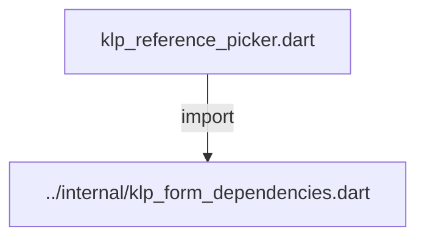
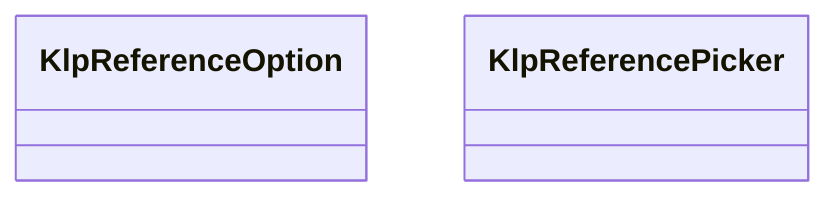
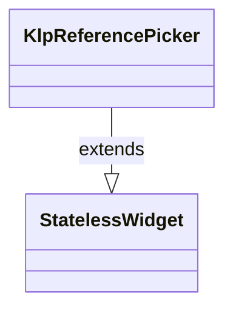

# klp_reference_picker.dart：直接依賴與宣告架構

[回到目錄](README.md) · [來源檔案](../../../../../lib/src/form/picker/klp_reference_picker.dart)

## 範圍

核心是 `lib/src/form/picker/klp_reference_picker.dart`。主要視角為該檔案明寫的 import／export／part；輔助視角為本檔宣告及 extends／implements／with／on 關係。只展開一層外部邊界。

## 直接依賴圖

## 依賴證據

| 關係 | 原始 directive | 來源 |
|---|---|---|
| import | <code>import &#x27;../internal/klp_form_dependencies.dart&#x27;;</code> | [lib/src/form/picker/klp_reference_picker.dart:1](../../../../../lib/src/form/picker/klp_reference_picker.dart#L1) |

## 宣告關係圖

本組節點是本檔宣告；沒有箭頭的宣告未在此圖主張互相依賴。

## 宣告與成員證據

成員包含 public 與 private；簽章取自來源，省略函式本體與欄位初始值。`(inferred)` 表示來源未明寫型別；建構子只顯示參數部分，不含初始化列表。

### KlpReferenceOption

ClassDeclaration · public · [lib/src/form/picker/klp_reference_picker.dart:3](../../../../../lib/src/form/picker/klp_reference_picker.dart#L3)

<code>class KlpReferenceOption</code>

| 成員 | 可見性 | 簽章／型別 | 來源註解摘要 | 證據 |
|---|---|---|---|---|
| constructor <code>KlpReferenceOption</code> | public | <code>const KlpReferenceOption({ required this.id, required this.label, this.kind, this.metadata, this.disabled = false, })</code> |  | [lib/src/form/picker/klp_reference_picker.dart:5](../../../../../lib/src/form/picker/klp_reference_picker.dart#L5) |
| field <code>id</code> | public | <code>final String id</code> |  | [lib/src/form/picker/klp_reference_picker.dart:13](../../../../../lib/src/form/picker/klp_reference_picker.dart#L13) |
| field <code>label</code> | public | <code>final String label</code> |  | [lib/src/form/picker/klp_reference_picker.dart:14](../../../../../lib/src/form/picker/klp_reference_picker.dart#L14) |
| field <code>kind</code> | public | <code>final String? kind</code> |  | [lib/src/form/picker/klp_reference_picker.dart:15](../../../../../lib/src/form/picker/klp_reference_picker.dart#L15) |
| field <code>metadata</code> | public | <code>final String? metadata</code> |  | [lib/src/form/picker/klp_reference_picker.dart:16](../../../../../lib/src/form/picker/klp_reference_picker.dart#L16) |
| field <code>disabled</code> | public | <code>final bool disabled</code> |  | [lib/src/form/picker/klp_reference_picker.dart:17](../../../../../lib/src/form/picker/klp_reference_picker.dart#L17) |

### KlpReferencePicker

ClassDeclaration · public · [lib/src/form/picker/klp_reference_picker.dart:20](../../../../../lib/src/form/picker/klp_reference_picker.dart#L20)

<code>class KlpReferencePicker extends StatelessWidget</code>

- `extends` → <code>StatelessWidget</code>：[lib/src/form/picker/klp_reference_picker.dart:20](../../../../../lib/src/form/picker/klp_reference_picker.dart#L20)

| 成員 | 可見性 | 簽章／型別 | 來源註解摘要 | 證據 |
|---|---|---|---|---|
| constructor <code>KlpReferencePicker</code> | public | <code>const KlpReferencePicker({ super.key, required this.title, required this.query, required this.queryPlaceholder, required this.results, required this.onQueryChanged, required this.onSelected, this.loading = false, })</code> |  | [lib/src/form/picker/klp_reference_picker.dart:21](../../../../../lib/src/form/picker/klp_reference_picker.dart#L21) |
| field <code>title</code> | public | <code>final String title</code> |  | [lib/src/form/picker/klp_reference_picker.dart:32](../../../../../lib/src/form/picker/klp_reference_picker.dart#L32) |
| field <code>query</code> | public | <code>final String query</code> |  | [lib/src/form/picker/klp_reference_picker.dart:33](../../../../../lib/src/form/picker/klp_reference_picker.dart#L33) |
| field <code>queryPlaceholder</code> | public | <code>final String queryPlaceholder</code> |  | [lib/src/form/picker/klp_reference_picker.dart:34](../../../../../lib/src/form/picker/klp_reference_picker.dart#L34) |
| field <code>results</code> | public | <code>final List&lt;KlpReferenceOption&gt; results</code> |  | [lib/src/form/picker/klp_reference_picker.dart:35](../../../../../lib/src/form/picker/klp_reference_picker.dart#L35) |
| field <code>onQueryChanged</code> | public | <code>final ValueChanged&lt;String&gt; onQueryChanged</code> |  | [lib/src/form/picker/klp_reference_picker.dart:36](../../../../../lib/src/form/picker/klp_reference_picker.dart#L36) |
| field <code>onSelected</code> | public | <code>final ValueChanged&lt;String&gt;? onSelected</code> |  | [lib/src/form/picker/klp_reference_picker.dart:37](../../../../../lib/src/form/picker/klp_reference_picker.dart#L37) |
| field <code>loading</code> | public | <code>final bool loading</code> |  | [lib/src/form/picker/klp_reference_picker.dart:38](../../../../../lib/src/form/picker/klp_reference_picker.dart#L38) |
| method <code>build</code> | public | <code>Widget build(BuildContext context)</code> |  | [lib/src/form/picker/klp_reference_picker.dart:40](../../../../../lib/src/form/picker/klp_reference_picker.dart#L40) |

## 閱讀說明與限制

箭頭只表示來源明寫的靜態關係；import 不等於呼叫。未分析動態呼叫、欄位的實際物件擁有權、狀態轉移或渲染流程；型別未進行語意解析，繼承目標保留原始型別拼寫。public／private 依 Dart 名稱前綴判斷；public 宣告不代表已由 `lib/kallopis.dart` 匯出。

本頁由 `tool/architecture_atlas` 產生；編輯來源或生成工具後重新產生，避免手改本頁。
