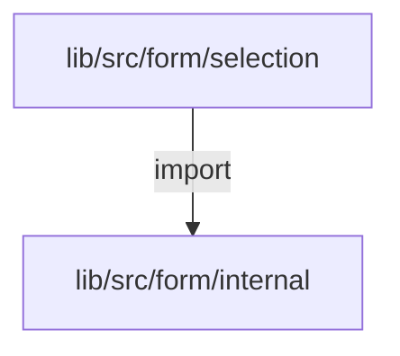
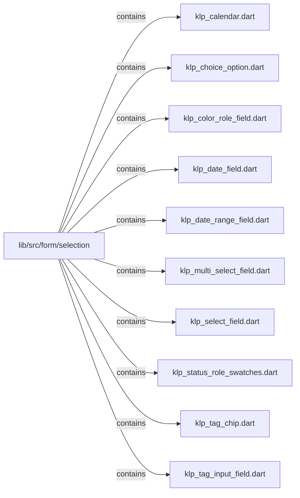

# lib/src/form/selection：架構分析入口

[上一層](../README.md)

## 範圍

閱讀 `lib/src/form/selection` 的直接子目錄與 Dart 檔案。結構圖表示實際檔案包含關係；依賴圖表示本層檔案明寫的 directives。每個檔案頁另列直接依賴、宣告、欄位、方法、建構子及行號證據。

## 本層直接依賴圖

箭頭以本層 Dart 檔案明寫的 directive 彙總到目標所在目錄或外部套件邊界；不遞迴將子目錄依賴算入本層。相同目標的不同 directive 類型分開計數。

| 目標邊界 | 關係 | directive 數 | 第一筆來源證據 |
|---|---|---|---|
| <code>lib/src/form/internal</code> | import | 14 | [lib/src/form/selection/klp_calendar.dart:1](../../../../../lib/src/form/selection/klp_calendar.dart#L1) |

### 同目錄依賴

| 來源 → 目標 | 關係 | 證據 |
|---|---|---|
| <code>klp_color_role_field.dart → klp_choice_option.dart</code> | import | [lib/src/form/selection/klp_color_role_field.dart:2](../../../../../lib/src/form/selection/klp_color_role_field.dart#L2) |
| <code>klp_color_role_field.dart → klp_select_field.dart</code> | import | [lib/src/form/selection/klp_color_role_field.dart:3](../../../../../lib/src/form/selection/klp_color_role_field.dart#L3) |
| <code>klp_date_field.dart → klp_calendar.dart</code> | import | [lib/src/form/selection/klp_date_field.dart:2](../../../../../lib/src/form/selection/klp_date_field.dart#L2) |
| <code>klp_multi_select_field.dart → klp_choice_option.dart</code> | import | [lib/src/form/selection/klp_multi_select_field.dart:2](../../../../../lib/src/form/selection/klp_multi_select_field.dart#L2) |
| <code>klp_select_field.dart → klp_choice_option.dart</code> | import | [lib/src/form/selection/klp_select_field.dart:2](../../../../../lib/src/form/selection/klp_select_field.dart#L2) |
| <code>klp_tag_input_field.dart → klp_tag_chip.dart</code> | import | [lib/src/form/selection/klp_tag_input_field.dart:2](../../../../../lib/src/form/selection/klp_tag_input_field.dart#L2) |

## 目錄結構圖

## 子目錄

| 目錄 | 導航 | 來源證據 |
|---|---|---|
| 無 | 目前沒有下一層目錄 | — |

## 本層檔案

| 檔案 | 宣告 | 細節 | 來源證據 |
|---|---|---|---|
| `klp_calendar.dart` | KlpCalendarSelectionMode, KlpCalendarRange, KlpCalendar, _KlpCalendarDayCell, _KlpCalendarDayCellState | [架構與 API](klp_calendar.md) | [lib/src/form/selection/klp_calendar.dart:1](../../../../../lib/src/form/selection/klp_calendar.dart#L1) |
| `klp_choice_option.dart` | KlpChoiceOption | [架構與 API](klp_choice_option.md) | [lib/src/form/selection/klp_choice_option.dart:1](../../../../../lib/src/form/selection/klp_choice_option.dart#L1) |
| `klp_color_role_field.dart` | KlpColorRoleField | [架構與 API](klp_color_role_field.md) | [lib/src/form/selection/klp_color_role_field.dart:1](../../../../../lib/src/form/selection/klp_color_role_field.dart#L1) |
| `klp_date_field.dart` | KlpDateFieldCalendar, KlpDateField, _KlpDateFieldState | [架構與 API](klp_date_field.md) | [lib/src/form/selection/klp_date_field.dart:1](../../../../../lib/src/form/selection/klp_date_field.dart#L1) |
| `klp_date_range_field.dart` | KlpDateRangeField | [架構與 API](klp_date_range_field.md) | [lib/src/form/selection/klp_date_range_field.dart:1](../../../../../lib/src/form/selection/klp_date_range_field.dart#L1) |
| `klp_multi_select_field.dart` | KlpMultiSelectField | [架構與 API](klp_multi_select_field.md) | [lib/src/form/selection/klp_multi_select_field.dart:1](../../../../../lib/src/form/selection/klp_multi_select_field.dart#L1) |
| `klp_select_field.dart` | KlpSelectField, _KlpSelectFieldState | [架構與 API](klp_select_field.md) | [lib/src/form/selection/klp_select_field.dart:1](../../../../../lib/src/form/selection/klp_select_field.dart#L1) |
| `klp_status_role_swatches.dart` | KlpStatusRoleSwatches | [架構與 API](klp_status_role_swatches.md) | [lib/src/form/selection/klp_status_role_swatches.dart:1](../../../../../lib/src/form/selection/klp_status_role_swatches.dart#L1) |
| `klp_tag_chip.dart` | KlpTagChip | [架構與 API](klp_tag_chip.md) | [lib/src/form/selection/klp_tag_chip.dart:1](../../../../../lib/src/form/selection/klp_tag_chip.dart#L1) |
| `klp_tag_input_field.dart` | KlpTagInputField | [架構與 API](klp_tag_input_field.md) | [lib/src/form/selection/klp_tag_input_field.dart:1](../../../../../lib/src/form/selection/klp_tag_input_field.dart#L1) |

## 閱讀說明

箭頭只表示來源明寫的靜態關係；import 不等於呼叫。未分析動態呼叫、欄位的實際物件擁有權、狀態轉移或渲染流程；型別未進行語意解析，繼承目標保留原始型別拼寫。public／private 依 Dart 名稱前綴判斷；public 宣告不代表已由 `lib/kallopis.dart` 匯出。

本頁的目錄與檔案由來源清冊產生；`manifest.json` 位於本圖集根目錄，可核對 SHA-256 與覆蓋數。人工模組摘要存於 `tool/architecture_atlas/briefs/`，重新生成時保留。
