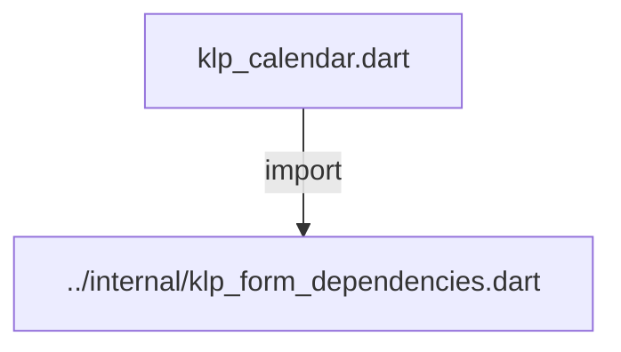
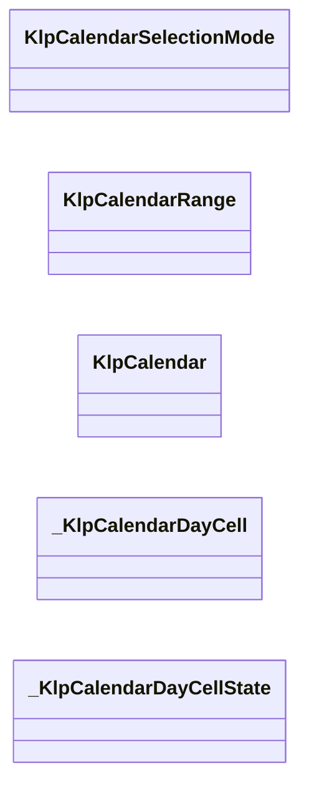
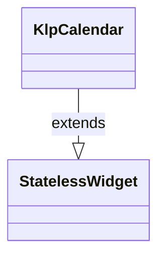
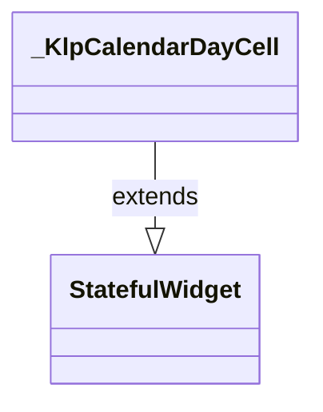
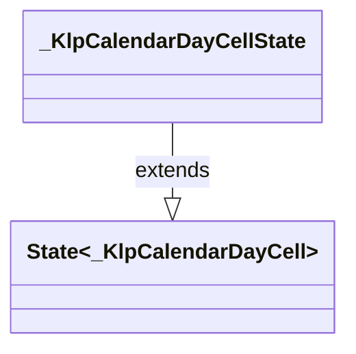

# klp_calendar.dart：直接依賴與宣告架構

[回到目錄](README.md) · [來源檔案](../../../../../lib/src/form/selection/klp_calendar.dart)

## 範圍

核心是 `lib/src/form/selection/klp_calendar.dart`。主要視角為該檔案明寫的 import／export／part；輔助視角為本檔宣告及 extends／implements／with／on 關係。只展開一層外部邊界。

## 直接依賴圖

## 依賴證據

| 關係 | 原始 directive | 來源 |
|---|---|---|
| import | <code>import &#x27;../internal/klp_form_dependencies.dart&#x27;;</code> | [lib/src/form/selection/klp_calendar.dart:1](../../../../../lib/src/form/selection/klp_calendar.dart#L1) |

## 宣告關係圖

本組節點是本檔宣告；沒有箭頭的宣告未在此圖主張互相依賴。

## 宣告與成員證據

成員包含 public 與 private；簽章取自來源，省略函式本體與欄位初始值。`(inferred)` 表示來源未明寫型別；建構子只顯示參數部分，不含初始化列表。

### KlpCalendarSelectionMode

EnumDeclaration · public · [lib/src/form/selection/klp_calendar.dart:3](../../../../../lib/src/form/selection/klp_calendar.dart#L3)

<code>enum KlpCalendarSelectionMode</code>

來源註解摘要：月曆的選取模式：單日或區間。

| 成員 | 可見性 | 簽章／型別 | 來源註解摘要 | 證據 |
|---|---|---|---|---|
| enum value <code>single</code> | public | <code>single</code> |  | [lib/src/form/selection/klp_calendar.dart:4](../../../../../lib/src/form/selection/klp_calendar.dart#L4) |
| enum value <code>range</code> | public | <code>range</code> |  | [lib/src/form/selection/klp_calendar.dart:4](../../../../../lib/src/form/selection/klp_calendar.dart#L4) |

### KlpCalendarRange

ClassDeclaration · public · [lib/src/form/selection/klp_calendar.dart:6](../../../../../lib/src/form/selection/klp_calendar.dart#L6)

<code>class KlpCalendarRange</code>

來源註解摘要：一段日期區間，用於 [KlpCalendarSelectionMode.range]。 [end] 為 `null` 表示只選了起點、尚未選終點——這時 [contains] 只有 [start] 本身算落在區間內。

| 成員 | 可見性 | 簽章／型別 | 來源註解摘要 | 證據 |
|---|---|---|---|---|
| constructor <code>KlpCalendarRange</code> | public | <code>const KlpCalendarRange({required this.start, this.end})</code> |  | [lib/src/form/selection/klp_calendar.dart:12](../../../../../lib/src/form/selection/klp_calendar.dart#L12) |
| field <code>start</code> | public | <code>final DateTime start</code> |  | [lib/src/form/selection/klp_calendar.dart:14](../../../../../lib/src/form/selection/klp_calendar.dart#L14) |
| field <code>end</code> | public | <code>final DateTime? end</code> |  | [lib/src/form/selection/klp_calendar.dart:15](../../../../../lib/src/form/selection/klp_calendar.dart#L15) |
| method <code>contains</code> | public | <code>bool contains(DateTime date)</code> | [date] 是否落在（含端點）目前的區間內。[start] 與 [end] 先後顛倒時會自動校正。 | [lib/src/form/selection/klp_calendar.dart:17](../../../../../lib/src/form/selection/klp_calendar.dart#L17) |

### KlpCalendar

ClassDeclaration · public · [lib/src/form/selection/klp_calendar.dart:30](../../../../../lib/src/form/selection/klp_calendar.dart#L30)

<code>class KlpCalendar extends StatelessWidget</code>

來源註解摘要：月曆面板：月份切換、日期格、今天標記、選取狀態，並可停用特定日期。 **這是純顯示元件，不持有任何日期狀態**——目前顯示的月份、選取的日期都由呼叫端 透過 [month]、[selectedDate]／[selectedRange] 傳入，切換月份與選日期一律經 [onPreviousMonth]／[onNextMonth]／[onDateSelected] 回呼，由呼叫端決定下一步狀態。 **不內建任何語言字串。** 月份標題（[monthLabel]）與星期縮寫（[weekdayLabels]） 一律由呼叫端組出——本庫沒有 l10n 機制，不替產品決定用哪種語言、哪一天是一週的 開始（見 [firstWeekday]）。

- `extends` → <code>StatelessWidget</code>：[lib/src/form/selection/klp_calendar.dart:39](../../../../../lib/src/form/selection/klp_calendar.dart#L39)

| 成員 | 可見性 | 簽章／型別 | 來源註解摘要 | 證據 |
|---|---|---|---|---|
| constructor <code>KlpCalendar</code> | public | <code>const KlpCalendar({ super.key, required this.month, required this.monthLabel, required this.weekdayLabels, required this.previousMonthLabel, required this.nextMonthLabel, this.mode = KlpCalendarSelectionMode.single, this.selectedDate, this.selectedRange, this.today, this.isDateDisabled, this.onDateSelected, this.onPreviousMonth, this.onNextMonth, this.firstWeekday = DateTime.monday, this.dayContentBuilder, })</code> |  | [lib/src/form/selection/klp_calendar.dart:40](../../../../../lib/src/form/selection/klp_calendar.dart#L40) |
| field <code>dayContentBuilder</code> | public | <code>final Widget? Function(DateTime date)? dayContentBuilder</code> | 每一格日期底下要放什麼。 `null` 表示只顯示日期數字，格高用 [KlpSpacingTheme.controlHeightSmall]； 給了 builder 就切換成內容格，格高改用 [KlpSpacingTheme.calendarContentCell]——日期數字加內容擠在選擇器的格高裡會糊成一團。 **這是 slot 而不是布林參數**：月曆不需要知道格子裡放的是待辦、排程還是別的東西， 那屬於呼叫端的語意。回傳 `null` 代表這一格沒有內容。 | [lib/src/form/selection/klp_calendar.dart:67](../../../../../lib/src/form/selection/klp_calendar.dart#L67) |
| field <code>month</code> | public | <code>final DateTime month</code> | 目前顯示的月份；只有年與月有意義，日的部分會被忽略。 | [lib/src/form/selection/klp_calendar.dart:70](../../../../../lib/src/form/selection/klp_calendar.dart#L70) |
| field <code>monthLabel</code> | public | <code>final String monthLabel</code> | 月份標題文字，例如「2026 年 8 月」——由呼叫端組出。 | [lib/src/form/selection/klp_calendar.dart:73](../../../../../lib/src/form/selection/klp_calendar.dart#L73) |
| field <code>weekdayLabels</code> | public | <code>final List&lt;String&gt; weekdayLabels</code> | 星期縮寫，長度必須是 7，順序須對齊從 [firstWeekday] 起算的一週。 | [lib/src/form/selection/klp_calendar.dart:76](../../../../../lib/src/form/selection/klp_calendar.dart#L76) |
| field <code>previousMonthLabel</code> | public | <code>final String previousMonthLabel</code> | 「上一個月」按鈕的無障礙標籤。 | [lib/src/form/selection/klp_calendar.dart:79](../../../../../lib/src/form/selection/klp_calendar.dart#L79) |
| field <code>nextMonthLabel</code> | public | <code>final String nextMonthLabel</code> | 「下一個月」按鈕的無障礙標籤。 | [lib/src/form/selection/klp_calendar.dart:82](../../../../../lib/src/form/selection/klp_calendar.dart#L82) |
| field <code>mode</code> | public | <code>final KlpCalendarSelectionMode mode</code> | 單日或區間選取。 | [lib/src/form/selection/klp_calendar.dart:85](../../../../../lib/src/form/selection/klp_calendar.dart#L85) |
| field <code>selectedDate</code> | public | <code>final DateTime? selectedDate</code> | [KlpCalendarSelectionMode.single] 時使用的目前選取日期。 | [lib/src/form/selection/klp_calendar.dart:88](../../../../../lib/src/form/selection/klp_calendar.dart#L88) |
| field <code>selectedRange</code> | public | <code>final KlpCalendarRange? selectedRange</code> | [KlpCalendarSelectionMode.range] 時使用的目前選取區間。 | [lib/src/form/selection/klp_calendar.dart:91](../../../../../lib/src/form/selection/klp_calendar.dart#L91) |
| field <code>today</code> | public | <code>final DateTime? today</code> | 「今天」標記使用的日期，`null` 表示不畫標記。 **本元件不會自行呼叫 `DateTime.now()`**——那會讓渲染結果依執行當下時間而異， golden test 也無法穩定比對；「今天」是誰由呼叫端決定並傳入。 | [lib/src/form/selection/klp_calendar.dart:97](../../../../../lib/src/form/selection/klp_calendar.dart#L97) |
| field <code>isDateDisabled</code> | public | <code>final bool Function(DateTime date)? isDateDisabled</code> | 判斷某個日期是否停用。回傳 `true` 的日期不可點擊，樣式也會轉為 faint。 | [lib/src/form/selection/klp_calendar.dart:100](../../../../../lib/src/form/selection/klp_calendar.dart#L100) |
| field <code>onDateSelected</code> | public | <code>final ValueChanged&lt;DateTime&gt;? onDateSelected</code> | 使用者點擊某個未停用日期時呼叫。 | [lib/src/form/selection/klp_calendar.dart:103](../../../../../lib/src/form/selection/klp_calendar.dart#L103) |
| field <code>onPreviousMonth</code> | public | <code>final VoidCallback? onPreviousMonth</code> | 使用者點擊「上一個月」時呼叫。傳 `null` 停用該按鈕。 | [lib/src/form/selection/klp_calendar.dart:106](../../../../../lib/src/form/selection/klp_calendar.dart#L106) |
| field <code>onNextMonth</code> | public | <code>final VoidCallback? onNextMonth</code> | 使用者點擊「下一個月」時呼叫。傳 `null` 停用該按鈕。 | [lib/src/form/selection/klp_calendar.dart:109](../../../../../lib/src/form/selection/klp_calendar.dart#L109) |
| field <code>firstWeekday</code> | public | <code>final int firstWeekday</code> | 一週的第一天，採 `DateTime.monday`（1）～`DateTime.sunday`（7）編碼。 | [lib/src/form/selection/klp_calendar.dart:112](../../../../../lib/src/form/selection/klp_calendar.dart#L112) |
| method <code>build</code> | public | <code>Widget build(BuildContext context)</code> |  | [lib/src/form/selection/klp_calendar.dart:114](../../../../../lib/src/form/selection/klp_calendar.dart#L114) |
| method <code>_buildCell</code> | private | <code>Widget _buildCell( BuildContext context, int index, int leading, int daysInMonth, )</code> |  | [lib/src/form/selection/klp_calendar.dart:183](../../../../../lib/src/form/selection/klp_calendar.dart#L183) |
| method <code>_isSelected</code> | private | <code>bool _isSelected(DateTime date)</code> |  | [lib/src/form/selection/klp_calendar.dart:214](../../../../../lib/src/form/selection/klp_calendar.dart#L214) |
| method <code>_isSameDay</code> | private | <code>static bool _isSameDay(DateTime a, DateTime b)</code> |  | [lib/src/form/selection/klp_calendar.dart:224](../../../../../lib/src/form/selection/klp_calendar.dart#L224) |

### _KlpCalendarDayCell

ClassDeclaration · private · [lib/src/form/selection/klp_calendar.dart:228](../../../../../lib/src/form/selection/klp_calendar.dart#L228)

<code>class _KlpCalendarDayCell extends StatefulWidget</code>

- `extends` → <code>StatefulWidget</code>：[lib/src/form/selection/klp_calendar.dart:228](../../../../../lib/src/form/selection/klp_calendar.dart#L228)

| 成員 | 可見性 | 簽章／型別 | 來源註解摘要 | 證據 |
|---|---|---|---|---|
| constructor <code>_KlpCalendarDayCell</code> | private | <code>const _KlpCalendarDayCell({ required this.label, required this.selected, required this.inRange, required this.isToday, required this.disabled, required this.onTap, required this.content, })</code> |  | [lib/src/form/selection/klp_calendar.dart:229](../../../../../lib/src/form/selection/klp_calendar.dart#L229) |
| field <code>content</code> | public | <code>final Widget? content</code> | 日期數字底下的內容。`null` 表示這一格只有數字。 | [lib/src/form/selection/klp_calendar.dart:240](../../../../../lib/src/form/selection/klp_calendar.dart#L240) |
| field <code>label</code> | public | <code>final String label</code> |  | [lib/src/form/selection/klp_calendar.dart:242](../../../../../lib/src/form/selection/klp_calendar.dart#L242) |
| field <code>selected</code> | public | <code>final bool selected</code> |  | [lib/src/form/selection/klp_calendar.dart:243](../../../../../lib/src/form/selection/klp_calendar.dart#L243) |
| field <code>inRange</code> | public | <code>final bool inRange</code> |  | [lib/src/form/selection/klp_calendar.dart:244](../../../../../lib/src/form/selection/klp_calendar.dart#L244) |
| field <code>isToday</code> | public | <code>final bool isToday</code> |  | [lib/src/form/selection/klp_calendar.dart:245](../../../../../lib/src/form/selection/klp_calendar.dart#L245) |
| field <code>disabled</code> | public | <code>final bool disabled</code> |  | [lib/src/form/selection/klp_calendar.dart:246](../../../../../lib/src/form/selection/klp_calendar.dart#L246) |
| field <code>onTap</code> | public | <code>final VoidCallback? onTap</code> |  | [lib/src/form/selection/klp_calendar.dart:247](../../../../../lib/src/form/selection/klp_calendar.dart#L247) |
| method <code>createState</code> | public | <code>State&lt;_KlpCalendarDayCell&gt; createState()</code> |  | [lib/src/form/selection/klp_calendar.dart:249](../../../../../lib/src/form/selection/klp_calendar.dart#L249) |

### _KlpCalendarDayCellState

ClassDeclaration · private · [lib/src/form/selection/klp_calendar.dart:253](../../../../../lib/src/form/selection/klp_calendar.dart#L253)

<code>class _KlpCalendarDayCellState extends State&lt;_KlpCalendarDayCell&gt;</code>

- `extends` → <code>State&lt;_KlpCalendarDayCell&gt;</code>：[lib/src/form/selection/klp_calendar.dart:253](../../../../../lib/src/form/selection/klp_calendar.dart#L253)

| 成員 | 可見性 | 簽章／型別 | 來源註解摘要 | 證據 |
|---|---|---|---|---|
| field <code>_hovered</code> | private | <code>bool _hovered</code> |  | [lib/src/form/selection/klp_calendar.dart:254](../../../../../lib/src/form/selection/klp_calendar.dart#L254) |
| method <code>build</code> | public | <code>Widget build(BuildContext context)</code> |  | [lib/src/form/selection/klp_calendar.dart:256](../../../../../lib/src/form/selection/klp_calendar.dart#L256) |

## 閱讀說明與限制

箭頭只表示來源明寫的靜態關係；import 不等於呼叫。未分析動態呼叫、欄位的實際物件擁有權、狀態轉移或渲染流程；型別未進行語意解析，繼承目標保留原始型別拼寫。public／private 依 Dart 名稱前綴判斷；public 宣告不代表已由 `lib/kallopis.dart` 匯出。

本頁由 `tool/architecture_atlas` 產生；編輯來源或生成工具後重新產生，避免手改本頁。
