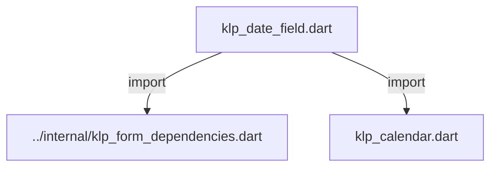
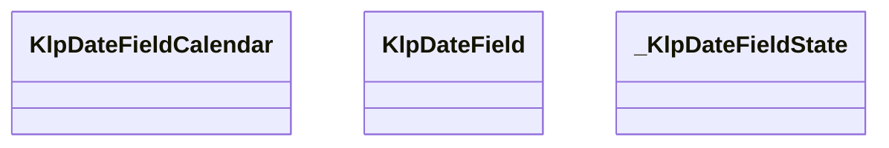
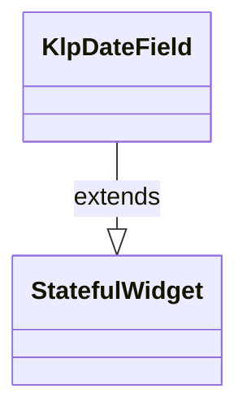
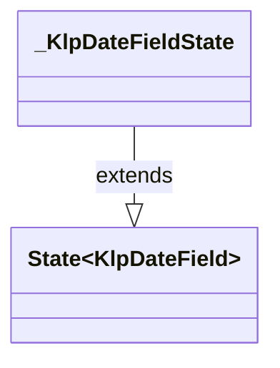

# klp_date_field.dart：直接依賴與宣告架構

[回到目錄](README.md) · [來源檔案](../../../../../lib/src/form/selection/klp_date_field.dart)

## 範圍

核心是 `lib/src/form/selection/klp_date_field.dart`。主要視角為該檔案明寫的 import／export／part；輔助視角為本檔宣告及 extends／implements／with／on 關係。只展開一層外部邊界。

## 直接依賴圖

## 依賴證據

| 關係 | 原始 directive | 來源 |
|---|---|---|
| import | <code>import &#x27;../internal/klp_form_dependencies.dart&#x27;;</code> | [lib/src/form/selection/klp_date_field.dart:1](../../../../../lib/src/form/selection/klp_date_field.dart#L1) |
| import | <code>import &#x27;klp_calendar.dart&#x27;;</code> | [lib/src/form/selection/klp_date_field.dart:2](../../../../../lib/src/form/selection/klp_date_field.dart#L2) |

## 宣告關係圖

本組節點是本檔宣告；沒有箭頭的宣告未在此圖主張互相依賴。

## 宣告與成員證據

成員包含 public 與 private；簽章取自來源，省略函式本體與欄位初始值。`(inferred)` 表示來源未明寫型別；建構子只顯示參數部分，不含初始化列表。

### KlpDateFieldCalendar

ClassDeclaration · public · [lib/src/form/selection/klp_date_field.dart:4](../../../../../lib/src/form/selection/klp_date_field.dart#L4)

<code>class KlpDateFieldCalendar</code>

來源註解摘要：[KlpDateField] 掛上月曆挑選面板所需的設定。**這是唯一的日曆狀態來源**—— 月份、選取日期、停用規則全部由呼叫端持有並傳入，欄位本身不記憶任何日期。 提供這個物件時，欄位右側會出現月曆圖示，點擊會展開 [KlpCalendar]；不提供 就退化為單純文字輸入（[KlpDateField] 抽取自 Planist 時的原始行為）。

| 成員 | 可見性 | 簽章／型別 | 來源註解摘要 | 證據 |
|---|---|---|---|---|
| constructor <code>KlpDateFieldCalendar</code> | public | <code>const KlpDateFieldCalendar({ required this.month, required this.monthLabel, required this.weekdayLabels, required this.previousMonthLabel, required this.nextMonthLabel, required this.onDateSelected, this.selectedDate, this.isDateDisabled, this.onPreviousMonth, this.onNextMonth, this.today, })</code> |  | [lib/src/form/selection/klp_date_field.dart:11](../../../../../lib/src/form/selection/klp_date_field.dart#L11) |
| field <code>month</code> | public | <code>final DateTime month</code> | 面板目前顯示的月份，轉發給 [KlpCalendar.month]。 | [lib/src/form/selection/klp_date_field.dart:26](../../../../../lib/src/form/selection/klp_date_field.dart#L26) |
| field <code>monthLabel</code> | public | <code>final String monthLabel</code> |  | [lib/src/form/selection/klp_date_field.dart:27](../../../../../lib/src/form/selection/klp_date_field.dart#L27) |
| field <code>weekdayLabels</code> | public | <code>final List&lt;String&gt; weekdayLabels</code> |  | [lib/src/form/selection/klp_date_field.dart:28](../../../../../lib/src/form/selection/klp_date_field.dart#L28) |
| field <code>previousMonthLabel</code> | public | <code>final String previousMonthLabel</code> |  | [lib/src/form/selection/klp_date_field.dart:29](../../../../../lib/src/form/selection/klp_date_field.dart#L29) |
| field <code>nextMonthLabel</code> | public | <code>final String nextMonthLabel</code> |  | [lib/src/form/selection/klp_date_field.dart:30](../../../../../lib/src/form/selection/klp_date_field.dart#L30) |
| field <code>selectedDate</code> | public | <code>final DateTime? selectedDate</code> |  | [lib/src/form/selection/klp_date_field.dart:31](../../../../../lib/src/form/selection/klp_date_field.dart#L31) |
| field <code>today</code> | public | <code>final DateTime? today</code> |  | [lib/src/form/selection/klp_date_field.dart:32](../../../../../lib/src/form/selection/klp_date_field.dart#L32) |
| field <code>isDateDisabled</code> | public | <code>final bool Function(DateTime date)? isDateDisabled</code> |  | [lib/src/form/selection/klp_date_field.dart:33](../../../../../lib/src/form/selection/klp_date_field.dart#L33) |
| field <code>onDateSelected</code> | public | <code>final ValueChanged&lt;DateTime&gt; onDateSelected</code> | 使用者在面板上點了某一天。欄位會在轉發這個回呼之後自行收起面板。 | [lib/src/form/selection/klp_date_field.dart:36](../../../../../lib/src/form/selection/klp_date_field.dart#L36) |
| field <code>onPreviousMonth</code> | public | <code>final VoidCallback? onPreviousMonth</code> |  | [lib/src/form/selection/klp_date_field.dart:37](../../../../../lib/src/form/selection/klp_date_field.dart#L37) |
| field <code>onNextMonth</code> | public | <code>final VoidCallback? onNextMonth</code> |  | [lib/src/form/selection/klp_date_field.dart:38](../../../../../lib/src/form/selection/klp_date_field.dart#L38) |

### KlpDateField

ClassDeclaration · public · [lib/src/form/selection/klp_date_field.dart:40](../../../../../lib/src/form/selection/klp_date_field.dart#L40)

<code>class KlpDateField extends StatefulWidget</code>

來源註解摘要：日期輸入欄位。文字輸入永遠可用；提供 [calendar] 時額外接上 [KlpCalendar] 作為挑選面板，兩套輸入路徑共用同一個文字結果，不是各自獨立的兩個元件。

- `extends` → <code>StatefulWidget</code>：[lib/src/form/selection/klp_date_field.dart:42](../../../../../lib/src/form/selection/klp_date_field.dart#L42)

| 成員 | 可見性 | 簽章／型別 | 來源註解摘要 | 證據 |
|---|---|---|---|---|
| constructor <code>KlpDateField</code> | public | <code>const KlpDateField({ super.key, required this.label, required this.value, required this.onChanged, this.placeholder, this.calendar, })</code> |  | [lib/src/form/selection/klp_date_field.dart:43](../../../../../lib/src/form/selection/klp_date_field.dart#L43) |
| field <code>label</code> | public | <code>final String label</code> |  | [lib/src/form/selection/klp_date_field.dart:52](../../../../../lib/src/form/selection/klp_date_field.dart#L52) |
| field <code>value</code> | public | <code>final String value</code> |  | [lib/src/form/selection/klp_date_field.dart:53](../../../../../lib/src/form/selection/klp_date_field.dart#L53) |
| field <code>onChanged</code> | public | <code>final ValueChanged&lt;String&gt;? onChanged</code> |  | [lib/src/form/selection/klp_date_field.dart:54](../../../../../lib/src/form/selection/klp_date_field.dart#L54) |
| field <code>placeholder</code> | public | <code>final String? placeholder</code> |  | [lib/src/form/selection/klp_date_field.dart:55](../../../../../lib/src/form/selection/klp_date_field.dart#L55) |
| field <code>calendar</code> | public | <code>final KlpDateFieldCalendar? calendar</code> | 月曆挑選面板的設定；`null` 時欄位維持純文字輸入。 | [lib/src/form/selection/klp_date_field.dart:58](../../../../../lib/src/form/selection/klp_date_field.dart#L58) |
| method <code>createState</code> | public | <code>State&lt;KlpDateField&gt; createState()</code> |  | [lib/src/form/selection/klp_date_field.dart:60](../../../../../lib/src/form/selection/klp_date_field.dart#L60) |

### _KlpDateFieldState

ClassDeclaration · private · [lib/src/form/selection/klp_date_field.dart:63](../../../../../lib/src/form/selection/klp_date_field.dart#L63)

<code>class _KlpDateFieldState extends State&lt;KlpDateField&gt;</code>

- `extends` → <code>State&lt;KlpDateField&gt;</code>：[lib/src/form/selection/klp_date_field.dart:63](../../../../../lib/src/form/selection/klp_date_field.dart#L63)

| 成員 | 可見性 | 簽章／型別 | 來源註解摘要 | 證據 |
|---|---|---|---|---|
| field <code>_expanded</code> | private | <code>bool _expanded</code> |  | [lib/src/form/selection/klp_date_field.dart:64](../../../../../lib/src/form/selection/klp_date_field.dart#L64) |
| method <code>build</code> | public | <code>Widget build(BuildContext context)</code> |  | [lib/src/form/selection/klp_date_field.dart:66](../../../../../lib/src/form/selection/klp_date_field.dart#L66) |

## 閱讀說明與限制

箭頭只表示來源明寫的靜態關係；import 不等於呼叫。未分析動態呼叫、欄位的實際物件擁有權、狀態轉移或渲染流程；型別未進行語意解析，繼承目標保留原始型別拼寫。public／private 依 Dart 名稱前綴判斷；public 宣告不代表已由 `lib/kallopis.dart` 匯出。

本頁由 `tool/architecture_atlas` 產生；編輯來源或生成工具後重新產生，避免手改本頁。
