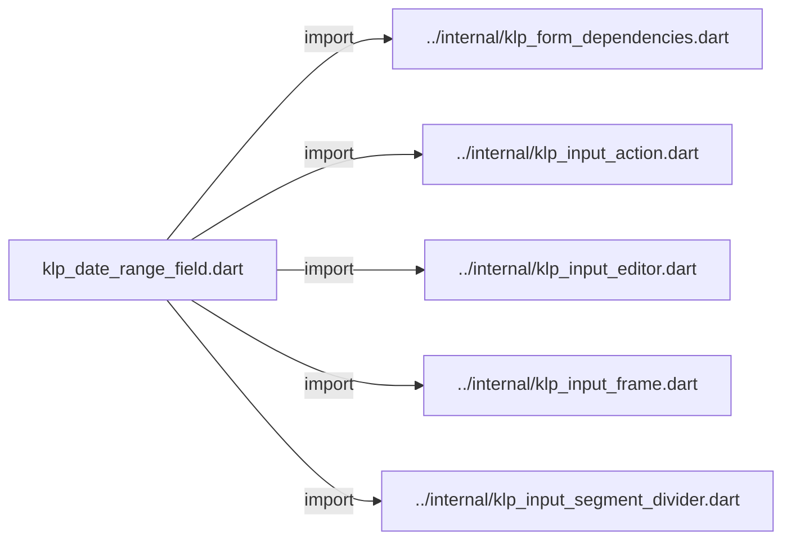
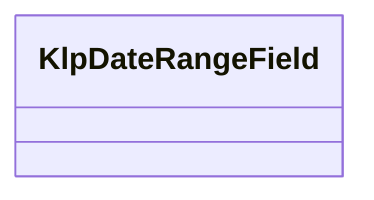
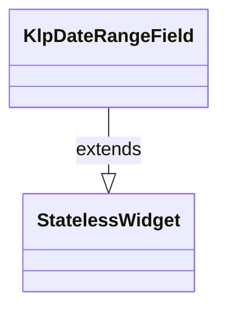

# klp_date_range_field.dart：直接依賴與宣告架構

[回到目錄](README.md) · [來源檔案](../../../../../lib/src/form/selection/klp_date_range_field.dart)

## 範圍

核心是 `lib/src/form/selection/klp_date_range_field.dart`。主要視角為該檔案明寫的 import／export／part；輔助視角為本檔宣告及 extends／implements／with／on 關係。只展開一層外部邊界。

## 直接依賴圖

## 依賴證據

| 關係 | 原始 directive | 來源 |
|---|---|---|
| import | <code>import &#x27;../internal/klp_form_dependencies.dart&#x27;;</code> | [lib/src/form/selection/klp_date_range_field.dart:1](../../../../../lib/src/form/selection/klp_date_range_field.dart#L1) |
| import | <code>import &#x27;../internal/klp_input_action.dart&#x27;;</code> | [lib/src/form/selection/klp_date_range_field.dart:2](../../../../../lib/src/form/selection/klp_date_range_field.dart#L2) |
| import | <code>import &#x27;../internal/klp_input_editor.dart&#x27;;</code> | [lib/src/form/selection/klp_date_range_field.dart:3](../../../../../lib/src/form/selection/klp_date_range_field.dart#L3) |
| import | <code>import &#x27;../internal/klp_input_frame.dart&#x27;;</code> | [lib/src/form/selection/klp_date_range_field.dart:4](../../../../../lib/src/form/selection/klp_date_range_field.dart#L4) |
| import | <code>import &#x27;../internal/klp_input_segment_divider.dart&#x27;;</code> | [lib/src/form/selection/klp_date_range_field.dart:5](../../../../../lib/src/form/selection/klp_date_range_field.dart#L5) |

## 宣告關係圖

本組節點是本檔宣告；沒有箭頭的宣告未在此圖主張互相依賴。

## 宣告與成員證據

成員包含 public 與 private；簽章取自來源，省略函式本體與欄位初始值。`(inferred)` 表示來源未明寫型別；建構子只顯示參數部分，不含初始化列表。

### KlpDateRangeField

ClassDeclaration · public · [lib/src/form/selection/klp_date_range_field.dart:7](../../../../../lib/src/form/selection/klp_date_range_field.dart#L7)

<code>class KlpDateRangeField extends StatelessWidget</code>

來源註解摘要：在同一控制框中編輯起訖日期，並可由尾端動作開啟產品提供的日期挑選器。

- `extends` → <code>StatelessWidget</code>：[lib/src/form/selection/klp_date_range_field.dart:8](../../../../../lib/src/form/selection/klp_date_range_field.dart#L8)

| 成員 | 可見性 | 簽章／型別 | 來源註解摘要 | 證據 |
|---|---|---|---|---|
| field <code>label</code> | public | <code>final String label</code> |  | [lib/src/form/selection/klp_date_range_field.dart:9](../../../../../lib/src/form/selection/klp_date_range_field.dart#L9) |
| field <code>startController</code> | public | <code>final TextEditingController? startController</code> |  | [lib/src/form/selection/klp_date_range_field.dart:10](../../../../../lib/src/form/selection/klp_date_range_field.dart#L10) |
| field <code>endController</code> | public | <code>final TextEditingController? endController</code> |  | [lib/src/form/selection/klp_date_range_field.dart:11](../../../../../lib/src/form/selection/klp_date_range_field.dart#L11) |
| field <code>initialStartValue</code> | public | <code>final String? initialStartValue</code> |  | [lib/src/form/selection/klp_date_range_field.dart:12](../../../../../lib/src/form/selection/klp_date_range_field.dart#L12) |
| field <code>initialEndValue</code> | public | <code>final String? initialEndValue</code> |  | [lib/src/form/selection/klp_date_range_field.dart:13](../../../../../lib/src/form/selection/klp_date_range_field.dart#L13) |
| field <code>startPlaceholder</code> | public | <code>final String? startPlaceholder</code> |  | [lib/src/form/selection/klp_date_range_field.dart:14](../../../../../lib/src/form/selection/klp_date_range_field.dart#L14) |
| field <code>endPlaceholder</code> | public | <code>final String? endPlaceholder</code> |  | [lib/src/form/selection/klp_date_range_field.dart:15](../../../../../lib/src/form/selection/klp_date_range_field.dart#L15) |
| field <code>onStartChanged</code> | public | <code>final ValueChanged&lt;String&gt;? onStartChanged</code> |  | [lib/src/form/selection/klp_date_range_field.dart:16](../../../../../lib/src/form/selection/klp_date_range_field.dart#L16) |
| field <code>onEndChanged</code> | public | <code>final ValueChanged&lt;String&gt;? onEndChanged</code> |  | [lib/src/form/selection/klp_date_range_field.dart:17](../../../../../lib/src/form/selection/klp_date_range_field.dart#L17) |
| field <code>onCalendarPressed</code> | public | <code>final VoidCallback? onCalendarPressed</code> |  | [lib/src/form/selection/klp_date_range_field.dart:18](../../../../../lib/src/form/selection/klp_date_range_field.dart#L18) |
| field <code>enabled</code> | public | <code>final bool enabled</code> |  | [lib/src/form/selection/klp_date_range_field.dart:19](../../../../../lib/src/form/selection/klp_date_range_field.dart#L19) |
| field <code>readOnly</code> | public | <code>final bool readOnly</code> |  | [lib/src/form/selection/klp_date_range_field.dart:20](../../../../../lib/src/form/selection/klp_date_range_field.dart#L20) |
| field <code>error</code> | public | <code>final String? error</code> |  | [lib/src/form/selection/klp_date_range_field.dart:21](../../../../../lib/src/form/selection/klp_date_range_field.dart#L21) |
| field <code>calendarLabel</code> | public | <code>final String? calendarLabel</code> |  | [lib/src/form/selection/klp_date_range_field.dart:22](../../../../../lib/src/form/selection/klp_date_range_field.dart#L22) |
| constructor <code>KlpDateRangeField</code> | public | <code>const KlpDateRangeField({ super.key, required this.label, this.startController, this.endController, this.initialStartValue, this.initialEndValue, this.startPlaceholder, this.endPlaceholder, this.onStartChanged, this.onEndChanged, this.onCalendarPressed, this.enabled = true, this.readOnly = false, this.error, this.calendarLabel, })</code> |  | [lib/src/form/selection/klp_date_range_field.dart:24](../../../../../lib/src/form/selection/klp_date_range_field.dart#L24) |
| method <code>build</code> | public | <code>Widget build(BuildContext context)</code> |  | [lib/src/form/selection/klp_date_range_field.dart:43](../../../../../lib/src/form/selection/klp_date_range_field.dart#L43) |

## 閱讀說明與限制

箭頭只表示來源明寫的靜態關係；import 不等於呼叫。未分析動態呼叫、欄位的實際物件擁有權、狀態轉移或渲染流程；型別未進行語意解析，繼承目標保留原始型別拼寫。public／private 依 Dart 名稱前綴判斷；public 宣告不代表已由 `lib/kallopis.dart` 匯出。

本頁由 `tool/architecture_atlas` 產生；編輯來源或生成工具後重新產生，避免手改本頁。
