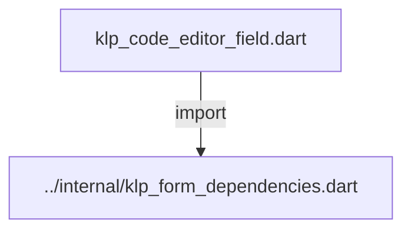
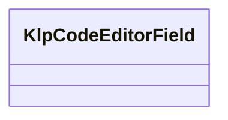
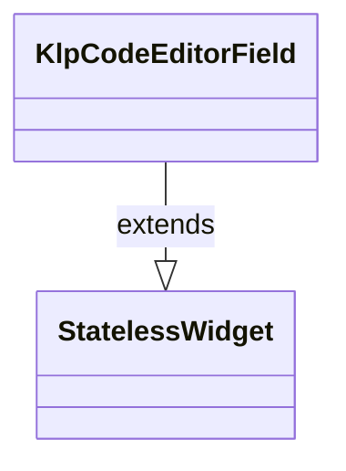

# klp_code_editor_field.dart：直接依賴與宣告架構

[回到目錄](README.md) · [來源檔案](../../../../../lib/src/form/structured/klp_code_editor_field.dart)

## 範圍

核心是 `lib/src/form/structured/klp_code_editor_field.dart`。主要視角為該檔案明寫的 import／export／part；輔助視角為本檔宣告及 extends／implements／with／on 關係。只展開一層外部邊界。

## 直接依賴圖

## 依賴證據

| 關係 | 原始 directive | 來源 |
|---|---|---|
| import | <code>import &#x27;../internal/klp_form_dependencies.dart&#x27;;</code> | [lib/src/form/structured/klp_code_editor_field.dart:1](../../../../../lib/src/form/structured/klp_code_editor_field.dart#L1) |

## 宣告關係圖

本組節點是本檔宣告；沒有箭頭的宣告未在此圖主張互相依賴。

## 宣告與成員證據

成員包含 public 與 private；簽章取自來源，省略函式本體與欄位初始值。`(inferred)` 表示來源未明寫型別；建構子只顯示參數部分，不含初始化列表。

### KlpCodeEditorField

ClassDeclaration · public · [lib/src/form/structured/klp_code_editor_field.dart:3](../../../../../lib/src/form/structured/klp_code_editor_field.dart#L3)

<code>class KlpCodeEditorField extends StatelessWidget</code>

來源註解摘要：結構化設定與程式碼編輯器欄位。支援頂部動作列、行內錯誤／警告提示與底部運算式動作列。

- `extends` → <code>StatelessWidget</code>：[lib/src/form/structured/klp_code_editor_field.dart:4](../../../../../lib/src/form/structured/klp_code_editor_field.dart#L4)

| 成員 | 可見性 | 簽章／型別 | 來源註解摘要 | 證據 |
|---|---|---|---|---|
| constructor <code>KlpCodeEditorField</code> | public | <code>const KlpCodeEditorField({ super.key, required this.label, this.subtitle, this.actions, required this.code, this.error, this.warning, this.footerLeft, this.footerRight, })</code> |  | [lib/src/form/structured/klp_code_editor_field.dart:5](../../../../../lib/src/form/structured/klp_code_editor_field.dart#L5) |
| field <code>label</code> | public | <code>final String label</code> |  | [lib/src/form/structured/klp_code_editor_field.dart:17](../../../../../lib/src/form/structured/klp_code_editor_field.dart#L17) |
| field <code>subtitle</code> | public | <code>final String? subtitle</code> |  | [lib/src/form/structured/klp_code_editor_field.dart:18](../../../../../lib/src/form/structured/klp_code_editor_field.dart#L18) |
| field <code>actions</code> | public | <code>final List&lt;String&gt;? actions</code> |  | [lib/src/form/structured/klp_code_editor_field.dart:19](../../../../../lib/src/form/structured/klp_code_editor_field.dart#L19) |
| field <code>code</code> | public | <code>final String code</code> |  | [lib/src/form/structured/klp_code_editor_field.dart:20](../../../../../lib/src/form/structured/klp_code_editor_field.dart#L20) |
| field <code>error</code> | public | <code>final String? error</code> |  | [lib/src/form/structured/klp_code_editor_field.dart:21](../../../../../lib/src/form/structured/klp_code_editor_field.dart#L21) |
| field <code>warning</code> | public | <code>final String? warning</code> |  | [lib/src/form/structured/klp_code_editor_field.dart:22](../../../../../lib/src/form/structured/klp_code_editor_field.dart#L22) |
| field <code>footerLeft</code> | public | <code>final Widget? footerLeft</code> |  | [lib/src/form/structured/klp_code_editor_field.dart:23](../../../../../lib/src/form/structured/klp_code_editor_field.dart#L23) |
| field <code>footerRight</code> | public | <code>final Widget? footerRight</code> |  | [lib/src/form/structured/klp_code_editor_field.dart:24](../../../../../lib/src/form/structured/klp_code_editor_field.dart#L24) |
| method <code>build</code> | public | <code>Widget build(BuildContext context)</code> |  | [lib/src/form/structured/klp_code_editor_field.dart:26](../../../../../lib/src/form/structured/klp_code_editor_field.dart#L26) |

## 閱讀說明與限制

箭頭只表示來源明寫的靜態關係；import 不等於呼叫。未分析動態呼叫、欄位的實際物件擁有權、狀態轉移或渲染流程；型別未進行語意解析，繼承目標保留原始型別拼寫。public／private 依 Dart 名稱前綴判斷；public 宣告不代表已由 `lib/kallopis.dart` 匯出。

本頁由 `tool/architecture_atlas` 產生；編輯來源或生成工具後重新產生，避免手改本頁。
