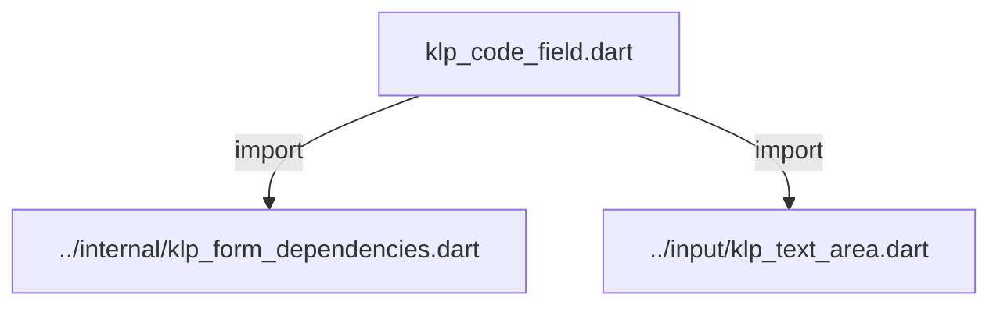
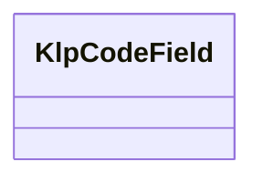
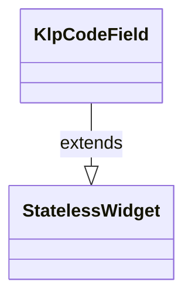

# klp_code_field.dart：直接依賴與宣告架構

[回到目錄](README.md) · [來源檔案](../../../../../lib/src/form/structured/klp_code_field.dart)

## 範圍

核心是 `lib/src/form/structured/klp_code_field.dart`。主要視角為該檔案明寫的 import／export／part；輔助視角為本檔宣告及 extends／implements／with／on 關係。只展開一層外部邊界。

## 直接依賴圖

## 依賴證據

| 關係 | 原始 directive | 來源 |
|---|---|---|
| import | <code>import &#x27;../internal/klp_form_dependencies.dart&#x27;;</code> | [lib/src/form/structured/klp_code_field.dart:1](../../../../../lib/src/form/structured/klp_code_field.dart#L1) |
| import | <code>import &#x27;../input/klp_text_area.dart&#x27;;</code> | [lib/src/form/structured/klp_code_field.dart:2](../../../../../lib/src/form/structured/klp_code_field.dart#L2) |

## 宣告關係圖

本組節點是本檔宣告；沒有箭頭的宣告未在此圖主張互相依賴。

## 宣告與成員證據

成員包含 public 與 private；簽章取自來源，省略函式本體與欄位初始值。`(inferred)` 表示來源未明寫型別；建構子只顯示參數部分，不含初始化列表。

### KlpCodeField

ClassDeclaration · public · [lib/src/form/structured/klp_code_field.dart:4](../../../../../lib/src/form/structured/klp_code_field.dart#L4)

<code>class KlpCodeField extends StatelessWidget</code>

來源註解摘要：程式碼欄位：唯讀時走語法高亮的 [KlpCodeViewer]，可編輯時走純文字的 [KlpTextArea]。 [readOnly] 切換的是整套渲染方式而非同一個 widget 加鎖——唯讀模式沒有 [onChanged] 也沒有 [error] 提示，這兩者只在可編輯（[readOnly] 為 false） 時才有意義。[language] 只影響唯讀模式下的語法高亮，可編輯模式不使用。

- `extends` → <code>StatelessWidget</code>：[lib/src/form/structured/klp_code_field.dart:10](../../../../../lib/src/form/structured/klp_code_field.dart#L10)

| 成員 | 可見性 | 簽章／型別 | 來源註解摘要 | 證據 |
|---|---|---|---|---|
| constructor <code>KlpCodeField</code> | public | <code>const KlpCodeField({ super.key, required this.label, required this.value, this.language, this.onChanged, this.readOnly = false, this.error, })</code> |  | [lib/src/form/structured/klp_code_field.dart:11](../../../../../lib/src/form/structured/klp_code_field.dart#L11) |
| field <code>label</code> | public | <code>final String label</code> |  | [lib/src/form/structured/klp_code_field.dart:21](../../../../../lib/src/form/structured/klp_code_field.dart#L21) |
| field <code>value</code> | public | <code>final String value</code> |  | [lib/src/form/structured/klp_code_field.dart:22](../../../../../lib/src/form/structured/klp_code_field.dart#L22) |
| field <code>language</code> | public | <code>final String? language</code> |  | [lib/src/form/structured/klp_code_field.dart:23](../../../../../lib/src/form/structured/klp_code_field.dart#L23) |
| field <code>onChanged</code> | public | <code>final ValueChanged&lt;String&gt;? onChanged</code> |  | [lib/src/form/structured/klp_code_field.dart:24](../../../../../lib/src/form/structured/klp_code_field.dart#L24) |
| field <code>readOnly</code> | public | <code>final bool readOnly</code> |  | [lib/src/form/structured/klp_code_field.dart:25](../../../../../lib/src/form/structured/klp_code_field.dart#L25) |
| field <code>error</code> | public | <code>final String? error</code> |  | [lib/src/form/structured/klp_code_field.dart:26](../../../../../lib/src/form/structured/klp_code_field.dart#L26) |
| method <code>build</code> | public | <code>Widget build(BuildContext context)</code> |  | [lib/src/form/structured/klp_code_field.dart:28](../../../../../lib/src/form/structured/klp_code_field.dart#L28) |

## 閱讀說明與限制

箭頭只表示來源明寫的靜態關係；import 不等於呼叫。未分析動態呼叫、欄位的實際物件擁有權、狀態轉移或渲染流程；型別未進行語意解析，繼承目標保留原始型別拼寫。public／private 依 Dart 名稱前綴判斷；public 宣告不代表已由 `lib/kallopis.dart` 匯出。

本頁由 `tool/architecture_atlas` 產生；編輯來源或生成工具後重新產生，避免手改本頁。
