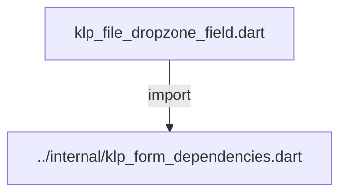
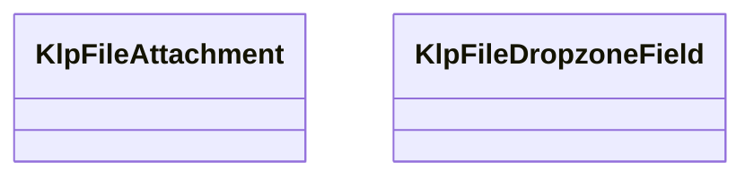
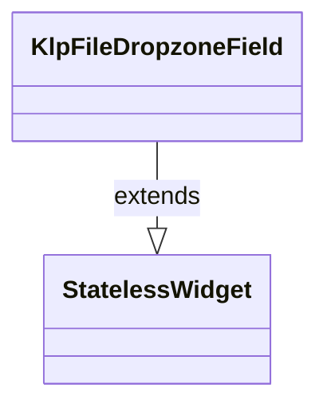

# klp_file_dropzone_field.dart：直接依賴與宣告架構

[回到目錄](README.md) · [來源檔案](../../../../../lib/src/form/structured/klp_file_dropzone_field.dart)

## 範圍

核心是 `lib/src/form/structured/klp_file_dropzone_field.dart`。主要視角為該檔案明寫的 import／export／part；輔助視角為本檔宣告及 extends／implements／with／on 關係。只展開一層外部邊界。

## 直接依賴圖

## 依賴證據

| 關係 | 原始 directive | 來源 |
|---|---|---|
| import | <code>import &#x27;../internal/klp_form_dependencies.dart&#x27;;</code> | [lib/src/form/structured/klp_file_dropzone_field.dart:1](../../../../../lib/src/form/structured/klp_file_dropzone_field.dart#L1) |

## 宣告關係圖

本組節點是本檔宣告；沒有箭頭的宣告未在此圖主張互相依賴。

## 宣告與成員證據

成員包含 public 與 private；簽章取自來源，省略函式本體與欄位初始值。`(inferred)` 表示來源未明寫型別；建構子只顯示參數部分，不含初始化列表。

### KlpFileAttachment

ClassDeclaration · public · [lib/src/form/structured/klp_file_dropzone_field.dart:3](../../../../../lib/src/form/structured/klp_file_dropzone_field.dart#L3)

<code>class KlpFileAttachment</code>

來源註解摘要：檔案附件資料。包含檔名、檔案大小與可選的上傳進度 (0.0~1.0)。

| 成員 | 可見性 | 簽章／型別 | 來源註解摘要 | 證據 |
|---|---|---|---|---|
| constructor <code>KlpFileAttachment</code> | public | <code>const KlpFileAttachment({ required this.name, required this.size, this.progress, })</code> |  | [lib/src/form/structured/klp_file_dropzone_field.dart:6](../../../../../lib/src/form/structured/klp_file_dropzone_field.dart#L6) |
| field <code>name</code> | public | <code>final String name</code> |  | [lib/src/form/structured/klp_file_dropzone_field.dart:12](../../../../../lib/src/form/structured/klp_file_dropzone_field.dart#L12) |
| field <code>size</code> | public | <code>final String size</code> |  | [lib/src/form/structured/klp_file_dropzone_field.dart:13](../../../../../lib/src/form/structured/klp_file_dropzone_field.dart#L13) |
| field <code>progress</code> | public | <code>final double? progress</code> |  | [lib/src/form/structured/klp_file_dropzone_field.dart:14](../../../../../lib/src/form/structured/klp_file_dropzone_field.dart#L14) |

### KlpFileDropzoneField

ClassDeclaration · public · [lib/src/form/structured/klp_file_dropzone_field.dart:16](../../../../../lib/src/form/structured/klp_file_dropzone_field.dart#L16)

<code>class KlpFileDropzoneField extends StatelessWidget</code>

來源註解摘要：檔案上傳拖曳區與附件清單元件。

- `extends` → <code>StatelessWidget</code>：[lib/src/form/structured/klp_file_dropzone_field.dart:17](../../../../../lib/src/form/structured/klp_file_dropzone_field.dart#L17)

| 成員 | 可見性 | 簽章／型別 | 來源註解摘要 | 證據 |
|---|---|---|---|---|
| constructor <code>KlpFileDropzoneField</code> | public | <code>const KlpFileDropzoneField({ super.key, required this.label, this.hint, this.chooseButtonLabel = &#x27;Choose files&#x27;, required this.files, this.onChoose, this.onRemove, })</code> |  | [lib/src/form/structured/klp_file_dropzone_field.dart:18](../../../../../lib/src/form/structured/klp_file_dropzone_field.dart#L18) |
| field <code>label</code> | public | <code>final String label</code> |  | [lib/src/form/structured/klp_file_dropzone_field.dart:28](../../../../../lib/src/form/structured/klp_file_dropzone_field.dart#L28) |
| field <code>hint</code> | public | <code>final String? hint</code> |  | [lib/src/form/structured/klp_file_dropzone_field.dart:29](../../../../../lib/src/form/structured/klp_file_dropzone_field.dart#L29) |
| field <code>chooseButtonLabel</code> | public | <code>final String chooseButtonLabel</code> |  | [lib/src/form/structured/klp_file_dropzone_field.dart:30](../../../../../lib/src/form/structured/klp_file_dropzone_field.dart#L30) |
| field <code>files</code> | public | <code>final List&lt;KlpFileAttachment&gt; files</code> |  | [lib/src/form/structured/klp_file_dropzone_field.dart:31](../../../../../lib/src/form/structured/klp_file_dropzone_field.dart#L31) |
| field <code>onChoose</code> | public | <code>final VoidCallback? onChoose</code> |  | [lib/src/form/structured/klp_file_dropzone_field.dart:32](../../../../../lib/src/form/structured/klp_file_dropzone_field.dart#L32) |
| field <code>onRemove</code> | public | <code>final ValueChanged&lt;int&gt;? onRemove</code> |  | [lib/src/form/structured/klp_file_dropzone_field.dart:33](../../../../../lib/src/form/structured/klp_file_dropzone_field.dart#L33) |
| method <code>build</code> | public | <code>Widget build(BuildContext context)</code> |  | [lib/src/form/structured/klp_file_dropzone_field.dart:35](../../../../../lib/src/form/structured/klp_file_dropzone_field.dart#L35) |

## 閱讀說明與限制

箭頭只表示來源明寫的靜態關係；import 不等於呼叫。未分析動態呼叫、欄位的實際物件擁有權、狀態轉移或渲染流程；型別未進行語意解析，繼承目標保留原始型別拼寫。public／private 依 Dart 名稱前綴判斷；public 宣告不代表已由 `lib/kallopis.dart` 匯出。

本頁由 `tool/architecture_atlas` 產生；編輯來源或生成工具後重新產生，避免手改本頁。
