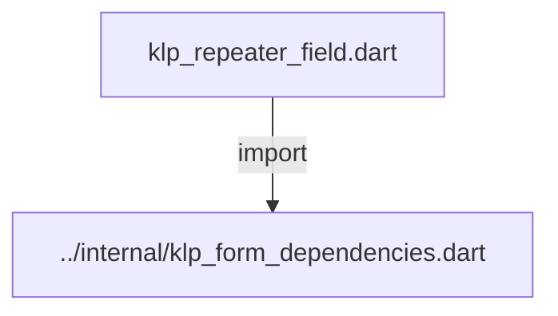
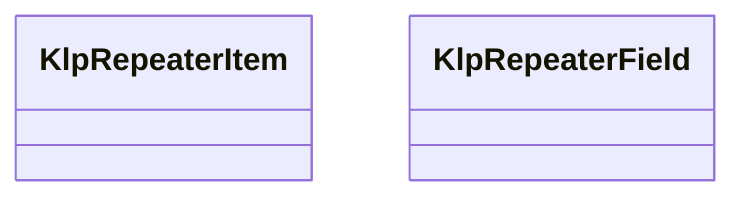
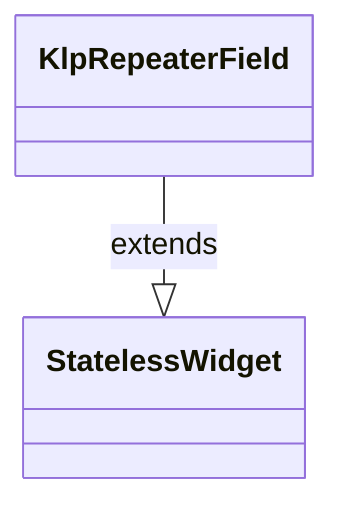

# klp_repeater_field.dart：直接依賴與宣告架構

[回到目錄](README.md) · [來源檔案](../../../../../lib/src/form/structured/klp_repeater_field.dart)

## 範圍

核心是 `lib/src/form/structured/klp_repeater_field.dart`。主要視角為該檔案明寫的 import／export／part；輔助視角為本檔宣告及 extends／implements／with／on 關係。只展開一層外部邊界。

## 直接依賴圖

## 依賴證據

| 關係 | 原始 directive | 來源 |
|---|---|---|
| import | <code>import &#x27;../internal/klp_form_dependencies.dart&#x27;;</code> | [lib/src/form/structured/klp_repeater_field.dart:1](../../../../../lib/src/form/structured/klp_repeater_field.dart#L1) |

## 宣告關係圖

本組節點是本檔宣告；沒有箭頭的宣告未在此圖主張互相依賴。

## 宣告與成員證據

成員包含 public 與 private；簽章取自來源，省略函式本體與欄位初始值。`(inferred)` 表示來源未明寫型別；建構子只顯示參數部分，不含初始化列表。

### KlpRepeaterItem

ClassDeclaration · public · [lib/src/form/structured/klp_repeater_field.dart:3](../../../../../lib/src/form/structured/klp_repeater_field.dart#L3)

<code>class KlpRepeaterItem</code>

來源註解摘要：[KlpRepeaterField] 裡的一個項目：識別碼加上該項目自己的輸入內容。 [child] 是整個項目的內容 widget（例如一組欄位），[id] 只用來在 [KlpRepeaterField.onRemove] 回報要刪除哪一項，與顯示內容無關。

| 成員 | 可見性 | 簽章／型別 | 來源註解摘要 | 證據 |
|---|---|---|---|---|
| constructor <code>KlpRepeaterItem</code> | public | <code>const KlpRepeaterItem({required this.id, required this.child})</code> |  | [lib/src/form/structured/klp_repeater_field.dart:9](../../../../../lib/src/form/structured/klp_repeater_field.dart#L9) |
| field <code>id</code> | public | <code>final String id</code> |  | [lib/src/form/structured/klp_repeater_field.dart:11](../../../../../lib/src/form/structured/klp_repeater_field.dart#L11) |
| field <code>child</code> | public | <code>final Widget child</code> |  | [lib/src/form/structured/klp_repeater_field.dart:12](../../../../../lib/src/form/structured/klp_repeater_field.dart#L12) |

### KlpRepeaterField

ClassDeclaration · public · [lib/src/form/structured/klp_repeater_field.dart:14](../../../../../lib/src/form/structured/klp_repeater_field.dart#L14)

<code>class KlpRepeaterField extends StatelessWidget</code>

來源註解摘要：可新增／刪除項目的重複欄位群組（例如「新增一組聯絡方式」）。 不維護項目清單的狀態——[items] 由呼叫端持有，新增／刪除都只是透過 [onAdd]／[onRemove] 回報意圖，實際要不要新增一項、刪哪一項由呼叫端決定 並重新傳入新的 [items]。

- `extends` → <code>StatelessWidget</code>：[lib/src/form/structured/klp_repeater_field.dart:19](../../../../../lib/src/form/structured/klp_repeater_field.dart#L19)

| 成員 | 可見性 | 簽章／型別 | 來源註解摘要 | 證據 |
|---|---|---|---|---|
| constructor <code>KlpRepeaterField</code> | public | <code>const KlpRepeaterField({ super.key, required this.label, required this.addLabel, required this.removeLabel, required this.items, required this.onAdd, required this.onRemove, })</code> |  | [lib/src/form/structured/klp_repeater_field.dart:20](../../../../../lib/src/form/structured/klp_repeater_field.dart#L20) |
| field <code>label</code> | public | <code>final String label</code> |  | [lib/src/form/structured/klp_repeater_field.dart:30](../../../../../lib/src/form/structured/klp_repeater_field.dart#L30) |
| field <code>addLabel</code> | public | <code>final String addLabel</code> |  | [lib/src/form/structured/klp_repeater_field.dart:31](../../../../../lib/src/form/structured/klp_repeater_field.dart#L31) |
| field <code>removeLabel</code> | public | <code>final String removeLabel</code> |  | [lib/src/form/structured/klp_repeater_field.dart:32](../../../../../lib/src/form/structured/klp_repeater_field.dart#L32) |
| field <code>items</code> | public | <code>final List&lt;KlpRepeaterItem&gt; items</code> |  | [lib/src/form/structured/klp_repeater_field.dart:33](../../../../../lib/src/form/structured/klp_repeater_field.dart#L33) |
| field <code>onAdd</code> | public | <code>final VoidCallback? onAdd</code> |  | [lib/src/form/structured/klp_repeater_field.dart:34](../../../../../lib/src/form/structured/klp_repeater_field.dart#L34) |
| field <code>onRemove</code> | public | <code>final ValueChanged&lt;String&gt;? onRemove</code> |  | [lib/src/form/structured/klp_repeater_field.dart:35](../../../../../lib/src/form/structured/klp_repeater_field.dart#L35) |
| method <code>build</code> | public | <code>Widget build(BuildContext context)</code> |  | [lib/src/form/structured/klp_repeater_field.dart:37](../../../../../lib/src/form/structured/klp_repeater_field.dart#L37) |

## 閱讀說明與限制

箭頭只表示來源明寫的靜態關係；import 不等於呼叫。未分析動態呼叫、欄位的實際物件擁有權、狀態轉移或渲染流程；型別未進行語意解析，繼承目標保留原始型別拼寫。public／private 依 Dart 名稱前綴判斷；public 宣告不代表已由 `lib/kallopis.dart` 匯出。

本頁由 `tool/architecture_atlas` 產生；編輯來源或生成工具後重新產生，避免手改本頁。
