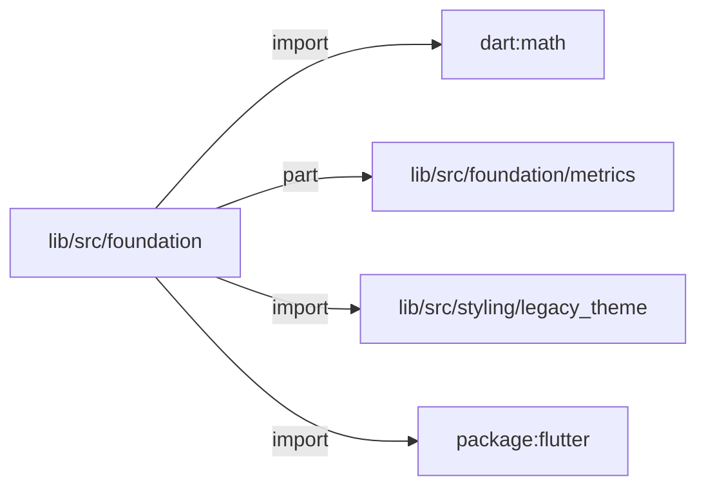
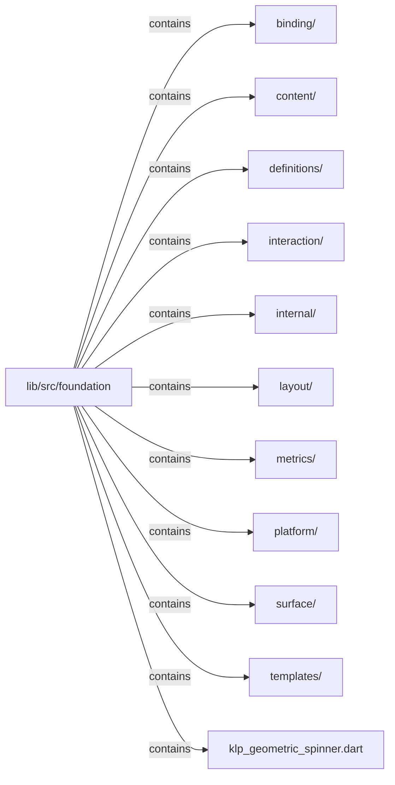
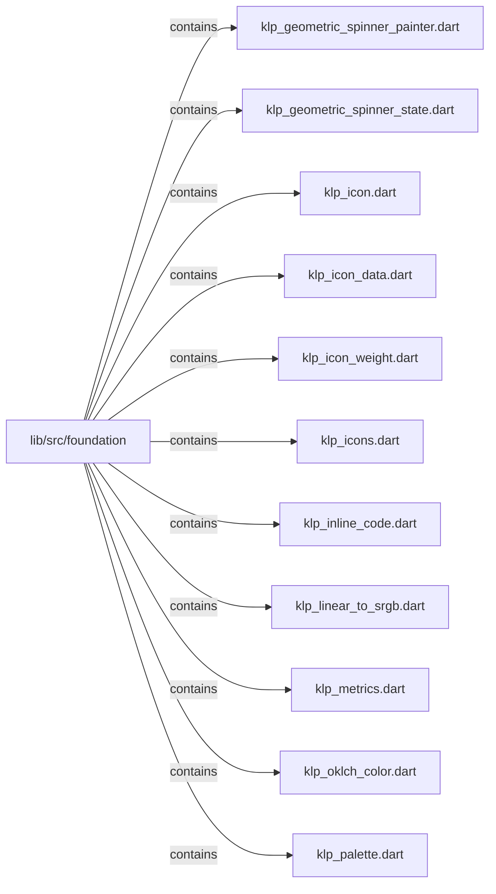
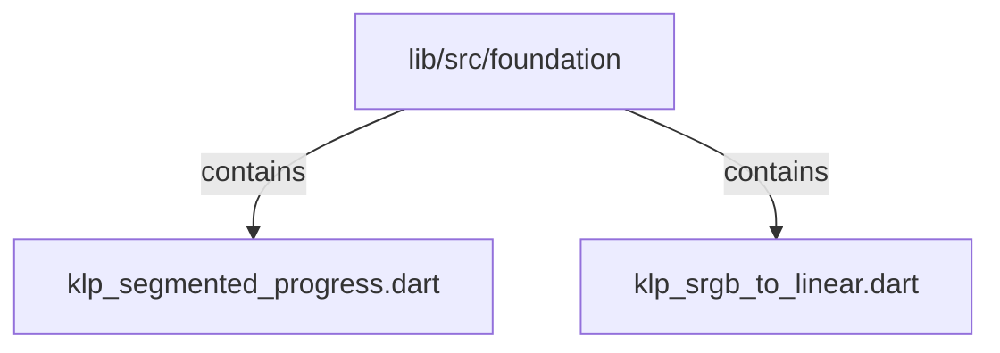

# lib/src/foundation：架構分析入口

[上一層](../README.md)

## 範圍

閱讀 `lib/src/foundation` 的直接子目錄與 Dart 檔案。結構圖表示實際檔案包含關係；依賴圖表示本層檔案明寫的 directives。每個檔案頁另列直接依賴、宣告、欄位、方法、建構子及行號證據。

## 模組閱讀重點

## 分析入口

新 Klp 路徑位於 `templates/`、`definitions/` 與 `binding/internal/`：外部作者只在定義期組合文字、線性排版、表面與 `KlpChildrenTemplate<T, C>`。元件定義遍歷模板取得唯一插槽 schema；compiler 先驗證 semantic 使用權限、模板資格及已擷取的 slot 範圍，再投影資料。`prepareCaptured` 產生不可變 `KlpPreparedComponent`，資源安裝後才嵌入已完成子呈現；不重新讀取外部結構 getter。

內部 bound 集合另含選擇操作、三區配置、單方向尺寸與完成的 `KlpBoundPlacement`，供 feature adapter／runtime 組合；renderer 不會收到未完成插槽。放置包裝保存識別，支援同層重排時延續 element。這些內部 bound 型別不等於外部公開模板，也不與以下 Klp 舊元件互相轉接。詳見 [元件模板樣板](../../component-template-prototype.md) 與 [合格子插槽](../../component-slots-prototype.md)。

`KlpBoundPlacement.id` 使用結構化 `KlpPlacementId`，不同 scope 的同名元件不共用呈現 key。`KlpBoundRetainedStack` 只接受已完成的頁面放置與有效 activeId，拒絕空頁集合、重複識別及不存在的目前頁；這是內部呈現資料，不是公開 Router 或任意畫面 builder。

`foundation/` 同時包含裝飾 palette／metrics 常數、OKLCH 色彩模型，以及 icon、inline code、spinner、progress 等會讀 theme 的視覺元件；不能把整個目錄視為無上游依賴的純常數底層。圖示目前由 KlpIconData 與 KlpIcon 組合 Flutter IconData 字型。設計語言的 KlpPalette 與 KlpAccent 已歸 tokens，這裡只保留非設計語言的 KlpDecorativePalette。

| 想查的問題 | 符號與來源 |
| --- | --- |
| 裝飾色盤定義在哪？ | KlpDecorativePalette — `lib/src/foundation/klp_palette.dart:8` |
| OKLCH 資料入口？ | KlpOklchColor — `lib/src/foundation/klp_oklch_color.dart:12` |
| 圖示如何實際繪出？ | KlpIcon.build — `lib/src/foundation/klp_icon.dart:57` |
| 靜態尺寸常數有哪些分類？ | KlpSpace／KlpControlMetrics — `lib/src/foundation/klp_metrics.dart:8`、`lib/src/foundation/klp_metrics.dart:138` |

重要關係：

- `klp_palette.dart` 僅 import Flutter 色彩型別，定義預覽桌布與視窗控制鈕的裝飾值；未匯出設計語言色盤（`lib/src/foundation/klp_palette.dart:1`、`lib/src/foundation/klp_palette.dart:8`）。
- `KlpIcon.build` → Flutter `IconData`：由字重決定字碼與字型，並指定 fontPackage 為 kallopis（`lib/src/foundation/klp_icon.dart:60`、`lib/src/foundation/klp_icon.dart:64`）。
- 目錄層級 `foundation → theme → tokens`：icon 引入 theme，theme 引入 primitive token（`lib/src/foundation/klp_icon.dart:3`、`lib/src/styling/legacy_theme/klp_theme.dart:7`）。兩端是不同職責的檔案。

import 依賴圖不能推導執行順序；圖示載入應以現行 IconData 實作為準。

## 本層直接依賴圖

箭頭以本層 Dart 檔案明寫的 directive 彙總到目標所在目錄或外部套件邊界；不遞迴將子目錄依賴算入本層。相同目標的不同 directive 類型分開計數。

| 目標邊界 | 關係 | directive 數 | 第一筆來源證據 |
|---|---|---|---|
| <code>dart:math</code> | import | 2 | [lib/src/foundation/klp_geometric_spinner.dart:1](../../../../lib/src/foundation/klp_geometric_spinner.dart#L1) |
| <code>lib/src/foundation/metrics</code> | part | 13 | [lib/src/foundation/klp_metrics.dart:3](../../../../lib/src/foundation/klp_metrics.dart#L3) |
| <code>lib/src/styling/legacy_theme</code> | import | 4 | [lib/src/foundation/klp_geometric_spinner.dart:4](../../../../lib/src/foundation/klp_geometric_spinner.dart#L4) |
| <code>package:flutter</code> | import | 9 | [lib/src/foundation/klp_geometric_spinner.dart:2](../../../../lib/src/foundation/klp_geometric_spinner.dart#L2) |

### 同目錄依賴

| 來源 → 目標 | 關係 | 證據 |
|---|---|---|
| <code>klp_geometric_spinner.dart → klp_geometric_spinner_painter.dart</code> | part | [lib/src/foundation/klp_geometric_spinner.dart:6](../../../../lib/src/foundation/klp_geometric_spinner.dart#L6) |
| <code>klp_geometric_spinner.dart → klp_geometric_spinner_state.dart</code> | part | [lib/src/foundation/klp_geometric_spinner.dart:7](../../../../lib/src/foundation/klp_geometric_spinner.dart#L7) |
| <code>klp_geometric_spinner_painter.dart → klp_geometric_spinner.dart</code> | part of | [lib/src/foundation/klp_geometric_spinner_painter.dart:1](../../../../lib/src/foundation/klp_geometric_spinner_painter.dart#L1) |
| <code>klp_geometric_spinner_state.dart → klp_geometric_spinner.dart</code> | part of | [lib/src/foundation/klp_geometric_spinner_state.dart:1](../../../../lib/src/foundation/klp_geometric_spinner_state.dart#L1) |
| <code>klp_icon.dart → klp_icon_data.dart</code> | import | [lib/src/foundation/klp_icon.dart:4](../../../../lib/src/foundation/klp_icon.dart#L4) |
| <code>klp_icon.dart → klp_icon_weight.dart</code> | import | [lib/src/foundation/klp_icon.dart:5](../../../../lib/src/foundation/klp_icon.dart#L5) |
| <code>klp_icon.dart → klp_icon_data.dart</code> | export | [lib/src/foundation/klp_icon.dart:7](../../../../lib/src/foundation/klp_icon.dart#L7) |
| <code>klp_icon.dart → klp_icon_weight.dart</code> | export | [lib/src/foundation/klp_icon.dart:8](../../../../lib/src/foundation/klp_icon.dart#L8) |
| <code>klp_icon_data.dart → klp_icon_weight.dart</code> | import | [lib/src/foundation/klp_icon_data.dart:3](../../../../lib/src/foundation/klp_icon_data.dart#L3) |
| <code>klp_icons.dart → klp_icon.dart</code> | import | [lib/src/foundation/klp_icons.dart:1](../../../../lib/src/foundation/klp_icons.dart#L1) |
| <code>klp_linear_to_srgb.dart → klp_oklch_color.dart</code> | part of | [lib/src/foundation/klp_linear_to_srgb.dart:1](../../../../lib/src/foundation/klp_linear_to_srgb.dart#L1) |
| <code>klp_oklch_color.dart → klp_linear_to_srgb.dart</code> | part | [lib/src/foundation/klp_oklch_color.dart:6](../../../../lib/src/foundation/klp_oklch_color.dart#L6) |
| <code>klp_oklch_color.dart → klp_srgb_to_linear.dart</code> | part | [lib/src/foundation/klp_oklch_color.dart:7](../../../../lib/src/foundation/klp_oklch_color.dart#L7) |
| <code>klp_srgb_to_linear.dart → klp_oklch_color.dart</code> | part of | [lib/src/foundation/klp_srgb_to_linear.dart:1](../../../../lib/src/foundation/klp_srgb_to_linear.dart#L1) |

## 目錄結構圖

## 子目錄

| 目錄 | 導航 | 來源證據 |
|---|---|---|
| `binding/` | [架構入口](binding/README.md) | [來源目錄](../../../../lib/src/foundation/binding) |
| `content/` | [架構入口](content/README.md) | [來源目錄](../../../../lib/src/foundation/content) |
| `definitions/` | [架構入口](definitions/README.md) | [來源目錄](../../../../lib/src/foundation/definitions) |
| `interaction/` | [架構入口](interaction/README.md) | [來源目錄](../../../../lib/src/foundation/interaction) |
| `internal/` | [架構入口](internal/README.md) | [來源目錄](../../../../lib/src/foundation/internal) |
| `layout/` | [架構入口](layout/README.md) | [來源目錄](../../../../lib/src/foundation/layout) |
| `metrics/` | [架構入口](metrics/README.md) | [來源目錄](../../../../lib/src/foundation/metrics) |
| `platform/` | [架構入口](platform/README.md) | [來源目錄](../../../../lib/src/foundation/platform) |
| `surface/` | [架構入口](surface/README.md) | [來源目錄](../../../../lib/src/foundation/surface) |
| `templates/` | [架構入口](templates/README.md) | [來源目錄](../../../../lib/src/foundation/templates) |

## 本層檔案

| 檔案 | 宣告 | 細節 | 來源證據 |
|---|---|---|---|
| `klp_geometric_spinner.dart` | KlpGeometricSpinner | [架構與 API](klp_geometric_spinner.md) | [lib/src/foundation/klp_geometric_spinner.dart:1](../../../../lib/src/foundation/klp_geometric_spinner.dart#L1) |
| `klp_geometric_spinner_painter.dart` | _GeometricSpinnerPainter | [架構與 API](klp_geometric_spinner_painter.md) | [lib/src/foundation/klp_geometric_spinner_painter.dart:1](../../../../lib/src/foundation/klp_geometric_spinner_painter.dart#L1) |
| `klp_geometric_spinner_state.dart` | _KlpGeometricSpinnerState | [架構與 API](klp_geometric_spinner_state.md) | [lib/src/foundation/klp_geometric_spinner_state.dart:1](../../../../lib/src/foundation/klp_geometric_spinner_state.dart#L1) |
| `klp_icon.dart` | KlpIcon | [架構與 API](klp_icon.md) | [lib/src/foundation/klp_icon.dart:1](../../../../lib/src/foundation/klp_icon.dart#L1) |
| `klp_icon_data.dart` | KlpIconData | [架構與 API](klp_icon_data.md) | [lib/src/foundation/klp_icon_data.dart:1](../../../../lib/src/foundation/klp_icon_data.dart#L1) |
| `klp_icon_weight.dart` | KlpIconWeight | [架構與 API](klp_icon_weight.md) | [lib/src/foundation/klp_icon_weight.dart:1](../../../../lib/src/foundation/klp_icon_weight.dart#L1) |
| `klp_icons.dart` | KlpIcons | [架構與 API](klp_icons.md) | [lib/src/foundation/klp_icons.dart:1](../../../../lib/src/foundation/klp_icons.dart#L1) |
| `klp_inline_code.dart` | KlpInlineCode | [架構與 API](klp_inline_code.md) | [lib/src/foundation/klp_inline_code.dart:1](../../../../lib/src/foundation/klp_inline_code.dart#L1) |
| `klp_linear_to_srgb.dart` | _linearToSrgb | [架構與 API](klp_linear_to_srgb.md) | [lib/src/foundation/klp_linear_to_srgb.dart:1](../../../../lib/src/foundation/klp_linear_to_srgb.dart#L1) |
| `klp_metrics.dart` | 無頂層宣告 | [架構與 API](klp_metrics.md) | [lib/src/foundation/klp_metrics.dart:1](../../../../lib/src/foundation/klp_metrics.dart#L1) |
| `klp_oklch_color.dart` | KlpOklchColor | [架構與 API](klp_oklch_color.md) | [lib/src/foundation/klp_oklch_color.dart:1](../../../../lib/src/foundation/klp_oklch_color.dart#L1) |
| `klp_palette.dart` | KlpDecorativePalette | [架構與 API](klp_palette.md) | [lib/src/foundation/klp_palette.dart:1](../../../../lib/src/foundation/klp_palette.dart#L1) |
| `klp_segmented_progress.dart` | KlpSegmentedProgress | [架構與 API](klp_segmented_progress.md) | [lib/src/foundation/klp_segmented_progress.dart:1](../../../../lib/src/foundation/klp_segmented_progress.dart#L1) |
| `klp_srgb_to_linear.dart` | _srgbToLinear | [架構與 API](klp_srgb_to_linear.md) | [lib/src/foundation/klp_srgb_to_linear.dart:1](../../../../lib/src/foundation/klp_srgb_to_linear.dart#L1) |

## 閱讀說明

箭頭只表示來源明寫的靜態關係；import 不等於呼叫。未分析動態呼叫、欄位的實際物件擁有權、狀態轉移或渲染流程；型別未進行語意解析，繼承目標保留原始型別拼寫。public／private 依 Dart 名稱前綴判斷；public 宣告不代表已由 `lib/kallopis.dart` 匯出。

本頁的目錄與檔案由來源清冊產生；`manifest.json` 位於本圖集根目錄，可核對 SHA-256 與覆蓋數。人工模組摘要存於 `tool/architecture_atlas/briefs/`，重新生成時保留。
