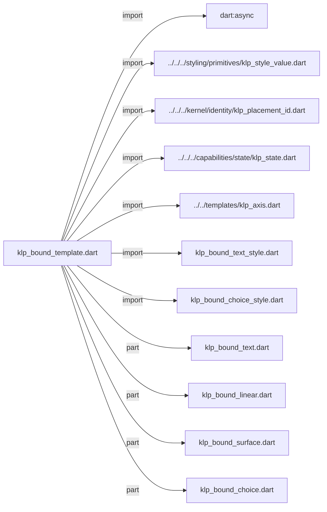
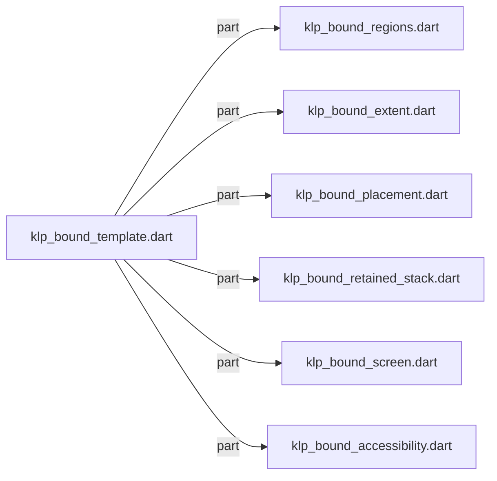
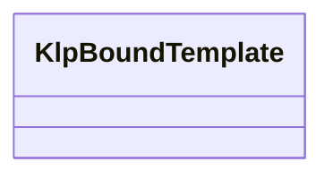

# klp_bound_template.dart：直接依賴與宣告架構

[回到目錄](README.md) · [來源檔案](../../../../../../lib/src/foundation/binding/internal/klp_bound_template.dart)

## 範圍

核心是 `lib/src/foundation/binding/internal/klp_bound_template.dart`。主要視角為該檔案明寫的 import／export／part；輔助視角為本檔宣告及 extends／implements／with／on 關係。只展開一層外部邊界。

## 直接依賴圖

## 依賴證據

| 關係 | 原始 directive | 來源 |
|---|---|---|
| import | <code>import &#x27;dart:async&#x27;;</code> | [lib/src/foundation/binding/internal/klp_bound_template.dart:1](../../../../../../lib/src/foundation/binding/internal/klp_bound_template.dart#L1) |
| import | <code>import &#x27;../../../styling/primitives/klp_style_value.dart&#x27;;</code> | [lib/src/foundation/binding/internal/klp_bound_template.dart:3](../../../../../../lib/src/foundation/binding/internal/klp_bound_template.dart#L3) |
| import | <code>import &#x27;../../../kernel/identity/klp_placement_id.dart&#x27;;</code> | [lib/src/foundation/binding/internal/klp_bound_template.dart:4](../../../../../../lib/src/foundation/binding/internal/klp_bound_template.dart#L4) |
| import | <code>import &#x27;../../../capabilities/state/klp_state.dart&#x27;;</code> | [lib/src/foundation/binding/internal/klp_bound_template.dart:5](../../../../../../lib/src/foundation/binding/internal/klp_bound_template.dart#L5) |
| import | <code>import &#x27;../../templates/klp_axis.dart&#x27;;</code> | [lib/src/foundation/binding/internal/klp_bound_template.dart:6](../../../../../../lib/src/foundation/binding/internal/klp_bound_template.dart#L6) |
| import | <code>import &#x27;klp_bound_text_style.dart&#x27;;</code> | [lib/src/foundation/binding/internal/klp_bound_template.dart:7](../../../../../../lib/src/foundation/binding/internal/klp_bound_template.dart#L7) |
| import | <code>import &#x27;klp_bound_choice_style.dart&#x27;;</code> | [lib/src/foundation/binding/internal/klp_bound_template.dart:8](../../../../../../lib/src/foundation/binding/internal/klp_bound_template.dart#L8) |
| part | <code>part &#x27;klp_bound_text.dart&#x27;;</code> | [lib/src/foundation/binding/internal/klp_bound_template.dart:10](../../../../../../lib/src/foundation/binding/internal/klp_bound_template.dart#L10) |
| part | <code>part &#x27;klp_bound_linear.dart&#x27;;</code> | [lib/src/foundation/binding/internal/klp_bound_template.dart:11](../../../../../../lib/src/foundation/binding/internal/klp_bound_template.dart#L11) |
| part | <code>part &#x27;klp_bound_surface.dart&#x27;;</code> | [lib/src/foundation/binding/internal/klp_bound_template.dart:12](../../../../../../lib/src/foundation/binding/internal/klp_bound_template.dart#L12) |
| part | <code>part &#x27;klp_bound_choice.dart&#x27;;</code> | [lib/src/foundation/binding/internal/klp_bound_template.dart:13](../../../../../../lib/src/foundation/binding/internal/klp_bound_template.dart#L13) |
| part | <code>part &#x27;klp_bound_regions.dart&#x27;;</code> | [lib/src/foundation/binding/internal/klp_bound_template.dart:14](../../../../../../lib/src/foundation/binding/internal/klp_bound_template.dart#L14) |
| part | <code>part &#x27;klp_bound_extent.dart&#x27;;</code> | [lib/src/foundation/binding/internal/klp_bound_template.dart:15](../../../../../../lib/src/foundation/binding/internal/klp_bound_template.dart#L15) |
| part | <code>part &#x27;klp_bound_placement.dart&#x27;;</code> | [lib/src/foundation/binding/internal/klp_bound_template.dart:16](../../../../../../lib/src/foundation/binding/internal/klp_bound_template.dart#L16) |
| part | <code>part &#x27;klp_bound_retained_stack.dart&#x27;;</code> | [lib/src/foundation/binding/internal/klp_bound_template.dart:17](../../../../../../lib/src/foundation/binding/internal/klp_bound_template.dart#L17) |
| part | <code>part &#x27;klp_bound_screen.dart&#x27;;</code> | [lib/src/foundation/binding/internal/klp_bound_template.dart:18](../../../../../../lib/src/foundation/binding/internal/klp_bound_template.dart#L18) |
| part | <code>part &#x27;klp_bound_accessibility.dart&#x27;;</code> | [lib/src/foundation/binding/internal/klp_bound_template.dart:19](../../../../../../lib/src/foundation/binding/internal/klp_bound_template.dart#L19) |

## 宣告關係圖

本組節點是本檔宣告；沒有箭頭的宣告未在此圖主張互相依賴。

## 宣告與成員證據

成員包含 public 與 private；簽章取自來源，省略函式本體與欄位初始值。`(inferred)` 表示來源未明寫型別；建構子只顯示參數部分，不含初始化列表。

### KlpBoundTemplate

ClassDeclaration · public · [lib/src/foundation/binding/internal/klp_bound_template.dart:21](../../../../../../lib/src/foundation/binding/internal/klp_bound_template.dart#L21)

<code>sealed class KlpBoundTemplate</code>

來源註解摘要：本庫完成資料投影與風格求值後的封閉呈現輸入。

| 成員 | 可見性 | 簽章／型別 | 來源註解摘要 | 證據 |
|---|---|---|---|---|
| constructor <code>KlpBoundTemplate</code> | public | <code>const KlpBoundTemplate()</code> |  | [lib/src/foundation/binding/internal/klp_bound_template.dart:23](../../../../../../lib/src/foundation/binding/internal/klp_bound_template.dart#L23) |

## 閱讀說明與限制

箭頭只表示來源明寫的靜態關係；import 不等於呼叫。未分析動態呼叫、欄位的實際物件擁有權、狀態轉移或渲染流程；型別未進行語意解析，繼承目標保留原始型別拼寫。public／private 依 Dart 名稱前綴判斷；public 宣告不代表已由 `lib/kallopis.dart` 匯出。

本頁由 `tool/architecture_atlas` 產生；編輯來源或生成工具後重新產生，避免手改本頁。
