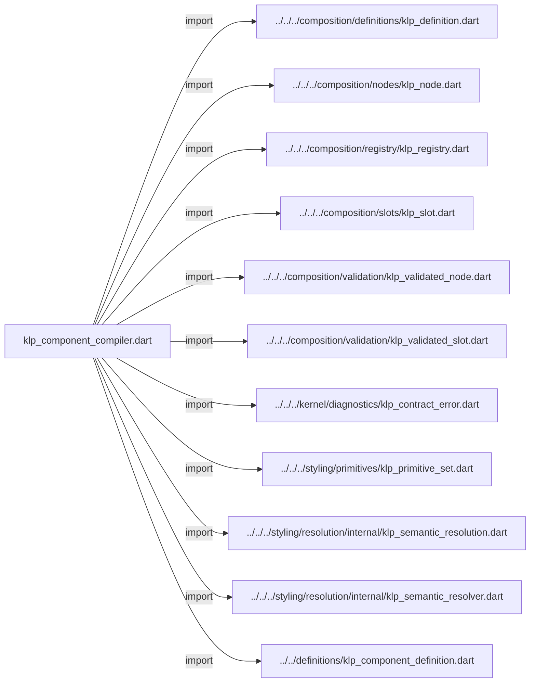
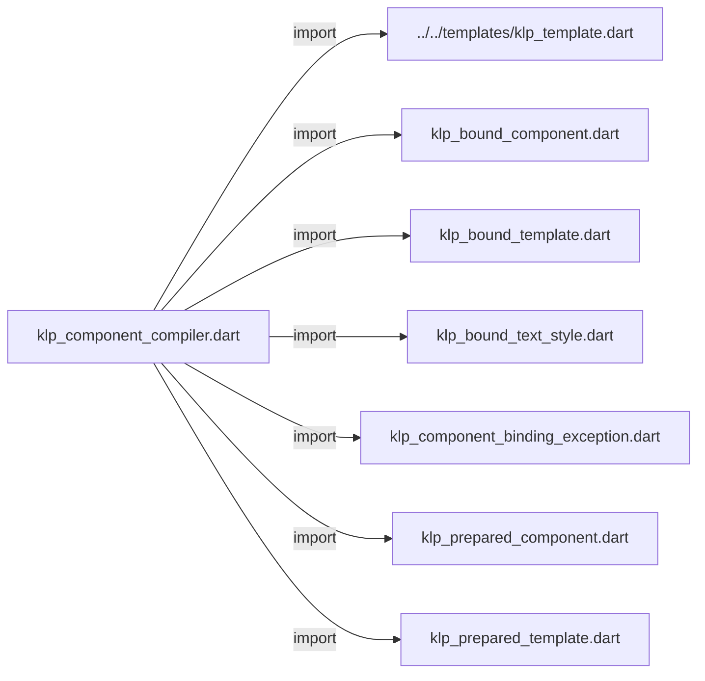
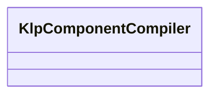

# klp_component_compiler.dart：直接依賴與宣告架構

[回到目錄](README.md) · [來源檔案](../../../../../../lib/src/foundation/binding/internal/klp_component_compiler.dart)

## 範圍

核心是 `lib/src/foundation/binding/internal/klp_component_compiler.dart`。主要視角為該檔案明寫的 import／export／part；輔助視角為本檔宣告及 extends／implements／with／on 關係。只展開一層外部邊界。

## 直接依賴圖

## 依賴證據

| 關係 | 原始 directive | 來源 |
|---|---|---|
| import | <code>import &#x27;../../../composition/definitions/klp_definition.dart&#x27;;</code> | [lib/src/foundation/binding/internal/klp_component_compiler.dart:1](../../../../../../lib/src/foundation/binding/internal/klp_component_compiler.dart#L1) |
| import | <code>import &#x27;../../../composition/nodes/klp_node.dart&#x27;;</code> | [lib/src/foundation/binding/internal/klp_component_compiler.dart:2](../../../../../../lib/src/foundation/binding/internal/klp_component_compiler.dart#L2) |
| import | <code>import &#x27;../../../composition/registry/klp_registry.dart&#x27;;</code> | [lib/src/foundation/binding/internal/klp_component_compiler.dart:3](../../../../../../lib/src/foundation/binding/internal/klp_component_compiler.dart#L3) |
| import | <code>import &#x27;../../../composition/slots/klp_slot.dart&#x27;;</code> | [lib/src/foundation/binding/internal/klp_component_compiler.dart:4](../../../../../../lib/src/foundation/binding/internal/klp_component_compiler.dart#L4) |
| import | <code>import &#x27;../../../composition/validation/klp_validated_node.dart&#x27;;</code> | [lib/src/foundation/binding/internal/klp_component_compiler.dart:5](../../../../../../lib/src/foundation/binding/internal/klp_component_compiler.dart#L5) |
| import | <code>import &#x27;../../../composition/validation/klp_validated_slot.dart&#x27;;</code> | [lib/src/foundation/binding/internal/klp_component_compiler.dart:6](../../../../../../lib/src/foundation/binding/internal/klp_component_compiler.dart#L6) |
| import | <code>import &#x27;../../../kernel/diagnostics/klp_contract_error.dart&#x27;;</code> | [lib/src/foundation/binding/internal/klp_component_compiler.dart:7](../../../../../../lib/src/foundation/binding/internal/klp_component_compiler.dart#L7) |
| import | <code>import &#x27;../../../styling/primitives/klp_primitive_set.dart&#x27;;</code> | [lib/src/foundation/binding/internal/klp_component_compiler.dart:8](../../../../../../lib/src/foundation/binding/internal/klp_component_compiler.dart#L8) |
| import | <code>import &#x27;../../../styling/resolution/internal/klp_semantic_resolution.dart&#x27;;</code> | [lib/src/foundation/binding/internal/klp_component_compiler.dart:9](../../../../../../lib/src/foundation/binding/internal/klp_component_compiler.dart#L9) |
| import | <code>import &#x27;../../../styling/resolution/internal/klp_semantic_resolver.dart&#x27;;</code> | [lib/src/foundation/binding/internal/klp_component_compiler.dart:10](../../../../../../lib/src/foundation/binding/internal/klp_component_compiler.dart#L10) |
| import | <code>import &#x27;../../definitions/klp_component_definition.dart&#x27;;</code> | [lib/src/foundation/binding/internal/klp_component_compiler.dart:11](../../../../../../lib/src/foundation/binding/internal/klp_component_compiler.dart#L11) |
| import | <code>import &#x27;../../templates/klp_template.dart&#x27;;</code> | [lib/src/foundation/binding/internal/klp_component_compiler.dart:12](../../../../../../lib/src/foundation/binding/internal/klp_component_compiler.dart#L12) |
| import | <code>import &#x27;klp_bound_component.dart&#x27;;</code> | [lib/src/foundation/binding/internal/klp_component_compiler.dart:13](../../../../../../lib/src/foundation/binding/internal/klp_component_compiler.dart#L13) |
| import | <code>import &#x27;klp_bound_template.dart&#x27;;</code> | [lib/src/foundation/binding/internal/klp_component_compiler.dart:14](../../../../../../lib/src/foundation/binding/internal/klp_component_compiler.dart#L14) |
| import | <code>import &#x27;klp_bound_text_style.dart&#x27;;</code> | [lib/src/foundation/binding/internal/klp_component_compiler.dart:15](../../../../../../lib/src/foundation/binding/internal/klp_component_compiler.dart#L15) |
| import | <code>import &#x27;klp_component_binding_exception.dart&#x27;;</code> | [lib/src/foundation/binding/internal/klp_component_compiler.dart:16](../../../../../../lib/src/foundation/binding/internal/klp_component_compiler.dart#L16) |
| import | <code>import &#x27;klp_prepared_component.dart&#x27;;</code> | [lib/src/foundation/binding/internal/klp_component_compiler.dart:17](../../../../../../lib/src/foundation/binding/internal/klp_component_compiler.dart#L17) |
| import | <code>import &#x27;klp_prepared_template.dart&#x27;;</code> | [lib/src/foundation/binding/internal/klp_component_compiler.dart:18](../../../../../../lib/src/foundation/binding/internal/klp_component_compiler.dart#L18) |

## 宣告關係圖

本組節點是本檔宣告；沒有箭頭的宣告未在此圖主張互相依賴。

## 宣告與成員證據

成員包含 public 與 private；簽章取自來源，省略函式本體與欄位初始值。`(inferred)` 表示來源未明寫型別；建構子只顯示參數部分，不含初始化列表。

### KlpComponentCompiler

ClassDeclaration · public · [lib/src/foundation/binding/internal/klp_component_compiler.dart:20](../../../../../../lib/src/foundation/binding/internal/klp_component_compiler.dart#L20)

<code>final class KlpComponentCompiler</code>

來源註解摘要：定義先驗證，資料後投影；只輸出封閉 foundation 結果，不建立 Flutter Widget。

| 成員 | 可見性 | 簽章／型別 | 來源註解摘要 | 證據 |
|---|---|---|---|---|
| field <code>_definitions</code> | private | <code>final Map&lt;String, KlpComponentDefinition&lt;KlpNode&gt;&gt; _definitions</code> |  | [lib/src/foundation/binding/internal/klp_component_compiler.dart:23](../../../../../../lib/src/foundation/binding/internal/klp_component_compiler.dart#L23) |
| field <code>_semantics</code> | private | <code>late final KlpSemanticResolver _semantics</code> |  | [lib/src/foundation/binding/internal/klp_component_compiler.dart:24](../../../../../../lib/src/foundation/binding/internal/klp_component_compiler.dart#L24) |
| constructor <code>KlpComponentCompiler</code> | public | <code>KlpComponentCompiler(Iterable&lt;KlpComponentDefinition&lt;KlpNode&gt;&gt; definitions, {Iterable&lt;KlpDefinition&lt;KlpNode&gt;&gt; sharedDefinitions = const []})</code> |  | [lib/src/foundation/binding/internal/klp_component_compiler.dart:26](../../../../../../lib/src/foundation/binding/internal/klp_component_compiler.dart#L26) |
| method <code>bind</code> | public | <code>KlpBoundComponent bind(KlpNode node, KlpPrimitiveSet primitives)</code> |  | [lib/src/foundation/binding/internal/klp_component_compiler.dart:36](../../../../../../lib/src/foundation/binding/internal/klp_component_compiler.dart#L36) |
| method <code>bindCaptured</code> | public | <code>KlpBoundComponent bindCaptured(KlpNode node, KlpValidatedNode snapshot, KlpPrimitiveSet primitives, {KlpSemanticResolution? resolved})</code> | 結構編譯已擷取識別與子節點，不再讀取外部結構 getter。 | [lib/src/foundation/binding/internal/klp_component_compiler.dart:41](../../../../../../lib/src/foundation/binding/internal/klp_component_compiler.dart#L41) |
| method <code>prepareCaptured</code> | public | <code>KlpPreparedComponent prepareCaptured(KlpNode node, KlpValidatedNode snapshot, KlpPrimitiveSet primitives, {KlpSemanticResolution? resolved})</code> | 子插槽只保存已驗證範圍，消費端程式在安裝資源前完成執行。 | [lib/src/foundation/binding/internal/klp_component_compiler.dart:47](../../../../../../lib/src/foundation/binding/internal/klp_component_compiler.dart#L47) |
| method <code>validateCaptured</code> | public | <code>void validateCaptured(KlpNode node, KlpValidatedNode snapshot)</code> | runtime 可先檢查整棵樹的模板資格，再開始任何文字投影。 | [lib/src/foundation/binding/internal/klp_component_compiler.dart:85](../../../../../../lib/src/foundation/binding/internal/klp_component_compiler.dart#L85) |
| method <code>_validateCaptured</code> | private | <code>(KlpComponentDefinition&lt;KlpNode&gt;, Map&lt;KlpSlot&lt;KlpNode&gt;, KlpValidatedSlot&gt;) _validateCaptured(KlpNode node, KlpValidatedNode snapshot)</code> |  | [lib/src/foundation/binding/internal/klp_component_compiler.dart:90](../../../../../../lib/src/foundation/binding/internal/klp_component_compiler.dart#L90) |
| method <code>_validateSlots</code> | private | <code>Map&lt;KlpSlot&lt;KlpNode&gt;, KlpValidatedSlot&gt; _validateSlots(KlpDefinition&lt;KlpNode&gt; definition, KlpValidatedNode snapshot)</code> |  | [lib/src/foundation/binding/internal/klp_component_compiler.dart:105](../../../../../../lib/src/foundation/binding/internal/klp_component_compiler.dart#L105) |
| method <code>_validate</code> | private | <code>void _validate(KlpTemplate&lt;KlpNode&gt; template, String owner)</code> |  | [lib/src/foundation/binding/internal/klp_component_compiler.dart:125](../../../../../../lib/src/foundation/binding/internal/klp_component_compiler.dart#L125) |
| method <code>_validateInput</code> | private | <code>void _validateInput(KlpTemplate&lt;KlpNode&gt; template, KlpNode node, String id, String path)</code> |  | [lib/src/foundation/binding/internal/klp_component_compiler.dart:146](../../../../../../lib/src/foundation/binding/internal/klp_component_compiler.dart#L146) |
| method <code>_bind</code> | private | <code>KlpPreparedTemplate _bind(KlpTemplate&lt;KlpNode&gt; template, KlpNode node, KlpSemanticResolution style, String id, String path, Map&lt;KlpSlot&lt;KlpNode&gt;, KlpValidatedSlot&gt; slots)</code> |  | [lib/src/foundation/binding/internal/klp_component_compiler.dart:161](../../../../../../lib/src/foundation/binding/internal/klp_component_compiler.dart#L161) |

## 閱讀說明與限制

箭頭只表示來源明寫的靜態關係；import 不等於呼叫。未分析動態呼叫、欄位的實際物件擁有權、狀態轉移或渲染流程；型別未進行語意解析，繼承目標保留原始型別拼寫。public／private 依 Dart 名稱前綴判斷；public 宣告不代表已由 `lib/kallopis.dart` 匯出。

本頁由 `tool/architecture_atlas` 產生；編輯來源或生成工具後重新產生，避免手改本頁。
