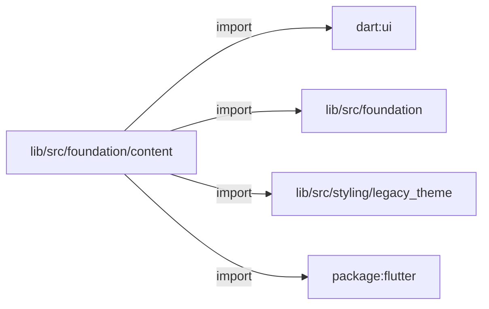
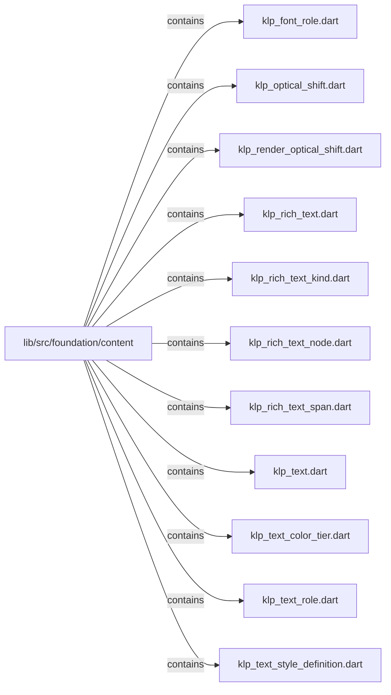
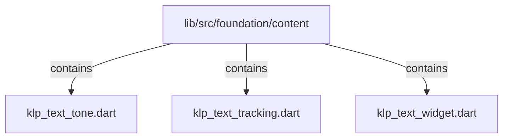

# lib/src/foundation/content：架構分析入口

[上一層](../README.md)

## 範圍

閱讀 `lib/src/foundation/content` 的直接子目錄與 Dart 檔案。結構圖表示實際檔案包含關係；依賴圖表示本層檔案明寫的 directives。每個檔案頁另列直接依賴、宣告、欄位、方法、建構子及行號證據。

## 本層直接依賴圖

箭頭以本層 Dart 檔案明寫的 directive 彙總到目標所在目錄或外部套件邊界；不遞迴將子目錄依賴算入本層。相同目標的不同 directive 類型分開計數。

| 目標邊界 | 關係 | directive 數 | 第一筆來源證據 |
|---|---|---|---|
| <code>dart:ui</code> | import | 1 | [lib/src/foundation/content/klp_rich_text_span.dart:1](../../../../../lib/src/foundation/content/klp_rich_text_span.dart#L1) |
| <code>lib/src/foundation</code> | import | 1 | [lib/src/foundation/content/klp_rich_text.dart:4](../../../../../lib/src/foundation/content/klp_rich_text.dart#L4) |
| <code>lib/src/styling/legacy_theme</code> | import | 5 | [lib/src/foundation/content/klp_rich_text.dart:5](../../../../../lib/src/foundation/content/klp_rich_text.dart#L5) |
| <code>package:flutter</code> | import | 8 | [lib/src/foundation/content/klp_rich_text.dart:1](../../../../../lib/src/foundation/content/klp_rich_text.dart#L1) |

### 同目錄依賴

| 來源 → 目標 | 關係 | 證據 |
|---|---|---|
| <code>klp_optical_shift.dart → klp_text_widget.dart</code> | part of | [lib/src/foundation/content/klp_optical_shift.dart:1](../../../../../lib/src/foundation/content/klp_optical_shift.dart#L1) |
| <code>klp_render_optical_shift.dart → klp_text_widget.dart</code> | part of | [lib/src/foundation/content/klp_render_optical_shift.dart:1](../../../../../lib/src/foundation/content/klp_render_optical_shift.dart#L1) |
| <code>klp_rich_text.dart → klp_rich_text_kind.dart</code> | import | [lib/src/foundation/content/klp_rich_text.dart:6](../../../../../lib/src/foundation/content/klp_rich_text.dart#L6) |
| <code>klp_rich_text.dart → klp_rich_text_node.dart</code> | import | [lib/src/foundation/content/klp_rich_text.dart:7](../../../../../lib/src/foundation/content/klp_rich_text.dart#L7) |
| <code>klp_rich_text.dart → klp_rich_text_span.dart</code> | import | [lib/src/foundation/content/klp_rich_text.dart:8](../../../../../lib/src/foundation/content/klp_rich_text.dart#L8) |
| <code>klp_rich_text.dart → klp_text.dart</code> | import | [lib/src/foundation/content/klp_rich_text.dart:9](../../../../../lib/src/foundation/content/klp_rich_text.dart#L9) |
| <code>klp_rich_text.dart → klp_rich_text_kind.dart</code> | export | [lib/src/foundation/content/klp_rich_text.dart:11](../../../../../lib/src/foundation/content/klp_rich_text.dart#L11) |
| <code>klp_rich_text.dart → klp_rich_text_node.dart</code> | export | [lib/src/foundation/content/klp_rich_text.dart:12](../../../../../lib/src/foundation/content/klp_rich_text.dart#L12) |
| <code>klp_rich_text.dart → klp_rich_text_span.dart</code> | export | [lib/src/foundation/content/klp_rich_text.dart:13](../../../../../lib/src/foundation/content/klp_rich_text.dart#L13) |
| <code>klp_rich_text_node.dart → klp_rich_text_kind.dart</code> | import | [lib/src/foundation/content/klp_rich_text_node.dart:3](../../../../../lib/src/foundation/content/klp_rich_text_node.dart#L3) |
| <code>klp_text.dart → klp_font_role.dart</code> | import | [lib/src/foundation/content/klp_text.dart:5](../../../../../lib/src/foundation/content/klp_text.dart#L5) |
| <code>klp_text.dart → klp_text_color_tier.dart</code> | import | [lib/src/foundation/content/klp_text.dart:6](../../../../../lib/src/foundation/content/klp_text.dart#L6) |
| <code>klp_text.dart → klp_text_role.dart</code> | import | [lib/src/foundation/content/klp_text.dart:7](../../../../../lib/src/foundation/content/klp_text.dart#L7) |
| <code>klp_text.dart → klp_text_style_definition.dart</code> | import | [lib/src/foundation/content/klp_text.dart:8](../../../../../lib/src/foundation/content/klp_text.dart#L8) |
| <code>klp_text.dart → klp_text_tone.dart</code> | import | [lib/src/foundation/content/klp_text.dart:9](../../../../../lib/src/foundation/content/klp_text.dart#L9) |
| <code>klp_text.dart → klp_font_role.dart</code> | export | [lib/src/foundation/content/klp_text.dart:11](../../../../../lib/src/foundation/content/klp_text.dart#L11) |
| <code>klp_text.dart → klp_text_color_tier.dart</code> | export | [lib/src/foundation/content/klp_text.dart:12](../../../../../lib/src/foundation/content/klp_text.dart#L12) |
| <code>klp_text.dart → klp_text_role.dart</code> | export | [lib/src/foundation/content/klp_text.dart:13](../../../../../lib/src/foundation/content/klp_text.dart#L13) |
| <code>klp_text.dart → klp_text_style_definition.dart</code> | export | [lib/src/foundation/content/klp_text.dart:14](../../../../../lib/src/foundation/content/klp_text.dart#L14) |
| <code>klp_text.dart → klp_text_tracking.dart</code> | export | [lib/src/foundation/content/klp_text.dart:15](../../../../../lib/src/foundation/content/klp_text.dart#L15) |
| <code>klp_text.dart → klp_text_tone.dart</code> | export | [lib/src/foundation/content/klp_text.dart:16](../../../../../lib/src/foundation/content/klp_text.dart#L16) |
| <code>klp_text.dart → klp_text_widget.dart</code> | export | [lib/src/foundation/content/klp_text.dart:17](../../../../../lib/src/foundation/content/klp_text.dart#L17) |
| <code>klp_text_style_definition.dart → klp_font_role.dart</code> | import | [lib/src/foundation/content/klp_text_style_definition.dart:4](../../../../../lib/src/foundation/content/klp_text_style_definition.dart#L4) |
| <code>klp_text_style_definition.dart → klp_text_color_tier.dart</code> | import | [lib/src/foundation/content/klp_text_style_definition.dart:5](../../../../../lib/src/foundation/content/klp_text_style_definition.dart#L5) |
| <code>klp_text_widget.dart → klp_text.dart</code> | import | [lib/src/foundation/content/klp_text_widget.dart:5](../../../../../lib/src/foundation/content/klp_text_widget.dart#L5) |
| <code>klp_text_widget.dart → klp_optical_shift.dart</code> | part | [lib/src/foundation/content/klp_text_widget.dart:7](../../../../../lib/src/foundation/content/klp_text_widget.dart#L7) |
| <code>klp_text_widget.dart → klp_render_optical_shift.dart</code> | part | [lib/src/foundation/content/klp_text_widget.dart:8](../../../../../lib/src/foundation/content/klp_text_widget.dart#L8) |

## 目錄結構圖

## 子目錄

| 目錄 | 導航 | 來源證據 |
|---|---|---|
| 無 | 目前沒有下一層目錄 | — |

## 本層檔案

| 檔案 | 宣告 | 細節 | 來源證據 |
|---|---|---|---|
| `klp_font_role.dart` | KlpFontRole | [架構與 API](klp_font_role.md) | [lib/src/foundation/content/klp_font_role.dart:1](../../../../../lib/src/foundation/content/klp_font_role.dart#L1) |
| `klp_optical_shift.dart` | _KlpOpticalShift | [架構與 API](klp_optical_shift.md) | [lib/src/foundation/content/klp_optical_shift.dart:1](../../../../../lib/src/foundation/content/klp_optical_shift.dart#L1) |
| `klp_render_optical_shift.dart` | _RenderKlpOpticalShift | [架構與 API](klp_render_optical_shift.md) | [lib/src/foundation/content/klp_render_optical_shift.dart:1](../../../../../lib/src/foundation/content/klp_render_optical_shift.dart#L1) |
| `klp_rich_text.dart` | KlpRichText | [架構與 API](klp_rich_text.md) | [lib/src/foundation/content/klp_rich_text.dart:1](../../../../../lib/src/foundation/content/klp_rich_text.dart#L1) |
| `klp_rich_text_kind.dart` | KlpRichTextKind | [架構與 API](klp_rich_text_kind.md) | [lib/src/foundation/content/klp_rich_text_kind.dart:1](../../../../../lib/src/foundation/content/klp_rich_text_kind.dart#L1) |
| `klp_rich_text_node.dart` | KlpRichTextNode | [架構與 API](klp_rich_text_node.md) | [lib/src/foundation/content/klp_rich_text_node.dart:1](../../../../../lib/src/foundation/content/klp_rich_text_node.dart#L1) |
| `klp_rich_text_span.dart` | KlpRichTextSpan | [架構與 API](klp_rich_text_span.md) | [lib/src/foundation/content/klp_rich_text_span.dart:1](../../../../../lib/src/foundation/content/klp_rich_text_span.dart#L1) |
| `klp_text.dart` | KlpTextStyles | [架構與 API](klp_text.md) | [lib/src/foundation/content/klp_text.dart:1](../../../../../lib/src/foundation/content/klp_text.dart#L1) |
| `klp_text_color_tier.dart` | KlpTextColorTier | [架構與 API](klp_text_color_tier.md) | [lib/src/foundation/content/klp_text_color_tier.dart:1](../../../../../lib/src/foundation/content/klp_text_color_tier.dart#L1) |
| `klp_text_role.dart` | KlpTextRole | [架構與 API](klp_text_role.md) | [lib/src/foundation/content/klp_text_role.dart:1](../../../../../lib/src/foundation/content/klp_text_role.dart#L1) |
| `klp_text_style_definition.dart` | KlpTextStyleDefinition | [架構與 API](klp_text_style_definition.md) | [lib/src/foundation/content/klp_text_style_definition.dart:1](../../../../../lib/src/foundation/content/klp_text_style_definition.dart#L1) |
| `klp_text_tone.dart` | KlpTextTone | [架構與 API](klp_text_tone.md) | [lib/src/foundation/content/klp_text_tone.dart:1](../../../../../lib/src/foundation/content/klp_text_tone.dart#L1) |
| `klp_text_tracking.dart` | KlpTextTracking | [架構與 API](klp_text_tracking.md) | [lib/src/foundation/content/klp_text_tracking.dart:1](../../../../../lib/src/foundation/content/klp_text_tracking.dart#L1) |
| `klp_text_widget.dart` | KlpText | [架構與 API](klp_text_widget.md) | [lib/src/foundation/content/klp_text_widget.dart:1](../../../../../lib/src/foundation/content/klp_text_widget.dart#L1) |

## 閱讀說明

箭頭只表示來源明寫的靜態關係；import 不等於呼叫。未分析動態呼叫、欄位的實際物件擁有權、狀態轉移或渲染流程；型別未進行語意解析，繼承目標保留原始型別拼寫。public／private 依 Dart 名稱前綴判斷；public 宣告不代表已由 `lib/kallopis.dart` 匯出。

本頁的目錄與檔案由來源清冊產生；`manifest.json` 位於本圖集根目錄，可核對 SHA-256 與覆蓋數。人工模組摘要存於 `tool/architecture_atlas/briefs/`，重新生成時保留。
