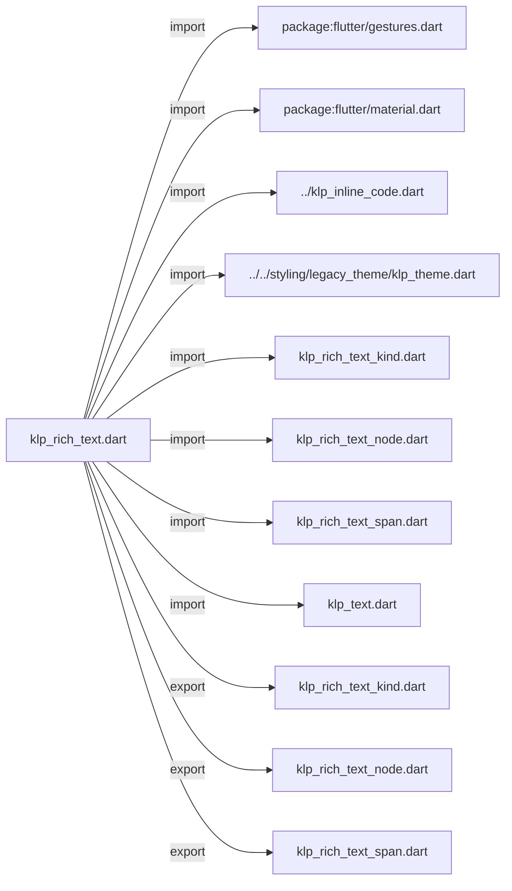
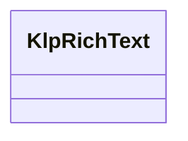
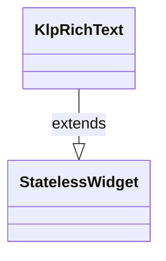

# klp_rich_text.dart：直接依賴與宣告架構

[回到目錄](README.md) · [來源檔案](../../../../../lib/src/foundation/content/klp_rich_text.dart)

## 範圍

核心是 `lib/src/foundation/content/klp_rich_text.dart`。主要視角為該檔案明寫的 import／export／part；輔助視角為本檔宣告及 extends／implements／with／on 關係。只展開一層外部邊界。

## 直接依賴圖

## 依賴證據

| 關係 | 原始 directive | 來源 |
|---|---|---|
| import | <code>import &#x27;package:flutter/gestures.dart&#x27;;</code> | [lib/src/foundation/content/klp_rich_text.dart:1](../../../../../lib/src/foundation/content/klp_rich_text.dart#L1) |
| import | <code>import &#x27;package:flutter/material.dart&#x27;;</code> | [lib/src/foundation/content/klp_rich_text.dart:2](../../../../../lib/src/foundation/content/klp_rich_text.dart#L2) |
| import | <code>import &#x27;../klp_inline_code.dart&#x27;;</code> | [lib/src/foundation/content/klp_rich_text.dart:4](../../../../../lib/src/foundation/content/klp_rich_text.dart#L4) |
| import | <code>import &#x27;../../styling/legacy_theme/klp_theme.dart&#x27;;</code> | [lib/src/foundation/content/klp_rich_text.dart:5](../../../../../lib/src/foundation/content/klp_rich_text.dart#L5) |
| import | <code>import &#x27;klp_rich_text_kind.dart&#x27;;</code> | [lib/src/foundation/content/klp_rich_text.dart:6](../../../../../lib/src/foundation/content/klp_rich_text.dart#L6) |
| import | <code>import &#x27;klp_rich_text_node.dart&#x27;;</code> | [lib/src/foundation/content/klp_rich_text.dart:7](../../../../../lib/src/foundation/content/klp_rich_text.dart#L7) |
| import | <code>import &#x27;klp_rich_text_span.dart&#x27;;</code> | [lib/src/foundation/content/klp_rich_text.dart:8](../../../../../lib/src/foundation/content/klp_rich_text.dart#L8) |
| import | <code>import &#x27;klp_text.dart&#x27;;</code> | [lib/src/foundation/content/klp_rich_text.dart:9](../../../../../lib/src/foundation/content/klp_rich_text.dart#L9) |
| export | <code>export &#x27;klp_rich_text_kind.dart&#x27;;</code> | [lib/src/foundation/content/klp_rich_text.dart:11](../../../../../lib/src/foundation/content/klp_rich_text.dart#L11) |
| export | <code>export &#x27;klp_rich_text_node.dart&#x27;;</code> | [lib/src/foundation/content/klp_rich_text.dart:12](../../../../../lib/src/foundation/content/klp_rich_text.dart#L12) |
| export | <code>export &#x27;klp_rich_text_span.dart&#x27;;</code> | [lib/src/foundation/content/klp_rich_text.dart:13](../../../../../lib/src/foundation/content/klp_rich_text.dart#L13) |

## 宣告關係圖

本組節點是本檔宣告；沒有箭頭的宣告未在此圖主張互相依賴。

## 宣告與成員證據

成員包含 public 與 private；簽章取自來源，省略函式本體與欄位初始值。`(inferred)` 表示來源未明寫型別；建構子只顯示參數部分，不含初始化列表。

### KlpRichText

ClassDeclaration · public · [lib/src/foundation/content/klp_rich_text.dart:15](../../../../../lib/src/foundation/content/klp_rich_text.dart#L15)

<code>class KlpRichText extends StatelessWidget</code>

來源註解摘要：行內混排文字：連結、mention、粗斜體、行內程式碼可以出現在同一段落裡。 [spans] 與 [nodes] 是兩種不同精細度的輸入，二擇一——給了 [nodes]（非空） 就完全忽略 [spans]；只需要簡單加粗／換色時用 [spans] 即可，不需要為此 組出完整的節點樹。[onOpenLink]／[onOpenMention] 為 null 時，對應的連結與 mention 仍會照樣顯示，只是不可點擊。

- `extends` → <code>StatelessWidget</code>：[lib/src/foundation/content/klp_rich_text.dart:21](../../../../../lib/src/foundation/content/klp_rich_text.dart#L21)

| 成員 | 可見性 | 簽章／型別 | 來源註解摘要 | 證據 |
|---|---|---|---|---|
| constructor <code>KlpRichText</code> | public | <code>const KlpRichText({ super.key, this.spans = const [], this.nodes = const [], this.selectable = false, this.onOpenLink, this.onOpenMention, })</code> |  | [lib/src/foundation/content/klp_rich_text.dart:22](../../../../../lib/src/foundation/content/klp_rich_text.dart#L22) |
| field <code>spans</code> | public | <code>final List&lt;KlpRichTextSpan&gt; spans</code> |  | [lib/src/foundation/content/klp_rich_text.dart:31](../../../../../lib/src/foundation/content/klp_rich_text.dart#L31) |
| field <code>nodes</code> | public | <code>final List&lt;KlpRichTextNode&gt; nodes</code> |  | [lib/src/foundation/content/klp_rich_text.dart:32](../../../../../lib/src/foundation/content/klp_rich_text.dart#L32) |
| field <code>selectable</code> | public | <code>final bool selectable</code> |  | [lib/src/foundation/content/klp_rich_text.dart:33](../../../../../lib/src/foundation/content/klp_rich_text.dart#L33) |
| field <code>onOpenLink</code> | public | <code>final ValueChanged&lt;String&gt;? onOpenLink</code> |  | [lib/src/foundation/content/klp_rich_text.dart:34](../../../../../lib/src/foundation/content/klp_rich_text.dart#L34) |
| field <code>onOpenMention</code> | public | <code>final ValueChanged&lt;String&gt;? onOpenMention</code> |  | [lib/src/foundation/content/klp_rich_text.dart:35](../../../../../lib/src/foundation/content/klp_rich_text.dart#L35) |
| method <code>build</code> | public | <code>Widget build(BuildContext context)</code> |  | [lib/src/foundation/content/klp_rich_text.dart:37](../../../../../lib/src/foundation/content/klp_rich_text.dart#L37) |
| method <code>_spanFor</code> | private | <code>InlineSpan _spanFor(BuildContext context, KlpRichTextNode node)</code> |  | [lib/src/foundation/content/klp_rich_text.dart:77](../../../../../lib/src/foundation/content/klp_rich_text.dart#L77) |

## 閱讀說明與限制

箭頭只表示來源明寫的靜態關係；import 不等於呼叫。未分析動態呼叫、欄位的實際物件擁有權、狀態轉移或渲染流程；型別未進行語意解析，繼承目標保留原始型別拼寫。public／private 依 Dart 名稱前綴判斷；public 宣告不代表已由 `lib/kallopis.dart` 匯出。

本頁由 `tool/architecture_atlas` 產生；編輯來源或生成工具後重新產生，避免手改本頁。
