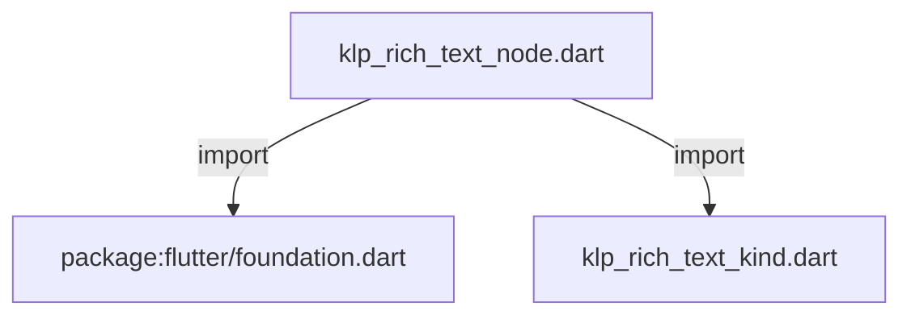
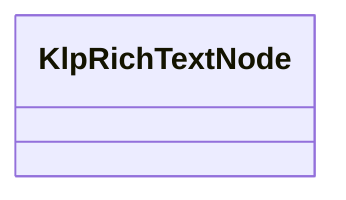

# klp_rich_text_node.dart：直接依賴與宣告架構

[回到目錄](README.md) · [來源檔案](../../../../../lib/src/foundation/content/klp_rich_text_node.dart)

## 範圍

核心是 `lib/src/foundation/content/klp_rich_text_node.dart`。主要視角為該檔案明寫的 import／export／part；輔助視角為本檔宣告及 extends／implements／with／on 關係。只展開一層外部邊界。

## 直接依賴圖

## 依賴證據

| 關係 | 原始 directive | 來源 |
|---|---|---|
| import | <code>import &#x27;package:flutter/foundation.dart&#x27;;</code> | [lib/src/foundation/content/klp_rich_text_node.dart:1](../../../../../lib/src/foundation/content/klp_rich_text_node.dart#L1) |
| import | <code>import &#x27;klp_rich_text_kind.dart&#x27;;</code> | [lib/src/foundation/content/klp_rich_text_node.dart:3](../../../../../lib/src/foundation/content/klp_rich_text_node.dart#L3) |

## 宣告關係圖

本組節點是本檔宣告；沒有箭頭的宣告未在此圖主張互相依賴。

## 宣告與成員證據

成員包含 public 與 private；簽章取自來源，省略函式本體與欄位初始值。`(inferred)` 表示來源未明寫型別；建構子只顯示參數部分，不含初始化列表。

### KlpRichTextNode

ClassDeclaration · public · [lib/src/foundation/content/klp_rich_text_node.dart:5](../../../../../lib/src/foundation/content/klp_rich_text_node.dart#L5)

<code>class KlpRichTextNode</code>

來源註解摘要：可巢狀組成粗體、斜體、連結與 mention 的行內文字節點。

| 成員 | 可見性 | 簽章／型別 | 來源註解摘要 | 證據 |
|---|---|---|---|---|
| constructor <code>KlpRichTextNode</code> | public | <code>const KlpRichTextNode({ this.kind = KlpRichTextKind.text, this.text, this.href, this.label, this.missing = false, this.unsafe = false, this.children = const [], })</code> |  | [lib/src/foundation/content/klp_rich_text_node.dart:8](../../../../../lib/src/foundation/content/klp_rich_text_node.dart#L8) |
| field <code>kind</code> | public | <code>final KlpRichTextKind kind</code> |  | [lib/src/foundation/content/klp_rich_text_node.dart:18](../../../../../lib/src/foundation/content/klp_rich_text_node.dart#L18) |
| field <code>text</code> | public | <code>final String? text</code> |  | [lib/src/foundation/content/klp_rich_text_node.dart:19](../../../../../lib/src/foundation/content/klp_rich_text_node.dart#L19) |
| field <code>href</code> | public | <code>final String? href</code> |  | [lib/src/foundation/content/klp_rich_text_node.dart:20](../../../../../lib/src/foundation/content/klp_rich_text_node.dart#L20) |
| field <code>label</code> | public | <code>final String? label</code> |  | [lib/src/foundation/content/klp_rich_text_node.dart:21](../../../../../lib/src/foundation/content/klp_rich_text_node.dart#L21) |
| field <code>missing</code> | public | <code>final bool missing</code> |  | [lib/src/foundation/content/klp_rich_text_node.dart:22](../../../../../lib/src/foundation/content/klp_rich_text_node.dart#L22) |
| field <code>unsafe</code> | public | <code>final bool unsafe</code> |  | [lib/src/foundation/content/klp_rich_text_node.dart:23](../../../../../lib/src/foundation/content/klp_rich_text_node.dart#L23) |
| field <code>children</code> | public | <code>final List&lt;KlpRichTextNode&gt; children</code> |  | [lib/src/foundation/content/klp_rich_text_node.dart:24](../../../../../lib/src/foundation/content/klp_rich_text_node.dart#L24) |

## 閱讀說明與限制

箭頭只表示來源明寫的靜態關係；import 不等於呼叫。未分析動態呼叫、欄位的實際物件擁有權、狀態轉移或渲染流程；型別未進行語意解析，繼承目標保留原始型別拼寫。public／private 依 Dart 名稱前綴判斷；public 宣告不代表已由 `lib/kallopis.dart` 匯出。

本頁由 `tool/architecture_atlas` 產生；編輯來源或生成工具後重新產生，避免手改本頁。
