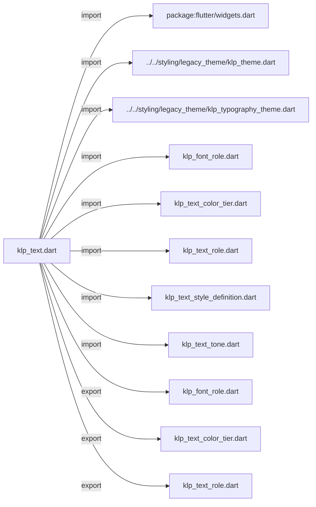
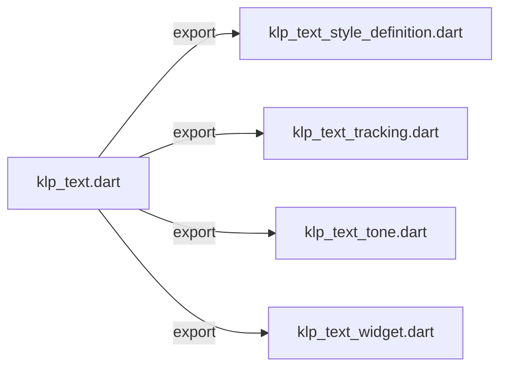
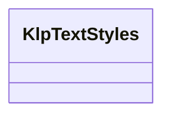

# klp_text.dart：直接依賴與宣告架構

[回到目錄](README.md) · [來源檔案](../../../../../lib/src/foundation/content/klp_text.dart)

## 範圍

核心是 `lib/src/foundation/content/klp_text.dart`。主要視角為該檔案明寫的 import／export／part；輔助視角為本檔宣告及 extends／implements／with／on 關係。只展開一層外部邊界。

## 直接依賴圖

## 依賴證據

| 關係 | 原始 directive | 來源 |
|---|---|---|
| import | <code>import &#x27;package:flutter/widgets.dart&#x27;;</code> | [lib/src/foundation/content/klp_text.dart:1](../../../../../lib/src/foundation/content/klp_text.dart#L1) |
| import | <code>import &#x27;../../styling/legacy_theme/klp_theme.dart&#x27;;</code> | [lib/src/foundation/content/klp_text.dart:3](../../../../../lib/src/foundation/content/klp_text.dart#L3) |
| import | <code>import &#x27;../../styling/legacy_theme/klp_typography_theme.dart&#x27;;</code> | [lib/src/foundation/content/klp_text.dart:4](../../../../../lib/src/foundation/content/klp_text.dart#L4) |
| import | <code>import &#x27;klp_font_role.dart&#x27;;</code> | [lib/src/foundation/content/klp_text.dart:5](../../../../../lib/src/foundation/content/klp_text.dart#L5) |
| import | <code>import &#x27;klp_text_color_tier.dart&#x27;;</code> | [lib/src/foundation/content/klp_text.dart:6](../../../../../lib/src/foundation/content/klp_text.dart#L6) |
| import | <code>import &#x27;klp_text_role.dart&#x27;;</code> | [lib/src/foundation/content/klp_text.dart:7](../../../../../lib/src/foundation/content/klp_text.dart#L7) |
| import | <code>import &#x27;klp_text_style_definition.dart&#x27;;</code> | [lib/src/foundation/content/klp_text.dart:8](../../../../../lib/src/foundation/content/klp_text.dart#L8) |
| import | <code>import &#x27;klp_text_tone.dart&#x27;;</code> | [lib/src/foundation/content/klp_text.dart:9](../../../../../lib/src/foundation/content/klp_text.dart#L9) |
| export | <code>export &#x27;klp_font_role.dart&#x27;;</code> | [lib/src/foundation/content/klp_text.dart:11](../../../../../lib/src/foundation/content/klp_text.dart#L11) |
| export | <code>export &#x27;klp_text_color_tier.dart&#x27;;</code> | [lib/src/foundation/content/klp_text.dart:12](../../../../../lib/src/foundation/content/klp_text.dart#L12) |
| export | <code>export &#x27;klp_text_role.dart&#x27;;</code> | [lib/src/foundation/content/klp_text.dart:13](../../../../../lib/src/foundation/content/klp_text.dart#L13) |
| export | <code>export &#x27;klp_text_style_definition.dart&#x27;;</code> | [lib/src/foundation/content/klp_text.dart:14](../../../../../lib/src/foundation/content/klp_text.dart#L14) |
| export | <code>export &#x27;klp_text_tracking.dart&#x27;;</code> | [lib/src/foundation/content/klp_text.dart:15](../../../../../lib/src/foundation/content/klp_text.dart#L15) |
| export | <code>export &#x27;klp_text_tone.dart&#x27;;</code> | [lib/src/foundation/content/klp_text.dart:16](../../../../../lib/src/foundation/content/klp_text.dart#L16) |
| export | <code>export &#x27;klp_text_widget.dart&#x27;;</code> | [lib/src/foundation/content/klp_text.dart:17](../../../../../lib/src/foundation/content/klp_text.dart#L17) |

## 宣告關係圖

本組節點是本檔宣告；沒有箭頭的宣告未在此圖主張互相依賴。

## 宣告與成員證據

成員包含 public 與 private；簽章取自來源，省略函式本體與欄位初始值。`(inferred)` 表示來源未明寫型別；建構子只顯示參數部分，不含初始化列表。

### KlpTextStyles

ClassDeclaration · public · [lib/src/foundation/content/klp_text.dart:19](../../../../../lib/src/foundation/content/klp_text.dart#L19)

<code>abstract final class KlpTextStyles</code>

來源註解摘要：把 [KlpTextRole] 解析成具體樣式與顏色的靜態工具集合。[KlpText] 內部就是 透過這個類別取得樣式，只有要繞過 [KlpText]（例如自訂 `RichText`）時才需要 直接呼叫 [definitionOf] 或 [colorFor]。

| 成員 | 可見性 | 簽章／型別 | 來源註解摘要 | 證據 |
|---|---|---|---|---|
| method <code>definitionsFor</code> | public | <code>static Map&lt;KlpTextRole, KlpTextStyleDefinition&gt; definitionsFor( KlpTypographyTheme type, )</code> | 字級與行高由 theme 決定，因此不能是編譯期常數的 map。 | [lib/src/foundation/content/klp_text.dart:23](../../../../../lib/src/foundation/content/klp_text.dart#L23) |
| method <code>definitionOf</code> | public | <code>static KlpTextStyleDefinition definitionOf( KlpTextRole role, KlpTypographyTheme type, )</code> |  | [lib/src/foundation/content/klp_text.dart:175](../../../../../lib/src/foundation/content/klp_text.dart#L175) |
| field <code>tiers</code> | public | <code>static const Map&lt;KlpTextRole, KlpTextColorTier&gt; tiers</code> | 角色對應的色階預設皆為 prominent（淺色最黑 ink900，深色最白 ink50）。 只有註解與說明 explicitly 傳入 tone 時才套用 muted / faint。 | [lib/src/foundation/content/klp_text.dart:184](../../../../../lib/src/foundation/content/klp_text.dart#L184) |
| method <code>colorFor</code> | public | <code>static Color colorFor( KlpThemeData tokens, { required KlpTextRole role, KlpTextTone tone = KlpTextTone.automatic, Color? requestedColor, })</code> |  | [lib/src/foundation/content/klp_text.dart:209](../../../../../lib/src/foundation/content/klp_text.dart#L209) |
| method <code>_tierForTone</code> | private | <code>static KlpTextColorTier _tierForTone(KlpTextRole role, KlpTextTone tone)</code> |  | [lib/src/foundation/content/klp_text.dart:227](../../../../../lib/src/foundation/content/klp_text.dart#L227) |

## 閱讀說明與限制

箭頭只表示來源明寫的靜態關係；import 不等於呼叫。未分析動態呼叫、欄位的實際物件擁有權、狀態轉移或渲染流程；型別未進行語意解析，繼承目標保留原始型別拼寫。public／private 依 Dart 名稱前綴判斷；public 宣告不代表已由 `lib/kallopis.dart` 匯出。

本頁由 `tool/architecture_atlas` 產生；編輯來源或生成工具後重新產生，避免手改本頁。
