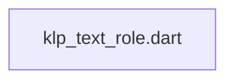
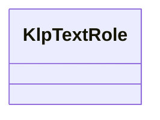

# klp_text_role.dart：直接依賴與宣告架構

[回到目錄](README.md) · [來源檔案](../../../../../lib/src/foundation/content/klp_text_role.dart)

## 範圍

核心是 `lib/src/foundation/content/klp_text_role.dart`。主要視角為該檔案明寫的 import／export／part；輔助視角為本檔宣告及 extends／implements／with／on 關係。只展開一層外部邊界。

## 直接依賴圖

## 依賴證據

| 關係 | 原始 directive | 來源 |
|---|---|---|
| 無 | 本檔未宣告 import／export／part | [lib/src/foundation/content/klp_text_role.dart:1](../../../../../lib/src/foundation/content/klp_text_role.dart#L1) |

## 宣告關係圖

本組節點是本檔宣告；沒有箭頭的宣告未在此圖主張互相依賴。

## 宣告與成員證據

成員包含 public 與 private；簽章取自來源，省略函式本體與欄位初始值。`(inferred)` 表示來源未明寫型別；建構子只顯示參數部分，不含初始化列表。

### KlpTextRole

EnumDeclaration · public · [lib/src/foundation/content/klp_text_role.dart:1](../../../../../lib/src/foundation/content/klp_text_role.dart#L1)

<code>enum KlpTextRole</code>

來源註解摘要：文字的語意角色，由 theme 決定對應字級、行高、字重與字族。

| 成員 | 可見性 | 簽章／型別 | 來源註解摘要 | 證據 |
|---|---|---|---|---|
| enum value <code>display</code> | public | <code>display</code> |  | [lib/src/foundation/content/klp_text_role.dart:3](../../../../../lib/src/foundation/content/klp_text_role.dart#L3) |
| enum value <code>h1</code> | public | <code>h1</code> |  | [lib/src/foundation/content/klp_text_role.dart:4](../../../../../lib/src/foundation/content/klp_text_role.dart#L4) |
| enum value <code>h2</code> | public | <code>h2</code> |  | [lib/src/foundation/content/klp_text_role.dart:5](../../../../../lib/src/foundation/content/klp_text_role.dart#L5) |
| enum value <code>h3</code> | public | <code>h3</code> |  | [lib/src/foundation/content/klp_text_role.dart:6](../../../../../lib/src/foundation/content/klp_text_role.dart#L6) |
| enum value <code>h4</code> | public | <code>h4</code> |  | [lib/src/foundation/content/klp_text_role.dart:7](../../../../../lib/src/foundation/content/klp_text_role.dart#L7) |
| enum value <code>lead</code> | public | <code>lead</code> |  | [lib/src/foundation/content/klp_text_role.dart:8](../../../../../lib/src/foundation/content/klp_text_role.dart#L8) |
| enum value <code>body</code> | public | <code>body</code> |  | [lib/src/foundation/content/klp_text_role.dart:9](../../../../../lib/src/foundation/content/klp_text_role.dart#L9) |
| enum value <code>sub</code> | public | <code>sub</code> |  | [lib/src/foundation/content/klp_text_role.dart:10](../../../../../lib/src/foundation/content/klp_text_role.dart#L10) |
| enum value <code>caption</code> | public | <code>caption</code> |  | [lib/src/foundation/content/klp_text_role.dart:11](../../../../../lib/src/foundation/content/klp_text_role.dart#L11) |
| enum value <code>captionStrong</code> | public | <code>captionStrong</code> |  | [lib/src/foundation/content/klp_text_role.dart:12](../../../../../lib/src/foundation/content/klp_text_role.dart#L12) |
| enum value <code>monoCaptionStrong</code> | public | <code>monoCaptionStrong</code> |  | [lib/src/foundation/content/klp_text_role.dart:13](../../../../../lib/src/foundation/content/klp_text_role.dart#L13) |
| enum value <code>micro</code> | public | <code>micro</code> |  | [lib/src/foundation/content/klp_text_role.dart:14](../../../../../lib/src/foundation/content/klp_text_role.dart#L14) |
| enum value <code>title</code> | public | <code>title</code> |  | [lib/src/foundation/content/klp_text_role.dart:15](../../../../../lib/src/foundation/content/klp_text_role.dart#L15) |
| enum value <code>section</code> | public | <code>section</code> |  | [lib/src/foundation/content/klp_text_role.dart:16](../../../../../lib/src/foundation/content/klp_text_role.dart#L16) |
| enum value <code>editor</code> | public | <code>editor</code> |  | [lib/src/foundation/content/klp_text_role.dart:17](../../../../../lib/src/foundation/content/klp_text_role.dart#L17) |
| enum value <code>terminal</code> | public | <code>terminal</code> |  | [lib/src/foundation/content/klp_text_role.dart:18](../../../../../lib/src/foundation/content/klp_text_role.dart#L18) |
| enum value <code>bodyStrong</code> | public | <code>bodyStrong</code> |  | [lib/src/foundation/content/klp_text_role.dart:19](../../../../../lib/src/foundation/content/klp_text_role.dart#L19) |
| enum value <code>appTitle</code> | public | <code>appTitle</code> |  | [lib/src/foundation/content/klp_text_role.dart:20](../../../../../lib/src/foundation/content/klp_text_role.dart#L20) |
| enum value <code>header</code> | public | <code>header</code> |  | [lib/src/foundation/content/klp_text_role.dart:21](../../../../../lib/src/foundation/content/klp_text_role.dart#L21) |
| enum value <code>status</code> | public | <code>status</code> |  | [lib/src/foundation/content/klp_text_role.dart:22](../../../../../lib/src/foundation/content/klp_text_role.dart#L22) |
| enum value <code>label</code> | public | <code>label</code> |  | [lib/src/foundation/content/klp_text_role.dart:23](../../../../../lib/src/foundation/content/klp_text_role.dart#L23) |
| enum value <code>code</code> | public | <code>code</code> |  | [lib/src/foundation/content/klp_text_role.dart:24](../../../../../lib/src/foundation/content/klp_text_role.dart#L24) |

## 閱讀說明與限制

箭頭只表示來源明寫的靜態關係；import 不等於呼叫。未分析動態呼叫、欄位的實際物件擁有權、狀態轉移或渲染流程；型別未進行語意解析，繼承目標保留原始型別拼寫。public／private 依 Dart 名稱前綴判斷；public 宣告不代表已由 `lib/kallopis.dart` 匯出。

本頁由 `tool/architecture_atlas` 產生；編輯來源或生成工具後重新產生，避免手改本頁。
