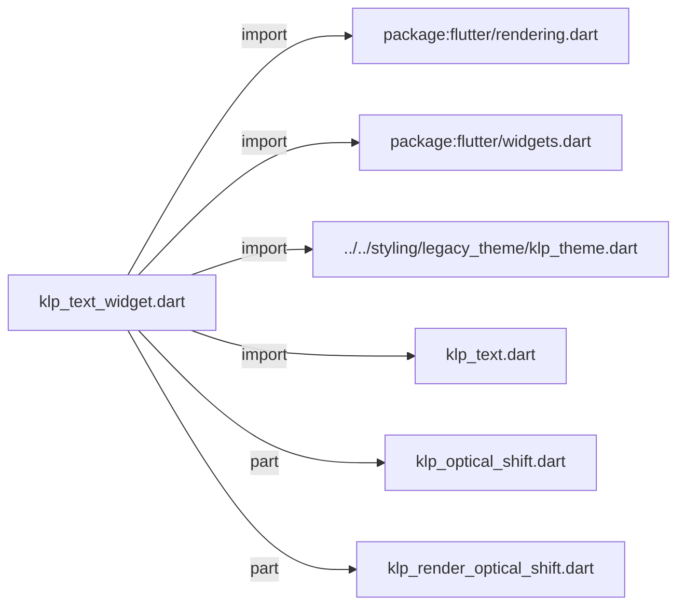
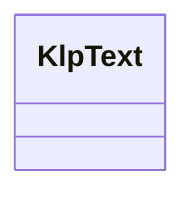
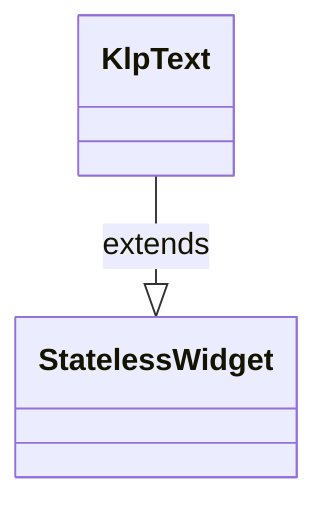

# klp_text_widget.dart：直接依賴與宣告架構

[回到目錄](README.md) · [來源檔案](../../../../../lib/src/foundation/content/klp_text_widget.dart)

## 範圍

核心是 `lib/src/foundation/content/klp_text_widget.dart`。主要視角為該檔案明寫的 import／export／part；輔助視角為本檔宣告及 extends／implements／with／on 關係。只展開一層外部邊界。

## 直接依賴圖

## 依賴證據

| 關係 | 原始 directive | 來源 |
|---|---|---|
| import | <code>import &#x27;package:flutter/rendering.dart&#x27;;</code> | [lib/src/foundation/content/klp_text_widget.dart:1](../../../../../lib/src/foundation/content/klp_text_widget.dart#L1) |
| import | <code>import &#x27;package:flutter/widgets.dart&#x27;;</code> | [lib/src/foundation/content/klp_text_widget.dart:2](../../../../../lib/src/foundation/content/klp_text_widget.dart#L2) |
| import | <code>import &#x27;../../styling/legacy_theme/klp_theme.dart&#x27;;</code> | [lib/src/foundation/content/klp_text_widget.dart:4](../../../../../lib/src/foundation/content/klp_text_widget.dart#L4) |
| import | <code>import &#x27;klp_text.dart&#x27;;</code> | [lib/src/foundation/content/klp_text_widget.dart:5](../../../../../lib/src/foundation/content/klp_text_widget.dart#L5) |
| part | <code>part &#x27;klp_optical_shift.dart&#x27;;</code> | [lib/src/foundation/content/klp_text_widget.dart:7](../../../../../lib/src/foundation/content/klp_text_widget.dart#L7) |
| part | <code>part &#x27;klp_render_optical_shift.dart&#x27;;</code> | [lib/src/foundation/content/klp_text_widget.dart:8](../../../../../lib/src/foundation/content/klp_text_widget.dart#L8) |

## 宣告關係圖

本組節點是本檔宣告；沒有箭頭的宣告未在此圖主張互相依賴。

## 宣告與成員證據

成員包含 public 與 private；簽章取自來源，省略函式本體與欄位初始值。`(inferred)` 表示來源未明寫型別；建構子只顯示參數部分，不含初始化列表。

### KlpText

ClassDeclaration · public · [lib/src/foundation/content/klp_text_widget.dart:10](../../../../../lib/src/foundation/content/klp_text_widget.dart#L10)

<code>class KlpText extends StatelessWidget</code>

來源註解摘要：以語意角色指定樣式的文字原語。

- `extends` → <code>StatelessWidget</code>：[lib/src/foundation/content/klp_text_widget.dart:11](../../../../../lib/src/foundation/content/klp_text_widget.dart#L11)

| 成員 | 可見性 | 簽章／型別 | 來源註解摘要 | 證據 |
|---|---|---|---|---|
| constructor <code>KlpText</code> | public | <code>const KlpText( this.data, { super.key, this.role = KlpTextRole.body, this.tone = KlpTextTone.automatic, this.maxLines, this.overflow, this.textAlign, this.color, this.decoration, this.ellipsisText, this.excludeFromSemantics = false, this.tracking, this.applyOpticalShift = true, })</code> |  | [lib/src/foundation/content/klp_text_widget.dart:12](../../../../../lib/src/foundation/content/klp_text_widget.dart#L12) |
| field <code>data</code> | public | <code>final String data</code> |  | [lib/src/foundation/content/klp_text_widget.dart:31](../../../../../lib/src/foundation/content/klp_text_widget.dart#L31) |
| field <code>role</code> | public | <code>final KlpTextRole role</code> |  | [lib/src/foundation/content/klp_text_widget.dart:32](../../../../../lib/src/foundation/content/klp_text_widget.dart#L32) |
| field <code>tone</code> | public | <code>final KlpTextTone tone</code> |  | [lib/src/foundation/content/klp_text_widget.dart:33](../../../../../lib/src/foundation/content/klp_text_widget.dart#L33) |
| field <code>maxLines</code> | public | <code>final int? maxLines</code> |  | [lib/src/foundation/content/klp_text_widget.dart:34](../../../../../lib/src/foundation/content/klp_text_widget.dart#L34) |
| field <code>overflow</code> | public | <code>final TextOverflow? overflow</code> |  | [lib/src/foundation/content/klp_text_widget.dart:35](../../../../../lib/src/foundation/content/klp_text_widget.dart#L35) |
| field <code>textAlign</code> | public | <code>final TextAlign? textAlign</code> |  | [lib/src/foundation/content/klp_text_widget.dart:36](../../../../../lib/src/foundation/content/klp_text_widget.dart#L36) |
| field <code>color</code> | public | <code>final Color? color</code> |  | [lib/src/foundation/content/klp_text_widget.dart:37](../../../../../lib/src/foundation/content/klp_text_widget.dart#L37) |
| field <code>decoration</code> | public | <code>final TextDecoration? decoration</code> |  | [lib/src/foundation/content/klp_text_widget.dart:38](../../../../../lib/src/foundation/content/klp_text_widget.dart#L38) |
| field <code>ellipsisText</code> | public | <code>final String? ellipsisText</code> |  | [lib/src/foundation/content/klp_text_widget.dart:39](../../../../../lib/src/foundation/content/klp_text_widget.dart#L39) |
| field <code>excludeFromSemantics</code> | public | <code>final bool excludeFromSemantics</code> |  | [lib/src/foundation/content/klp_text_widget.dart:40](../../../../../lib/src/foundation/content/klp_text_widget.dart#L40) |
| field <code>tracking</code> | public | <code>final KlpTextTracking? tracking</code> |  | [lib/src/foundation/content/klp_text_widget.dart:41](../../../../../lib/src/foundation/content/klp_text_widget.dart#L41) |
| field <code>applyOpticalShift</code> | public | <code>final bool applyOpticalShift</code> |  | [lib/src/foundation/content/klp_text_widget.dart:42](../../../../../lib/src/foundation/content/klp_text_widget.dart#L42) |
| method <code>build</code> | public | <code>Widget build(BuildContext context)</code> |  | [lib/src/foundation/content/klp_text_widget.dart:44](../../../../../lib/src/foundation/content/klp_text_widget.dart#L44) |
| method <code>_resolveVisibleData</code> | private | <code>String _resolveVisibleData( BuildContext context, BoxConstraints constraints, TextStyle style, )</code> |  | [lib/src/foundation/content/klp_text_widget.dart:105](../../../../../lib/src/foundation/content/klp_text_widget.dart#L105) |
| method <code>_fits</code> | private | <code>bool _fits( BuildContext context, String value, BoxConstraints constraints, TextStyle style, )</code> |  | [lib/src/foundation/content/klp_text_widget.dart:133](../../../../../lib/src/foundation/content/klp_text_widget.dart#L133) |

## 閱讀說明與限制

箭頭只表示來源明寫的靜態關係；import 不等於呼叫。未分析動態呼叫、欄位的實際物件擁有權、狀態轉移或渲染流程；型別未進行語意解析，繼承目標保留原始型別拼寫。public／private 依 Dart 名稱前綴判斷；public 宣告不代表已由 `lib/kallopis.dart` 匯出。

本頁由 `tool/architecture_atlas` 產生；編輯來源或生成工具後重新產生，避免手改本頁。
