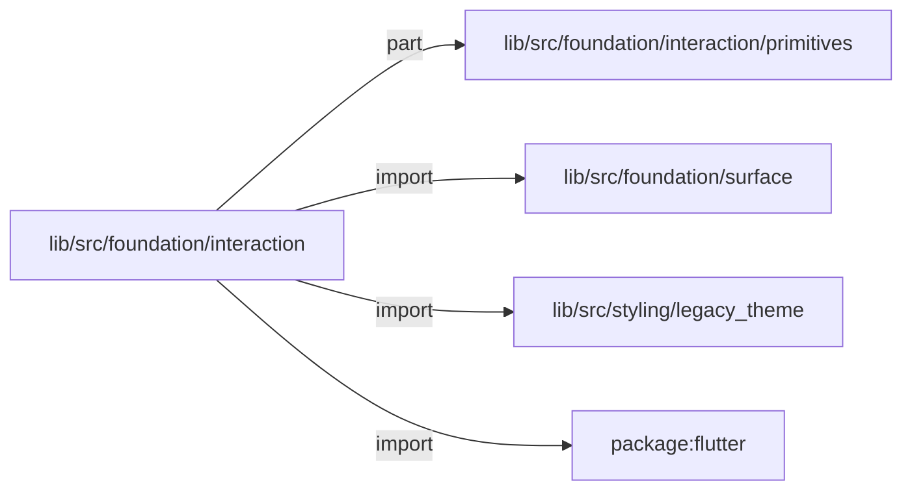
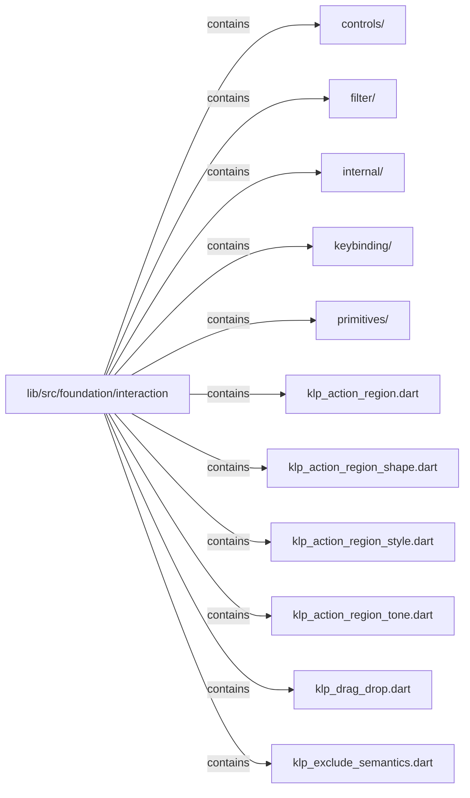
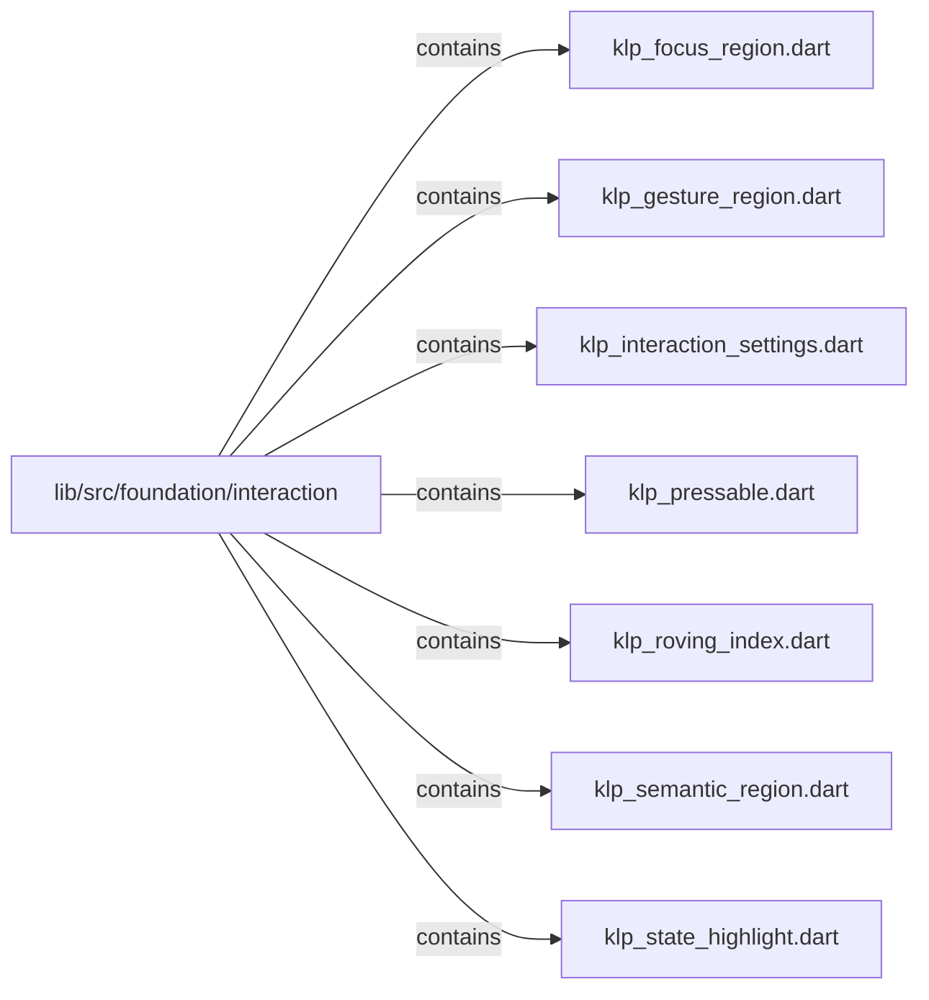

# lib/src/foundation/interaction：架構分析入口

[上一層](../README.md)

## 範圍

閱讀 `lib/src/foundation/interaction` 的直接子目錄與 Dart 檔案。結構圖表示實際檔案包含關係；依賴圖表示本層檔案明寫的 directives。每個檔案頁另列直接依賴、宣告、欄位、方法、建構子及行號證據。

## 本層直接依賴圖

箭頭以本層 Dart 檔案明寫的 directive 彙總到目標所在目錄或外部套件邊界；不遞迴將子目錄依賴算入本層。相同目標的不同 directive 類型分開計數。

| 目標邊界 | 關係 | directive 數 | 第一筆來源證據 |
|---|---|---|---|
| <code>lib/src/foundation/interaction/primitives</code> | part | 1 | [lib/src/foundation/interaction/klp_action_region.dart:8](../../../../../lib/src/foundation/interaction/klp_action_region.dart#L8) |
| <code>lib/src/foundation/surface</code> | import | 2 | [lib/src/foundation/interaction/klp_drag_drop.dart:4](../../../../../lib/src/foundation/interaction/klp_drag_drop.dart#L4) |
| <code>lib/src/styling/legacy_theme</code> | import | 6 | [lib/src/foundation/interaction/klp_action_region.dart:3](../../../../../lib/src/foundation/interaction/klp_action_region.dart#L3) |
| <code>package:flutter</code> | import | 10 | [lib/src/foundation/interaction/klp_action_region.dart:1](../../../../../lib/src/foundation/interaction/klp_action_region.dart#L1) |

### 同目錄依賴

| 來源 → 目標 | 關係 | 證據 |
|---|---|---|
| <code>klp_action_region.dart → klp_action_region_shape.dart</code> | import | [lib/src/foundation/interaction/klp_action_region.dart:4](../../../../../lib/src/foundation/interaction/klp_action_region.dart#L4) |
| <code>klp_action_region.dart → klp_action_region_style.dart</code> | import | [lib/src/foundation/interaction/klp_action_region.dart:5](../../../../../lib/src/foundation/interaction/klp_action_region.dart#L5) |
| <code>klp_action_region.dart → klp_action_region_tone.dart</code> | import | [lib/src/foundation/interaction/klp_action_region.dart:6](../../../../../lib/src/foundation/interaction/klp_action_region.dart#L6) |
| <code>klp_pressable.dart → klp_interaction_settings.dart</code> | import | [lib/src/foundation/interaction/klp_pressable.dart:3](../../../../../lib/src/foundation/interaction/klp_pressable.dart#L3) |

## 目錄結構圖

## 子目錄

| 目錄 | 導航 | 來源證據 |
|---|---|---|
| `controls/` | [架構入口](controls/README.md) | [來源目錄](../../../../../lib/src/foundation/interaction/controls) |
| `filter/` | [架構入口](filter/README.md) | [來源目錄](../../../../../lib/src/foundation/interaction/filter) |
| `internal/` | [架構入口](internal/README.md) | [來源目錄](../../../../../lib/src/foundation/interaction/internal) |
| `keybinding/` | [架構入口](keybinding/README.md) | [來源目錄](../../../../../lib/src/foundation/interaction/keybinding) |
| `primitives/` | [架構入口](primitives/README.md) | [來源目錄](../../../../../lib/src/foundation/interaction/primitives) |

## 本層檔案

| 檔案 | 宣告 | 細節 | 來源證據 |
|---|---|---|---|
| `klp_action_region.dart` | 無頂層宣告 | [架構與 API](klp_action_region.md) | [lib/src/foundation/interaction/klp_action_region.dart:1](../../../../../lib/src/foundation/interaction/klp_action_region.dart#L1) |
| `klp_action_region_shape.dart` | KlpActionRegionShape | [架構與 API](klp_action_region_shape.md) | [lib/src/foundation/interaction/klp_action_region_shape.dart:1](../../../../../lib/src/foundation/interaction/klp_action_region_shape.dart#L1) |
| `klp_action_region_style.dart` | KlpActionRegionStyle | [架構與 API](klp_action_region_style.md) | [lib/src/foundation/interaction/klp_action_region_style.dart:1](../../../../../lib/src/foundation/interaction/klp_action_region_style.dart#L1) |
| `klp_action_region_tone.dart` | KlpActionRegionTone | [架構與 API](klp_action_region_tone.md) | [lib/src/foundation/interaction/klp_action_region_tone.dart:1](../../../../../lib/src/foundation/interaction/klp_action_region_tone.dart#L1) |
| `klp_drag_drop.dart` | KlpDropTarget, KlpDragPreview, KlpDropIndicator | [架構與 API](klp_drag_drop.md) | [lib/src/foundation/interaction/klp_drag_drop.dart:1](../../../../../lib/src/foundation/interaction/klp_drag_drop.dart#L1) |
| `klp_exclude_semantics.dart` | KlpExcludeSemantics | [架構與 API](klp_exclude_semantics.md) | [lib/src/foundation/interaction/klp_exclude_semantics.dart:1](../../../../../lib/src/foundation/interaction/klp_exclude_semantics.dart#L1) |
| `klp_focus_region.dart` | KlpFocusRegion | [架構與 API](klp_focus_region.md) | [lib/src/foundation/interaction/klp_focus_region.dart:1](../../../../../lib/src/foundation/interaction/klp_focus_region.dart#L1) |
| `klp_gesture_region.dart` | KlpGestureRegion | [架構與 API](klp_gesture_region.md) | [lib/src/foundation/interaction/klp_gesture_region.dart:1](../../../../../lib/src/foundation/interaction/klp_gesture_region.dart#L1) |
| `klp_interaction_settings.dart` | KlpInteractionSettings, KlpInteractionSettingsContext | [架構與 API](klp_interaction_settings.md) | [lib/src/foundation/interaction/klp_interaction_settings.dart:1](../../../../../lib/src/foundation/interaction/klp_interaction_settings.dart#L1) |
| `klp_pressable.dart` | KlpPressable, _KlpPressableState | [架構與 API](klp_pressable.md) | [lib/src/foundation/interaction/klp_pressable.dart:1](../../../../../lib/src/foundation/interaction/klp_pressable.dart#L1) |
| `klp_roving_index.dart` | KlpRovingIndex | [架構與 API](klp_roving_index.md) | [lib/src/foundation/interaction/klp_roving_index.dart:1](../../../../../lib/src/foundation/interaction/klp_roving_index.dart#L1) |
| `klp_semantic_region.dart` | KlpSemanticRegion | [架構與 API](klp_semantic_region.md) | [lib/src/foundation/interaction/klp_semantic_region.dart:1](../../../../../lib/src/foundation/interaction/klp_semantic_region.dart#L1) |
| `klp_state_highlight.dart` | KlpHighlightState, KlpStateHighlight | [架構與 API](klp_state_highlight.md) | [lib/src/foundation/interaction/klp_state_highlight.dart:1](../../../../../lib/src/foundation/interaction/klp_state_highlight.dart#L1) |

## 閱讀說明

箭頭只表示來源明寫的靜態關係；import 不等於呼叫。未分析動態呼叫、欄位的實際物件擁有權、狀態轉移或渲染流程；型別未進行語意解析，繼承目標保留原始型別拼寫。public／private 依 Dart 名稱前綴判斷；public 宣告不代表已由 `lib/kallopis.dart` 匯出。

本頁的目錄與檔案由來源清冊產生；`manifest.json` 位於本圖集根目錄，可核對 SHA-256 與覆蓋數。人工模組摘要存於 `tool/architecture_atlas/briefs/`，重新生成時保留。
