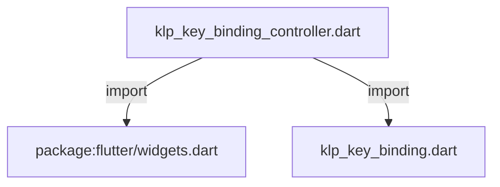
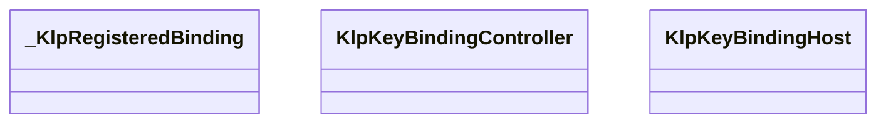
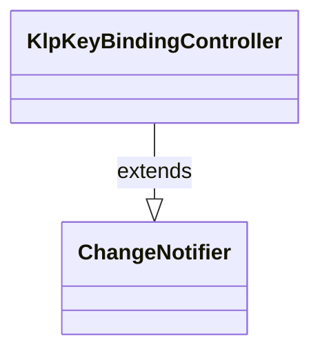
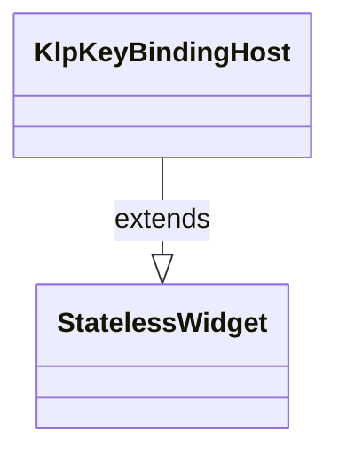

# klp_key_binding_controller.dart：直接依賴與宣告架構

[回到目錄](README.md) · [來源檔案](../../../../../../lib/src/foundation/interaction/keybinding/klp_key_binding_controller.dart)

## 範圍

核心是 `lib/src/foundation/interaction/keybinding/klp_key_binding_controller.dart`。主要視角為該檔案明寫的 import／export／part；輔助視角為本檔宣告及 extends／implements／with／on 關係。只展開一層外部邊界。

## 直接依賴圖

## 依賴證據

| 關係 | 原始 directive | 來源 |
|---|---|---|
| import | <code>import &#x27;package:flutter/widgets.dart&#x27;;</code> | [lib/src/foundation/interaction/keybinding/klp_key_binding_controller.dart:1](../../../../../../lib/src/foundation/interaction/keybinding/klp_key_binding_controller.dart#L1) |
| import | <code>import &#x27;klp_key_binding.dart&#x27;;</code> | [lib/src/foundation/interaction/keybinding/klp_key_binding_controller.dart:3](../../../../../../lib/src/foundation/interaction/keybinding/klp_key_binding_controller.dart#L3) |

## 宣告關係圖

本組節點是本檔宣告；沒有箭頭的宣告未在此圖主張互相依賴。

## 宣告與成員證據

成員包含 public 與 private；簽章取自來源，省略函式本體與欄位初始值。`(inferred)` 表示來源未明寫型別；建構子只顯示參數部分，不含初始化列表。

### KlpKeyBindingAction

GenericTypeAlias · public · [lib/src/foundation/interaction/keybinding/klp_key_binding_controller.dart:5](../../../../../../lib/src/foundation/interaction/keybinding/klp_key_binding_controller.dart#L5)

<code>typedef KlpKeyBindingAction = VoidCallback;</code>

### _KlpRegisteredBinding

ClassDeclaration · private · [lib/src/foundation/interaction/keybinding/klp_key_binding_controller.dart:7](../../../../../../lib/src/foundation/interaction/keybinding/klp_key_binding_controller.dart#L7)

<code>class _KlpRegisteredBinding</code>

| 成員 | 可見性 | 簽章／型別 | 來源註解摘要 | 證據 |
|---|---|---|---|---|
| constructor <code>_KlpRegisteredBinding</code> | private | <code>const _KlpRegisteredBinding(this.binding, this.action)</code> |  | [lib/src/foundation/interaction/keybinding/klp_key_binding_controller.dart:8](../../../../../../lib/src/foundation/interaction/keybinding/klp_key_binding_controller.dart#L8) |
| field <code>binding</code> | public | <code>final KlpKeyBinding binding</code> |  | [lib/src/foundation/interaction/keybinding/klp_key_binding_controller.dart:10](../../../../../../lib/src/foundation/interaction/keybinding/klp_key_binding_controller.dart#L10) |
| field <code>action</code> | public | <code>final KlpKeyBindingAction action</code> |  | [lib/src/foundation/interaction/keybinding/klp_key_binding_controller.dart:11](../../../../../../lib/src/foundation/interaction/keybinding/klp_key_binding_controller.dart#L11) |

### KlpKeyBindingController

ClassDeclaration · public · [lib/src/foundation/interaction/keybinding/klp_key_binding_controller.dart:14](../../../../../../lib/src/foundation/interaction/keybinding/klp_key_binding_controller.dart#L14)

<code>class KlpKeyBindingController extends ChangeNotifier</code>

來源註解摘要：App 內唯一的快捷鍵註冊與 scope 解析器。

- `extends` → <code>ChangeNotifier</code>：[lib/src/foundation/interaction/keybinding/klp_key_binding_controller.dart:15](../../../../../../lib/src/foundation/interaction/keybinding/klp_key_binding_controller.dart#L15)

| 成員 | 可見性 | 簽章／型別 | 來源註解摘要 | 證據 |
|---|---|---|---|---|
| field <code>_bindings</code> | private | <code>final List&lt;_KlpRegisteredBinding&gt; _bindings</code> |  | [lib/src/foundation/interaction/keybinding/klp_key_binding_controller.dart:16](../../../../../../lib/src/foundation/interaction/keybinding/klp_key_binding_controller.dart#L16) |
| field <code>_activePageId</code> | private | <code>String? _activePageId</code> |  | [lib/src/foundation/interaction/keybinding/klp_key_binding_controller.dart:17](../../../../../../lib/src/foundation/interaction/keybinding/klp_key_binding_controller.dart#L17) |
| field <code>_activeRegionId</code> | private | <code>String? _activeRegionId</code> |  | [lib/src/foundation/interaction/keybinding/klp_key_binding_controller.dart:18](../../../../../../lib/src/foundation/interaction/keybinding/klp_key_binding_controller.dart#L18) |
| getter <code>activePageId</code> | public | <code>String? get activePageId</code> |  | [lib/src/foundation/interaction/keybinding/klp_key_binding_controller.dart:20](../../../../../../lib/src/foundation/interaction/keybinding/klp_key_binding_controller.dart#L20) |
| getter <code>activeRegionId</code> | public | <code>String? get activeRegionId</code> |  | [lib/src/foundation/interaction/keybinding/klp_key_binding_controller.dart:21](../../../../../../lib/src/foundation/interaction/keybinding/klp_key_binding_controller.dart#L21) |
| method <code>register</code> | public | <code>VoidCallback register({ required KlpKeyBinding binding, required KlpKeyBindingAction action, })</code> | 註冊快捷鍵，回傳可保存的解除註冊函式。 | [lib/src/foundation/interaction/keybinding/klp_key_binding_controller.dart:23](../../../../../../lib/src/foundation/interaction/keybinding/klp_key_binding_controller.dart#L23) |
| method <code>activatePage</code> | public | <code>void activatePage(String? pageId)</code> |  | [lib/src/foundation/interaction/keybinding/klp_key_binding_controller.dart:36](../../../../../../lib/src/foundation/interaction/keybinding/klp_key_binding_controller.dart#L36) |
| method <code>activateRegion</code> | public | <code>void activateRegion({required String regionId, String? pageId})</code> |  | [lib/src/foundation/interaction/keybinding/klp_key_binding_controller.dart:43](../../../../../../lib/src/foundation/interaction/keybinding/klp_key_binding_controller.dart#L43) |
| method <code>clearRegion</code> | public | <code>void clearRegion(String regionId)</code> |  | [lib/src/foundation/interaction/keybinding/klp_key_binding_controller.dart:50](../../../../../../lib/src/foundation/interaction/keybinding/klp_key_binding_controller.dart#L50) |
| getter <code>shortcuts</code> | public | <code>Map&lt;ShortcutActivator, Intent&gt; get shortcuts</code> |  | [lib/src/foundation/interaction/keybinding/klp_key_binding_controller.dart:56](../../../../../../lib/src/foundation/interaction/keybinding/klp_key_binding_controller.dart#L56) |
| getter <code>actions</code> | public | <code>Map&lt;Type, Action&lt;Intent&gt;&gt; get actions</code> |  | [lib/src/foundation/interaction/keybinding/klp_key_binding_controller.dart:64](../../../../../../lib/src/foundation/interaction/keybinding/klp_key_binding_controller.dart#L64) |
| method <code>invoke</code> | public | <code>void invoke(String commandId)</code> |  | [lib/src/foundation/interaction/keybinding/klp_key_binding_controller.dart:75](../../../../../../lib/src/foundation/interaction/keybinding/klp_key_binding_controller.dart#L75) |
| getter <code>_resolvedBindings</code> | private | <code>List&lt;_KlpRegisteredBinding&gt; get _resolvedBindings</code> |  | [lib/src/foundation/interaction/keybinding/klp_key_binding_controller.dart:84](../../../../../../lib/src/foundation/interaction/keybinding/klp_key_binding_controller.dart#L84) |

### KlpKeyBindingHost

ClassDeclaration · public · [lib/src/foundation/interaction/keybinding/klp_key_binding_controller.dart:101](../../../../../../lib/src/foundation/interaction/keybinding/klp_key_binding_controller.dart#L101)

<code>class KlpKeyBindingHost extends StatelessWidget</code>

來源註解摘要：將 controller 的目前 scope 接到 Flutter Shortcuts／Actions。

- `extends` → <code>StatelessWidget</code>：[lib/src/foundation/interaction/keybinding/klp_key_binding_controller.dart:102](../../../../../../lib/src/foundation/interaction/keybinding/klp_key_binding_controller.dart#L102)

| 成員 | 可見性 | 簽章／型別 | 來源註解摘要 | 證據 |
|---|---|---|---|---|
| constructor <code>KlpKeyBindingHost</code> | public | <code>const KlpKeyBindingHost({super.key, required this.controller, required this.child})</code> |  | [lib/src/foundation/interaction/keybinding/klp_key_binding_controller.dart:103](../../../../../../lib/src/foundation/interaction/keybinding/klp_key_binding_controller.dart#L103) |
| field <code>controller</code> | public | <code>final KlpKeyBindingController controller</code> |  | [lib/src/foundation/interaction/keybinding/klp_key_binding_controller.dart:105](../../../../../../lib/src/foundation/interaction/keybinding/klp_key_binding_controller.dart#L105) |
| field <code>child</code> | public | <code>final Widget child</code> |  | [lib/src/foundation/interaction/keybinding/klp_key_binding_controller.dart:106](../../../../../../lib/src/foundation/interaction/keybinding/klp_key_binding_controller.dart#L106) |
| method <code>build</code> | public | <code>Widget build(BuildContext context)</code> |  | [lib/src/foundation/interaction/keybinding/klp_key_binding_controller.dart:108](../../../../../../lib/src/foundation/interaction/keybinding/klp_key_binding_controller.dart#L108) |

## 閱讀說明與限制

箭頭只表示來源明寫的靜態關係；import 不等於呼叫。未分析動態呼叫、欄位的實際物件擁有權、狀態轉移或渲染流程；型別未進行語意解析，繼承目標保留原始型別拼寫。public／private 依 Dart 名稱前綴判斷；public 宣告不代表已由 `lib/kallopis.dart` 匯出。

本頁由 `tool/architecture_atlas` 產生；編輯來源或生成工具後重新產生，避免手改本頁。
