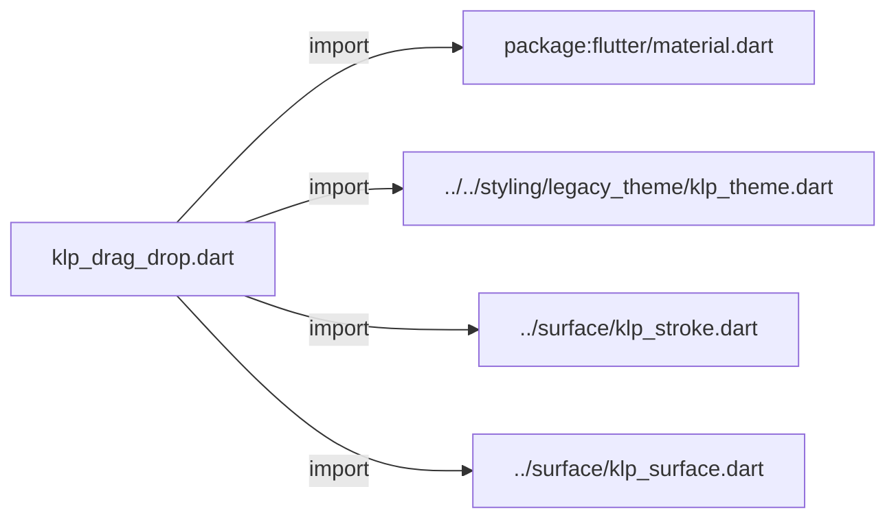
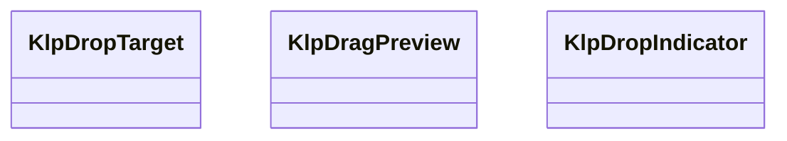
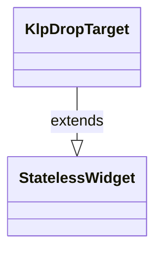
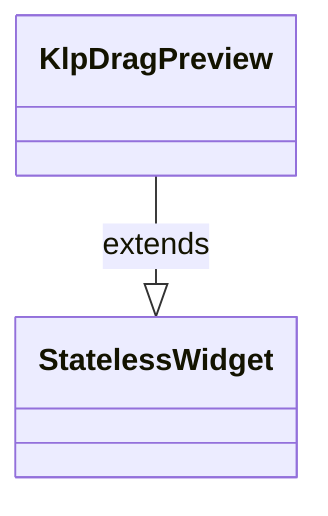
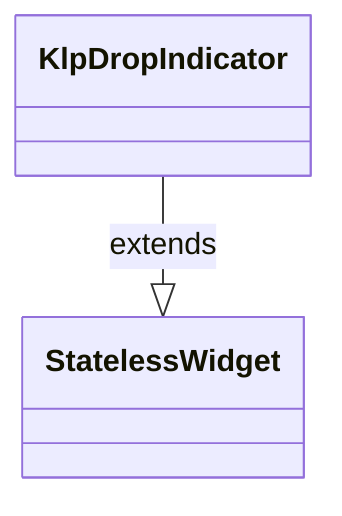

# klp_drag_drop.dart：直接依賴與宣告架構

[回到目錄](README.md) · [來源檔案](../../../../../lib/src/foundation/interaction/klp_drag_drop.dart)

## 範圍

核心是 `lib/src/foundation/interaction/klp_drag_drop.dart`。主要視角為該檔案明寫的 import／export／part；輔助視角為本檔宣告及 extends／implements／with／on 關係。只展開一層外部邊界。

## 直接依賴圖

## 依賴證據

| 關係 | 原始 directive | 來源 |
|---|---|---|
| import | <code>import &#x27;package:flutter/material.dart&#x27;;</code> | [lib/src/foundation/interaction/klp_drag_drop.dart:1](../../../../../lib/src/foundation/interaction/klp_drag_drop.dart#L1) |
| import | <code>import &#x27;../../styling/legacy_theme/klp_theme.dart&#x27;;</code> | [lib/src/foundation/interaction/klp_drag_drop.dart:3](../../../../../lib/src/foundation/interaction/klp_drag_drop.dart#L3) |
| import | <code>import &#x27;../surface/klp_stroke.dart&#x27;;</code> | [lib/src/foundation/interaction/klp_drag_drop.dart:4](../../../../../lib/src/foundation/interaction/klp_drag_drop.dart#L4) |
| import | <code>import &#x27;../surface/klp_surface.dart&#x27;;</code> | [lib/src/foundation/interaction/klp_drag_drop.dart:5](../../../../../lib/src/foundation/interaction/klp_drag_drop.dart#L5) |

## 宣告關係圖

本組節點是本檔宣告；沒有箭頭的宣告未在此圖主張互相依賴。

## 宣告與成員證據

成員包含 public 與 private；簽章取自來源，省略函式本體與欄位初始值。`(inferred)` 表示來源未明寫型別；建構子只顯示參數部分，不含初始化列表。

### KlpDropTarget

ClassDeclaration · public · [lib/src/foundation/interaction/klp_drag_drop.dart:7](../../../../../lib/src/foundation/interaction/klp_drag_drop.dart#L7)

<code>class KlpDropTarget extends StatelessWidget</code>

- `extends` → <code>StatelessWidget</code>：[lib/src/foundation/interaction/klp_drag_drop.dart:7](../../../../../lib/src/foundation/interaction/klp_drag_drop.dart#L7)

| 成員 | 可見性 | 簽章／型別 | 來源註解摘要 | 證據 |
|---|---|---|---|---|
| constructor <code>KlpDropTarget</code> | public | <code>const KlpDropTarget({super.key, required this.child, required this.active})</code> |  | [lib/src/foundation/interaction/klp_drag_drop.dart:8](../../../../../lib/src/foundation/interaction/klp_drag_drop.dart#L8) |
| field <code>child</code> | public | <code>final Widget child</code> |  | [lib/src/foundation/interaction/klp_drag_drop.dart:10](../../../../../lib/src/foundation/interaction/klp_drag_drop.dart#L10) |
| field <code>active</code> | public | <code>final bool active</code> |  | [lib/src/foundation/interaction/klp_drag_drop.dart:11](../../../../../lib/src/foundation/interaction/klp_drag_drop.dart#L11) |
| method <code>build</code> | public | <code>Widget build(BuildContext context)</code> |  | [lib/src/foundation/interaction/klp_drag_drop.dart:13](../../../../../lib/src/foundation/interaction/klp_drag_drop.dart#L13) |

### KlpDragPreview

ClassDeclaration · public · [lib/src/foundation/interaction/klp_drag_drop.dart:26](../../../../../lib/src/foundation/interaction/klp_drag_drop.dart#L26)

<code>class KlpDragPreview extends StatelessWidget</code>

- `extends` → <code>StatelessWidget</code>：[lib/src/foundation/interaction/klp_drag_drop.dart:26](../../../../../lib/src/foundation/interaction/klp_drag_drop.dart#L26)

| 成員 | 可見性 | 簽章／型別 | 來源註解摘要 | 證據 |
|---|---|---|---|---|
| constructor <code>KlpDragPreview</code> | public | <code>const KlpDragPreview({super.key, required this.child})</code> |  | [lib/src/foundation/interaction/klp_drag_drop.dart:27](../../../../../lib/src/foundation/interaction/klp_drag_drop.dart#L27) |
| field <code>child</code> | public | <code>final Widget child</code> |  | [lib/src/foundation/interaction/klp_drag_drop.dart:29](../../../../../lib/src/foundation/interaction/klp_drag_drop.dart#L29) |
| method <code>build</code> | public | <code>Widget build(BuildContext context)</code> |  | [lib/src/foundation/interaction/klp_drag_drop.dart:31](../../../../../lib/src/foundation/interaction/klp_drag_drop.dart#L31) |

### KlpDropIndicator

ClassDeclaration · public · [lib/src/foundation/interaction/klp_drag_drop.dart:44](../../../../../lib/src/foundation/interaction/klp_drag_drop.dart#L44)

<code>class KlpDropIndicator extends StatelessWidget</code>

- `extends` → <code>StatelessWidget</code>：[lib/src/foundation/interaction/klp_drag_drop.dart:44](../../../../../lib/src/foundation/interaction/klp_drag_drop.dart#L44)

| 成員 | 可見性 | 簽章／型別 | 來源註解摘要 | 證據 |
|---|---|---|---|---|
| constructor <code>KlpDropIndicator</code> | public | <code>const KlpDropIndicator({super.key, this.vertical = false, this.thickness})</code> |  | [lib/src/foundation/interaction/klp_drag_drop.dart:45](../../../../../lib/src/foundation/interaction/klp_drag_drop.dart#L45) |
| field <code>vertical</code> | public | <code>final bool vertical</code> |  | [lib/src/foundation/interaction/klp_drag_drop.dart:47](../../../../../lib/src/foundation/interaction/klp_drag_drop.dart#L47) |
| field <code>thickness</code> | public | <code>final double? thickness</code> |  | [lib/src/foundation/interaction/klp_drag_drop.dart:48](../../../../../lib/src/foundation/interaction/klp_drag_drop.dart#L48) |
| method <code>build</code> | public | <code>Widget build(BuildContext context)</code> |  | [lib/src/foundation/interaction/klp_drag_drop.dart:50](../../../../../lib/src/foundation/interaction/klp_drag_drop.dart#L50) |

## 閱讀說明與限制

箭頭只表示來源明寫的靜態關係；import 不等於呼叫。未分析動態呼叫、欄位的實際物件擁有權、狀態轉移或渲染流程；型別未進行語意解析，繼承目標保留原始型別拼寫。public／private 依 Dart 名稱前綴判斷；public 宣告不代表已由 `lib/kallopis.dart` 匯出。

本頁由 `tool/architecture_atlas` 產生；編輯來源或生成工具後重新產生，避免手改本頁。
