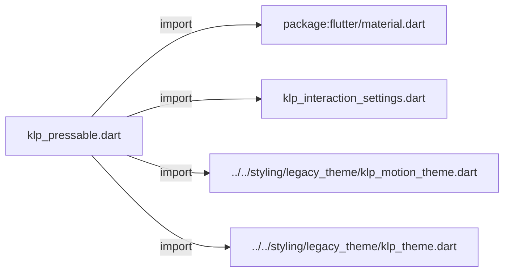
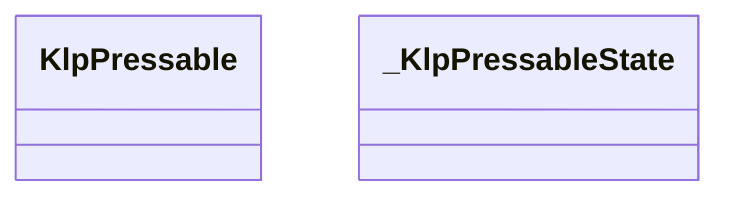
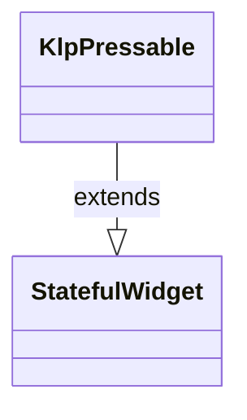
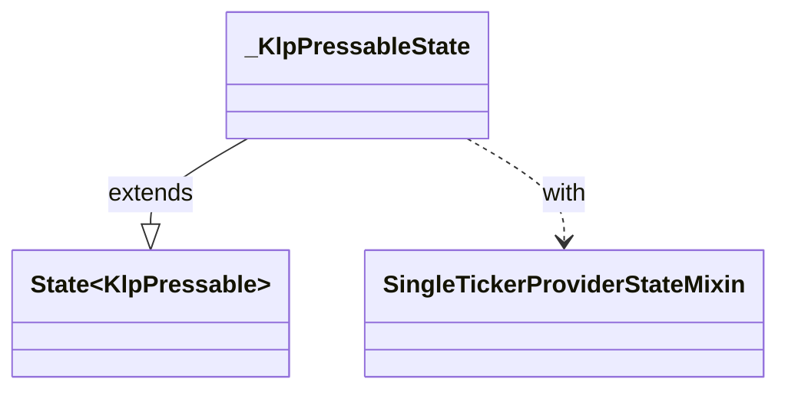

# klp_pressable.dart：直接依賴與宣告架構

[回到目錄](README.md) · [來源檔案](../../../../../lib/src/foundation/interaction/klp_pressable.dart)

## 範圍

核心是 `lib/src/foundation/interaction/klp_pressable.dart`。主要視角為該檔案明寫的 import／export／part；輔助視角為本檔宣告及 extends／implements／with／on 關係。只展開一層外部邊界。

## 直接依賴圖

## 依賴證據

| 關係 | 原始 directive | 來源 |
|---|---|---|
| import | <code>import &#x27;package:flutter/material.dart&#x27;;</code> | [lib/src/foundation/interaction/klp_pressable.dart:1](../../../../../lib/src/foundation/interaction/klp_pressable.dart#L1) |
| import | <code>import &#x27;klp_interaction_settings.dart&#x27;;</code> | [lib/src/foundation/interaction/klp_pressable.dart:3](../../../../../lib/src/foundation/interaction/klp_pressable.dart#L3) |
| import | <code>import &#x27;../../styling/legacy_theme/klp_motion_theme.dart&#x27;;</code> | [lib/src/foundation/interaction/klp_pressable.dart:4](../../../../../lib/src/foundation/interaction/klp_pressable.dart#L4) |
| import | <code>import &#x27;../../styling/legacy_theme/klp_theme.dart&#x27;;</code> | [lib/src/foundation/interaction/klp_pressable.dart:5](../../../../../lib/src/foundation/interaction/klp_pressable.dart#L5) |

## 宣告關係圖

本組節點是本檔宣告；沒有箭頭的宣告未在此圖主張互相依賴。

## 宣告與成員證據

成員包含 public 與 private；簽章取自來源，省略函式本體與欄位初始值。`(inferred)` 表示來源未明寫型別；建構子只顯示參數部分，不含初始化列表。

### KlpPressable

ClassDeclaration · public · [lib/src/foundation/interaction/klp_pressable.dart:7](../../../../../lib/src/foundation/interaction/klp_pressable.dart#L7)

<code>class KlpPressable extends StatefulWidget</code>

來源註解摘要：可按壓表面的 hover／focus 視覺。

- `extends` → <code>StatefulWidget</code>：[lib/src/foundation/interaction/klp_pressable.dart:8](../../../../../lib/src/foundation/interaction/klp_pressable.dart#L8)

| 成員 | 可見性 | 簽章／型別 | 來源註解摘要 | 證據 |
|---|---|---|---|---|
| constructor <code>KlpPressable</code> | public | <code>const KlpPressable({ super.key, required this.child, required this.onPressed, this.onLongPress, this.longPressProgressColor, this.borderRadius, this.onHover, this.onFocusChange, this.selected = false, this.hoverHighlight = true, })</code> |  | [lib/src/foundation/interaction/klp_pressable.dart:9](../../../../../lib/src/foundation/interaction/klp_pressable.dart#L9) |
| field <code>child</code> | public | <code>final Widget child</code> |  | [lib/src/foundation/interaction/klp_pressable.dart:22](../../../../../lib/src/foundation/interaction/klp_pressable.dart#L22) |
| field <code>onPressed</code> | public | <code>final VoidCallback? onPressed</code> |  | [lib/src/foundation/interaction/klp_pressable.dart:23](../../../../../lib/src/foundation/interaction/klp_pressable.dart#L23) |
| field <code>onLongPress</code> | public | <code>final VoidCallback? onLongPress</code> |  | [lib/src/foundation/interaction/klp_pressable.dart:24](../../../../../lib/src/foundation/interaction/klp_pressable.dart#L24) |
| field <code>longPressProgressColor</code> | public | <code>final Color? longPressProgressColor</code> |  | [lib/src/foundation/interaction/klp_pressable.dart:25](../../../../../lib/src/foundation/interaction/klp_pressable.dart#L25) |
| field <code>borderRadius</code> | public | <code>final BorderRadius? borderRadius</code> |  | [lib/src/foundation/interaction/klp_pressable.dart:26](../../../../../lib/src/foundation/interaction/klp_pressable.dart#L26) |
| field <code>onHover</code> | public | <code>final ValueChanged&lt;bool&gt;? onHover</code> |  | [lib/src/foundation/interaction/klp_pressable.dart:27](../../../../../lib/src/foundation/interaction/klp_pressable.dart#L27) |
| field <code>onFocusChange</code> | public | <code>final ValueChanged&lt;bool&gt;? onFocusChange</code> |  | [lib/src/foundation/interaction/klp_pressable.dart:28](../../../../../lib/src/foundation/interaction/klp_pressable.dart#L28) |
| field <code>selected</code> | public | <code>final bool selected</code> | 受控選取狀態；視覺完全由目前的 Kallopis theme 決定。 | [lib/src/foundation/interaction/klp_pressable.dart:31](../../../../../lib/src/foundation/interaction/klp_pressable.dart#L31) |
| field <code>hoverHighlight</code> | public | <code>final bool hoverHighlight</code> | 是否由 [KlpPressable] 自己畫 hover／focus 的高亮。 設為 `false` 的場合是「外層已經畫了狀態」——例如 [KlpButton] 本身就有底色， 再疊一層高亮只會讓它看起來髒掉。這不是關掉狀態表達，是把它交給外層。 | [lib/src/foundation/interaction/klp_pressable.dart:37](../../../../../lib/src/foundation/interaction/klp_pressable.dart#L37) |
| method <code>createState</code> | public | <code>State&lt;KlpPressable&gt; createState()</code> |  | [lib/src/foundation/interaction/klp_pressable.dart:39](../../../../../lib/src/foundation/interaction/klp_pressable.dart#L39) |

### _KlpPressableState

ClassDeclaration · private · [lib/src/foundation/interaction/klp_pressable.dart:43](../../../../../lib/src/foundation/interaction/klp_pressable.dart#L43)

<code>class _KlpPressableState extends State&lt;KlpPressable&gt; with SingleTickerProviderStateMixin</code>

- `extends` → <code>State&lt;KlpPressable&gt;</code>：[lib/src/foundation/interaction/klp_pressable.dart:43](../../../../../lib/src/foundation/interaction/klp_pressable.dart#L43)
- `with` → <code>SingleTickerProviderStateMixin</code>：[lib/src/foundation/interaction/klp_pressable.dart:44](../../../../../lib/src/foundation/interaction/klp_pressable.dart#L44)

| 成員 | 可見性 | 簽章／型別 | 來源註解摘要 | 證據 |
|---|---|---|---|---|
| field <code>_longPressController</code> | private | <code>late final AnimationController _longPressController</code> |  | [lib/src/foundation/interaction/klp_pressable.dart:45](../../../../../lib/src/foundation/interaction/klp_pressable.dart#L45) |
| field <code>_longPressTriggered</code> | private | <code>bool _longPressTriggered</code> |  | [lib/src/foundation/interaction/klp_pressable.dart:46](../../../../../lib/src/foundation/interaction/klp_pressable.dart#L46) |
| field <code>_isHovered</code> | private | <code>bool _isHovered</code> |  | [lib/src/foundation/interaction/klp_pressable.dart:47](../../../../../lib/src/foundation/interaction/klp_pressable.dart#L47) |
| field <code>_isFocused</code> | private | <code>bool _isFocused</code> |  | [lib/src/foundation/interaction/klp_pressable.dart:48](../../../../../lib/src/foundation/interaction/klp_pressable.dart#L48) |
| getter <code>_enabled</code> | private | <code>bool get _enabled</code> |  | [lib/src/foundation/interaction/klp_pressable.dart:50](../../../../../lib/src/foundation/interaction/klp_pressable.dart#L50) |
| method <code>initState</code> | public | <code>void initState()</code> |  | [lib/src/foundation/interaction/klp_pressable.dart:52](../../../../../lib/src/foundation/interaction/klp_pressable.dart#L52) |
| method <code>didChangeDependencies</code> | public | <code>void didChangeDependencies()</code> |  | [lib/src/foundation/interaction/klp_pressable.dart:61](../../../../../lib/src/foundation/interaction/klp_pressable.dart#L61) |
| method <code>didUpdateWidget</code> | public | <code>void didUpdateWidget(KlpPressable oldWidget)</code> |  | [lib/src/foundation/interaction/klp_pressable.dart:67](../../../../../lib/src/foundation/interaction/klp_pressable.dart#L67) |
| method <code>dispose</code> | public | <code>void dispose()</code> |  | [lib/src/foundation/interaction/klp_pressable.dart:73](../../../../../lib/src/foundation/interaction/klp_pressable.dart#L73) |
| method <code>_handleAnimationStatus</code> | private | <code>void _handleAnimationStatus(AnimationStatus status)</code> |  | [lib/src/foundation/interaction/klp_pressable.dart:81](../../../../../lib/src/foundation/interaction/klp_pressable.dart#L81) |
| method <code>_handlePointerDown</code> | private | <code>void _handlePointerDown(PointerDownEvent event)</code> |  | [lib/src/foundation/interaction/klp_pressable.dart:90](../../../../../lib/src/foundation/interaction/klp_pressable.dart#L90) |
| method <code>_handleTap</code> | private | <code>void _handleTap()</code> |  | [lib/src/foundation/interaction/klp_pressable.dart:97](../../../../../lib/src/foundation/interaction/klp_pressable.dart#L97) |
| method <code>_resetLongPress</code> | private | <code>void _resetLongPress()</code> |  | [lib/src/foundation/interaction/klp_pressable.dart:103](../../../../../lib/src/foundation/interaction/klp_pressable.dart#L103) |
| method <code>_handleHover</code> | private | <code>void _handleHover(bool hovered)</code> |  | [lib/src/foundation/interaction/klp_pressable.dart:108](../../../../../lib/src/foundation/interaction/klp_pressable.dart#L108) |
| method <code>_handleFocusChange</code> | private | <code>void _handleFocusChange(bool focused)</code> |  | [lib/src/foundation/interaction/klp_pressable.dart:115](../../../../../lib/src/foundation/interaction/klp_pressable.dart#L115) |
| method <code>build</code> | public | <code>Widget build(BuildContext context)</code> |  | [lib/src/foundation/interaction/klp_pressable.dart:122](../../../../../lib/src/foundation/interaction/klp_pressable.dart#L122) |

## 閱讀說明與限制

箭頭只表示來源明寫的靜態關係；import 不等於呼叫。未分析動態呼叫、欄位的實際物件擁有權、狀態轉移或渲染流程；型別未進行語意解析，繼承目標保留原始型別拼寫。public／private 依 Dart 名稱前綴判斷；public 宣告不代表已由 `lib/kallopis.dart` 匯出。

本頁由 `tool/architecture_atlas` 產生；編輯來源或生成工具後重新產生，避免手改本頁。
