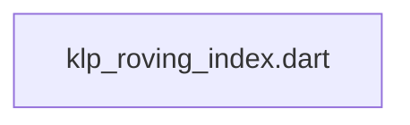
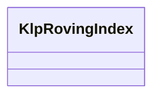

# klp_roving_index.dart：直接依賴與宣告架構

[回到目錄](README.md) · [來源檔案](../../../../../lib/src/foundation/interaction/klp_roving_index.dart)

## 範圍

核心是 `lib/src/foundation/interaction/klp_roving_index.dart`。主要視角為該檔案明寫的 import／export／part；輔助視角為本檔宣告及 extends／implements／with／on 關係。只展開一層外部邊界。

## 直接依賴圖

## 依賴證據

| 關係 | 原始 directive | 來源 |
|---|---|---|
| 無 | 本檔未宣告 import／export／part | [lib/src/foundation/interaction/klp_roving_index.dart:1](../../../../../lib/src/foundation/interaction/klp_roving_index.dart#L1) |

## 宣告關係圖

本組節點是本檔宣告；沒有箭頭的宣告未在此圖主張互相依賴。

## 宣告與成員證據

成員包含 public 與 private；簽章取自來源，省略函式本體與欄位初始值。`(inferred)` 表示來源未明寫型別；建構子只顯示參數部分，不含初始化列表。

### KlpRovingIndex

ClassDeclaration · public · [lib/src/foundation/interaction/klp_roving_index.dart:1](../../../../../lib/src/foundation/interaction/klp_roving_index.dart#L1)

<code>abstract final class KlpRovingIndex</code>

來源註解摘要：一組項目間以方向鍵移動「高亮索引」的共用邏輯。 本庫多個元件（[KlpCombobox]、[KlpMenu]、[KlpCommandMenu]、[KlpTabs]，見各自 檔案）都需要「↓／↑（或 ←／→）在項目間移動、跳過停用項、到底/到頂循環」這套 規則。抽成純函式而非各自重寫一份，避免同一條規則出現兩份互相分岔的實作 （AGENTS.md 的硬規則：一條規則只能有一個實作）。 這個類別只做索引運算，不涉及任何 widget 或視覺——各元件仍自行決定「高亮」要 畫成什麼樣子（沿用各自既有的視覺語言），這裡只回答「下一個索引是幾號」。

| 成員 | 可見性 | 簽章／型別 | 來源註解摘要 | 證據 |
|---|---|---|---|---|
| method <code>move</code> | public | <code>static int move({ required int current, required int count, required bool forward, bool Function(int index)? isEnabled, })</code> | 從 [current]（可能是 `-1`，代表尚無高亮）往下一個「可用」索引移動。 [count] 是項目總數。[forward] 為 `true` 表示往後移動（例如 ↓ 或 →）， `false` 表示往前移動（↑ 或 ←）。移動會在頭尾之間循環（wrap-around），不會 停在邊界。[isEnabled] 用來判斷某個索引是否可以被高亮，預設全部可用；若所 有項目都不可用，回傳原本的 [current]（不移動）。 | [lib/src/foundation/interaction/klp_roving_index.dart:11](../../../../../lib/src/foundation/interaction/klp_roving_index.dart#L11) |
| method <code>first</code> | public | <code>static int first({required int count, bool Function(int index)? isEnabled})</code> | 跳到第一個可用索引（Home）。找不到可用項目時回傳 `-1`。 | [lib/src/foundation/interaction/klp_roving_index.dart:33](../../../../../lib/src/foundation/interaction/klp_roving_index.dart#L33) |
| method <code>last</code> | public | <code>static int last({required int count, bool Function(int index)? isEnabled})</code> | 跳到最後一個可用索引（End）。找不到可用項目時回傳 `-1`。 | [lib/src/foundation/interaction/klp_roving_index.dart:42](../../../../../lib/src/foundation/interaction/klp_roving_index.dart#L42) |

## 閱讀說明與限制

箭頭只表示來源明寫的靜態關係；import 不等於呼叫。未分析動態呼叫、欄位的實際物件擁有權、狀態轉移或渲染流程；型別未進行語意解析，繼承目標保留原始型別拼寫。public／private 依 Dart 名稱前綴判斷；public 宣告不代表已由 `lib/kallopis.dart` 匯出。

本頁由 `tool/architecture_atlas` 產生；編輯來源或生成工具後重新產生，避免手改本頁。
