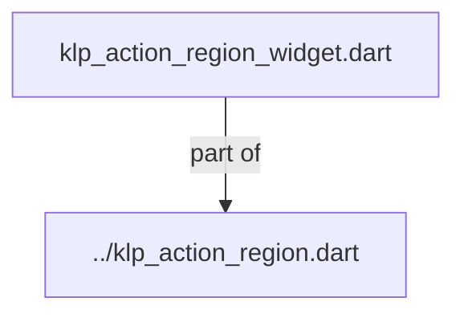
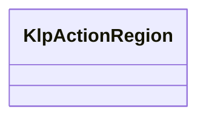
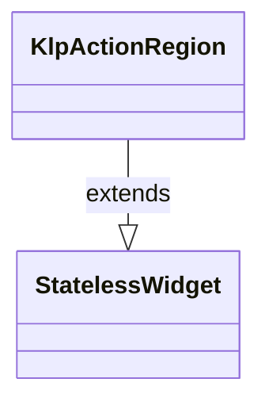

# klp_action_region_widget.dart：直接依賴與宣告架構

[回到目錄](README.md) · [來源檔案](../../../../../../lib/src/foundation/interaction/primitives/klp_action_region_widget.dart)

## 範圍

核心是 `lib/src/foundation/interaction/primitives/klp_action_region_widget.dart`。主要視角為該檔案明寫的 import／export／part；輔助視角為本檔宣告及 extends／implements／with／on 關係。只展開一層外部邊界。

## 直接依賴圖

## 依賴證據

| 關係 | 原始 directive | 來源 |
|---|---|---|
| part of | <code>part of &#x27;../klp_action_region.dart&#x27;;</code> | [lib/src/foundation/interaction/primitives/klp_action_region_widget.dart:1](../../../../../../lib/src/foundation/interaction/primitives/klp_action_region_widget.dart#L1) |

## 宣告關係圖

本組節點是本檔宣告；沒有箭頭的宣告未在此圖主張互相依賴。

## 宣告與成員證據

成員包含 public 與 private；簽章取自來源，省略函式本體與欄位初始值。`(inferred)` 表示來源未明寫型別；建構子只顯示參數部分，不含初始化列表。

### KlpActionRegion

ClassDeclaration · public · [lib/src/foundation/interaction/primitives/klp_action_region_widget.dart:3](../../../../../../lib/src/foundation/interaction/primitives/klp_action_region_widget.dart#L3)

<code>class KlpActionRegion extends StatelessWidget</code>

來源註解摘要：統一封裝按鈕語意、hover、focus 與可點擊表面的互動原語。

- `extends` → <code>StatelessWidget</code>：[lib/src/foundation/interaction/primitives/klp_action_region_widget.dart:4](../../../../../../lib/src/foundation/interaction/primitives/klp_action_region_widget.dart#L4)

| 成員 | 可見性 | 簽章／型別 | 來源註解摘要 | 證據 |
|---|---|---|---|---|
| constructor <code>KlpActionRegion</code> | public | <code>const KlpActionRegion({ super.key, required this.label, required this.onPressed, required this.builder, this.tone = KlpActionRegionTone.neutral, this.selected = false, this.active = false, this.toggled, this.expanded, this.shape = KlpActionRegionShape.card, })</code> |  | [lib/src/foundation/interaction/primitives/klp_action_region_widget.dart:5](../../../../../../lib/src/foundation/interaction/primitives/klp_action_region_widget.dart#L5) |
| field <code>label</code> | public | <code>final String label</code> |  | [lib/src/foundation/interaction/primitives/klp_action_region_widget.dart:18](../../../../../../lib/src/foundation/interaction/primitives/klp_action_region_widget.dart#L18) |
| field <code>onPressed</code> | public | <code>final VoidCallback? onPressed</code> |  | [lib/src/foundation/interaction/primitives/klp_action_region_widget.dart:19](../../../../../../lib/src/foundation/interaction/primitives/klp_action_region_widget.dart#L19) |
| field <code>builder</code> | public | <code>final Widget Function(BuildContext context, KlpActionRegionStyle style) builder</code> |  | [lib/src/foundation/interaction/primitives/klp_action_region_widget.dart:21](../../../../../../lib/src/foundation/interaction/primitives/klp_action_region_widget.dart#L21) |
| field <code>tone</code> | public | <code>final KlpActionRegionTone tone</code> |  | [lib/src/foundation/interaction/primitives/klp_action_region_widget.dart:22](../../../../../../lib/src/foundation/interaction/primitives/klp_action_region_widget.dart#L22) |
| field <code>selected</code> | public | <code>final bool selected</code> |  | [lib/src/foundation/interaction/primitives/klp_action_region_widget.dart:23](../../../../../../lib/src/foundation/interaction/primitives/klp_action_region_widget.dart#L23) |
| field <code>active</code> | public | <code>final bool active</code> |  | [lib/src/foundation/interaction/primitives/klp_action_region_widget.dart:24](../../../../../../lib/src/foundation/interaction/primitives/klp_action_region_widget.dart#L24) |
| field <code>toggled</code> | public | <code>final bool? toggled</code> |  | [lib/src/foundation/interaction/primitives/klp_action_region_widget.dart:25](../../../../../../lib/src/foundation/interaction/primitives/klp_action_region_widget.dart#L25) |
| field <code>expanded</code> | public | <code>final bool? expanded</code> |  | [lib/src/foundation/interaction/primitives/klp_action_region_widget.dart:26](../../../../../../lib/src/foundation/interaction/primitives/klp_action_region_widget.dart#L26) |
| field <code>shape</code> | public | <code>final KlpActionRegionShape shape</code> |  | [lib/src/foundation/interaction/primitives/klp_action_region_widget.dart:27](../../../../../../lib/src/foundation/interaction/primitives/klp_action_region_widget.dart#L27) |
| method <code>build</code> | public | <code>Widget build(BuildContext context)</code> |  | [lib/src/foundation/interaction/primitives/klp_action_region_widget.dart:29](../../../../../../lib/src/foundation/interaction/primitives/klp_action_region_widget.dart#L29) |

## 閱讀說明與限制

箭頭只表示來源明寫的靜態關係；import 不等於呼叫。未分析動態呼叫、欄位的實際物件擁有權、狀態轉移或渲染流程；型別未進行語意解析，繼承目標保留原始型別拼寫。public／private 依 Dart 名稱前綴判斷；public 宣告不代表已由 `lib/kallopis.dart` 匯出。

本頁由 `tool/architecture_atlas` 產生；編輯來源或生成工具後重新產生，避免手改本頁。
