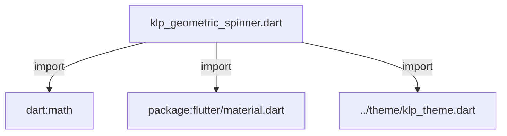
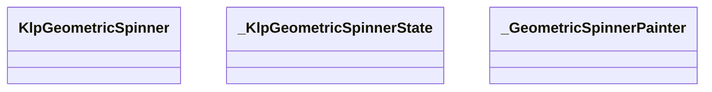
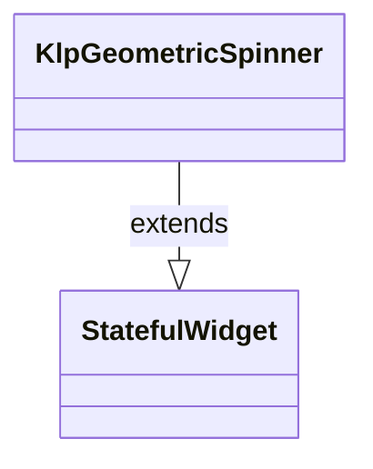
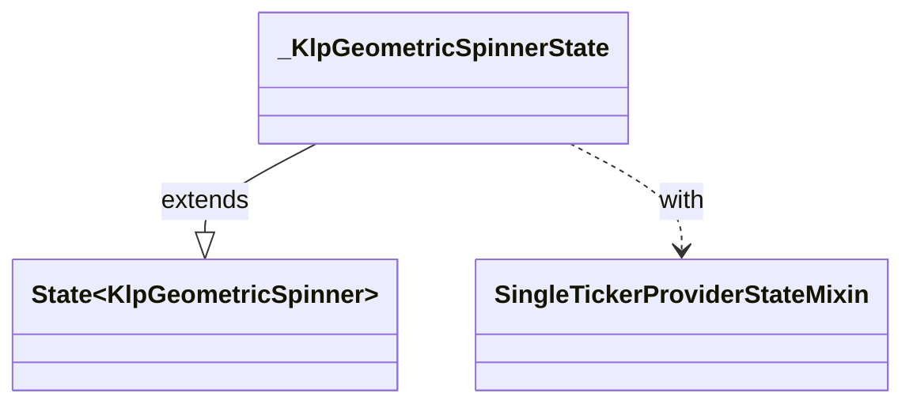
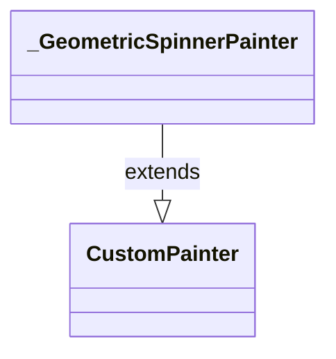

# klp_geometric_spinner.dart：直接依賴與宣告架構

[回到目錄](README.md) · [來源檔案](../../../../lib/src/foundation/klp_geometric_spinner.dart)

## 範圍

核心是 `lib/src/foundation/klp_geometric_spinner.dart`。主要視角為該檔案明寫的 import／export／part；輔助視角為本檔宣告及 extends／implements／with／on 關係。只展開一層外部邊界。

## 直接依賴圖

## 依賴證據

| 關係 | 原始 directive | 來源 |
|---|---|---|
| import | <code>import &#x27;dart:math&#x27; as math;</code> | [lib/src/foundation/klp_geometric_spinner.dart:1](../../../../lib/src/foundation/klp_geometric_spinner.dart#L1) |
| import | <code>import &#x27;package:flutter/material.dart&#x27;;</code> | [lib/src/foundation/klp_geometric_spinner.dart:2](../../../../lib/src/foundation/klp_geometric_spinner.dart#L2) |
| import | <code>import &#x27;../theme/klp_theme.dart&#x27;;</code> | [lib/src/foundation/klp_geometric_spinner.dart:4](../../../../lib/src/foundation/klp_geometric_spinner.dart#L4) |

## 宣告關係圖

本組節點是本檔宣告；沒有箭頭的宣告未在此圖主張互相依賴。

## 宣告與成員證據

成員包含 public 與 private；簽章取自來源，省略函式本體與欄位初始值。`(inferred)` 表示來源未明寫型別；建構子只顯示參數部分，不含初始化列表。

### KlpGeometricSpinner

ClassDeclaration · public · [lib/src/foundation/klp_geometric_spinner.dart:6](../../../../lib/src/foundation/klp_geometric_spinner.dart#L6)

<code>class KlpGeometricSpinner extends StatefulWidget</code>

來源註解摘要：幾何圖案載入動畫。 由四個對稱的小方塊圍繞中心旋轉，並伴隨對比色進行平滑色彩動畫， 適合用於載入狀態、資料請求或背景處理中指示。

- `extends` → <code>StatefulWidget</code>：[lib/src/foundation/klp_geometric_spinner.dart:10](../../../../lib/src/foundation/klp_geometric_spinner.dart#L10)

| 成員 | 可見性 | 簽章／型別 | 來源註解摘要 | 證據 |
|---|---|---|---|---|
| constructor <code>KlpGeometricSpinner</code> | public | <code>const KlpGeometricSpinner({ super.key, this.size, this.color, this.contrastColor, this.duration, })</code> |  | [lib/src/foundation/klp_geometric_spinner.dart:11](../../../../lib/src/foundation/klp_geometric_spinner.dart#L11) |
| field <code>size</code> | public | <code>final double? size</code> | 動畫尺寸（寬高等長）。預設為 `context.klp.space.iconLarge` (24px)。 | [lib/src/foundation/klp_geometric_spinner.dart:20](../../../../lib/src/foundation/klp_geometric_spinner.dart#L20) |
| field <code>color</code> | public | <code>final Color? color</code> | 主幾何填色。預設為 `context.klpColors.text`。 | [lib/src/foundation/klp_geometric_spinner.dart:23](../../../../lib/src/foundation/klp_geometric_spinner.dart#L23) |
| field <code>contrastColor</code> | public | <code>final Color? contrastColor</code> | 對比幾何填色。預設為 `context.klpColors.accent`。 | [lib/src/foundation/klp_geometric_spinner.dart:26](../../../../lib/src/foundation/klp_geometric_spinner.dart#L26) |
| field <code>duration</code> | public | <code>final Duration? duration</code> | 單次循環週期時長。 | [lib/src/foundation/klp_geometric_spinner.dart:29](../../../../lib/src/foundation/klp_geometric_spinner.dart#L29) |
| method <code>createState</code> | public | <code>State&lt;KlpGeometricSpinner&gt; createState()</code> |  | [lib/src/foundation/klp_geometric_spinner.dart:31](../../../../lib/src/foundation/klp_geometric_spinner.dart#L31) |

### _KlpGeometricSpinnerState

ClassDeclaration · private · [lib/src/foundation/klp_geometric_spinner.dart:35](../../../../lib/src/foundation/klp_geometric_spinner.dart#L35)

<code>class _KlpGeometricSpinnerState extends State&lt;KlpGeometricSpinner&gt; with SingleTickerProviderStateMixin</code>

- `extends` → <code>State&lt;KlpGeometricSpinner&gt;</code>：[lib/src/foundation/klp_geometric_spinner.dart:35](../../../../lib/src/foundation/klp_geometric_spinner.dart#L35)
- `with` → <code>SingleTickerProviderStateMixin</code>：[lib/src/foundation/klp_geometric_spinner.dart:36](../../../../lib/src/foundation/klp_geometric_spinner.dart#L36)

| 成員 | 可見性 | 簽章／型別 | 來源註解摘要 | 證據 |
|---|---|---|---|---|
| field <code>_controller</code> | private | <code>late final AnimationController _controller</code> |  | [lib/src/foundation/klp_geometric_spinner.dart:37](../../../../lib/src/foundation/klp_geometric_spinner.dart#L37) |
| method <code>initState</code> | public | <code>void initState()</code> |  | [lib/src/foundation/klp_geometric_spinner.dart:39](../../../../lib/src/foundation/klp_geometric_spinner.dart#L39) |
| method <code>didChangeDependencies</code> | public | <code>void didChangeDependencies()</code> |  | [lib/src/foundation/klp_geometric_spinner.dart:45](../../../../lib/src/foundation/klp_geometric_spinner.dart#L45) |
| method <code>dispose</code> | public | <code>void dispose()</code> |  | [lib/src/foundation/klp_geometric_spinner.dart:56](../../../../lib/src/foundation/klp_geometric_spinner.dart#L56) |
| method <code>build</code> | public | <code>Widget build(BuildContext context)</code> |  | [lib/src/foundation/klp_geometric_spinner.dart:62](../../../../lib/src/foundation/klp_geometric_spinner.dart#L62) |

### _GeometricSpinnerPainter

ClassDeclaration · private · [lib/src/foundation/klp_geometric_spinner.dart:114](../../../../lib/src/foundation/klp_geometric_spinner.dart#L114)

<code>class _GeometricSpinnerPainter extends CustomPainter</code>

- `extends` → <code>CustomPainter</code>：[lib/src/foundation/klp_geometric_spinner.dart:114](../../../../lib/src/foundation/klp_geometric_spinner.dart#L114)

| 成員 | 可見性 | 簽章／型別 | 來源註解摘要 | 證據 |
|---|---|---|---|---|
| constructor <code>_GeometricSpinnerPainter</code> | private | <code>const _GeometricSpinnerPainter({ required this.progress, required this.primaryColor, required this.contrastColor, required this.squareFactor, required this.orbitFactor, required this.cornerFactor, })</code> |  | [lib/src/foundation/klp_geometric_spinner.dart:115](../../../../lib/src/foundation/klp_geometric_spinner.dart#L115) |
| field <code>progress</code> | public | <code>final double progress</code> |  | [lib/src/foundation/klp_geometric_spinner.dart:124](../../../../lib/src/foundation/klp_geometric_spinner.dart#L124) |
| field <code>primaryColor</code> | public | <code>final Color primaryColor</code> |  | [lib/src/foundation/klp_geometric_spinner.dart:125](../../../../lib/src/foundation/klp_geometric_spinner.dart#L125) |
| field <code>contrastColor</code> | public | <code>final Color contrastColor</code> |  | [lib/src/foundation/klp_geometric_spinner.dart:126](../../../../lib/src/foundation/klp_geometric_spinner.dart#L126) |
| field <code>squareFactor</code> | public | <code>final double squareFactor</code> |  | [lib/src/foundation/klp_geometric_spinner.dart:127](../../../../lib/src/foundation/klp_geometric_spinner.dart#L127) |
| field <code>orbitFactor</code> | public | <code>final double orbitFactor</code> |  | [lib/src/foundation/klp_geometric_spinner.dart:128](../../../../lib/src/foundation/klp_geometric_spinner.dart#L128) |
| field <code>cornerFactor</code> | public | <code>final double cornerFactor</code> |  | [lib/src/foundation/klp_geometric_spinner.dart:129](../../../../lib/src/foundation/klp_geometric_spinner.dart#L129) |
| method <code>paint</code> | public | <code>void paint(Canvas canvas, Size size)</code> |  | [lib/src/foundation/klp_geometric_spinner.dart:131](../../../../lib/src/foundation/klp_geometric_spinner.dart#L131) |
| method <code>shouldRepaint</code> | public | <code>bool shouldRepaint(covariant _GeometricSpinnerPainter oldDelegate)</code> |  | [lib/src/foundation/klp_geometric_spinner.dart:164](../../../../lib/src/foundation/klp_geometric_spinner.dart#L164) |

## 閱讀說明與限制

箭頭只表示來源明寫的靜態關係；import 不等於呼叫。未分析動態呼叫、欄位的實際物件擁有權、狀態轉移或渲染流程；型別未進行語意解析，繼承目標保留原始型別拼寫。public／private 依 Dart 名稱前綴判斷；public 宣告不代表已由 `lib/kallopis.dart` 匯出。

本頁由 `tool/architecture_atlas` 產生；編輯來源或生成工具後重新產生，避免手改本頁。
