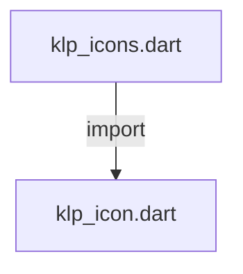
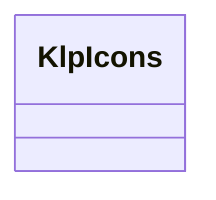

# klp_icons.dart：直接依賴與宣告架構

[回到目錄](README.md) · [來源檔案](../../../../lib/src/foundation/klp_icons.dart)

## 範圍

核心是 `lib/src/foundation/klp_icons.dart`。主要視角為該檔案明寫的 import／export／part；輔助視角為本檔宣告及 extends／implements／with／on 關係。只展開一層外部邊界。

## 直接依賴圖

## 依賴證據

| 關係 | 原始 directive | 來源 |
|---|---|---|
| import | <code>import &#x27;klp_icon.dart&#x27;;</code> | [lib/src/foundation/klp_icons.dart:1](../../../../lib/src/foundation/klp_icons.dart#L1) |

## 宣告關係圖

本組節點是本檔宣告；沒有箭頭的宣告未在此圖主張互相依賴。

## 宣告與成員證據

成員包含 public 與 private；簽章取自來源，省略函式本體與欄位初始值。`(inferred)` 表示來源未明寫型別；建構子只顯示參數部分，不含初始化列表。

### KlpIcons

ClassDeclaration · public · [lib/src/foundation/klp_icons.dart:3](../../../../lib/src/foundation/klp_icons.dart#L3)

<code>abstract final class KlpIcons</code>

來源註解摘要：Kallopis 使用的 Flaticon UIcons（Regular／Thin Rounded）語意別名。 字碼固定取自 `@flaticon/flaticon-uicons` 3.3.1。公開名稱維持 Kallopis 的產品中立語意，呼叫端不需要知道 Flaticon 的 CSS class 名稱。

| 成員 | 可見性 | 簽章／型別 | 來源註解摘要 | 證據 |
|---|---|---|---|---|
| field <code>archive</code> | public | <code>static const KlpIconData archive</code> |  | [lib/src/foundation/klp_icons.dart:8](../../../../lib/src/foundation/klp_icons.dart#L8) |
| field <code>bookmark</code> | public | <code>static const KlpIconData bookmark</code> |  | [lib/src/foundation/klp_icons.dart:9](../../../../lib/src/foundation/klp_icons.dart#L9) |
| field <code>box</code> | public | <code>static const KlpIconData box</code> |  | [lib/src/foundation/klp_icons.dart:10](../../../../lib/src/foundation/klp_icons.dart#L10) |
| field <code>calendar</code> | public | <code>static const KlpIconData calendar</code> |  | [lib/src/foundation/klp_icons.dart:11](../../../../lib/src/foundation/klp_icons.dart#L11) |
| field <code>check</code> | public | <code>static const KlpIconData check</code> |  | [lib/src/foundation/klp_icons.dart:12](../../../../lib/src/foundation/klp_icons.dart#L12) |
| field <code>checkSquare</code> | public | <code>static const KlpIconData checkSquare</code> |  | [lib/src/foundation/klp_icons.dart:13](../../../../lib/src/foundation/klp_icons.dart#L13) |
| field <code>chevronDown</code> | public | <code>static const KlpIconData chevronDown</code> |  | [lib/src/foundation/klp_icons.dart:14](../../../../lib/src/foundation/klp_icons.dart#L14) |
| field <code>disclosureTriangle</code> | public | <code>static const KlpIconData disclosureTriangle</code> |  | [lib/src/foundation/klp_icons.dart:15](../../../../lib/src/foundation/klp_icons.dart#L15) |
| field <code>clipboard</code> | public | <code>static const KlpIconData clipboard</code> |  | [lib/src/foundation/klp_icons.dart:16](../../../../lib/src/foundation/klp_icons.dart#L16) |
| field <code>collapse</code> | public | <code>static const KlpIconData collapse</code> |  | [lib/src/foundation/klp_icons.dart:17](../../../../lib/src/foundation/klp_icons.dart#L17) |
| field <code>container</code> | public | <code>static const KlpIconData container</code> |  | [lib/src/foundation/klp_icons.dart:18](../../../../lib/src/foundation/klp_icons.dart#L18) |
| field <code>cpu</code> | public | <code>static const KlpIconData cpu</code> |  | [lib/src/foundation/klp_icons.dart:19](../../../../lib/src/foundation/klp_icons.dart#L19) |
| field <code>diagramProject</code> | public | <code>static const KlpIconData diagramProject</code> |  | [lib/src/foundation/klp_icons.dart:20](../../../../lib/src/foundation/klp_icons.dart#L20) |
| field <code>edit</code> | public | <code>static const KlpIconData edit</code> |  | [lib/src/foundation/klp_icons.dart:21](../../../../lib/src/foundation/klp_icons.dart#L21) |
| field <code>eye</code> | public | <code>static const KlpIconData eye</code> |  | [lib/src/foundation/klp_icons.dart:22](../../../../lib/src/foundation/klp_icons.dart#L22) |
| field <code>folder</code> | public | <code>static const KlpIconData folder</code> |  | [lib/src/foundation/klp_icons.dart:23](../../../../lib/src/foundation/klp_icons.dart#L23) |
| field <code>folderPlus</code> | public | <code>static const KlpIconData folderPlus</code> |  | [lib/src/foundation/klp_icons.dart:24](../../../../lib/src/foundation/klp_icons.dart#L24) |
| field <code>grid</code> | public | <code>static const KlpIconData grid</code> |  | [lib/src/foundation/klp_icons.dart:25](../../../../lib/src/foundation/klp_icons.dart#L25) |
| field <code>gripVertical</code> | public | <code>static const KlpIconData gripVertical</code> |  | [lib/src/foundation/klp_icons.dart:26](../../../../lib/src/foundation/klp_icons.dart#L26) |
| field <code>inbox</code> | public | <code>static const KlpIconData inbox</code> |  | [lib/src/foundation/klp_icons.dart:27](../../../../lib/src/foundation/klp_icons.dart#L27) |
| field <code>handWriting</code> | public | <code>static const KlpIconData handWriting</code> |  | [lib/src/foundation/klp_icons.dart:28](../../../../lib/src/foundation/klp_icons.dart#L28) |
| field <code>infoSquare</code> | public | <code>static const KlpIconData infoSquare</code> |  | [lib/src/foundation/klp_icons.dart:29](../../../../lib/src/foundation/klp_icons.dart#L29) |
| field <code>alertSquare</code> | public | <code>static const KlpIconData alertSquare</code> |  | [lib/src/foundation/klp_icons.dart:30](../../../../lib/src/foundation/klp_icons.dart#L30) |
| field <code>minus</code> | public | <code>static const KlpIconData minus</code> |  | [lib/src/foundation/klp_icons.dart:31](../../../../lib/src/foundation/klp_icons.dart#L31) |
| field <code>maximize</code> | public | <code>static const KlpIconData maximize</code> |  | [lib/src/foundation/klp_icons.dart:32](../../../../lib/src/foundation/klp_icons.dart#L32) |
| field <code>restore</code> | public | <code>static const KlpIconData restore</code> |  | [lib/src/foundation/klp_icons.dart:33](../../../../lib/src/foundation/klp_icons.dart#L33) |
| field <code>keyboard</code> | public | <code>static const KlpIconData keyboard</code> |  | [lib/src/foundation/klp_icons.dart:34](../../../../lib/src/foundation/klp_icons.dart#L34) |
| field <code>menu</code> | public | <code>static const KlpIconData menu</code> |  | [lib/src/foundation/klp_icons.dart:35](../../../../lib/src/foundation/klp_icons.dart#L35) |
| field <code>more</code> | public | <code>static const KlpIconData more</code> |  | [lib/src/foundation/klp_icons.dart:36](../../../../lib/src/foundation/klp_icons.dart#L36) |
| field <code>pencil</code> | public | <code>static const KlpIconData pencil</code> |  | [lib/src/foundation/klp_icons.dart:37](../../../../lib/src/foundation/klp_icons.dart#L37) |
| field <code>search</code> | public | <code>static const KlpIconData search</code> |  | [lib/src/foundation/klp_icons.dart:38](../../../../lib/src/foundation/klp_icons.dart#L38) |
| field <code>settings</code> | public | <code>static const KlpIconData settings</code> |  | [lib/src/foundation/klp_icons.dart:39](../../../../lib/src/foundation/klp_icons.dart#L39) |
| field <code>slash</code> | public | <code>static const KlpIconData slash</code> |  | [lib/src/foundation/klp_icons.dart:40](../../../../lib/src/foundation/klp_icons.dart#L40) |
| field <code>sparkles</code> | public | <code>static const KlpIconData sparkles</code> |  | [lib/src/foundation/klp_icons.dart:41](../../../../lib/src/foundation/klp_icons.dart#L41) |
| field <code>switchVertical</code> | public | <code>static const KlpIconData switchVertical</code> |  | [lib/src/foundation/klp_icons.dart:42](../../../../lib/src/foundation/klp_icons.dart#L42) |
| field <code>telescope</code> | public | <code>static const KlpIconData telescope</code> |  | [lib/src/foundation/klp_icons.dart:43](../../../../lib/src/foundation/klp_icons.dart#L43) |
| field <code>trash</code> | public | <code>static const KlpIconData trash</code> |  | [lib/src/foundation/klp_icons.dart:44](../../../../lib/src/foundation/klp_icons.dart#L44) |
| field <code>users</code> | public | <code>static const KlpIconData users</code> |  | [lib/src/foundation/klp_icons.dart:45](../../../../lib/src/foundation/klp_icons.dart#L45) |
| field <code>x</code> | public | <code>static const KlpIconData x</code> |  | [lib/src/foundation/klp_icons.dart:46](../../../../lib/src/foundation/klp_icons.dart#L46) |
| field <code>xSquare</code> | public | <code>static const KlpIconData xSquare</code> |  | [lib/src/foundation/klp_icons.dart:47](../../../../lib/src/foundation/klp_icons.dart#L47) |
| field <code>circle</code> | public | <code>static const KlpIconData circle</code> |  | [lib/src/foundation/klp_icons.dart:48](../../../../lib/src/foundation/klp_icons.dart#L48) |
| field <code>refresh</code> | public | <code>static const KlpIconData refresh</code> |  | [lib/src/foundation/klp_icons.dart:49](../../../../lib/src/foundation/klp_icons.dart#L49) |
| field <code>loader</code> | public | <code>static const KlpIconData loader</code> |  | [lib/src/foundation/klp_icons.dart:50](../../../../lib/src/foundation/klp_icons.dart#L50) |
| field <code>timer</code> | public | <code>static const KlpIconData timer</code> |  | [lib/src/foundation/klp_icons.dart:51](../../../../lib/src/foundation/klp_icons.dart#L51) |
| field <code>clock</code> | public | <code>static const KlpIconData clock</code> |  | [lib/src/foundation/klp_icons.dart:52](../../../../lib/src/foundation/klp_icons.dart#L52) |
| field <code>splitCircle</code> | public | <code>static const KlpIconData splitCircle</code> |  | [lib/src/foundation/klp_icons.dart:53](../../../../lib/src/foundation/klp_icons.dart#L53) |
| field <code>panelLeft</code> | public | <code>static const KlpIconData panelLeft</code> |  | [lib/src/foundation/klp_icons.dart:54](../../../../lib/src/foundation/klp_icons.dart#L54) |
| field <code>panelRight</code> | public | <code>static const KlpIconData panelRight</code> |  | [lib/src/foundation/klp_icons.dart:55](../../../../lib/src/foundation/klp_icons.dart#L55) |
| field <code>panelBottom</code> | public | <code>static const KlpIconData panelBottom</code> |  | [lib/src/foundation/klp_icons.dart:56](../../../../lib/src/foundation/klp_icons.dart#L56) |
| field <code>panelSplit</code> | public | <code>static const KlpIconData panelSplit</code> |  | [lib/src/foundation/klp_icons.dart:57](../../../../lib/src/foundation/klp_icons.dart#L57) |
| field <code>plus</code> | public | <code>static const KlpIconData plus</code> |  | [lib/src/foundation/klp_icons.dart:58](../../../../lib/src/foundation/klp_icons.dart#L58) |
| field <code>copy</code> | public | <code>static const KlpIconData copy</code> |  | [lib/src/foundation/klp_icons.dart:59](../../../../lib/src/foundation/klp_icons.dart#L59) |
| field <code>eyeCrossed</code> | public | <code>static const KlpIconData eyeCrossed</code> |  | [lib/src/foundation/klp_icons.dart:60](../../../../lib/src/foundation/klp_icons.dart#L60) |
| field <code>lock</code> | public | <code>static const KlpIconData lock</code> |  | [lib/src/foundation/klp_icons.dart:61](../../../../lib/src/foundation/klp_icons.dart#L61) |
| field <code>sidebarLeft</code> | public | <code>static const KlpIconData sidebarLeft</code> |  | [lib/src/foundation/klp_icons.dart:62](../../../../lib/src/foundation/klp_icons.dart#L62) |
| field <code>sidebarRight</code> | public | <code>static const KlpIconData sidebarRight</code> |  | [lib/src/foundation/klp_icons.dart:63](../../../../lib/src/foundation/klp_icons.dart#L63) |
| field <code>close</code> | public | <code>static const KlpIconData close</code> |  | [lib/src/foundation/klp_icons.dart:64](../../../../lib/src/foundation/klp_icons.dart#L64) |
| field <code>chevronUp</code> | public | <code>static const KlpIconData chevronUp</code> |  | [lib/src/foundation/klp_icons.dart:65](../../../../lib/src/foundation/klp_icons.dart#L65) |
| field <code>globe</code> | public | <code>static const KlpIconData globe</code> |  | [lib/src/foundation/klp_icons.dart:66](../../../../lib/src/foundation/klp_icons.dart#L66) |
| field <code>filter</code> | public | <code>static const KlpIconData filter</code> |  | [lib/src/foundation/klp_icons.dart:67](../../../../lib/src/foundation/klp_icons.dart#L67) |

## 閱讀說明與限制

箭頭只表示來源明寫的靜態關係；import 不等於呼叫。未分析動態呼叫、欄位的實際物件擁有權、狀態轉移或渲染流程；型別未進行語意解析，繼承目標保留原始型別拼寫。public／private 依 Dart 名稱前綴判斷；public 宣告不代表已由 `lib/kallopis.dart` 匯出。

本頁由 `tool/architecture_atlas` 產生；編輯來源或生成工具後重新產生，避免手改本頁。
