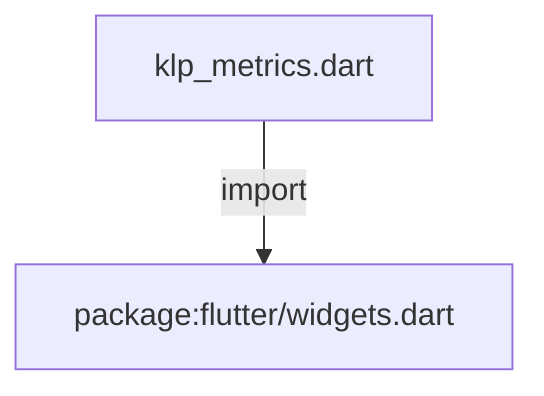
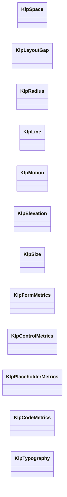
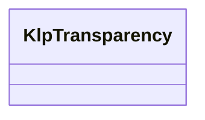

# klp_metrics.dart：直接依賴與宣告架構

[回到目錄](README.md) · [來源檔案](../../../../lib/src/foundation/klp_metrics.dart)

## 範圍

核心是 `lib/src/foundation/klp_metrics.dart`。主要視角為該檔案明寫的 import／export／part；輔助視角為本檔宣告及 extends／implements／with／on 關係。只展開一層外部邊界。

## 直接依賴圖

## 依賴證據

| 關係 | 原始 directive | 來源 |
|---|---|---|
| import | <code>import &#x27;package:flutter/widgets.dart&#x27;;</code> | [lib/src/foundation/klp_metrics.dart:1](../../../../lib/src/foundation/klp_metrics.dart#L1) |

## 宣告關係圖

本組節點是本檔宣告；沒有箭頭的宣告未在此圖主張互相依賴。

本組節點是本檔宣告；沒有箭頭的宣告未在此圖主張互相依賴。

## 宣告與成員證據

成員包含 public 與 private；簽章取自來源，省略函式本體與欄位初始值。`(inferred)` 表示來源未明寫型別；建構子只顯示參數部分，不含初始化列表。

### KlpSpace

ClassDeclaration · public · [lib/src/foundation/klp_metrics.dart:3](../../../../lib/src/foundation/klp_metrics.dart#L3)

<code>abstract final class KlpSpace</code>

來源註解摘要：舊版的 static const 間距階梯，抽取自 Planist 時仍有元件直接引用。 這一層**不會隨 theme 變化**，屬於待清除的欠債，不是給新元件用的字彙表—— 新程式碼請改讀 `context.klp.space`（semantic 層）。`test/token_discipline_test.dart` 用棘輪列管剩餘引用數，只能減少、不能增加。

| 成員 | 可見性 | 簽章／型別 | 來源註解摘要 | 證據 |
|---|---|---|---|---|
| field <code>xxs</code> | public | <code>static const double xxs</code> |  | [lib/src/foundation/klp_metrics.dart:9](../../../../lib/src/foundation/klp_metrics.dart#L9) |
| field <code>xs</code> | public | <code>static const double xs</code> |  | [lib/src/foundation/klp_metrics.dart:10](../../../../lib/src/foundation/klp_metrics.dart#L10) |
| field <code>sm</code> | public | <code>static const double sm</code> |  | [lib/src/foundation/klp_metrics.dart:11](../../../../lib/src/foundation/klp_metrics.dart#L11) |
| field <code>md</code> | public | <code>static const double md</code> |  | [lib/src/foundation/klp_metrics.dart:12](../../../../lib/src/foundation/klp_metrics.dart#L12) |
| field <code>lg</code> | public | <code>static const double lg</code> |  | [lib/src/foundation/klp_metrics.dart:13](../../../../lib/src/foundation/klp_metrics.dart#L13) |
| field <code>xl</code> | public | <code>static const double xl</code> |  | [lib/src/foundation/klp_metrics.dart:14](../../../../lib/src/foundation/klp_metrics.dart#L14) |
| field <code>xxl</code> | public | <code>static const double xxl</code> |  | [lib/src/foundation/klp_metrics.dart:15](../../../../lib/src/foundation/klp_metrics.dart#L15) |
| field <code>sectionLarge</code> | public | <code>static const double sectionLarge</code> |  | [lib/src/foundation/klp_metrics.dart:16](../../../../lib/src/foundation/klp_metrics.dart#L16) |
| field <code>page</code> | public | <code>static const double page</code> |  | [lib/src/foundation/klp_metrics.dart:17](../../../../lib/src/foundation/klp_metrics.dart#L17) |
| field <code>pageLarge</code> | public | <code>static const double pageLarge</code> |  | [lib/src/foundation/klp_metrics.dart:18](../../../../lib/src/foundation/klp_metrics.dart#L18) |

### KlpLayoutGap

ClassDeclaration · public · [lib/src/foundation/klp_metrics.dart:21](../../../../lib/src/foundation/klp_metrics.dart#L21)

<code>abstract final class KlpLayoutGap</code>

來源註解摘要：舊版的 static const 版面間隙，僅剩少數版面預設值仍引用。 與 [KlpSpace] 同屬待清除的欠債層——新程式碼請改讀 `context.klp.space`。

| 成員 | 可見性 | 簽章／型別 | 來源註解摘要 | 證據 |
|---|---|---|---|---|
| field <code>lg</code> | public | <code>static const double lg</code> |  | [lib/src/foundation/klp_metrics.dart:25](../../../../lib/src/foundation/klp_metrics.dart#L25) |

### KlpRadius

ClassDeclaration · public · [lib/src/foundation/klp_metrics.dart:28](../../../../lib/src/foundation/klp_metrics.dart#L28)

<code>abstract final class KlpRadius</code>

來源註解摘要：舊版的 static const 圓角階梯，抽取自 Planist 時仍有元件直接引用。 與 [KlpSpace] 同屬待清除的欠債層，不隨 theme 變化——新程式碼請改讀 `context.klp.shape` 或對應的 semantic token。

| 成員 | 可見性 | 簽章／型別 | 來源註解摘要 | 證據 |
|---|---|---|---|---|
| field <code>none</code> | public | <code>static const double none</code> |  | [lib/src/foundation/klp_metrics.dart:33](../../../../lib/src/foundation/klp_metrics.dart#L33) |
| field <code>sm</code> | public | <code>static const double sm</code> |  | [lib/src/foundation/klp_metrics.dart:34](../../../../lib/src/foundation/klp_metrics.dart#L34) |
| field <code>md</code> | public | <code>static const double md</code> |  | [lib/src/foundation/klp_metrics.dart:35](../../../../lib/src/foundation/klp_metrics.dart#L35) |
| field <code>lg</code> | public | <code>static const double lg</code> |  | [lib/src/foundation/klp_metrics.dart:36](../../../../lib/src/foundation/klp_metrics.dart#L36) |
| field <code>full</code> | public | <code>static const double full</code> |  | [lib/src/foundation/klp_metrics.dart:37](../../../../lib/src/foundation/klp_metrics.dart#L37) |
| field <code>control</code> | public | <code>static const double control</code> |  | [lib/src/foundation/klp_metrics.dart:39](../../../../lib/src/foundation/klp_metrics.dart#L39) |
| field <code>card</code> | public | <code>static const double card</code> |  | [lib/src/foundation/klp_metrics.dart:40](../../../../lib/src/foundation/klp_metrics.dart#L40) |
| field <code>panel</code> | public | <code>static const double panel</code> |  | [lib/src/foundation/klp_metrics.dart:41](../../../../lib/src/foundation/klp_metrics.dart#L41) |
| field <code>pill</code> | public | <code>static const double pill</code> |  | [lib/src/foundation/klp_metrics.dart:42](../../../../lib/src/foundation/klp_metrics.dart#L42) |

### KlpLine

ClassDeclaration · public · [lib/src/foundation/klp_metrics.dart:45](../../../../lib/src/foundation/klp_metrics.dart#L45)

<code>abstract final class KlpLine</code>

來源註解摘要：舊版的 static const 線條幾何：粗細與虛線的長度／間隙／透明度。 與 [KlpSpace] 同屬待清除的欠債層，不隨 theme 變化——hover 虛線實際取用的是 `context.klp` 上對應的 semantic token（例如 [KlpTheme.selectionWash]）， 這個類別僅保留給尚未遷移的舊呼叫端。

| 成員 | 可見性 | 簽章／型別 | 來源註解摘要 | 證據 |
|---|---|---|---|---|
| field <code>hairline</code> | public | <code>static const double hairline</code> |  | [lib/src/foundation/klp_metrics.dart:51](../../../../lib/src/foundation/klp_metrics.dart#L51) |
| field <code>width</code> | public | <code>static const double width</code> |  | [lib/src/foundation/klp_metrics.dart:52](../../../../lib/src/foundation/klp_metrics.dart#L52) |
| field <code>dashedLength</code> | public | <code>static const double dashedLength</code> |  | [lib/src/foundation/klp_metrics.dart:53](../../../../lib/src/foundation/klp_metrics.dart#L53) |
| field <code>dashedGap</code> | public | <code>static const double dashedGap</code> |  | [lib/src/foundation/klp_metrics.dart:54](../../../../lib/src/foundation/klp_metrics.dart#L54) |
| field <code>dashedOpacity</code> | public | <code>static const double dashedOpacity</code> |  | [lib/src/foundation/klp_metrics.dart:55](../../../../lib/src/foundation/klp_metrics.dart#L55) |

### KlpMotion

ClassDeclaration · public · [lib/src/foundation/klp_metrics.dart:58](../../../../lib/src/foundation/klp_metrics.dart#L58)

<code>abstract final class KlpMotion</code>

來源註解摘要：舊版的 static const 動畫時長，目前兩個值都固定為 [Duration.zero]。 本產品在 theme／style 切換時刻意不做過場動畫——切換是使用者主動觸發的離散 事件，補間動畫只會讓「切好了沒」變得模糊。與 [KlpSpace] 同屬待清除的欠債層， 新程式碼請改讀 `context.klp.motion`。

| 成員 | 可見性 | 簽章／型別 | 來源註解摘要 | 證據 |
|---|---|---|---|---|
| field <code>themeTransition</code> | public | <code>static const Duration themeTransition</code> |  | [lib/src/foundation/klp_metrics.dart:64](../../../../lib/src/foundation/klp_metrics.dart#L64) |
| field <code>styleTransition</code> | public | <code>static const Duration styleTransition</code> |  | [lib/src/foundation/klp_metrics.dart:65](../../../../lib/src/foundation/klp_metrics.dart#L65) |

### KlpElevation

ClassDeclaration · public · [lib/src/foundation/klp_metrics.dart:68](../../../../lib/src/foundation/klp_metrics.dart#L68)

<code>abstract final class KlpElevation</code>

來源註解摘要：舊版的 static const 陰影參數，僅供選單彈出層的投影使用。 與 [KlpSpace] 同屬待清除的欠債層，不隨 theme 變化——新程式碼請改讀 `context.klp.surface` 上對應的 overlay 陰影 token。

| 成員 | 可見性 | 簽章／型別 | 來源註解摘要 | 證據 |
|---|---|---|---|---|
| field <code>menuBlurRadius</code> | public | <code>static const double menuBlurRadius</code> |  | [lib/src/foundation/klp_metrics.dart:73](../../../../lib/src/foundation/klp_metrics.dart#L73) |
| field <code>menuSpreadRadius</code> | public | <code>static const double menuSpreadRadius</code> |  | [lib/src/foundation/klp_metrics.dart:74](../../../../lib/src/foundation/klp_metrics.dart#L74) |
| field <code>menuOffsetY</code> | public | <code>static const double menuOffsetY</code> |  | [lib/src/foundation/klp_metrics.dart:75](../../../../lib/src/foundation/klp_metrics.dart#L75) |
| field <code>menuShadowOpacity</code> | public | <code>static const double menuShadowOpacity</code> |  | [lib/src/foundation/klp_metrics.dart:76](../../../../lib/src/foundation/klp_metrics.dart#L76) |

### KlpSize

ClassDeclaration · public · [lib/src/foundation/klp_metrics.dart:79](../../../../lib/src/foundation/klp_metrics.dart#L79)

<code>abstract final class KlpSize</code>

來源註解摘要：舊版的 static const 尺寸階梯：控制項高度、圖示尺寸、面板寬度與 responsive 斷點全部混在一起。 與 [KlpSpace] 同屬待清除的欠債層。面板寬度與斷點（[sidebar]、[inspector]、 [primaryPaneBreakpoint] 等）是刻意保留的版面預設值，消費者可用 widget 參數 覆寫，不屬於風格；其餘控制項與圖示尺寸新程式碼請改讀 `context.klp` 上對應的 semantic token。

| 成員 | 可見性 | 簽章／型別 | 來源註解摘要 | 證據 |
|---|---|---|---|---|
| field <code>controlSmall</code> | public | <code>static const double controlSmall</code> |  | [lib/src/foundation/klp_metrics.dart:87](../../../../lib/src/foundation/klp_metrics.dart#L87) |
| field <code>control</code> | public | <code>static const double control</code> |  | [lib/src/foundation/klp_metrics.dart:88](../../../../lib/src/foundation/klp_metrics.dart#L88) |
| field <code>controlLarge</code> | public | <code>static const double controlLarge</code> |  | [lib/src/foundation/klp_metrics.dart:89](../../../../lib/src/foundation/klp_metrics.dart#L89) |
| field <code>controlXLarge</code> | public | <code>static const double controlXLarge</code> |  | [lib/src/foundation/klp_metrics.dart:90](../../../../lib/src/foundation/klp_metrics.dart#L90) |
| field <code>segmentedDense</code> | public | <code>static const double segmentedDense</code> |  | [lib/src/foundation/klp_metrics.dart:91](../../../../lib/src/foundation/klp_metrics.dart#L91) |
| field <code>segmentedDenseItem</code> | public | <code>static const double segmentedDenseItem</code> |  | [lib/src/foundation/klp_metrics.dart:92](../../../../lib/src/foundation/klp_metrics.dart#L92) |
| field <code>iconButton</code> | public | <code>static const double iconButton</code> |  | [lib/src/foundation/klp_metrics.dart:93](../../../../lib/src/foundation/klp_metrics.dart#L93) |
| field <code>tab</code> | public | <code>static const double tab</code> |  | [lib/src/foundation/klp_metrics.dart:94](../../../../lib/src/foundation/klp_metrics.dart#L94) |
| field <code>iconSmall</code> | public | <code>static const double iconSmall</code> |  | [lib/src/foundation/klp_metrics.dart:95](../../../../lib/src/foundation/klp_metrics.dart#L95) |
| field <code>iconBase</code> | public | <code>static const double iconBase</code> |  | [lib/src/foundation/klp_metrics.dart:96](../../../../lib/src/foundation/klp_metrics.dart#L96) |
| field <code>disclosure</code> | public | <code>static const double disclosure</code> |  | [lib/src/foundation/klp_metrics.dart:97](../../../../lib/src/foundation/klp_metrics.dart#L97) |
| field <code>icon</code> | public | <code>static const double icon</code> |  | [lib/src/foundation/klp_metrics.dart:98](../../../../lib/src/foundation/klp_metrics.dart#L98) |
| field <code>iconMedium</code> | public | <code>static const double iconMedium</code> |  | [lib/src/foundation/klp_metrics.dart:99](../../../../lib/src/foundation/klp_metrics.dart#L99) |
| field <code>iconLarge</code> | public | <code>static const double iconLarge</code> |  | [lib/src/foundation/klp_metrics.dart:100](../../../../lib/src/foundation/klp_metrics.dart#L100) |
| field <code>rail</code> | public | <code>static const double rail</code> |  | [lib/src/foundation/klp_metrics.dart:101](../../../../lib/src/foundation/klp_metrics.dart#L101) |
| field <code>header</code> | public | <code>static const double header</code> |  | [lib/src/foundation/klp_metrics.dart:102](../../../../lib/src/foundation/klp_metrics.dart#L102) |
| field <code>statusBar</code> | public | <code>static const double statusBar</code> |  | [lib/src/foundation/klp_metrics.dart:103](../../../../lib/src/foundation/klp_metrics.dart#L103) |
| field <code>listTileTrailingMax</code> | public | <code>static const double listTileTrailingMax</code> |  | [lib/src/foundation/klp_metrics.dart:104](../../../../lib/src/foundation/klp_metrics.dart#L104) |
| field <code>primaryPaneBreakpoint</code> | public | <code>static const double primaryPaneBreakpoint</code> |  | [lib/src/foundation/klp_metrics.dart:105](../../../../lib/src/foundation/klp_metrics.dart#L105) |
| field <code>primaryPaneContentBreakpoint</code> | public | <code>static const double primaryPaneContentBreakpoint</code> |  | [lib/src/foundation/klp_metrics.dart:106](../../../../lib/src/foundation/klp_metrics.dart#L106) |
| field <code>secondaryPaneBreakpoint</code> | public | <code>static const double secondaryPaneBreakpoint</code> |  | [lib/src/foundation/klp_metrics.dart:107](../../../../lib/src/foundation/klp_metrics.dart#L107) |
| field <code>sidebar</code> | public | <code>static const double sidebar</code> |  | [lib/src/foundation/klp_metrics.dart:108](../../../../lib/src/foundation/klp_metrics.dart#L108) |
| field <code>inspector</code> | public | <code>static const double inspector</code> |  | [lib/src/foundation/klp_metrics.dart:109](../../../../lib/src/foundation/klp_metrics.dart#L109) |
| field <code>menu</code> | public | <code>static const double menu</code> |  | [lib/src/foundation/klp_metrics.dart:110](../../../../lib/src/foundation/klp_metrics.dart#L110) |
| field <code>menuHeader</code> | public | <code>static const double menuHeader</code> |  | [lib/src/foundation/klp_metrics.dart:111](../../../../lib/src/foundation/klp_metrics.dart#L111) |
| field <code>menuItem</code> | public | <code>static const double menuItem</code> |  | [lib/src/foundation/klp_metrics.dart:112](../../../../lib/src/foundation/klp_metrics.dart#L112) |

### KlpFormMetrics

ClassDeclaration · public · [lib/src/foundation/klp_metrics.dart:115](../../../../lib/src/foundation/klp_metrics.dart#L115)

<code>abstract final class KlpFormMetrics</code>

來源註解摘要：表單控制項（勾選框、切換開關）的固定幾何：欄位高度、選取指示器的尺寸與內縮。 這些是控制項繪製時的座標關係，不是可覆寫的風格——例如 [selectionIndicator] 是從 [selectionControl] 扣掉兩側內縮算出來的，動一個值另一個就得跟著算， 因此整組留在 component 層而非拆進 theme。

| 成員 | 可見性 | 簽章／型別 | 來源註解摘要 | 證據 |
|---|---|---|---|---|
| field <code>fieldHeight</code> | public | <code>static const double fieldHeight</code> |  | [lib/src/foundation/klp_metrics.dart:121](../../../../lib/src/foundation/klp_metrics.dart#L121) |
| field <code>selectionControl</code> | public | <code>static const double selectionControl</code> |  | [lib/src/foundation/klp_metrics.dart:122](../../../../lib/src/foundation/klp_metrics.dart#L122) |
| field <code>selectionIndicatorInset</code> | public | <code>static const double selectionIndicatorInset</code> |  | [lib/src/foundation/klp_metrics.dart:123](../../../../lib/src/foundation/klp_metrics.dart#L123) |
| field <code>selectionIndicator</code> | public | <code>static const double selectionIndicator</code> |  | [lib/src/foundation/klp_metrics.dart:124](../../../../lib/src/foundation/klp_metrics.dart#L124) |
| field <code>selectionIcon</code> | public | <code>static const double selectionIcon</code> |  | [lib/src/foundation/klp_metrics.dart:126](../../../../lib/src/foundation/klp_metrics.dart#L126) |
| field <code>toggleWidth</code> | public | <code>static const double toggleWidth</code> |  | [lib/src/foundation/klp_metrics.dart:127](../../../../lib/src/foundation/klp_metrics.dart#L127) |
| field <code>toggleHeight</code> | public | <code>static const double toggleHeight</code> |  | [lib/src/foundation/klp_metrics.dart:128](../../../../lib/src/foundation/klp_metrics.dart#L128) |
| field <code>toggleThumb</code> | public | <code>static const double toggleThumb</code> |  | [lib/src/foundation/klp_metrics.dart:129](../../../../lib/src/foundation/klp_metrics.dart#L129) |
| field <code>toggleInset</code> | public | <code>static const double toggleInset</code> |  | [lib/src/foundation/klp_metrics.dart:130](../../../../lib/src/foundation/klp_metrics.dart#L130) |

### KlpControlMetrics

ClassDeclaration · public · [lib/src/foundation/klp_metrics.dart:133](../../../../lib/src/foundation/klp_metrics.dart#L133)

<code>abstract final class KlpControlMetrics</code>

來源註解摘要：分段控制項與捲軸的固定幾何。 [scrollbarEndControlRightInset] 是從 [scrollbarThickness] 與 [scrollbarEndControlExtent] 算出來的置中位移，兩者是連動的繪製參數而非各自 獨立的風格值，因此留在同一個類別而非拆進 theme。

| 成員 | 可見性 | 簽章／型別 | 來源註解摘要 | 證據 |
|---|---|---|---|---|
| field <code>segmentedDenseInset</code> | public | <code>static const double segmentedDenseInset</code> |  | [lib/src/foundation/klp_metrics.dart:139](../../../../lib/src/foundation/klp_metrics.dart#L139) |
| field <code>scrollbarThickness</code> | public | <code>static const double scrollbarThickness</code> |  | [lib/src/foundation/klp_metrics.dart:140](../../../../lib/src/foundation/klp_metrics.dart#L140) |
| field <code>scrollbarEndControlExtent</code> | public | <code>static const double scrollbarEndControlExtent</code> |  | [lib/src/foundation/klp_metrics.dart:141](../../../../lib/src/foundation/klp_metrics.dart#L141) |
| field <code>scrollbarEndControlRightInset</code> | public | <code>static const double scrollbarEndControlRightInset</code> |  | [lib/src/foundation/klp_metrics.dart:142](../../../../lib/src/foundation/klp_metrics.dart#L142) |
| field <code>scrollbarPageIncrement</code> | public | <code>static const double scrollbarPageIncrement</code> |  | [lib/src/foundation/klp_metrics.dart:144](../../../../lib/src/foundation/klp_metrics.dart#L144) |

### KlpPlaceholderMetrics

ClassDeclaration · public · [lib/src/foundation/klp_metrics.dart:147](../../../../lib/src/foundation/klp_metrics.dart#L147)

<code>abstract final class KlpPlaceholderMetrics</code>

來源註解摘要：[KlpRegionPlaceholder] 專用的固定幾何：內距、間隙，以及斜線底紋 （hatch）的繪製參數。 `hatchBand`／`hatchGap`／`darkHatchColorMix` 這類值是畫斜線底紋這個具體 視覺效果的座標，不是一般意義的風格 token，因此留在元件旁邊而非拆進 theme。

| 成員 | 可見性 | 簽章／型別 | 來源註解摘要 | 證據 |
|---|---|---|---|---|
| field <code>minimumHeight</code> | public | <code>static const double minimumHeight</code> |  | [lib/src/foundation/klp_metrics.dart:153](../../../../lib/src/foundation/klp_metrics.dart#L153) |
| field <code>markerSize</code> | public | <code>static const double markerSize</code> |  | [lib/src/foundation/klp_metrics.dart:154](../../../../lib/src/foundation/klp_metrics.dart#L154) |
| field <code>contentPaddingHorizontal</code> | public | <code>static const double contentPaddingHorizontal</code> |  | [lib/src/foundation/klp_metrics.dart:155](../../../../lib/src/foundation/klp_metrics.dart#L155) |
| field <code>contentPaddingVertical</code> | public | <code>static const double contentPaddingVertical</code> |  | [lib/src/foundation/klp_metrics.dart:156](../../../../lib/src/foundation/klp_metrics.dart#L156) |
| field <code>contentGap</code> | public | <code>static const double contentGap</code> |  | [lib/src/foundation/klp_metrics.dart:157](../../../../lib/src/foundation/klp_metrics.dart#L157) |
| field <code>actionLeadingGap</code> | public | <code>static const double actionLeadingGap</code> |  | [lib/src/foundation/klp_metrics.dart:158](../../../../lib/src/foundation/klp_metrics.dart#L158) |
| field <code>actionPaddingHorizontal</code> | public | <code>static const double actionPaddingHorizontal</code> |  | [lib/src/foundation/klp_metrics.dart:159](../../../../lib/src/foundation/klp_metrics.dart#L159) |
| field <code>actionPaddingVertical</code> | public | <code>static const double actionPaddingVertical</code> |  | [lib/src/foundation/klp_metrics.dart:160](../../../../lib/src/foundation/klp_metrics.dart#L160) |
| field <code>hatchBand</code> | public | <code>static const double hatchBand</code> |  | [lib/src/foundation/klp_metrics.dart:161](../../../../lib/src/foundation/klp_metrics.dart#L161) |
| field <code>hatchGap</code> | public | <code>static const double hatchGap</code> |  | [lib/src/foundation/klp_metrics.dart:162](../../../../lib/src/foundation/klp_metrics.dart#L162) |
| field <code>hatchStrokeWidth</code> | public | <code>static const double hatchStrokeWidth</code> |  | [lib/src/foundation/klp_metrics.dart:163](../../../../lib/src/foundation/klp_metrics.dart#L163) |
| field <code>darkHatchColorMix</code> | public | <code>static const double darkHatchColorMix</code> |  | [lib/src/foundation/klp_metrics.dart:164](../../../../lib/src/foundation/klp_metrics.dart#L164) |
| field <code>latentStrokeOpacity</code> | public | <code>static const double latentStrokeOpacity</code> |  | [lib/src/foundation/klp_metrics.dart:165](../../../../lib/src/foundation/klp_metrics.dart#L165) |
| field <code>labelLetterSpacing</code> | public | <code>static const double labelLetterSpacing</code> |  | [lib/src/foundation/klp_metrics.dart:166](../../../../lib/src/foundation/klp_metrics.dart#L166) |
| field <code>detailMaximumWidth</code> | public | <code>static const double detailMaximumWidth</code> |  | [lib/src/foundation/klp_metrics.dart:167](../../../../lib/src/foundation/klp_metrics.dart#L167) |

### KlpCodeMetrics

ClassDeclaration · public · [lib/src/foundation/klp_metrics.dart:170](../../../../lib/src/foundation/klp_metrics.dart#L170)

<code>abstract final class KlpCodeMetrics</code>

來源註解摘要：[KlpCodeViewer] 與相關程式碼展示元件的固定幾何：header 高度、終端機圓點 間距、行號欄寬與自動換行寬度。 這些是程式碼區塊這個具體版面的量測值，只有 [KlpCodeViewer] 一系會用到， 因此不進 semantic 層而是留在元件旁邊。

| 成員 | 可見性 | 簽章／型別 | 來源註解摘要 | 證據 |
|---|---|---|---|---|
| field <code>actionButtonSize</code> | public | <code>static const double actionButtonSize</code> |  | [lib/src/foundation/klp_metrics.dart:176](../../../../lib/src/foundation/klp_metrics.dart#L176) |
| field <code>actionIconSize</code> | public | <code>static const double actionIconSize</code> |  | [lib/src/foundation/klp_metrics.dart:177](../../../../lib/src/foundation/klp_metrics.dart#L177) |
| field <code>headerHeight</code> | public | <code>static const double headerHeight</code> |  | [lib/src/foundation/klp_metrics.dart:178](../../../../lib/src/foundation/klp_metrics.dart#L178) |
| field <code>terminalDot</code> | public | <code>static const double terminalDot</code> |  | [lib/src/foundation/klp_metrics.dart:179](../../../../lib/src/foundation/klp_metrics.dart#L179) |
| field <code>terminalDotGap</code> | public | <code>static const double terminalDotGap</code> |  | [lib/src/foundation/klp_metrics.dart:180](../../../../lib/src/foundation/klp_metrics.dart#L180) |
| field <code>terminalGroupGap</code> | public | <code>static const double terminalGroupGap</code> |  | [lib/src/foundation/klp_metrics.dart:181](../../../../lib/src/foundation/klp_metrics.dart#L181) |
| field <code>headerPaddingHorizontal</code> | public | <code>static const double headerPaddingHorizontal</code> |  | [lib/src/foundation/klp_metrics.dart:182](../../../../lib/src/foundation/klp_metrics.dart#L182) |
| field <code>bodyPaddingHorizontal</code> | public | <code>static const double bodyPaddingHorizontal</code> |  | [lib/src/foundation/klp_metrics.dart:183](../../../../lib/src/foundation/klp_metrics.dart#L183) |
| field <code>bodyPaddingVertical</code> | public | <code>static const double bodyPaddingVertical</code> |  | [lib/src/foundation/klp_metrics.dart:184](../../../../lib/src/foundation/klp_metrics.dart#L184) |
| field <code>lineNumberWidth</code> | public | <code>static const double lineNumberWidth</code> |  | [lib/src/foundation/klp_metrics.dart:185](../../../../lib/src/foundation/klp_metrics.dart#L185) |
| field <code>wrappedLineWidth</code> | public | <code>static const double wrappedLineWidth</code> |  | [lib/src/foundation/klp_metrics.dart:186](../../../../lib/src/foundation/klp_metrics.dart#L186) |
| field <code>defaultMaximumHeight</code> | public | <code>static const double defaultMaximumHeight</code> |  | [lib/src/foundation/klp_metrics.dart:187](../../../../lib/src/foundation/klp_metrics.dart#L187) |

### KlpTypography

ClassDeclaration · public · [lib/src/foundation/klp_metrics.dart:190](../../../../lib/src/foundation/klp_metrics.dart#L190)

<code>abstract final class KlpTypography</code>

來源註解摘要：舊版的 static const 字型階梯：字族、字級、行高、字距與字重全部混在一起。 與 [KlpSpace] 同屬待清除的欠債層，不隨 theme 變化——新程式碼請改讀 [KlpTextStyles] 或 `context.klp` 上對應的 semantic token。字族刻意統一走 套件內的 Noto Sans TC 並附上完整的中日文 fallback 清單（[sansFallback]）。

| 成員 | 可見性 | 簽章／型別 | 來源註解摘要 | 證據 |
|---|---|---|---|---|
| field <code>sansFamily</code> | public | <code>static const String sansFamily</code> |  | [lib/src/foundation/klp_metrics.dart:197](../../../../lib/src/foundation/klp_metrics.dart#L197) |
| field <code>sansFallback</code> | public | <code>static const List&lt;String&gt; sansFallback</code> |  | [lib/src/foundation/klp_metrics.dart:198](../../../../lib/src/foundation/klp_metrics.dart#L198) |
| field <code>monoFamily</code> | public | <code>static const String monoFamily</code> |  | [lib/src/foundation/klp_metrics.dart:205](../../../../lib/src/foundation/klp_metrics.dart#L205) |
| field <code>monoFallback</code> | public | <code>static const List&lt;String&gt; monoFallback</code> |  | [lib/src/foundation/klp_metrics.dart:206](../../../../lib/src/foundation/klp_metrics.dart#L206) |
| field <code>uiFamily</code> | public | <code>static const String uiFamily</code> |  | [lib/src/foundation/klp_metrics.dart:215](../../../../lib/src/foundation/klp_metrics.dart#L215) |
| field <code>uiFallback</code> | public | <code>static const List&lt;String&gt; uiFallback</code> |  | [lib/src/foundation/klp_metrics.dart:216](../../../../lib/src/foundation/klp_metrics.dart#L216) |
| field <code>bodyFamily</code> | public | <code>static const String bodyFamily</code> |  | [lib/src/foundation/klp_metrics.dart:219](../../../../lib/src/foundation/klp_metrics.dart#L219) |
| field <code>bodyFallback</code> | public | <code>static const List&lt;String&gt; bodyFallback</code> |  | [lib/src/foundation/klp_metrics.dart:220](../../../../lib/src/foundation/klp_metrics.dart#L220) |
| field <code>micro</code> | public | <code>static const double micro</code> |  | [lib/src/foundation/klp_metrics.dart:222](../../../../lib/src/foundation/klp_metrics.dart#L222) |
| field <code>caption</code> | public | <code>static const double caption</code> |  | [lib/src/foundation/klp_metrics.dart:223](../../../../lib/src/foundation/klp_metrics.dart#L223) |
| field <code>small</code> | public | <code>static const double small</code> |  | [lib/src/foundation/klp_metrics.dart:224](../../../../lib/src/foundation/klp_metrics.dart#L224) |
| field <code>sub</code> | public | <code>static const double sub</code> |  | [lib/src/foundation/klp_metrics.dart:225](../../../../lib/src/foundation/klp_metrics.dart#L225) |
| field <code>body</code> | public | <code>static const double body</code> |  | [lib/src/foundation/klp_metrics.dart:226](../../../../lib/src/foundation/klp_metrics.dart#L226) |
| field <code>lead</code> | public | <code>static const double lead</code> |  | [lib/src/foundation/klp_metrics.dart:227](../../../../lib/src/foundation/klp_metrics.dart#L227) |
| field <code>h4</code> | public | <code>static const double h4</code> |  | [lib/src/foundation/klp_metrics.dart:228](../../../../lib/src/foundation/klp_metrics.dart#L228) |
| field <code>h3</code> | public | <code>static const double h3</code> |  | [lib/src/foundation/klp_metrics.dart:229](../../../../lib/src/foundation/klp_metrics.dart#L229) |
| field <code>section</code> | public | <code>static const double section</code> |  | [lib/src/foundation/klp_metrics.dart:230](../../../../lib/src/foundation/klp_metrics.dart#L230) |
| field <code>headingSmall</code> | public | <code>static const double headingSmall</code> |  | [lib/src/foundation/klp_metrics.dart:231](../../../../lib/src/foundation/klp_metrics.dart#L231) |
| field <code>h2</code> | public | <code>static const double h2</code> |  | [lib/src/foundation/klp_metrics.dart:232](../../../../lib/src/foundation/klp_metrics.dart#L232) |
| field <code>heading</code> | public | <code>static const double heading</code> |  | [lib/src/foundation/klp_metrics.dart:233](../../../../lib/src/foundation/klp_metrics.dart#L233) |
| field <code>editorHeading</code> | public | <code>static const double editorHeading</code> |  | [lib/src/foundation/klp_metrics.dart:234](../../../../lib/src/foundation/klp_metrics.dart#L234) |
| field <code>h1</code> | public | <code>static const double h1</code> |  | [lib/src/foundation/klp_metrics.dart:235](../../../../lib/src/foundation/klp_metrics.dart#L235) |
| field <code>title</code> | public | <code>static const double title</code> |  | [lib/src/foundation/klp_metrics.dart:236](../../../../lib/src/foundation/klp_metrics.dart#L236) |
| field <code>headline</code> | public | <code>static const double headline</code> |  | [lib/src/foundation/klp_metrics.dart:237](../../../../lib/src/foundation/klp_metrics.dart#L237) |
| field <code>display</code> | public | <code>static const double display</code> |  | [lib/src/foundation/klp_metrics.dart:238](../../../../lib/src/foundation/klp_metrics.dart#L238) |
| field <code>hero</code> | public | <code>static const double hero</code> |  | [lib/src/foundation/klp_metrics.dart:239](../../../../lib/src/foundation/klp_metrics.dart#L239) |
| field <code>microLineHeight</code> | public | <code>static const double microLineHeight</code> |  | [lib/src/foundation/klp_metrics.dart:241](../../../../lib/src/foundation/klp_metrics.dart#L241) |
| field <code>captionLineHeight</code> | public | <code>static const double captionLineHeight</code> |  | [lib/src/foundation/klp_metrics.dart:242](../../../../lib/src/foundation/klp_metrics.dart#L242) |
| field <code>subLineHeight</code> | public | <code>static const double subLineHeight</code> |  | [lib/src/foundation/klp_metrics.dart:243](../../../../lib/src/foundation/klp_metrics.dart#L243) |
| field <code>bodyLineHeight</code> | public | <code>static const double bodyLineHeight</code> |  | [lib/src/foundation/klp_metrics.dart:244](../../../../lib/src/foundation/klp_metrics.dart#L244) |
| field <code>leadLineHeight</code> | public | <code>static const double leadLineHeight</code> |  | [lib/src/foundation/klp_metrics.dart:245](../../../../lib/src/foundation/klp_metrics.dart#L245) |
| field <code>h4LineHeight</code> | public | <code>static const double h4LineHeight</code> |  | [lib/src/foundation/klp_metrics.dart:246](../../../../lib/src/foundation/klp_metrics.dart#L246) |
| field <code>h3LineHeight</code> | public | <code>static const double h3LineHeight</code> |  | [lib/src/foundation/klp_metrics.dart:247](../../../../lib/src/foundation/klp_metrics.dart#L247) |
| field <code>h2LineHeight</code> | public | <code>static const double h2LineHeight</code> |  | [lib/src/foundation/klp_metrics.dart:248](../../../../lib/src/foundation/klp_metrics.dart#L248) |
| field <code>h1LineHeight</code> | public | <code>static const double h1LineHeight</code> |  | [lib/src/foundation/klp_metrics.dart:249](../../../../lib/src/foundation/klp_metrics.dart#L249) |
| field <code>displayLineHeight</code> | public | <code>static const double displayLineHeight</code> |  | [lib/src/foundation/klp_metrics.dart:250](../../../../lib/src/foundation/klp_metrics.dart#L250) |
| field <code>displayLetterSpacing</code> | public | <code>static const double displayLetterSpacing</code> |  | [lib/src/foundation/klp_metrics.dart:252](../../../../lib/src/foundation/klp_metrics.dart#L252) |
| field <code>labelLetterSpacing</code> | public | <code>static const double labelLetterSpacing</code> |  | [lib/src/foundation/klp_metrics.dart:253](../../../../lib/src/foundation/klp_metrics.dart#L253) |
| field <code>uiBaselineOffset</code> | public | <code>static const double uiBaselineOffset</code> |  | [lib/src/foundation/klp_metrics.dart:254](../../../../lib/src/foundation/klp_metrics.dart#L254) |
| field <code>regular</code> | public | <code>static const FontWeight regular</code> |  | [lib/src/foundation/klp_metrics.dart:256](../../../../lib/src/foundation/klp_metrics.dart#L256) |
| field <code>medium</code> | public | <code>static const FontWeight medium</code> |  | [lib/src/foundation/klp_metrics.dart:257](../../../../lib/src/foundation/klp_metrics.dart#L257) |
| field <code>semibold</code> | public | <code>static const FontWeight semibold</code> |  | [lib/src/foundation/klp_metrics.dart:258](../../../../lib/src/foundation/klp_metrics.dart#L258) |
| field <code>bold</code> | public | <code>static const FontWeight bold</code> |  | [lib/src/foundation/klp_metrics.dart:259](../../../../lib/src/foundation/klp_metrics.dart#L259) |
| field <code>extraBold</code> | public | <code>static const FontWeight extraBold</code> |  | [lib/src/foundation/klp_metrics.dart:260](../../../../lib/src/foundation/klp_metrics.dart#L260) |

### KlpTransparency

ClassDeclaration · public · [lib/src/foundation/klp_metrics.dart:263](../../../../lib/src/foundation/klp_metrics.dart#L263)

<code>abstract final class KlpTransparency</code>

來源註解摘要：舊版的 static const 面板透明度，僅剩少數視窗背景仍直接引用。 與 [KlpSpace] 同屬待清除的欠債層，不隨 theme 變化——新程式碼請改讀 `context.klp.surface` 上對應的透明度 token。

| 成員 | 可見性 | 簽章／型別 | 來源註解摘要 | 證據 |
|---|---|---|---|---|
| field <code>lightPaneOpacity</code> | public | <code>static const double lightPaneOpacity</code> |  | [lib/src/foundation/klp_metrics.dart:268](../../../../lib/src/foundation/klp_metrics.dart#L268) |
| field <code>darkPaneOpacity</code> | public | <code>static const double darkPaneOpacity</code> |  | [lib/src/foundation/klp_metrics.dart:269](../../../../lib/src/foundation/klp_metrics.dart#L269) |

## 閱讀說明與限制

箭頭只表示來源明寫的靜態關係；import 不等於呼叫。未分析動態呼叫、欄位的實際物件擁有權、狀態轉移或渲染流程；型別未進行語意解析，繼承目標保留原始型別拼寫。public／private 依 Dart 名稱前綴判斷；public 宣告不代表已由 `lib/kallopis.dart` 匯出。

本頁由 `tool/architecture_atlas` 產生；編輯來源或生成工具後重新產生，避免手改本頁。
