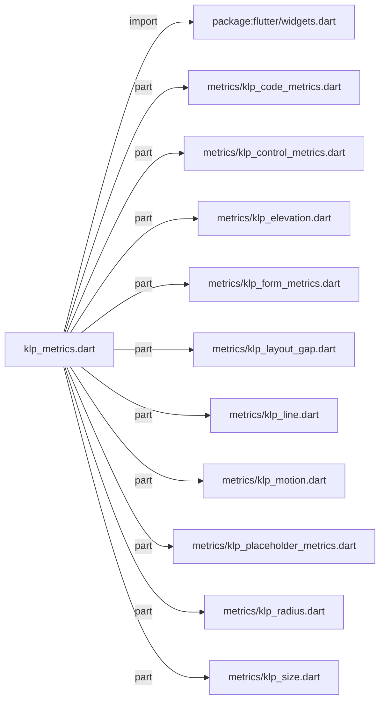
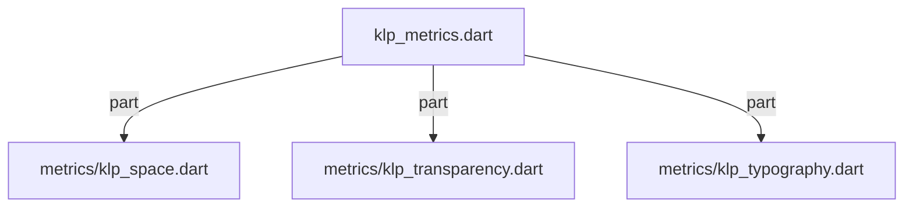

# klp_metrics.dart：直接依賴與宣告架構

[回到目錄](README.md) · [來源檔案](../../../../lib/src/foundation/klp_metrics.dart)

## 範圍

核心是 `lib/src/foundation/klp_metrics.dart`。主要視角為該檔案明寫的 import／export／part；輔助視角為本檔宣告及 extends／implements／with／on 關係。只展開一層外部邊界。

## 直接依賴圖

## 依賴證據

| 關係 | 原始 directive | 來源 |
|---|---|---|
| import | <code>import &#x27;package:flutter/widgets.dart&#x27;;</code> | [lib/src/foundation/klp_metrics.dart:1](../../../../lib/src/foundation/klp_metrics.dart#L1) |
| part | <code>part &#x27;metrics/klp_code_metrics.dart&#x27;;</code> | [lib/src/foundation/klp_metrics.dart:3](../../../../lib/src/foundation/klp_metrics.dart#L3) |
| part | <code>part &#x27;metrics/klp_control_metrics.dart&#x27;;</code> | [lib/src/foundation/klp_metrics.dart:4](../../../../lib/src/foundation/klp_metrics.dart#L4) |
| part | <code>part &#x27;metrics/klp_elevation.dart&#x27;;</code> | [lib/src/foundation/klp_metrics.dart:5](../../../../lib/src/foundation/klp_metrics.dart#L5) |
| part | <code>part &#x27;metrics/klp_form_metrics.dart&#x27;;</code> | [lib/src/foundation/klp_metrics.dart:6](../../../../lib/src/foundation/klp_metrics.dart#L6) |
| part | <code>part &#x27;metrics/klp_layout_gap.dart&#x27;;</code> | [lib/src/foundation/klp_metrics.dart:7](../../../../lib/src/foundation/klp_metrics.dart#L7) |
| part | <code>part &#x27;metrics/klp_line.dart&#x27;;</code> | [lib/src/foundation/klp_metrics.dart:8](../../../../lib/src/foundation/klp_metrics.dart#L8) |
| part | <code>part &#x27;metrics/klp_motion.dart&#x27;;</code> | [lib/src/foundation/klp_metrics.dart:9](../../../../lib/src/foundation/klp_metrics.dart#L9) |
| part | <code>part &#x27;metrics/klp_placeholder_metrics.dart&#x27;;</code> | [lib/src/foundation/klp_metrics.dart:10](../../../../lib/src/foundation/klp_metrics.dart#L10) |
| part | <code>part &#x27;metrics/klp_radius.dart&#x27;;</code> | [lib/src/foundation/klp_metrics.dart:11](../../../../lib/src/foundation/klp_metrics.dart#L11) |
| part | <code>part &#x27;metrics/klp_size.dart&#x27;;</code> | [lib/src/foundation/klp_metrics.dart:12](../../../../lib/src/foundation/klp_metrics.dart#L12) |
| part | <code>part &#x27;metrics/klp_space.dart&#x27;;</code> | [lib/src/foundation/klp_metrics.dart:13](../../../../lib/src/foundation/klp_metrics.dart#L13) |
| part | <code>part &#x27;metrics/klp_transparency.dart&#x27;;</code> | [lib/src/foundation/klp_metrics.dart:14](../../../../lib/src/foundation/klp_metrics.dart#L14) |
| part | <code>part &#x27;metrics/klp_typography.dart&#x27;;</code> | [lib/src/foundation/klp_metrics.dart:15](../../../../lib/src/foundation/klp_metrics.dart#L15) |

## 宣告關係圖

本檔沒有 class／enum／mixin／extension 宣告；頂層函式、變數與 typedef 見下表。

## 宣告與成員證據

成員包含 public 與 private；簽章取自來源，省略函式本體與欄位初始值。`(inferred)` 表示來源未明寫型別；建構子只顯示參數部分，不含初始化列表。

## 閱讀說明與限制

箭頭只表示來源明寫的靜態關係；import 不等於呼叫。未分析動態呼叫、欄位的實際物件擁有權、狀態轉移或渲染流程；型別未進行語意解析，繼承目標保留原始型別拼寫。public／private 依 Dart 名稱前綴判斷；public 宣告不代表已由 `lib/kallopis.dart` 匯出。

本頁由 `tool/architecture_atlas` 產生；編輯來源或生成工具後重新產生，避免手改本頁。
