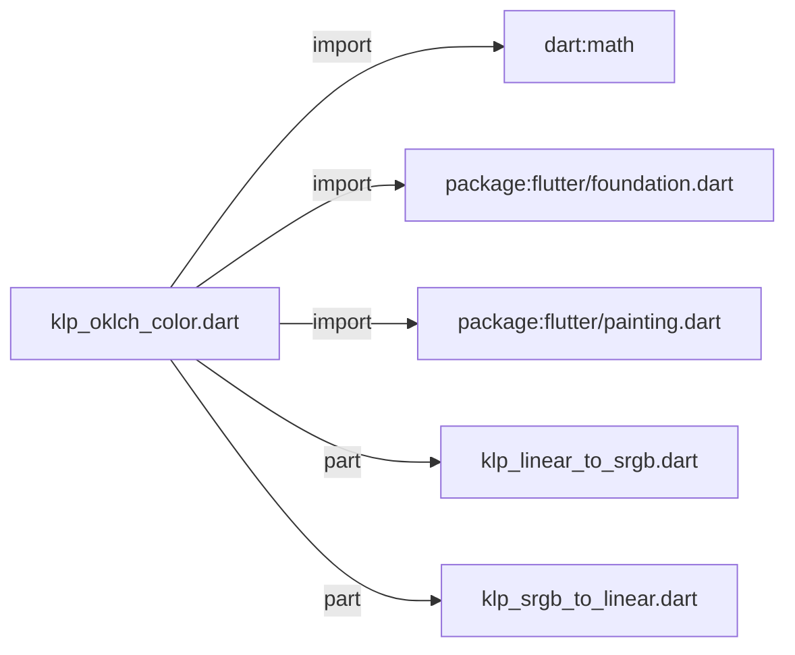
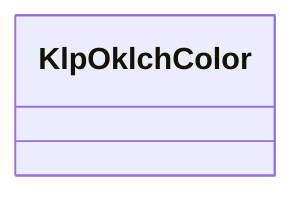

# klp_oklch_color.dart：直接依賴與宣告架構

[回到目錄](README.md) · [來源檔案](../../../../lib/src/foundation/klp_oklch_color.dart)

## 範圍

核心是 `lib/src/foundation/klp_oklch_color.dart`。主要視角為該檔案明寫的 import／export／part；輔助視角為本檔宣告及 extends／implements／with／on 關係。只展開一層外部邊界。

## 直接依賴圖

## 依賴證據

| 關係 | 原始 directive | 來源 |
|---|---|---|
| import | <code>import &#x27;dart:math&#x27; as math;</code> | [lib/src/foundation/klp_oklch_color.dart:1](../../../../lib/src/foundation/klp_oklch_color.dart#L1) |
| import | <code>import &#x27;package:flutter/foundation.dart&#x27;;</code> | [lib/src/foundation/klp_oklch_color.dart:3](../../../../lib/src/foundation/klp_oklch_color.dart#L3) |
| import | <code>import &#x27;package:flutter/painting.dart&#x27;;</code> | [lib/src/foundation/klp_oklch_color.dart:4](../../../../lib/src/foundation/klp_oklch_color.dart#L4) |
| part | <code>part &#x27;klp_linear_to_srgb.dart&#x27;;</code> | [lib/src/foundation/klp_oklch_color.dart:6](../../../../lib/src/foundation/klp_oklch_color.dart#L6) |
| part | <code>part &#x27;klp_srgb_to_linear.dart&#x27;;</code> | [lib/src/foundation/klp_oklch_color.dart:7](../../../../lib/src/foundation/klp_oklch_color.dart#L7) |

## 宣告關係圖

本組節點是本檔宣告；沒有箭頭的宣告未在此圖主張互相依賴。

## 宣告與成員證據

成員包含 public 與 private；簽章取自來源，省略函式本體與欄位初始值。`(inferred)` 表示來源未明寫型別；建構子只顯示參數部分，不含初始化列表。

### KlpOklchColor

ClassDeclaration · public · [lib/src/foundation/klp_oklch_color.dart:9](../../../../lib/src/foundation/klp_oklch_color.dart#L9)

<code>class KlpOklchColor</code>

來源註解摘要：以 OKLCH 表示的裝置無關色彩。 [lightness] 與 [alpha] 使用 0 到 1；[chroma] 不限制上界；[hue] 以角度表示。 轉成 Flutter [Color] 時會逐通道限制在 sRGB 色域內，原值是否超出色域可先由 [isInSrgbGamut] 判斷。

| 成員 | 可見性 | 簽章／型別 | 來源註解摘要 | 證據 |
|---|---|---|---|---|
| constructor <code>KlpOklchColor</code> | public | <code>const KlpOklchColor({ required this.lightness, required this.chroma, required this.hue, this.alpha = 1, })</code> |  | [lib/src/foundation/klp_oklch_color.dart:16](../../../../lib/src/foundation/klp_oklch_color.dart#L16) |
| constructor <code>fromColor</code> | public | <code>factory KlpOklchColor.fromColor(Color color)</code> | 從 Flutter sRGB 色彩建立 OKLCH 值。 | [lib/src/foundation/klp_oklch_color.dart:25](../../../../lib/src/foundation/klp_oklch_color.dart#L25) |
| field <code>lightness</code> | public | <code>final double lightness</code> |  | [lib/src/foundation/klp_oklch_color.dart:66](../../../../lib/src/foundation/klp_oklch_color.dart#L66) |
| field <code>chroma</code> | public | <code>final double chroma</code> |  | [lib/src/foundation/klp_oklch_color.dart:67](../../../../lib/src/foundation/klp_oklch_color.dart#L67) |
| field <code>hue</code> | public | <code>final double hue</code> |  | [lib/src/foundation/klp_oklch_color.dart:68](../../../../lib/src/foundation/klp_oklch_color.dart#L68) |
| field <code>alpha</code> | public | <code>final double alpha</code> |  | [lib/src/foundation/klp_oklch_color.dart:69](../../../../lib/src/foundation/klp_oklch_color.dart#L69) |
| getter <code>isInSrgbGamut</code> | public | <code>bool get isInSrgbGamut</code> | 未限制通道前的轉換結果是否完整落在 sRGB 色域。 | [lib/src/foundation/klp_oklch_color.dart:71](../../../../lib/src/foundation/klp_oklch_color.dart#L71) |
| getter <code>closestSrgbFallback</code> | public | <code>KlpOklchColor get closestSrgbFallback</code> | 固定 Lightness 與 Hue，找出 sRGB 色域內的最大 Chroma。 | [lib/src/foundation/klp_oklch_color.dart:77](../../../../lib/src/foundation/klp_oklch_color.dart#L77) |
| method <code>toSrgbFallbackColor</code> | public | <code>Color toSrgbFallbackColor()</code> | 取得以 Chroma fallback 映射後的 sRGB 色彩。 | [lib/src/foundation/klp_oklch_color.dart:98](../../../../lib/src/foundation/klp_oklch_color.dart#L98) |
| method <code>toColor</code> | public | <code>Color toColor()</code> | 轉成 Flutter sRGB 色彩；超出色域的通道會限制在 0 到 1。 | [lib/src/foundation/klp_oklch_color.dart:101](../../../../lib/src/foundation/klp_oklch_color.dart#L101) |
| method <code>copyWith</code> | public | <code>KlpOklchColor copyWith({ double? lightness, double? chroma, double? hue, double? alpha, })</code> | 建立只替換指定座標的新值。 | [lib/src/foundation/klp_oklch_color.dart:113](../../../../lib/src/foundation/klp_oklch_color.dart#L113) |
| method <code>_toSrgb</code> | private | <code>List&lt;double&gt; _toSrgb()</code> |  | [lib/src/foundation/klp_oklch_color.dart:128](../../../../lib/src/foundation/klp_oklch_color.dart#L128) |
| method <code>==</code> | public | <code>bool operator ==(Object other)</code> |  | [lib/src/foundation/klp_oklch_color.dart:146](../../../../lib/src/foundation/klp_oklch_color.dart#L146) |
| getter <code>hashCode</code> | public | <code>int get hashCode</code> |  | [lib/src/foundation/klp_oklch_color.dart:156](../../../../lib/src/foundation/klp_oklch_color.dart#L156) |

## 閱讀說明與限制

箭頭只表示來源明寫的靜態關係；import 不等於呼叫。未分析動態呼叫、欄位的實際物件擁有權、狀態轉移或渲染流程；型別未進行語意解析，繼承目標保留原始型別拼寫。public／private 依 Dart 名稱前綴判斷；public 宣告不代表已由 `lib/kallopis.dart` 匯出。

本頁由 `tool/architecture_atlas` 產生；編輯來源或生成工具後重新產生，避免手改本頁。
